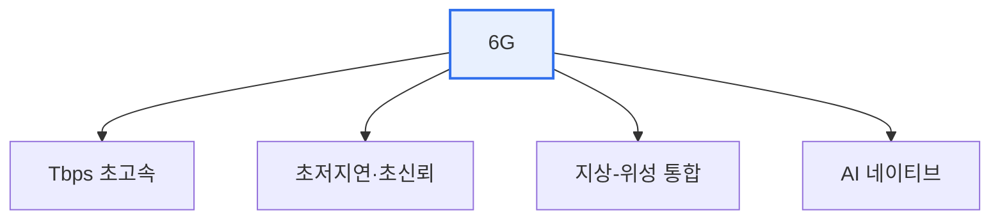

# 6G 이동통신

## 1. 개요

### 가. 정의
> 5G를 잇는 차세대 이동통신으로, **초당 테라비트(Tbps)급 전송속도, 초저지연(수십 μs), 지상-공중-위성을 아우르는 통합 커버리지**를 지향하는 2030년경 상용화 목표 기술이다.

6G의 방향성은 5G의 단순한 연장이 아니라 '**물리 세계와 디지털 세계의 완전한 융합**'이라는 질적 도약에 있다. 5G가 초고속·초저지연·초연결을 표방했지만, 홀로그램 통신, 실시간 디지털 트윈, 완전 자율주행, 몰입형 확장현실(XR) 같은 서비스를 완벽히 구현하기에는 대역폭과 지연이 여전히 부족하다. 6G는 이 한계를 넘기 위해 훨씬 높은 주파수인 **테라헤르츠(THz) 대역**을 개척하고, 네트워크 스스로 자원과 품질을 최적화하는 **AI 네이티브** 구조를 채택한다. 즉 사람이 화면을 보는 통신을 넘어, 물리 공간을 실시간으로 디지털에 복제하고 제어하는 인프라를 지향한다.

### 나. 등장 배경
데이터 트래픽의 기하급수적 증가, 자율주행·메타버스·산업 자동화 등 초실감·초정밀 서비스 수요, 그리고 지구 전역을 끊김 없이 연결하려는 요구가 5G의 물리적 한계를 드러내며 6G 연구를 촉발했다.

## 2. 핵심 특징 및 기술

6G를 실현하는 핵심 기술들은 서로 맞물린다. **테라헤르츠 대역** 은 초광대역을 확보해 Tbps 속도를 가능케 하고, **AI 네이티브 네트워크** 는 트래픽·자원·품질을 스스로 예측·최적화한다. **위성 통합(NTN)** 은 저궤도 위성을 지상망과 결합해 바다·오지까지 커버리지를 넓히고, **통신-센싱 융합(JCAS)** 은 통신 신호로 주변을 감지해 초정밀 측위를 제공한다. 여기에 에너지 효율을 극대화하는 **그린 네트워크** 가 지속가능성을 뒷받침한다.

| 기술 | 내용 |
|---|---|
| **테라헤르츠(THz)** | 초광대역·초고속 전송 |
| **AI 네이티브 네트워크** | AI로 자원·품질 자율 최적화 |
| **위성 통합(NTN)** | 저궤도 위성으로 전지구 커버리지 |
| **통신-센싱 융합(JCAS)** | 통신+센싱으로 초정밀 측위 |
| **초저전력·그린** | 에너지 효율(지속가능 네트워크) |

## 3. 5G와 비교

| 구분 | 5G | 6G(목표) |
|---|---|---|
| **속도** | 최대 20Gbps | 1Tbps급 |
| **지연** | 1ms | 0.1ms 수준 |
| **주파수** | mmWave까지 | THz 대역 |
| **커버리지** | 지상 중심 | 지상-공중-위성 통합 |
| **지능화** | 부분적 | AI 네이티브 |

## 4. 고려사항 및 시사점

1. **THz 전파 특성의 극복이 최대 기술 과제**다. 테라헤르츠는 대역이 넓지만 도달 거리가 짧고 직진성이 강해 장애물에 약하므로, 초다중안테나(Ultra-Massive MIMO)·지능형 반사면(RIS) 등으로 이를 보완해야 한다.
2. **표준화·주파수 확보 경쟁**이 치열하다. 3GPP·ITU를 중심으로 국가·기업 간 기술 주도권 경쟁이 벌어지고 있어, 표준 선점이 산업 경쟁력을 좌우한다.
3. **보안·에너지가 상용화의 관건**이다. 초연결로 공격 표면이 넓어지므로 양자내성·AI 기반 보안이, 막대한 전력 소모에 대응하는 에너지 효율화가 필수 과제로 남는다.

---

> **한 줄 요약**: 6G는 *Tbps 초고속·초저지연·지상위성 통합·AI 네이티브* 를 지향하는 차세대 이동통신으로, THz 대역과 위성 융합으로 홀로그램·디지털트윈 등 초실감 서비스를 실현하되 THz 전파 한계 극복·표준 선점·보안·에너지가 과제다.
