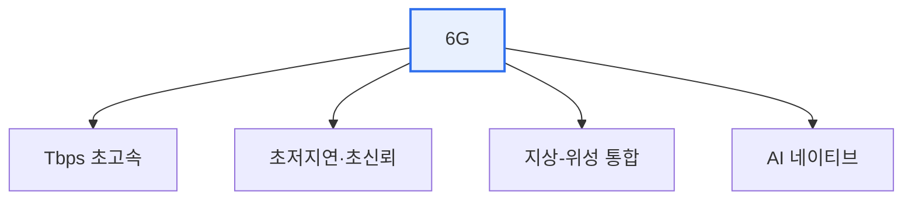

# 6G 이동통신

## 1. 개요

### 가. 정의
> 5G를 잇는 차세대 이동통신으로, **초당 테라비트(Tbps)급 속도, 초저지연(수십 μs), 지상-위성 통합 커버리지**를 지향하는 2030년경 상용화 목표 기술.

6G의 방향성은 5G의 연장이 아니라 '**물리 세계와 디지털 세계의 완전 융합**'이다. 홀로그램 통신, 디지털 트윈, 완전 자율주행, 확장현실(XR) 등 5G로는 부족한 초실감·초연결 서비스를 위해, 더 높은 주파수(테라헤르츠)와 AI 네이티브 네트워크가 요구된다.

## 2. 핵심 특징 및 기술

| 기술 | 내용 |
|---|---|
| **테라헤르츠(THz) 대역** | 초광대역·초고속 전송 |
| **AI 네이티브 네트워크** | AI로 자원·품질 자율 최적화 |
| **위성 통합(NTN)** | 저궤도 위성으로 전지구 커버리지 |
| **초정밀 측위·센싱** | 통신+센싱 융합(JCAS) |
| **초저전력·지속가능** | 에너지 효율(그린 네트워크) |

## 3. 5G와 비교

| 구분 | 5G | 6G(목표) |
|---|---|---|
| **속도** | 최대 20Gbps | 1Tbps급 |
| **지연** | 1ms | 0.1ms 수준 |
| **주파수** | mmWave까지 | THz 대역 |
| **커버리지** | 지상 중심 | 지상-공중-위성 통합 |

## 4. 시사점
- 초실감(홀로그램·XR)·디지털 트윈·완전 자율주행의 기반
- THz 전파 특성(짧은 도달·직진성) 극복, 표준화(3GPP·ITU) 경쟁
- 보안·에너지·주파수 확보가 상용화 과제

---

> **한 줄 요약**: 6G는 *Tbps 초고속·초저지연·지상-위성 통합·AI 네이티브* 를 지향하는 차세대 이동통신으로, THz 대역과 위성 융합으로 초실감·초연결 서비스를 실현한다.
