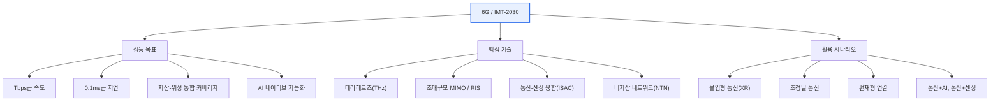
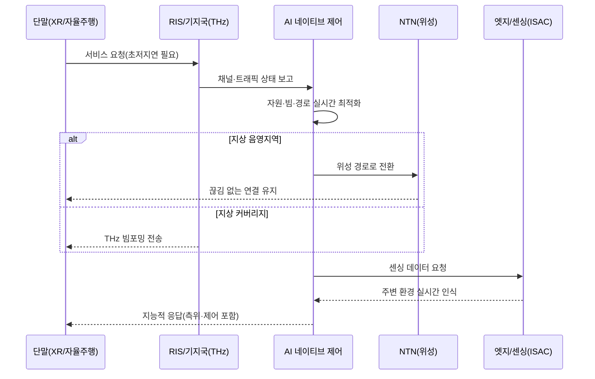

# 6G 이동통신

## 1. 개요

### 가. 정의
> 6G(6th Generation Mobile Communication)는 5G를 잇는 차세대 이동통신으로, **초당 테라비트(Tbps)급 전송속도, 초저지연(수십 μs), 지상-공중-위성을 아우르는 통합 커버리지, 그리고 통신·센싱·연산·지능이 하나로 융합된 인프라**를 지향하는 2030년경 상용화 목표 기술이다.

6G의 방향성은 5G의 단순한 연장이 아니라 '**물리 세계와 디지털 세계의 완전한 융합**'이라는 질적 도약에 있다. 5G가 초고속(eMBB)·초저지연(URLLC)·초연결(mMTC)을 표방했지만, 홀로그램 통신, 실시간 디지털 트윈, 완전 자율주행(Level 5), 촉각까지 전달하는 몰입형 확장현실(XR) 같은 서비스를 완벽히 구현하기에는 대역폭과 지연이 여전히 부족하다. 6G는 이 한계를 넘기 위해 훨씬 높은 주파수인 **테라헤르츠(THz) 대역**을 개척하고, 네트워크 스스로 자원과 품질을 최적화하는 **AI 네이티브(AI-Native)** 구조를 채택한다. 즉 사람이 화면을 보는 통신을 넘어, 물리 공간을 실시간으로 디지털에 복제하고 제어하는 인프라를 지향한다.

주목할 점은 6G가 '속도 경쟁'만의 세대가 아니라는 것이다. 세대마다 최고속도가 약 10~100배 향상되어 온 것은 사실이지만, 6G에서 더 본질적인 변화는 **네트워크의 역할 재정의**다. 통신망이 단순히 데이터를 나르는 파이프에서 벗어나, 전파로 주변 환경을 인식(센싱)하고, 엣지에서 연산을 수행하며, AI로 스스로 판단하는 '지능형 플랫폼'으로 진화한다. ITU-R은 이러한 미래상을 2023년 11월 승인한 **IMT-2030 프레임워크 권고(Recommendation ITU-R M.2160)** 로 공식화했으며, 여기서 6G의 6대 활용 시나리오와 15개 역량(capabilities)을 제시했다.

### 나. 등장 배경 및 필요성
6G 연구를 촉발한 첫 번째 동인은 **데이터 트래픽의 기하급수적 증가**다. 글로벌 모바일 트래픽은 매년 30~40% 안팎으로 증가해 왔으며, 생성형 AI·8K 스트리밍·클라우드 게이밍·XR이 대중화되면 5G의 셀당 용량으로는 감당이 어려워진다. 트래픽의 양뿐 아니라 '질'도 달라진다. 홀로그램·디지털 트윈처럼 지연에 극도로 민감한 트래픽은 단순 대역폭 확대만으로 해결되지 않는다.

두 번째 동인은 **초실감·초정밀 서비스의 등장**이다. 자율주행 차량은 주변 차량·인프라와 밀리초 단위로 상태를 교환해야 하고, 원격 로봇 수술은 촉각 피드백까지 실시간 전달해야 하며, 스마트 팩토리의 협동 로봇은 수십 μs의 지연 편차도 허용하지 않는다. 이런 서비스는 '평균 성능'이 아니라 '보장된 최악 성능(bounded worst-case)'을 요구하므로, 결정론적(deterministic) 네트워크가 필요하다.

세 번째 동인은 **커버리지의 지리적 한계**다. 5G까지의 지상 기지국 중심 구조로는 해양·사막·산악·공중 등 지구 표면의 상당 부분이 여전히 음영지역으로 남는다. 스타링크(Starlink)로 대표되는 저궤도 위성(LEO) 인터넷의 급성장은 '지상망과 위성망의 경계를 허무는' 비지상 네트워크(NTN, Non-Terrestrial Network)의 실현 가능성을 보여주었고, 6G는 이를 표준 안으로 흡수하려 한다. 마지막으로 **지속가능성(탄소중립)** 요구가 있다. ICT의 전력 소비가 사회적 이슈가 되면서, 6G는 성능뿐 아니라 비트당 에너지 소모를 획기적으로 낮추는 **그린 네트워크**를 설계 목표로 삼는다.

## 2. 6G의 목표 성능과 전체 구조

6G가 제시하는 성능 목표는 5G 대비 전 지표에서 도약적이다. 전송속도는 최대 1Tbps(사용자 체감 수백 Mbps~Gbps), 지연은 무선 구간 0.1ms 수준, 연결 밀도는 1㎢당 1,000만 대, 이동성 지원은 최대 시속 1,000km(항공기)까지 확장된다. 다만 이러한 수치는 '이론적 상한'이며, 실제 상용 서비스가 모든 지표를 동시에 만족하는 것은 아니라는 점에 유의해야 한다. 각 활용 시나리오별로 강조되는 역량이 다르다.

```mermaid
flowchart TB
  G["6G / IMT-2030"] --> P[성능 목표]
  G --> T[핵심 기술]
  G --> U[활용 시나리오]

  P --> P1["Tbps급 속도"]
  P --> P2["0.1ms급 지연"]
  P --> P3["지상-위성 통합 커버리지"]
  P --> P4["AI 네이티브 지능화"]

  T --> T1["테라헤르츠(THz)"]
  T --> T2["초대규모 MIMO / RIS"]
  T --> T3["통신-센싱 융합(ISAC)"]
  T --> T4["비지상 네트워크(NTN)"]

  U --> U1["몰입형 통신(XR)"]
  U --> U2["초정밀 통신"]
  U --> U3["편재형 연결"]
  U --> U4["통신+AI, 통신+센싱"]

  style G fill:#e8f0fe,stroke:#2f6fed,stroke-width:2px
```

위 구조도가 보여주듯 6G는 성능 목표, 이를 뒷받침하는 핵심 기술, 그리고 그 위에서 구현되는 활용 시나리오가 층위를 이룬다. ITU-R M.2160은 활용 시나리오를 크게 **몰입형 통신(Immersive Communication), 초고신뢰·초저지연 통신, 초대규모 연결(Massive Communication), 유비쿼터스 연결(Ubiquitous Connectivity), AI와 통신의 융합(Integrated AI and Communication), 센싱과 통신의 융합(Integrated Sensing and Communication)** 의 6가지로 정리했다. 앞의 세 가지는 5G eMBB/URLLC/mMTC를 확장한 것이고, 뒤의 세 가지가 6G에서 새롭게 추가된 축이다. 즉 '유비쿼터스(위성 통합)', 'AI 융합', '센싱 융합'이 6G를 이전 세대와 구분 짓는 정체성이다.

## 3. 핵심 요소기술 상세

### 가. 테라헤르츠(THz) 대역과 초대규모 MIMO
6G가 Tbps급 속도를 노리는 물리적 근거는 **넓은 주파수 대역폭**이다. 섀넌 용량 공식(C = B·log₂(1+SNR))에서 용량은 대역폭 B에 선형 비례하므로, 수십~수백 GHz의 광대역을 확보할 수 있는 0.1~10THz 대역이 유력한 후보가 된다. 5G의 mmWave(24~52GHz)보다 한 단계 높은 이 대역은 이론적으로 100GHz 이상의 연속 대역을 제공할 수 있어 초광대역 전송의 토대가 된다.

그러나 THz는 '양날의 검'이다. 주파수가 높을수록 파장이 짧아져 직진성이 극단적으로 강해지고, 대기 중 수증기·산소 분자에 의한 흡수 손실이 커지며, 벽·나뭇잎 같은 장애물조차 뚫지 못한다. 그 결과 도달 거리가 수십 m 수준으로 짧아지고 링크가 쉽게 끊긴다. 이를 보완하는 것이 **초대규모 MIMO(Ultra-Massive MIMO)** 로, 수백~수천 개의 초소형 안테나를 집적해 에너지를 특정 방향으로 좁게 모으는 빔포밍(beamforming)을 수행한다. 파장이 짧을수록 안테나를 더 촘촘히 집적할 수 있다는 점은 THz의 단점을 역이용하는 설계 포인트다.

여기에 **지능형 반사면(RIS, Reconfigurable Intelligent Surface)** 이 결합된다. RIS는 수많은 미세 소자로 이루어진 평면 패널로, 각 소자의 위상을 전자적으로 제어해 입사한 전파를 원하는 방향으로 반사·굴절시킨다. 직진성이 강해 장애물에 취약한 THz 신호를, 건물 외벽이나 실내 벽면에 부착한 RIS로 '우회 경로'를 만들어 음영지역을 없애는 것이다. RIS는 능동 소자 없이 전파 환경 자체를 프로그래밍한다는 점에서 '스마트 무선 환경(Smart Radio Environment)'의 핵심으로 주목받는다.

### 나. AI 네이티브 네트워크
5G에서도 AI는 운영 자동화(SON) 등에 부분적으로 쓰였지만, 6G의 AI는 설계 단계부터 네트워크에 내장되는 **AI 네이티브**다. 이는 물리계층·MAC·자원관리·보안 등 전 계층에서 AI가 1차적 제어 주체가 된다는 뜻이다. 예컨대 AI가 채널 상태를 예측해 변조·부호화를 실시간 조정하고, 트래픽 패턴을 학습해 자원을 선제 할당하며, 이상 트래픽을 탐지해 보안 위협에 대응한다.

특히 주목받는 것은 **에어 인터페이스의 AI화**다. 전통적으로 송수신기의 채널 추정·등화·복조는 수학적 모델에 기반한 알고리즘으로 설계되었으나, 6G에서는 이를 종단간(end-to-end) 학습된 신경망으로 대체하려는 연구가 활발하다. 3GPP도 Release 18(5G-Advanced)부터 AI/ML을 표준에 반영하기 시작해, 채널 상태 정보(CSI) 피드백·빔 관리·측위에 AI를 적용하는 작업을 진행 중이다. 이 흐름은 6G에서 본격화될 전망이다.

AI 네이티브의 또 다른 축은 **네트워크가 AI 서비스를 위한 인프라가 되는 것(AI as a Service)** 이다. 분산된 엣지 자원을 활용해 연합학습(Federated Learning)이나 분산 추론을 수행하고, 네트워크 전체를 하나의 거대한 AI 연산·데이터 플랫폼으로 활용한다. 즉 'AI로 네트워크를 운영'하는 동시에 '네트워크로 AI를 서비스'하는 양방향 융합이 6G AI 네이티브의 완성된 모습이다.

### 다. 비지상 네트워크(NTN)와 통신-센싱 융합(ISAC)
**비지상 네트워크(NTN)** 는 저궤도(LEO)·중궤도(MEO)·정지궤도(GEO) 위성과 고고도 플랫폼(HAPS)을 지상 이동통신망과 하나의 체계로 통합한다. 3GPP는 Release 17부터 NTN 표준화를 시작했고, 2022년 이후 스마트폰의 위성 직접 통신(D2D, Direct-to-Device)이 상용화 단계에 진입했다. 6G에서는 단순 긴급 메시지를 넘어 광대역 데이터까지 위성으로 주고받는 완전 통합을 목표로 하여, 사용자가 지상망·위성망을 의식하지 않고 어디서나 끊김 없이 연결되는 '유비쿼터스 커버리지'를 실현한다.

**통신-센싱 융합(ISAC, Integrated Sensing and Communication)** 은 6G의 가장 혁신적인 개념 중 하나다. 통신에 쓰는 무선 신호를 레이더처럼 활용해 주변 사물의 거리·속도·형상을 감지하는 것으로, 별도 센서 없이 기지국이 통신과 센싱을 동시에 수행한다. THz의 짧은 파장은 mm 단위의 초정밀 측위와 이미징을 가능케 해, 자율주행 차량의 사각지대 감지, 실내 사람 감지, 제스처 인식, 환경 매핑 등에 활용될 수 있다. 통신 인프라가 곧 센싱 인프라가 되므로 별도 투자 없이 '물리 세계의 실시간 디지털화'가 가능해진다.

여기에 **초저전력·그린 네트워크** 가 지속가능성을 뒷받침한다. THz 대역과 초대규모 안테나는 자칫 막대한 전력을 소모할 수 있으므로, AI 기반 에너지 절감, 셀 온오프(cell sleeping), 저전력 반도체 설계가 필수다. 6G는 '성능 향상'과 '비트당 에너지 절감'을 동시에 달성해야 하는 과제를 안고 있다.

## 4. 세대별 진화와 5G 대비 심화 비교

세대별 비교를 단순 스펙 나열로만 보면 본질을 놓친다. 각 세대가 무엇을 '새로운 축'으로 추가했는지를 보는 것이 중요하다. 3G가 데이터(패킷), 4G가 모바일 브로드밴드(IP 올인원), 5G가 산업용 저지연·초연결을 추가했다면, **6G는 위성 통합·AI·센싱을 추가**한다. 아래 처리 흐름은 6G에서 하나의 서비스 요청이 어떻게 지능적으로 처리되는지를 보여준다.

```mermaid
sequenceDiagram
  participant U as 단말(XR/자율주행)
  participant R as RIS/기지국(THz)
  participant A as AI 네이티브 제어
  participant N as NTN(위성)
  participant E as 엣지/센싱(ISAC)
  U->>R: 서비스 요청(초저지연 필요)
  R->>A: 채널·트래픽 상태 보고
  A->>A: 자원·빔·경로 실시간 최적화
  alt 지상 음영지역
    A->>N: 위성 경로로 전환
    N-->>U: 끊김 없는 연결 유지
  else 지상 커버리지
    R-->>U: THz 빔포밍 전송
  end
  A->>E: 센싱 데이터 요청
  E-->>A: 주변 환경 실시간 인식
  A-->>U: 지능적 응답(측위·제어 포함)
```

| 구분 | 4G(LTE) | 5G | 6G(목표/IMT-2030) |
|---|---|---|---|
| **최고 속도** | 1Gbps | 20Gbps | 1Tbps급 |
| **체감 지연** | 10ms | 1ms | 0.1ms 수준 |
| **주파수** | ~6GHz | mmWave(~52GHz) | THz(0.1~10THz) |
| **커버리지** | 지상 | 지상 중심 | 지상-공중-위성 통합 |
| **지능화** | 없음 | 부분적(SON) | AI 네이티브(전 계층) |
| **센싱** | 없음 | 실험적 | 통신-센싱 융합(ISAC) |
| **대표 서비스** | 모바일 영상 | 스마트팩토리·V2X | 홀로그램·디지털트윈·완전자율 |

이 비교에서 차이가 생기는 근본 이유는 '요구 서비스가 물리 세계와 더 밀착되기 때문'이다. 4G까지는 사람이 화면으로 소비하는 콘텐츠가 중심이어서 지연에 상대적으로 관대했다. 5G부터 기계·산업이 사용자가 되면서 지연·신뢰성이 결정적 지표가 되었고, 6G에서는 여기에 '실시간 물리 공간 인식·제어'가 더해져 센싱·AI·위성이 필수가 된다. 실무적 함의는 명확하다. 6G 투자는 통신 장비뿐 아니라 AI 연산 인프라·위성·반도체까지 아우르는 융합 투자가 되며, 통신사의 사업 모델도 '연결 판매'에서 '지능·센싱·플랫폼 서비스'로 전환된다.

## 5. 심화: 최신 표준화 동향과 산업 사례

6G는 아직 상용화 전이지만 표준화 로드맵은 구체화되고 있다. **ITU-R** 은 2023년 11월 IMT-2030 프레임워크(M.2160)를 승인해 6G의 비전과 역량을 확정했고, 2027년경 기술성능요구사항(TPR) 확정을 거쳐 2030년 전후 표준을 완성할 계획이다. **3GPP** 는 5G-Advanced(Release 18~20)에서 AI/ML·NTN·ISAC 기반 기술을 다지고 있으며, 6G 규격은 통상 **Release 21부터** 본격화될 것으로 전망된다. 3GPP는 2025년 전후로 6G 스터디를 시작해, 첫 6G 규격을 2028~2029년경 완성하는 일정을 논의하고 있다.

산업계의 준비도 활발하다. 국내에서는 삼성전자가 2020년 '6G 백서'를 발간해 THz·AI 비전을 제시했고, SK텔레콤·KT·LG유플러스와 ETRI가 THz 소자·NTN·AI 네이티브 연구를 진행 중이다. 유럽은 **Hexa-X 및 Hexa-X-II** 프로젝트로 6G 아키텍처와 유즈케이스를 정의하고 있으며, 미국은 NextG Alliance(ATIS 주관)를 통해 6G 로드맵과 기술 리더십을 추진한다. 노키아·에릭슨은 RIS·ISAC 실증을, 중국은 위성-지상 통합 시험망을 각각 앞세우고 있다.

주목할 사례로, 이미 상용화된 **위성 D2D**는 6G NTN의 전초전 성격을 띤다. 스마트폰이 별도 안테나 없이 위성과 직접 문자·저속 데이터를 주고받는 서비스가 2022년 이후 확산되었고, 이는 6G가 지향하는 지상-위성 완전 통합의 현실적 출발점이다. 또한 '**메타버스·디지털 트윈 제조**' 분야에서는 공장 전체를 실시간 3D로 복제해 원격 제어하는 실증이 진행 중인데, 이는 6G의 초저지연·ISAC이 성숙해야 완전해지는 대표 응용이다.

## 6. 고려사항 및 시사점 (기술사 관점)

1. **THz 전파 특성 극복이 최대 기술 과제이며, 이는 단일 기술이 아닌 조합으로 풀어야 한다.** 도달거리·직진성·흡수손실 문제를 초대규모 MIMO·RIS·셀 초조밀화로 보완해야 하며, 이는 기지국 밀도 증가에 따른 CAPEX 상승·백홀 부담이라는 경제성 문제로 직결된다. 따라서 THz는 핫스팟·실내 등 국소 영역에 우선 적용하고, 광역 커버리지는 sub-7GHz·NTN이 담당하는 **주파수 계층화 전략**이 현실적이다.

2. **표준·주파수 선점이 산업 경쟁력을 좌우한다.** 6G는 표준특허(SEP) 경쟁이자 국가 기술주권 이슈로, ITU·3GPP에서의 주도권 확보와 THz 대역의 국제 분배(WRC)가 관건이다. 우리 관점에서는 소재·부품·소자(THz 반도체, RIS 소재)의 원천기술 확보가 표준 채택과 직결되므로, 표준화 활동과 R&D를 연계한 국가적 대응이 요구된다.

3. **보안·프라이버시 위협이 질적으로 확대된다.** 초연결로 공격 표면이 넓어지고, ISAC은 통신망이 사람·환경을 상시 감지하므로 프라이버시 침해 소지가 크다. 양자컴퓨터 상용화에 대비한 **양자내성암호(PQC)** 적용과 AI 기반 실시간 위협탐지, 그리고 센싱 데이터에 대한 개인정보 보호 거버넌스가 설계 단계부터 내재화(security/privacy by design)되어야 한다.

4. **에너지 효율과 지속가능성이 상용화의 전제조건이다.** THz·초대규모 안테나·AI 연산은 전력 소모를 키우므로, 비트당 에너지를 획기적으로 낮추지 못하면 탄소중립 정책과 충돌한다. AI 기반 에너지 최적화·저전력 반도체·셀 슬리핑을 결합한 그린 6G 설계가 필수다.

5. **투자·사업모델 전환에 대한 전략적 판단이 필요하다.** 6G는 통신·AI·위성·반도체가 융합된 대규모 투자이므로, 5G 투자 회수가 끝나지 않은 통신사에게는 시점·범위 선택이 중요하다. '연결 판매'를 넘어 센싱·AI·디지털트윈 등 부가가치 플랫폼으로 수익원을 확장하는 방향으로 사업 모델을 재설계하는 것이 트레이드오프의 핵심이다.

## 참고자료
- ITU-R, "Framework and overall objectives of the future development of IMT for 2030 and beyond (Recommendation ITU-R M.2160)": https://www.itu.int/rec/R-REC-M.2160/en
- 3GPP, "Releases" (5G-Advanced/6G 로드맵): https://www.3gpp.org/specifications-technologies/releases
- Samsung, "6G: The Next Hyper-Connected Experience for All": https://www.samsung.com/global/business/networks/insights/6g/
- Hexa-X (EU 6G Flagship): https://hexa-x.eu/

---

> **한 줄 요약**: 6G는 *Tbps 초고속·0.1ms급 초저지연·지상위성 통합(NTN)·AI 네이티브·통신센싱 융합(ISAC)* 을 지향하는 차세대 이동통신(ITU-R IMT-2030)으로, THz 대역과 초대규모 MIMO·RIS로 홀로그램·디지털트윈 등 초실감 서비스를 실현하되 THz 전파 한계 극복·표준 선점·보안/프라이버시·에너지 효율이 상용화의 핵심 과제다.
