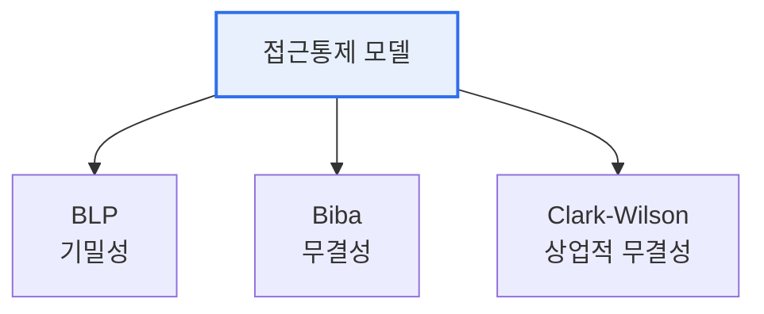

# 접근 통제 보안 모델 — BLP · Biba · Clark-Wilson

## 1. 개요

### 가. 정의
> **접근 통제 보안 모델**은 주체(사용자)가 객체(자원)에 접근할 때 지켜야 할 규칙을 형식화한 것으로, 무엇을 보호하느냐에 따라 **기밀성(BLP)·무결성(Biba·Clark-Wilson)** 모델로 나뉜다.

이 모델들을 함께 이해하는 핵심은 '**각 모델이 서로 다른 보안 목표를 정반대 규칙으로 달성한다**'는 데 있다. 기밀성을 지키려는 BLP는 "비밀 정보가 낮은 등급으로 새어나가지 않게" 막고, 무결성을 지키려는 Biba는 "신뢰할 수 없는 데이터가 중요한 자원을 오염시키지 않게" 막는다. 흥미롭게도 이 둘의 규칙은 방향이 정반대다. 기밀성은 '위로 쓰고 아래로 못 읽게', 무결성은 '아래로 못 쓰고 위에서 못 읽게' 통제한다. 목표가 다르기 때문이다. Clark-Wilson은 여기서 더 나아가, 군사적 등급이 아닌 상업 환경의 무결성을 잘 정의된 트랜잭션과 직무 분리로 보장한다. 즉 세 모델은 "무엇을 지키려는가(기밀성 vs 무결성)"와 "어떤 환경인가(군사 vs 상업)"에 따라 나뉜다.

## 2. BLP(Bell-LaPadula) 모델 — 기밀성

> 군사 기밀 보호를 위한 대표적 **기밀성 모델** 로, 정보가 높은 등급에서 낮은 등급으로 유출되는 것을 막는다.

BLP의 두 규칙은 '기밀 정보의 하향 유출 차단'이라는 목표를 구현한다.

| 규칙 | 내용 |
|---|---|
| **No Read Up (단순 보안)** | 자기보다 높은 등급의 정보를 읽을 수 없음 |
| **No Write Down (*-속성)** | 자기보다 낮은 등급에 쓸 수 없음(기밀 유출 방지) |

'낮은 등급이 높은 기밀을 못 읽고, 높은 등급이 낮은 곳에 기밀을 못 흘린다'는 원리다.

## 3. Biba 모델 — 무결성

> 데이터의 **무결성 보호** 를 위한 모델로, 신뢰도 낮은 정보가 높은 무결성 자원을 오염시키는 것을 막는다. BLP와 규칙 방향이 정반대다.

| 규칙 | 내용 |
|---|---|
| **No Write Up** | 자기보다 높은 무결성 등급에 쓸 수 없음(오염 방지) |
| **No Read Down** | 자기보다 낮은 무결성 등급을 읽을 수 없음 |

'신뢰도 낮은 주체가 중요한 데이터를 못 고치고, 신뢰도 높은 주체가 오염된 데이터를 안 읽는다'는 원리로, 무결성을 지킨다.

## 4. Clark-Wilson 모델 — 상업적 무결성

> 상업 환경의 무결성을 위한 모델로, **잘 정의된 트랜잭션과 직무 분리** 를 통해 데이터를 정당한 방법으로만 변경하도록 보장한다.

| 요소 | 내용 |
|---|---|
| **잘 정의된 트랜잭션** | 인가된 절차(프로그램)로만 데이터 변경 |
| **직무 분리(SoD)** | 한 사람이 전 과정을 못 하게 분리(부정 방지) |
| **무결성 검증** | 데이터 일관성 정기 검증 |

은행처럼 '정해진 절차로만, 여러 사람이 나눠서' 데이터를 다루게 해 부정과 오류를 막는다.

## 5. 비교 및 시사점

| 모델 | 보호 목표 | 핵심 규칙 |
|---|---|---|
| **BLP** | 기밀성 | No Read Up, No Write Down |
| **Biba** | 무결성 | No Write Up, No Read Down |
| **Clark-Wilson** | 상업적 무결성 | 트랜잭션·직무 분리 |

1. **목표에 맞는 모델 선택**이 중요하다. 군사·정보기관은 기밀성(BLP), 금융·상업은 무결성(Biba·Clark-Wilson)이 우선이므로 환경에 맞게 적용한다.
2. **기밀성과 무결성 규칙의 상충**을 이해한다. BLP와 Biba는 규칙이 정반대라 동시에 완전 적용하기 어렵다. 실무는 목표 우선순위에 따라 조합·절충한다.
3. **현대 접근통제로 확장**된다. 이 고전 모델의 원리(등급·직무 분리)가 RBAC·ABAC, 제로트러스트의 최소권한·직무분리 원칙으로 계승되고 있다.

---

> **한 줄 요약**: 접근통제 모델은 *BLP(기밀성: No Read Up·No Write Down)·Biba(무결성: No Write Up·No Read Down)·Clark-Wilson(상업 무결성: 트랜잭션·직무분리)* 으로 나뉘며, 보호 목표(기밀성 vs 무결성)와 환경에 맞게 선택·조합한다.
