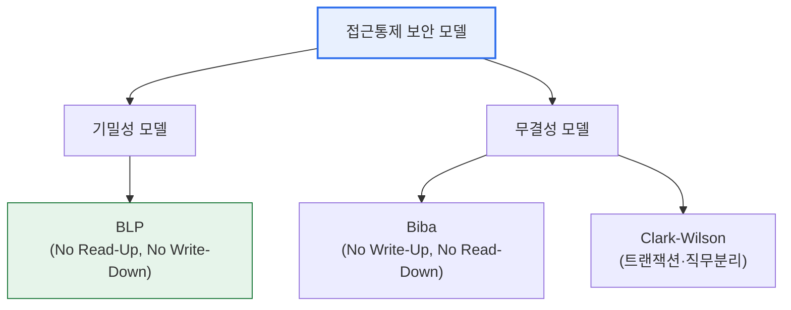
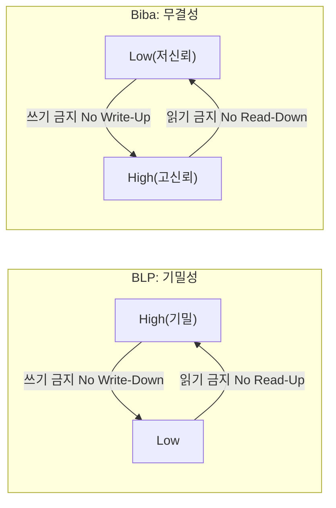

# 접근 통제 보안 모델 — BLP · Biba · Clark-Wilson

## 1. 개요

### 가. 정의
> **접근 통제 보안 모델(Access Control Security Model)** 은 주체(Subject, 사용자·프로세스)가 객체(Object, 파일·자원)에 접근할 때 지켜야 할 규칙을 수학적·형식적으로 정의한 것으로, 무엇을 보호하느냐에 따라 **기밀성(BLP)** 과 **무결성(Biba·Clark-Wilson)** 모델로 나뉜다.

이 세 모델을 함께 이해하는 핵심은 '**각 모델이 서로 다른 보안 목표를 정반대의 규칙으로 달성한다**'는 데 있다. 기밀성을 지키려는 BLP는 "비밀 정보가 낮은 등급으로 새어나가지 않게" 막고, 무결성을 지키려는 Biba는 "신뢰할 수 없는 데이터가 중요한 자원을 오염시키지 않게" 막는다. 흥미롭게도 두 모델의 규칙은 방향이 정확히 대칭을 이룬다. 기밀성 모델은 '위로 쓰고 아래로 읽는다(Write-Up, Read-Down)', 무결성 모델은 '아래로 읽지 못하고 위로 쓰지 못한다(No Read-Down, No Write-Up)'. 목표가 반대이므로 규칙도 반대가 되는 것이다.

Clark-Wilson은 여기서 한 걸음 더 나아간다. BLP·Biba가 군사적 보안 '등급(Label)'을 전제로 한 반면, Clark-Wilson은 등급이라는 개념이 낯선 상업 환경에서 **잘 정의된 트랜잭션(Well-formed Transaction)** 과 **직무 분리(Separation of Duty)** 로 무결성을 달성한다. 정리하면 세 모델은 "무엇을 지키려는가(기밀성 vs 무결성)"와 "어떤 환경인가(군사 vs 상업)"라는 두 축으로 구분된다.

### 나. 등장 배경 및 필요성
1970년대 미국 국방부는 여러 등급의 기밀을 한 시스템에서 다루는 다중등급보안(MLS) 환경에서, 사람의 판단이 아닌 **시스템이 강제하는 규칙**으로 정보 유출을 막을 필요가 있었다. 이 요구가 BLP라는 최초의 형식적 보안 모델을 낳았다. 그러나 BLP는 기밀성만 다룰 뿐 데이터가 부적절하게 '변조'되는 것은 막지 못했고, 이 공백을 메우기 위해 무결성에 초점을 둔 Biba가, 그리고 등급 체계가 없는 기업 회계·거래 환경을 위한 Clark-Wilson이 차례로 제안되었다. 즉 세 모델은 서로 경쟁 관계가 아니라, 현실의 서로 다른 보안 요구를 순차적으로 보완해 온 계보(系譜)로 이해해야 한다.

이 고전 모델들은 오늘날 직접 구현되기보다, RBAC·ABAC·제로트러스트 같은 현대 접근통제의 **설계 원리**로 계승된다는 점에서 여전히 중요하다. 최소권한·직무분리·강제적 규칙이라는 개념의 뿌리가 여기에 있다.

## 2. BLP(Bell-LaPadula) 모델 — 기밀성

> 미 국방부의 군사 기밀 보호를 위해 제안된 대표적 **기밀성(Confidentiality) 모델** 로, 정보가 높은 등급에서 낮은 등급으로 유출되는 것을 강제적으로 차단한다. 흔히 "**Write-Up, Read-Down(위로 쓰고 아래로 읽는다)**"으로 요약된다.

BLP의 두 핵심 규칙은 모두 '기밀 정보의 하향 유출 차단'이라는 단일 목표를 구현한다. 첫째 규칙인 **단순 보안 속성(ss-property, No Read-Up)** 은 주체가 자신의 인가 등급보다 높은 객체를 읽지 못하게 한다. 기밀(Secret) 등급의 사용자가 일급기밀(Top Secret) 문서를 열람하지 못하게 하는 것으로, 직관적이고 자연스러운 규칙이다.

둘째 규칙인 **성형 속성(\*-property, No Write-Down)** 은 오히려 직관에 반해 보이지만 BLP의 핵심이다. 높은 등급의 주체가 낮은 등급의 객체에 쓰지 못하게 막는다. 왜냐하면 일급기밀을 아는 사용자가 그 내용을 실수로든 악의로든 공개(Unclassified) 문서에 옮겨 적으면, 등급이 낮은 사람도 기밀을 보게 되어 유출이 발생하기 때문이다. 특히 트로이목마가 사용자 권한을 이용해 기밀을 낮은 등급으로 흘리는 공격을 이 규칙이 원천 차단한다.

BLP에는 규칙의 안정성을 보장하는 **평정 원칙(Tranquility Principle)** 이라는 전제가 있다. 강한 평정성은 시스템 운영 중 주체·객체의 보안 등급이 아예 변하지 않음을, 약한 평정성은 보안 정책을 위반하는 방향으로는 등급이 변하지 않음을 뜻한다. 만약 등급이 임의로 바뀔 수 있다면 No Write-Down 규칙을 우회할 수 있으므로, 이 원칙은 모델의 무결성을 지탱하는 숨은 기둥이다. 한계도 분명하다. BLP는 기밀성만 보장할 뿐 데이터 변조는 통제하지 못하며, 오히려 낮은 등급 사용자가 높은 등급 객체에 쓰는 것(Write-Up)은 허용하므로 무결성 관점에서는 위험할 수 있다.

| 규칙 | 정식 명칭 | 내용 |
|---|---|---|
| **No Read-Up** | 단순 보안 속성(ss) | 자신보다 높은 등급의 정보를 읽을 수 없음 |
| **No Write-Down** | 성형 속성(\*) | 자신보다 낮은 등급에 쓸 수 없음(기밀 하향 유출 방지) |
| **재량 규칙** | ds-속성 | 접근제어행렬(DAC)로 세부 권한 추가 통제 |

## 3. Biba 모델 — 무결성

> 데이터의 **무결성(Integrity) 보호** 를 위한 모델로, 신뢰도가 낮은 정보가 무결성이 높은 자원을 오염시키는 것을 막는다. BLP와 규칙 방향이 정확히 정반대라 "**No Read-Down, No Write-Up**"으로 요약된다.

Biba가 다루는 것은 '기밀'이 아니라 '오염'이다. 예를 들어 검증되지 않은 외부 입력이나 신뢰도 낮은 프로세스가 시스템의 핵심 설정 파일이나 회계 원장 같은 고(高)무결성 자원을 함부로 수정하면, 데이터의 정확성과 신뢰성이 무너진다. Biba는 이를 두 규칙으로 차단한다.

**무결성 성형 속성(No Write-Up)** 은 주체가 자신보다 높은 무결성 등급의 객체에 쓰지 못하게 한다. 신뢰도 낮은 주체가 중요한 데이터를 변경해 오염시키는 것을 막는 규칙으로, BLP의 No Write-Down과 방향이 반대다. **단순 무결성 속성(No Read-Down)** 은 주체가 자신보다 낮은 무결성 등급의 객체를 읽지 못하게 한다. 신뢰도 높은 프로세스가 오염된(신뢰도 낮은) 데이터를 읽어 들여 스스로 오염되는 것을 막기 위함이다.

BLP와 Biba를 한 시스템에 동시에 완전 적용하면 규칙이 서로 충돌해 접근이 과도하게 제한된다는 점이 실무적 함의다. 기밀성 관점에서는 아래로 읽어야 하고(Read-Down), 무결성 관점에서는 아래로 읽으면 안 되기(No Read-Down) 때문이다. 따라서 현실 시스템은 보호 우선순위에 따라 한쪽을 주로 채택하거나, 등급 체계를 분리해 절충한다. 또한 Biba는 무결성만 다루므로 기밀성은 별도 통제가 필요하다.

| 규칙 | 내용 | BLP와의 대비 |
|---|---|---|
| **No Write-Up** | 높은 무결성 등급에 쓸 수 없음(오염 방지) | BLP는 No Write-Down |
| **No Read-Down** | 낮은 무결성 등급을 읽을 수 없음 | BLP는 Read-Down 허용 |

## 4. Clark-Wilson 모델 — 상업적 무결성

> 은행·회계 같은 상업 환경의 무결성을 위한 모델로, 군사적 등급 대신 **잘 정의된 트랜잭션과 직무 분리**를 통해 데이터가 오직 정당한 절차로만 변경되도록 보장한다.

Clark-Wilson의 출발점은 "기업 환경에서 무결성이란 무엇인가"라는 질문이다. 은행에서 중요한 것은 '누가 얼마나 비밀을 아느냐'가 아니라 '거래가 정확하고 일관되게, 인가된 절차로만 처리되느냐'다. 이를 위해 이 모델은 보호 대상 데이터를 **CDI(Constrained Data Item, 제약된 데이터)** 로 정의하고, 사용자가 데이터를 직접 건드리지 못하게 한 뒤 오직 인증된 프로그램인 **TP(Transformation Procedure, 변환 절차)** 를 통해서만 변경하도록 강제한다.

**잘 정의된 트랜잭션**은 이 TP 개념을 가리킨다. 사용자가 계좌 잔액을 임의로 수정하는 것이 아니라, '입금'·'출금'이라는 검증된 프로그램을 거치게 해 항상 데이터가 일관된 상태에서 일관된 상태로만 전이하도록 한다. **무결성 검증 절차(IVP, Integrity Verification Procedure)** 는 CDI가 유효한 상태인지를 정기적으로 확인해, 예컨대 차변·대변 합계가 일치하는지 같은 일관성을 검증한다.

**직무 분리(Separation of Duty)** 는 부정을 막는 조직적 통제다. 한 사람이 거래의 요청·승인·기록 전 과정을 혼자 수행하면 횡령·조작이 쉬워지므로, 이를 여러 역할로 나눈다. 예를 들어 대금 지급에서 지출 요청자와 승인자를 분리하면, 부정을 저지르려면 최소 두 명의 공모가 필요해져 통제 강도가 크게 높아진다. 이러한 상업적 무결성 원리는 오늘날 SOX(사베인스-옥슬리)법 등 회계 내부통제 요건과 직결되어, ERP·회계 시스템 설계의 기본 원칙으로 자리 잡았다.

| 요소 | 내용 |
|---|---|
| **CDI/UDI** | 보호 대상 데이터(CDI)와 비제약 데이터(UDI) 구분 |
| **잘 정의된 트랜잭션(TP)** | 인가된 절차(프로그램)로만 CDI 변경 |
| **직무 분리(SoD)** | 요청·승인·기록을 분리해 단독 부정 방지 |
| **무결성 검증(IVP)** | CDI의 일관성·유효성 정기 검증 |

## 5. 비교 및 시사점

세 모델을 한눈에 비교하면, 보호 목표(기밀성/무결성)와 적용 환경(군사/상업)이라는 두 기준으로 뚜렷이 갈린다. 아래 구조도는 이 분류를 시각화한 것이다.

```mermaid
flowchart TB
  M["접근통제 보안 모델"] --> C["기밀성 모델"]
  M --> I["무결성 모델"]
  C --> B["BLP<br/>(No Read-Up, No Write-Down)"]
  I --> BI["Biba<br/>(No Write-Up, No Read-Down)"]
  I --> CW["Clark-Wilson<br/>(트랜잭션·직무분리)"]
  style M fill:#e8f0fe,stroke:#2f6fed,stroke-width:2px
  style B fill:#e6f4ea,stroke:#137333,stroke-width:1px
```

아래 프로세스 관점의 다이어그램은 세 모델이 각각 '읽기/쓰기'를 어느 방향으로 허용·차단하는지를 대비해 보여 준다. 규칙의 방향성이 목표에서 필연적으로 도출됨을 확인할 수 있다.

```mermaid
flowchart LR
  subgraph BLP["BLP: 기밀성"]
    HB["High(기밀)"] -->|"쓰기 금지 No Write-Down"| LB["Low"]
    LB -->|"읽기 금지 No Read-Up"| HB
  end
  subgraph BIBA["Biba: 무결성"]
    LI["Low(저신뢰)"] -->|"쓰기 금지 No Write-Up"| HI["High(고신뢰)"]
    HI -->|"읽기 금지 No Read-Down"| LI
  end
```

| 모델 | 보호 목표 | 환경 | 핵심 규칙 |
|---|---|---|---|
| **BLP** | 기밀성 | 군사·정보기관 | No Read-Up, No Write-Down |
| **Biba** | 무결성 | 신뢰도 통제가 필요한 시스템 | No Write-Up, No Read-Down |
| **Clark-Wilson** | 상업적 무결성 | 금융·회계 | 트랜잭션·직무 분리·무결성 검증 |

차이가 생기는 근본 이유는 '유출'과 '오염'이라는 위협의 방향이 정반대이기 때문이다. 기밀은 위에서 아래로 새어나가므로 하향 쓰기를 막고, 오염은 아래에서 위로 스며들므로 상향 쓰기를 막는다. 이 대칭성을 이해하면 규칙을 암기하지 않고도 재구성할 수 있다.

구체적 사례로 세 모델의 쓰임을 대비해 보자. 첫째, 군 지휘통제 시스템에서 일급기밀 작전계획을 다루는 장교가 일반 등급 게시판에 요약을 올리려 하면 BLP의 No Write-Down이 이를 차단한다. 둘째, 서버 운영 환경에서 신뢰도 낮은 사용자 업로드 스크립트가 시스템 핵심 설정 파일을 수정하려 하면 Biba의 No Write-Up이 오염을 막는다. 셋째, 은행 계정계에서 한 직원이 자신의 계좌로 이체를 요청하고 스스로 승인하려 하면 Clark-Wilson의 직무 분리가 이를 불허하고 별도 승인자를 강제한다. 세 사례 모두 '사람의 선의'가 아니라 '시스템이 강제하는 규칙'으로 사고를 예방한다는 공통점이 있으며, 이것이 형식적 보안 모델의 본질적 가치다.

한 가지 유의할 점은, 이 모델들이 현실에서는 순수한 형태로 구현되기보다 서로 보완적으로 결합된다는 것이다. 예컨대 다중등급 운영체제(SELinux 등)는 BLP·Biba의 강제적 규칙을 커널 수준에서 구현하되, 실제 운영 편의를 위해 역할·타입 기반 정책(RBAC/TE)을 함께 사용한다. 따라서 기술사 관점에서는 개별 모델의 규칙 암기를 넘어, 목표·환경에 따라 이들을 어떻게 조합·절충할지를 설계하는 안목이 요구된다.

## 6. 고려사항 및 시사점 (기술사 관점)

1. **보호 목표에 맞는 모델 선택이 우선이다.** 군사·정보기관처럼 기밀성이 최우선이면 BLP를, 금융·제조·회계처럼 데이터 정확성이 최우선이면 Biba·Clark-Wilson을 기반으로 설계해야 한다. 시스템의 핵심 자산이 '비밀'인지 '정확성'인지를 먼저 규정하는 것이 출발점이다.
2. **기밀성과 무결성 규칙의 상충을 절충해야 한다.** BLP와 Biba는 Read/Write 방향이 반대라 동시에 완전 적용하면 가용성이 심각히 저하된다. 실무에서는 우선순위가 높은 목표를 주 모델로 삼고, 등급 체계를 분리하거나 예외를 최소화하는 방식으로 조합한다.
3. **강제적 통제(MAC)의 한계와 운영 부담을 고려한다.** 이들 모델은 강력하지만 등급 부여·유지 비용이 크고 유연성이 낮다. 따라서 오늘날에는 순수 구현보다, RBAC로 역할 기반 관리 편의성을 더하고 ABAC로 상황(속성) 기반 세밀 통제를 결합하는 하이브리드가 일반적이다.
4. **현대 아키텍처로의 계승을 인식한다.** 최소권한·직무분리·강제규칙이라는 고전 원리는 제로트러스트(절대 신뢰하지 않고 항상 검증)와 최소권한 접근, 클라우드 IAM의 정책 기반 통제로 직접 이어진다. 고전 모델은 현대 통제의 '설계 언어'이므로 원리 이해가 실무 설계 역량으로 직결된다.
5. **규정 준수(Compliance)와의 연계를 설계에 반영한다.** Clark-Wilson의 직무분리·무결성검증 원리는 SOX·전자금융감독규정 등 내부통제 요건과 직결되므로, 접근통제 설계 시 감사 추적·증적 확보까지 함께 고려해야 실효성이 있다.

## 참고자료
- Bell–LaPadula model (Wikipedia): https://en.wikipedia.org/wiki/Bell%E2%80%93LaPadula_model
- Formal Security Models Explained: Bell-LaPadula, Biba, Clark-Wilson: https://inventivehq.com/blog/formal-security-models-bell-lapadula-biba-clark-wilson

---

> **한 줄 요약**: 접근통제 모델은 *BLP(기밀성: No Read-Up·No Write-Down)·Biba(무결성: No Write-Up·No Read-Down)·Clark-Wilson(상업 무결성: 트랜잭션·직무분리)* 으로 나뉘며, '유출은 하향, 오염은 상향'이라는 위협 방향의 대칭에서 규칙이 도출되고, 보호 목표·환경에 맞게 선택·조합해 RBAC·ABAC·제로트러스트로 계승·확장된다.
