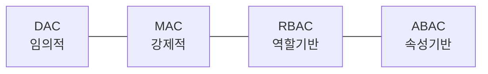

# 접근제어(Access Control)

## 1. 개요

### 가. 개념
> 인증된 **주체(Subject)** 가 **객체(Object)** 에 대해 **허가된 권한(Right)만큼만 접근**하도록 통제하는 정보보호 메커니즘. 정보보호는 크게 **암호화**(데이터 보호)와 **접근제어**(접근 통제)로 분류된다.

### 나. 3대 요소(AAA)
- **식별·인증(Authentication)** → **인가(Authorization)** → **책임추적성(Accounting)**

## 2. 접근제어 정책(Policy)

| 정책 | 원리 | 장·단점 |
|---|---|---|
| **DAC(임의적)** | 객체 소유자가 권한 부여 | 유연/통제 약함, 트로이목마 취약 |
| **MAC(강제적)** | 보안등급·라벨로 시스템이 강제 | 강한 보안(군·기밀)/유연성 낮음 |
| **RBAC(역할기반)** | 역할(Role)에 권한 부여, 사용자는 역할 배정 | 관리 효율·기업 표준 |
| **ABAC(속성기반)** | 주체·객체·환경 **속성/상황**으로 동적 결정 | 세밀·유연/정책 복잡 |

## 3. 접근제어 절차

| 단계 | 내용 |
|---|---|
| **식별·인증** | 신원 제시·검증(지식·소유·생체) |
| **인가** | 접근 정책에 따라 권한 판단 |
| **중재·집행** | 참조모니터가 모든 접근 강제 통제 |
| **감사** | 접근 이력 기록·모니터링 |

## 4. 구현 메커니즘

| 메커니즘 | 설명 |
|---|---|
| **접근제어행렬(ACM)** | 주체×객체 권한 표(개념 모델) |
| **ACL** | 객체별 접근 권한 목록(열 단위) |
| **Capability List** | 주체별 권한 토큰(행 단위) |
| **보안 레이블** | 등급 비교로 판정(MAC) |
| **참조모니터(Reference Monitor)** | 모든 접근을 중재·강제(TCB), 우회 불가·검증가능 |

## 5. 고려사항 및 시사점
- **최소권한(Least Privilege)·직무분리(SoD)** 원칙 적용
- 클라우드·원격근무 확대 → **제로트러스트(ZTNA)**, ABAC·지속적 인증으로 진화
- IAM·PAM(특권계정관리)와 연계해 통합 접근 거버넌스 구축

---

> **한 줄 요약**: 접근제어는 *식별·인증→인가→중재(참조모니터)→감사* 절차로 주체의 객체 접근을 통제하며, DAC·MAC·RBAC·ABAC 정책을 ACL·Capability·참조모니터로 구현하고 최소권한·제로트러스트로 발전한다.
