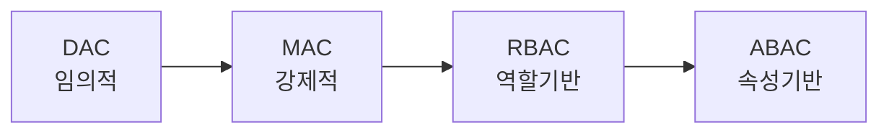

# 접근제어(Access Control)

## 1. 개요

### 가. 정의
> 인증된 **주체(Subject)** 가 **객체(Object)** 에 대해 **허가된 권한(Right)만큼만 접근**하도록 통제하는 정보보호 메커니즘.

정보보호는 크게 데이터 자체를 알아볼 수 없게 만드는 **암호화**와, 데이터에 다가서는 행위를 막는 **접근제어**로 나뉜다. 암호화가 "훔쳐도 못 읽게" 하는 방어라면, 접근제어는 "애초에 손대지 못하게" 하는 방어다. 두 방어선은 상호 보완적이며, 접근제어는 시스템의 자원(파일·DB·기능)에 대한 접근을 정책에 따라 허용·거부함으로써 **기밀성·무결성·가용성**을 함께 지탱하는 보안의 기본 골격이다.

### 나. 3대 요소와 필요성
접근제어는 흔히 AAA로 요약되는 세 단계로 작동한다. 먼저 "너는 누구냐"를 확인하는 **식별·인증(Authentication)**, 다음으로 "무엇을 해도 되느냐"를 판정하는 **인가(Authorization)**, 끝으로 "무엇을 했는가"를 남기는 **책임추적성(Accounting)** 이다. 이 세 단계가 순서대로 맞물려야 한다는 점이 중요하다. 인증 없는 인가는 사칭을 부르고, 인가 없는 인증은 통제를 잃으며, 감사 없는 접근은 사고 시 책임을 물을 수 없다. 내부자 위협·계정 탈취가 보안 사고의 큰 축을 차지하는 현실에서, "누가 무엇에 접근할 수 있는가"를 규율하는 접근제어는 사실상 모든 시스템 보안의 출발점이 된다.

## 2. 접근제어 정책(Policy)

정책은 "권한을 누가, 어떤 기준으로 부여하는가"에 따라 나뉜다. DAC에서 ABAC로 갈수록 통제의 주체가 개인에서 시스템으로, 판단 기준이 정적 신원에서 동적 상황으로 옮겨가며 **보안 강도와 유연성이 함께 커지는 대신 정책 복잡도도 증가**한다.

**DAC**는 객체 소유자가 자기 재량으로 권한을 나눠주는 방식(유닉스 파일 권한이 대표)으로 유연하지만, 권한을 넘겨받은 프로그램이 몰래 정보를 유출하는 **트로이목마에 취약**하다. **MAC**는 소유자 의사와 무관하게 시스템이 보안등급·라벨을 비교해 강제하므로(군·기밀 시스템의 BLP 모델) 매우 강력하나 유연성이 낮다. **RBAC**는 권한을 개인이 아니라 **역할(Role)** 에 부여하고 사용자에게 역할을 배정하는 방식으로, 인사이동 시 역할만 바꾸면 되어 대규모 조직의 관리 효율이 높아 기업 표준이 되었다. **ABAC**는 주체·객체·환경의 **속성과 상황**(부서, 시간, 접속 위치 등)을 조합해 접근을 동적으로 결정해 가장 세밀하다.

| 정책 | 원리 | 장·단점 |
|---|---|---|
| **DAC(임의적)** | 객체 소유자가 권한 부여 | 유연 / 통제 약함, 트로이목마 취약 |
| **MAC(강제적)** | 보안등급·라벨로 시스템이 강제 | 강한 보안(군·기밀) / 유연성 낮음 |
| **RBAC(역할기반)** | 역할에 권한 부여, 사용자에 역할 배정 | 관리 효율·기업 표준 |
| **ABAC(속성기반)** | 주체·객체·환경 속성으로 동적 결정 | 세밀·유연 / 정책 복잡 |

## 3. 접근제어 절차

접근제어가 실제로 동작하는 흐름은 신원 확인에서 감사까지 이어진다. 이 흐름에서 결정적 역할은 모든 접근 요청을 반드시 거쳐 가게 하는 **참조모니터(Reference Monitor)** 가 맡는다.

각 단계는 다음과 같다. 식별·인증에서 신원을 지식(비밀번호)·소유(토큰)·생체 요소로 검증하고, 인가에서 정책에 따라 권한을 판단하며, 참조모니터가 **모든 접근을 예외 없이 중재·강제**한다. 참조모니터가 갖춰야 할 세 조건 — 우회 불가능(모든 접근이 반드시 거침), 변조 불가능, 검증 가능(작고 분석 가능) — 이 지켜져야 통제가 신뢰된다.

| 단계 | 내용 |
|---|---|
| **식별·인증** | 신원 제시·검증(지식·소유·생체) |
| **인가** | 접근 정책에 따라 권한 판단 |
| **중재·집행** | 참조모니터가 모든 접근 강제 통제 |
| **감사** | 접근 이력 기록·모니터링(책임추적) |

## 4. 구현 메커니즘

정책을 실제 시스템에 담는 개념적 원형은 주체×객체의 권한을 채운 **접근제어행렬(ACM)** 이다. 하지만 이 행렬은 대부분 비어 있어 통째로 저장하면 비효율적이라, 실무에서는 이를 열 단위로 자른 **ACL**과 행 단위로 자른 **Capability**로 나눠 구현한다. ACL은 객체 입장에서 "누가 나에게 접근 가능한가"를 파일마다 붙이는 방식이라 객체 중심 관리에 편하고, Capability는 주체가 권한 토큰을 들고 다니는 방식이라 주체 중심·분산 환경에 유리하다.

| 메커니즘 | 설명 |
|---|---|
| **접근제어행렬(ACM)** | 주체×객체 권한 표(개념 모델) |
| **ACL** | 객체별 접근 권한 목록(열 단위) |
| **Capability List** | 주체별 권한 토큰(행 단위) |
| **보안 레이블** | 등급 비교로 판정(MAC) |
| **참조모니터** | 모든 접근 중재·강제(TCB), 우회 불가·검증 가능 |

## 5. 고려사항 및 시사점
기술사 관점에서 접근제어 설계의 두 대원칙은 **최소권한(Least Privilege)** 과 **직무분리(SoD)** 다. 각 주체에 업무에 꼭 필요한 최소 권한만 부여하면 계정 탈취 시 피해가 줄고, 요청·승인·실행을 서로 다른 사람이 맡게 하면 단독 부정이 원천 차단된다. 최근 경계는 근본적으로 이동하고 있다. 클라우드·원격근무 확대로 "내부망은 신뢰"라는 전제가 무너지면서, 모든 접근을 매번 검증하는 **제로트러스트(ZTNA)** 로 패러다임이 옮겨간다. 이 흐름은 상황(디바이스 상태·위치·행위)을 반영하는 **ABAC와 지속적 인증**을 요구하며, 계정 전 주기를 관리하는 **IAM**과 관리자·서버 계정을 특별 통제하는 **PAM(특권계정관리)** 을 결합한 통합 접근 거버넌스로 발전한다.

---

> **한 줄 요약**: 접근제어는 *식별·인증→인가→참조모니터 중재→감사* 절차로 주체의 객체 접근을 통제하며, DAC·MAC·RBAC·ABAC 정책을 ACL·Capability·참조모니터로 구현하고, 최소권한·직무분리를 토대로 제로트러스트·ABAC로 진화한다.
