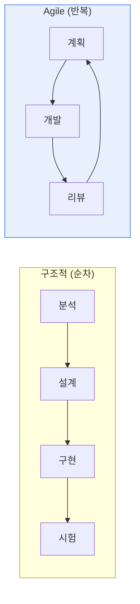

# 구조적 방법론과 Agile 방법론 (Scrum·Kanban)

## 1. 개요

### 가. 정의
> **구조적 방법론**은 시스템을 기능 중심으로 분할·정의하며 순차적으로 개발하는 전통적 방법론이고, **Agile 방법론**은 짧은 반복으로 동작하는 소프트웨어를 점진적으로 만들며 변화에 유연하게 대응하는 방법론이다.

두 방법론의 근본 차이는 '**계획을 따를 것인가, 변화에 대응할 것인가**'라는 태도에 있다. 구조적 방법론은 분석→설계→구현→시험을 순차적으로 진행하며, 앞 단계에서 요구를 확정하고 상세한 문서로 통제해 예측가능성을 확보한다. 자료흐름도(DFD)·구조도 같은 도구로 기능을 하향 분할하는 방식이다. 반면 Agile은 요구가 계속 변한다는 전제 아래, 2~4주 반복(스프린트)마다 실제 동작하는 결과물을 내고 고객 피드백으로 방향을 수정한다. 문서보다 동작하는 소프트웨어를, 계약보다 고객 협력을 중시한다. 요구가 안정적이면 구조적 방법론이, 불확실하고 시장 대응이 중요하면 Agile이 유리하다. Agile을 실천하는 대표 프레임워크가 Scrum과 Kanban이다.

### 나. 도입 배경
전통적 방법론은 요구가 자주 바뀌는 현대 소프트웨어 환경에서 변경 대응이 느리고 후반에 결함이 발견되는 한계를 드러냈다. 빠른 출시와 변화 대응을 위해 Agile이 확산되었다.

## 2. 구조적 방법론과 Agile 비교

| 구분 | 구조적 방법론 | Agile 방법론 |
|---|---|---|
| **진행** | 순차·단계 완결 | 반복·점진 |
| **요구 변경** | 통제·최소화 | 적극 수용 |
| **중심** | 상세 문서·계획 | 동작 SW·협력 |
| **도구** | DFD·구조도 | 백로그·스프린트·보드 |
| **적합** | 요구 안정·대규모·규제 | 요구 불확실·빠른 대응 |

## 3. Scrum과 Kanban

Agile을 구현하는 두 대표 프레임워크는 접근이 다르다. **Scrum** 은 정해진 기간(스프린트)에 계획한 작업을 완료하는 **타임박스 기반** 방식으로, 역할(PO·스크럼마스터·팀)과 이벤트(스프린트 계획·데일리·리뷰·회고)가 정형화되어 있다. **Kanban** 은 작업 흐름을 시각화한 보드에서 진행 중 작업 수(WIP)를 제한해 **흐름을 최적화** 하는 방식으로, 정해진 반복 주기 없이 연속적으로 일감을 처리한다.

| 구분 | Scrum | Kanban |
|---|---|---|
| **주기** | 고정 스프린트(타임박스) | 연속 흐름(주기 없음) |
| **역할** | PO·스크럼마스터·팀(정형) | 규정 없음(유연) |
| **핵심** | 스프린트 목표 달성 | WIP 제한, 흐름 최적화 |
| **변경** | 스프린트 중 변경 지양 | 언제든 유연 |
| **적합** | 명확한 반복 개발 | 운영·지원·연속 처리 |

## 4. Agile의 효율적 수행 방안

1. **점진적 도입과 문화 정착**: 전면 전환보다 파일럿 팀부터 시작하고, 자율·협력·회고 문화를 함께 조성해야 '이름만 Agile'을 피한다.
2. **DevOps·CI/CD 결합**: 자동화된 빌드·테스트·배포가 뒷받침되어야 짧은 반복의 '빠른 가치 전달'이 실제로 실현된다.
3. **하이브리드·대규모 확장**: 상위 계획은 구조적으로, 개발은 Agile로 운영하는 하이브리드나 SAFe·LeSS 같은 대규모 애자일 프레임워크로 절충한다.

## 5. 고려사항 및 시사점

- **방법론보다 팀 역량·문화가 성공을 좌우**한다. Agile은 자율적 팀 문화 없이는 형식만 남는다.
- **최소한의 문서**는 유지해야 한다. 문서 최소화가 추적성·유지보수에 필요한 문서까지 없애는 것을 의미하지 않는다.

---

> **한 줄 요약**: 구조적 방법론은 *순차·계획 중심의 예측가능성*, Agile은 *반복·변화 대응의 유연성* 을 제공하며, Agile 구현체인 Scrum(타임박스)·Kanban(흐름 최적화)을 프로젝트 특성에 맞게 선택하되 팀 문화와 DevOps 결합이 성공을 좌우한다.
