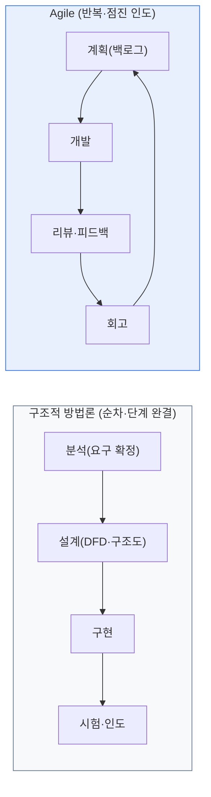
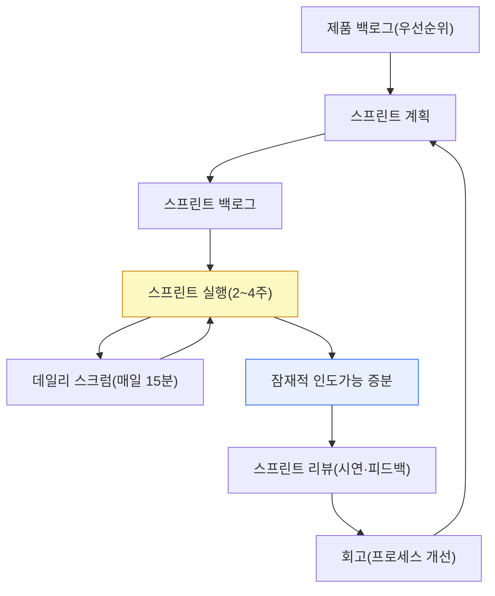

# 구조적 방법론과 Agile 방법론 (Scrum·Kanban)

## 1. 개요

### 가. 정의

> **구조적 방법론(Structured Methodology)** 은 시스템을 기능 중심으로 하향 분할·정의하며 분석→설계→구현→시험을 순차적으로 진행하는 전통적 개발 방법론이고, **Agile 방법론** 은 짧은 반복(Iteration)으로 동작하는 소프트웨어를 점진적으로 인도하며 요구 변화에 유연하게 대응하는 경량(Lightweight) 방법론이다.

두 방법론의 근본 차이는 "**계획을 따를 것인가, 변화에 대응할 것인가**"라는 개발 철학의 태도 차이에 있다. 구조적 방법론은 앞 단계에서 요구를 확정하고 상세 문서로 산출물을 통제해 **예측가능성(Predictability)** 을 확보하려 한다. 자료흐름도(DFD)·자료사전(DD)·소단위명세서(Mini-spec)·구조도(Structure Chart) 같은 도구로 시스템 기능을 하향식(Top-down)으로 분할하고, 각 단계가 완결되어야 다음 단계로 넘어가는 워터폴(Waterfall) 생명주기를 기본으로 한다. 이 방식은 단계마다 검토·승인(Gate)이 명확해 감사·추적이 쉽고, 요구가 안정적이며 산출물 책임을 계약으로 규정해야 하는 공공·금융·국방 같은 규제 산업에서 여전히 강점을 가진다.

반면 Agile은 "요구는 프로젝트 내내 변한다"는 전제 아래 2~4주 단위 반복마다 실제 동작하는 결과물(Working Software)을 인도하고, 고객 피드백으로 다음 방향을 조정한다. 2001년 발표된 **Agile Manifesto(애자일 선언)** 는 ① 프로세스·도구보다 개인과 상호작용 ② 방대한 문서보다 동작하는 소프트웨어 ③ 계약 협상보다 고객과의 협력 ④ 계획 준수보다 변화 대응을 더 가치 있게 여긴다는 4대 가치와 12개 원칙을 제시했다. 즉 Agile은 특정 절차가 아니라 **가치·원칙의 집합**이며, 이를 실천하는 대표적 프레임워크가 Scrum(팀 협업·타임박스)과 Kanban(흐름 최적화), 그리고 XP(기술 프랙티스)이다.

요구가 명확하고 안정적이며 대규모·고신뢰가 필요하면 구조적 방법론이, 요구가 불확실하고 시장 대응 속도가 중요하면 Agile이 유리하다는 점이 선택의 기준이 된다. 실제로는 상위 계획·아키텍처는 구조적으로 통제하고 개발 실행은 Agile로 반복하는 **하이브리드** 형태가 대기업 SI·공공 사업에서 늘고 있다.

### 나. 도입 배경 및 필요성

전통적 방법론은 요구가 자주 바뀌는 현대 소프트웨어 환경에서 세 가지 한계를 드러냈다. 첫째, 앞 단계에서 요구를 모두 확정한다는 가정이 비현실적이어서, 시장·비즈니스가 바뀌면 확정된 설계가 곧 낡은 것이 된다. 둘째, 결함이 후반 시험 단계에서 한꺼번에 발견되어 수정 비용이 기하급수적으로 커진다(요구 단계 1이면 운영 단계 100 수준). 셋째, 중간 산출물은 많아도 "동작하는 것"은 프로젝트 후반에야 나오므로 고객이 가치를 늦게 확인한다.

Agile은 이러한 한계에 대한 대응으로, **작게 나눠 빨리 인도하고 피드백으로 방향을 수정**하는 접근을 취한다. 클라우드·DevOps·CI/CD의 확산으로 짧은 주기의 빌드·배포가 기술적으로 가능해지면서, "빠른 출시(Time-to-Market)와 변화 대응"이라는 비즈니스 요구와 결합해 Agile이 사실상 소프트웨어 개발의 주류로 자리 잡았다.

## 2. 구조적 방법론과 Agile의 개념 비교

```mermaid
flowchart LR
  subgraph S["구조적 방법론 (순차·단계 완결)"]
    S1["분석(요구 확정)"] --> S2["설계(DFD·구조도)"] --> S3["구현"] --> S4["시험·인도"]
  end
  subgraph A["Agile (반복·점진 인도)"]
    A1["계획(백로그)"] --> A2["개발"] --> A3["리뷰·피드백"] --> A4["회고"] --> A1
  end
  style A fill:#e8f0fe,stroke:#2f6fed
  style S fill:#f8f9fb,stroke:#64748b
```

위 구조도에서 보듯 구조적 방법론은 단계가 **한 방향으로 흐르며 완결**되는 반면, Agile은 계획-개발-리뷰-회고가 **닫힌 순환(Loop)** 을 이룬다. 이 구조 차이가 요구 변경 대응, 산출물 형태, 위험 관리 방식의 차이를 만든다.

가장 큰 차이는 **요구 변경을 대하는 태도**다. 구조적 방법론은 변경을 "통제·최소화 대상"으로 보아 변경관리위원회(CCB)와 형상관리로 엄격히 억제한다. 변경이 앞 단계 산출물 전체를 흔들기 때문이다. Agile은 변경을 "경쟁 우위의 원천"으로 보아 매 반복 경계에서 백로그 우선순위를 재조정한다. 다만 이는 스프린트 "진행 중"의 무분별한 변경을 허용한다는 뜻이 아니라, **변경 수용 지점을 반복 경계로 정례화**했다는 의미다.

두 번째 차이는 **위험이 드러나는 시점**이다. 구조적 방법론에서는 통합·부하 문제 같은 큰 위험이 후반 시험에 몰려 나타나(위험의 후행성), 발견이 늦고 수정 비용이 크다. Agile은 매 반복마다 동작 소프트웨어를 만들어 통합·성능 문제를 조기에 노출시키므로 위험을 앞당겨 관리한다.

| 구분 | 구조적 방법론 | Agile 방법론 |
|---|---|---|
| **진행 방식** | 순차·단계 완결(Waterfall) | 반복·점진(Iterative·Incremental) |
| **요구 변경** | 통제·최소화(CCB) | 반복 경계에서 적극 수용 |
| **핵심 가치** | 상세 문서·계획·예측가능성 | 동작 SW·고객 협력·변화 대응 |
| **주요 도구** | DFD·자료사전·구조도 | 백로그·스프린트·보드·번다운 |
| **위험 노출** | 후반 집중(후행) | 매 반복 조기 노출 |
| **적합 상황** | 요구 안정·대규모·규제 산업 | 요구 불확실·빠른 시장 대응 |

## 3. Agile 구현 프레임워크: Scrum과 Kanban

Agile 가치를 실제 개발 절차로 구현한 두 대표 프레임워크가 Scrum과 Kanban이다. 둘 다 "작게, 자주, 투명하게"라는 원칙을 공유하지만, Scrum은 **타임박스와 역할·이벤트로 리듬을 만드는** 방식이고 Kanban은 **작업 흐름 자체를 시각화·최적화하는** 방식이라는 점에서 접근이 다르다.

### 가. Scrum — 타임박스 기반 반복

Scrum은 2~4주의 고정 기간인 **스프린트(Sprint)** 를 단위로, 계획한 작업을 그 기간 안에 완료(Done)하는 것을 목표로 하는 프레임워크다. 핵심은 세 가지 역할, 다섯 가지 이벤트, 세 가지 산출물로 구성된다. 역할은 제품 가치와 백로그 우선순위를 책임지는 **제품책임자(Product Owner)**, 프로세스를 촉진하고 장애물을 제거하는 **스크럼 마스터(Scrum Master)**, 자기조직화하여 실제로 만드는 **개발팀(Dev Team)** 으로 나뉜다.

이 역할 분리가 중요한 이유는 "무엇을 만들지(PO)"와 "어떻게 잘 만들지(팀)", 그리고 "프로세스가 잘 돌게(SM)"라는 책임을 분리해 한 사람에게 권한이 집중되는 것을 막기 때문이다. 특히 스크럼 마스터는 지시자가 아니라 **서번트 리더(Servant Leader)** 로서, 팀이 스스로 문제를 풀도록 돕는 촉진자 역할을 한다.

이벤트는 스프린트 목표와 작업을 정하는 **스프린트 계획**, 매일 15분간 진행 상황과 장애를 공유하는 **데일리 스크럼**, 결과물을 이해관계자에게 시연하고 피드백받는 **스프린트 리뷰**, 프로세스를 개선하는 **회고(Retrospective)** 로 구성된다. 산출물은 제품 백로그, 스프린트 백로그, 그리고 실제로 인도 가능한 **증분(Increment)** 이다. 진행 현황은 남은 작업량을 시각화한 **번다운 차트(Burndown Chart)** 로 투명하게 공유한다.

```mermaid
flowchart TB
  PB["제품 백로그(우선순위)"] --> SP["스프린트 계획"]
  SP --> SB["스프린트 백로그"]
  SB --> DEV["스프린트 실행(2~4주)"]
  DEV --> DS["데일리 스크럼(매일 15분)"]
  DS --> DEV
  DEV --> INC["잠재적 인도가능 증분"]
  INC --> RV["스프린트 리뷰(시연·피드백)"]
  RV --> RE["회고(프로세스 개선)"]
  RE --> SP
  style INC fill:#e8f0fe,stroke:#2f6fed
  style DEV fill:#fef9c3,stroke:#ca8a04
```

### 나. Kanban — 흐름(Flow) 기반 연속 처리

Kanban은 정해진 반복 주기 없이, 작업을 보드(To Do → In Progress → Done)에 카드로 시각화하고 각 단계의 **동시 진행 작업 수(WIP, Work In Progress)를 제한**해 흐름을 최적화하는 방식이다. WIP 제한이 핵심 장치인 이유는, 한 사람이 여러 일을 동시에 붙들면 컨텍스트 전환 비용과 대기 시간이 늘어 오히려 전체 처리량이 떨어지기 때문이다. WIP를 제한하면 병목(Bottleneck) 단계가 눈에 보이게 드러나고, 팀은 새 일을 시작하기보다 "쌓인 일을 끝내는" 데 집중하게 된다.

Kanban은 정형화된 역할·이벤트를 강제하지 않아 도입 저항이 적고, 진행 중인 프로세스 위에 그대로 얹을 수 있다는 장점이 있다. 그래서 요구가 수시로 들어오는 **운영·유지보수·기술지원** 업무에 특히 잘 맞는다. 흐름 성과는 하나의 작업이 시작부터 완료까지 걸린 시간인 **리드타임(Lead Time)** 과 단위 시간당 완료량인 **처리량(Throughput)**, 그리고 시간에 따른 작업 분포를 보여주는 **누적흐름도(CFD)** 로 측정한다.

### 다. Scrum과 Kanban의 비교

| 구분 | Scrum | Kanban |
|---|---|---|
| **주기** | 고정 스프린트(타임박스) | 연속 흐름(주기 없음) |
| **역할** | PO·SM·개발팀(정형) | 별도 규정 없음(유연) |
| **작업 조절** | 스프린트 단위 커밋 | WIP 제한으로 흐름 조절 |
| **핵심 지표** | 속도(Velocity)·번다운 | 리드타임·처리량·CFD |
| **변경 수용** | 스프린트 중 변경 지양 | 언제든 재우선순위 |
| **적합 상황** | 기능 개발·명확한 반복 | 운영·지원·연속 처리 |

두 프레임워크는 배타적이지 않다. Scrum의 리듬(스프린트·회고)에 Kanban의 흐름 관리(WIP 제한·보드)를 결합한 **Scrumban** 이 실무에서 널리 쓰이며, 개발은 Scrum으로, 운영·버그 대응은 Kanban으로 나눠 운영하는 조직도 많다. 선택 기준은 "일이 계획 가능한 배치(Batch)로 들어오는가, 흐르듯 연속으로 들어오는가"이다.

## 4. Agile의 효율적 수행 방안과 적용 사례

Agile을 형식만 흉내 내면 "이름만 Agile(Cargo-cult Agile)"에 그친다. 실제 성과를 내려면 다음이 함께 가야 한다.

첫째, **점진적 도입과 문화 정착**이다. 전면 전환보다 파일럿 팀에서 시작해 성공 경험을 조직에 퍼뜨리고, 자율·투명·회고를 통한 지속 개선 문화를 함께 조성해야 한다. Agile은 자기조직화 팀을 전제하므로, 지시·통제형 관리 문화가 남아 있으면 형식만 남는다.

둘째, **DevOps·CI/CD와의 결합**이다. 짧은 반복의 "빠른 가치 인도"는 빌드·테스트·배포 자동화가 뒷받침되어야 실제로 실현된다. 자동화된 파이프라인이 없으면 반복 주기마다 수동 배포·회귀시험 부담이 누적되어 반복이 오히려 팀을 지치게 한다. 예컨대 넷플릭스·아마존은 자동화된 배포 파이프라인 위에서 하루에도 수천 건을 배포하는데, 이는 Agile 반복이 DevOps와 결합해야 규모의 속도가 난다는 것을 보여준다.

셋째, **대규모 확장 프레임워크의 활용**이다. 팀이 수십 개로 늘면 팀 간 의존성·정렬 문제가 생기므로, 여러 애자일 팀을 조율하는 **SAFe(Scaled Agile Framework)**, **LeSS(Large-Scale Scrum)**, **Spotify 모델(Squad·Tribe·Chapter·Guild)** 같은 확장 체계로 절충한다. 국내에서도 대형 금융·통신사가 차세대·디지털 전환 사업에 SAFe를 도입해 상위 계획은 정렬하되 팀 실행은 자율에 맡기는 방식을 채택한 사례가 늘고 있다.

넷째, **적정 지표로 개선을 이끈다**. Scrum은 속도(Velocity)·번다운으로 예측 가능성을, Kanban은 리드타임·처리량으로 흐름을 관리하되, 지표를 팀 통제 수단이 아니라 회고의 재료로 삼아야 한다. 속도를 팀 간 비교·경쟁에 쓰면 추정 부풀리기 같은 역효과가 난다.

## 5. 심화: 최신 동향과 예상 출제 방향

최근 Agile 논의는 "팀 단위 실천"을 넘어 조직 전체의 **비즈니스 애자일리티(Business Agility)** 로 확장되고 있다. 개발팀만 빠르게 반복해도 기획·예산·조달이 연 단위 워터폴이면 전체 리드타임이 늘어나기 때문에, 예산·거버넌스까지 흐름에 맞추자는 **Beyond Budgeting**, 가치 흐름 전체를 관리하는 **가치흐름관리(VSM, Value Stream Management)** 가 주목받는다. 또한 AI 코딩 어시스턴트(코파일럿류)의 확산으로 반복 내 개발 속도가 빨라지면서, 백로그 관리·수용 기준(AC) 정의·자동화 테스트 품질이 병목으로 부각되고 있다.

기술사 관점에서 이 주제는 ① 구조적 vs Agile을 "요구 안정성·위험 노출 시점"으로 비교시키거나, ② Scrum과 Kanban을 "주기·역할·지표" 축으로 구분시키거나, ③ 대규모 조직의 Agile 확산 방안(SAFe·DevOps 결합)을 논술시키는 형태로 출제되기 쉽다. 답안은 "방법론은 목적이 아니라 수단이며, 프로젝트 특성(요구 불확실성·규모·규제)에 맞춰 선택·혼합해야 한다"는 균형 잡힌 결론으로 마무리하는 것이 유리하다.

## 6. 고려사항 및 시사점

1. **방법론보다 팀 역량·문화가 성공을 좌우한다.** Agile은 자율적·협력적 팀 문화 없이는 이벤트만 남는 형식주의로 전락한다. 조직문화·리더십 변화가 방법론 도입과 병행되어야 한다.
2. **문서 최소화가 문서 폐기는 아니다.** 추적성·유지보수·감사에 필요한 최소 문서(아키텍처 결정 기록, 수용 기준, 릴리스 노트)는 유지해야 하며, 특히 규제 산업에서는 Agile 안에서도 필수 산출물을 정의해야 한다.
3. **하이브리드가 현실적 해법이다.** 상위 계획·예산·아키텍처는 구조적으로 통제하고 개발 실행은 Agile로 반복하는 혼합이, 요구 안정성과 변화 대응이 공존하는 대규모 공공·SI 사업의 실용적 절충안이다.
4. **자동화(DevOps·CI/CD) 없는 Agile은 지속 불가능하다.** 반복 주기가 짧아질수록 수동 테스트·배포 부담이 누적되므로, 파이프라인 자동화가 Agile의 전제 조건임을 인식하고 투자해야 한다.
5. **지표는 통제가 아니라 개선의 재료로 쓴다.** 속도·리드타임을 팀 간 비교·평가에 쓰면 추정 왜곡·번아웃을 부른다. 지표는 팀 스스로 회고하고 병목을 찾는 도구여야 한다.

## 참고자료

- Agile Manifesto, https://agilemanifesto.org/
- Scrum Guide (Schwaber·Sutherland), https://scrumguides.org/
- Kanban University, https://kanban.university/
- Scaled Agile Framework (SAFe), https://scaledagileframework.com/

---

> **한 줄 요약**: 구조적 방법론은 *순차·계획 중심의 예측가능성* 을, Agile은 *반복·변화 대응의 유연성* 을 제공하며, Agile 구현체인 Scrum(타임박스·역할·이벤트)과 Kanban(WIP 제한·흐름 최적화)을 프로젝트 특성에 맞게 선택·혼합하되, 팀 문화와 DevOps·CI/CD 결합, 지표의 올바른 활용이 성공을 좌우한다.
