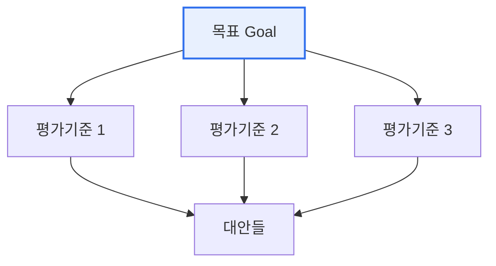

# AHP(Analytic Hierarchy Process, 계층분석법)

## 1. 개요

### 가. 정의
> Thomas Saaty가 제안한 **다기준 의사결정(MCDM) 기법**으로, 복잡한 의사결정 문제를 계층 구조로 분해하고 요소 간 **쌍대비교(Pairwise Comparison)** 를 통해 가중치를 산출해 최적 대안을 선택한다.

AHP의 강점은 '**정성적·주관적 판단을 정량적 우선순위로 전환**'하는 데 있다. 사람은 여러 기준(가격·성능·디자인·브랜드)을 한꺼번에 저울질하는 데는 서투르지만, 두 개씩 비교하는 것(가격이 성능보다 얼마나 더 중요한가)은 비교적 쉽고 일관되게 할 수 있다. AHP는 이 쌍대비교를 수학적으로 종합해 각 기준의 가중치를 도출하므로, 직관과 경험에 의존하던 의사결정에 논리와 객관성을 부여한다. 더욱이 판단의 논리적 일관성을 **일관성 비율(CR)** 로 검증할 수 있어, "가격이 성능보다 중요하고 성능이 디자인보다 중요한데 디자인이 가격보다 중요하다"는 식의 모순을 잡아낸다.

### 나. 필요성
투자 우선순위, 공급업체 선정, 정책 평가처럼 여러 기준을 종합해야 하는 의사결정은 근거 없이 이뤄지면 설득력과 수용성이 떨어진다. AHP는 판단 과정을 투명하게 구조화해 이해관계자의 합의를 이끄는 도구가 된다.

## 2. 계층 구조 및 절차

AHP는 문제를 '목표–평가기준–대안'의 계층으로 분해한 뒤, 각 계층에서 요소들을 두 개씩 비교한다. 비교는 1(동등)부터 9(절대 중요)까지의 척도를 쓰며, 이 비교 결과로 만든 행렬의 고유벡터에서 가중치가 나온다. 마지막으로 각 기준의 가중치와 대안별 점수를 종합해 최적 대안을 결정한다. 이때 반드시 일관성 비율(CR)이 0.1 이하인지 확인해 판단의 논리성을 검증한다.

| 단계 | 내용 |
|---|---|
| **1. 계층 구조화** | 목표–평가기준–대안으로 문제 분해 |
| **2. 쌍대비교** | 요소 간 상대 중요도를 1~9 척도로 비교 |
| **3. 가중치 산출** | 비교행렬의 고유벡터로 우선순위 계산 |
| **4. 일관성 검증** | 일관성 비율(CR ≤ 0.1) 확인 |
| **5. 종합·선택** | 기준 가중치×대안 점수 종합해 최적 대안 결정 |

## 3. 특징(장단점)

| 구분 | 내용 |
|---|---|
| **장점** | 정성·정량 통합, 논리적·체계적, 일관성 검증 가능, 합의 도출 |
| **단점** | 기준·대안 많으면 비교 수 급증, 주관 개입, 순위 역전 가능성 |

기준이 n개면 쌍대비교는 n(n-1)/2회 필요해, 요소가 많아지면 비교 횟수가 급격히 늘어 응답 피로와 일관성 저하가 생긴다. 또한 새 대안을 추가하면 기존 순위가 뒤집히는 순위 역전(Rank Reversal) 현상이 나타날 수 있다.

## 4. 고려사항 및 시사점

1. **일관성 비율(CR)이 판단의 논리성을 담보**한다. CR이 0.1을 넘으면 응답에 모순이 있다는 뜻이므로 재검토해야 하며, 이 검증 기능이 AHP를 단순 가중합과 구별 짓는다.
2. **적용 범위가 넓다**. 투자 우선순위·공급업체 선정·정책 평가·기술 선택 등 다기준 의사결정 전반에 활용되며, 특히 정량화하기 어려운 판단을 체계화하는 데 유용하다.
3. **한계를 보완하는 확장 기법**이 있다. 기준 간 상호 의존을 다루는 ANP(네트워크 분석), 불확실·모호성을 반영하는 퍼지 AHP 등으로 순수 AHP의 독립성·명확성 가정의 한계를 보완한다.

---

> **한 줄 요약**: AHP는 문제를 *목표–기준–대안 계층으로 분해* 하고 쌍대비교(1~9 척도)로 가중치를 산출해 최적 대안을 선택하는 다기준 의사결정 기법으로, 일관성 비율(CR)로 판단의 논리성을 검증하며 ANP·퍼지 AHP로 확장된다.
