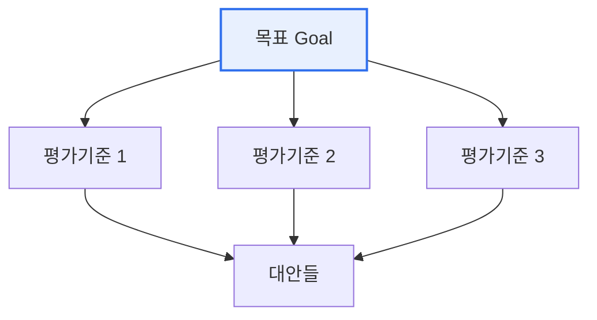

# AHP(Analytic Hierarchy Process, 계층분석법)

## 1. 개요

### 가. 정의
> Thomas Saaty가 제안한 **다기준 의사결정(MCDM) 기법**으로, 복잡한 문제를 계층 구조로 분해하고 요소 간 **쌍대비교(Pairwise Comparison)** 를 통해 가중치를 산출해 최적 대안을 선택한다.

AHP의 강점은 '**정성적 판단을 정량적 우선순위로 전환**'한다는 데 있다. 사람이 여러 기준을 한꺼번에 저울질하긴 어렵지만, 두 개씩 비교하는 것은 쉽다. AHP는 이 쌍대비교를 수학적으로 종합해 일관성 있는 가중치를 도출하므로, 주관이 개입되는 의사결정에 객관성과 논리를 부여한다.

## 2. 계층 구조 및 절차

| 단계 | 내용 |
|---|---|
| **1. 계층 구조화** | 목표–평가기준–대안으로 문제 분해 |
| **2. 쌍대비교** | 요소 간 상대 중요도를 1~9 척도로 비교 |
| **3. 가중치 산출** | 비교행렬의 고유벡터로 우선순위 계산 |
| **4. 일관성 검증** | 일관성 비율(CR ≤ 0.1) 확인 |
| **5. 종합·대안 선택** | 기준별 가중치를 종합해 최적 대안 결정 |

## 3. 특징

| 구분 | 내용 |
|---|---|
| **장점** | 정성·정량 통합, 논리적·체계적, 일관성 검증 가능 |
| **단점** | 기준·대안 많으면 비교 수 급증, 주관 개입, 순위 역전 가능성 |

## 4. 시사점
- 투자 우선순위·공급업체 선정·정책 평가 등 폭넓게 활용
- **일관성 비율(CR)** 로 판단의 논리성 검증이 핵심
- ANP(네트워크)·퍼지 AHP로 상호의존·불확실성 보완

---

> **한 줄 요약**: AHP는 문제를 *목표–기준–대안 계층으로 분해* 하고 쌍대비교로 가중치를 산출해 최적 대안을 선택하는 다기준 의사결정 기법으로, 일관성 비율(CR)로 판단의 논리성을 검증한다.
