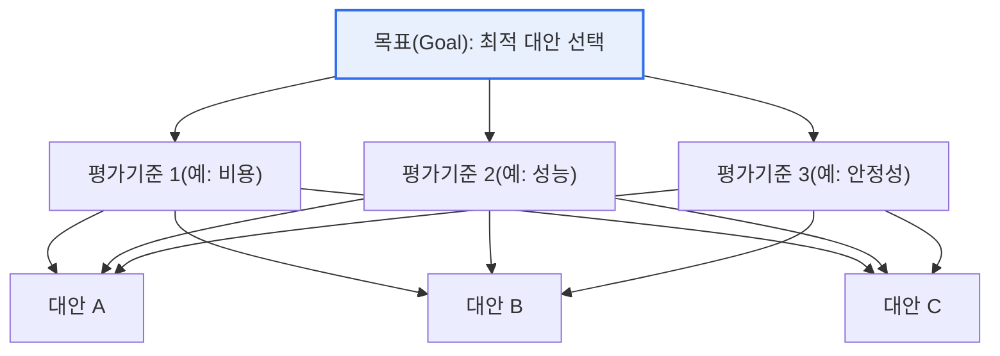
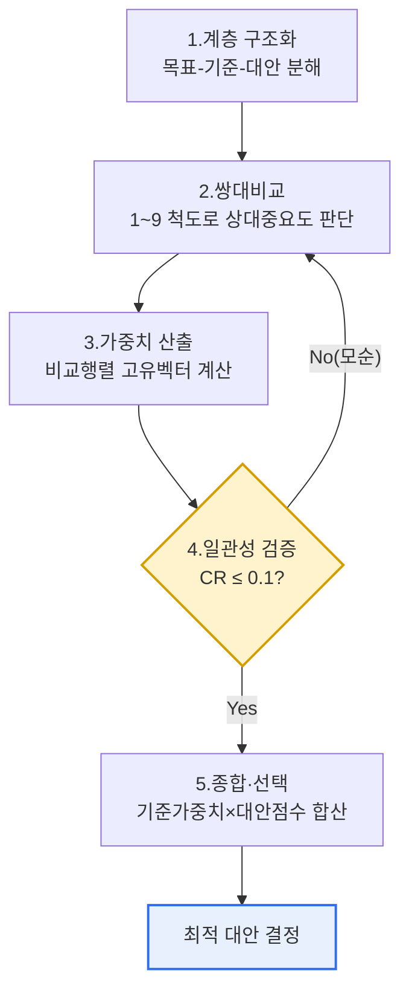

# AHP(Analytic Hierarchy Process, 계층분석법)

## 1. 개요

### 가. 정의

> Thomas Saaty가 1970년대에 제안한 **다기준 의사결정(MCDM, Multi-Criteria Decision Making) 기법**으로, 복잡한 의사결정 문제를 '목표–평가기준–대안'의 **계층 구조(Hierarchy)** 로 분해하고, 각 계층 요소 간 **쌍대비교(Pairwise Comparison)** 를 통해 상대적 가중치를 산출하여 최적 대안을 선택하는 방법론이다.

AHP의 본질적 강점은 '**정성적·주관적 판단을 정량적 우선순위로 전환**'하는 데 있다. 인간의 인지는 여러 기준(가격·성능·디자인·브랜드·유지비 등)을 한꺼번에 저울질하는 데는 매우 서투르다. 심리학의 '매직 넘버 7±2' 연구가 시사하듯 사람이 동시에 안정적으로 비교·처리할 수 있는 항목 수에는 한계가 있기 때문이다. 그러나 두 개씩 놓고 "A가 B보다 얼마나 더 중요한가"를 판단하는 일은 상대적으로 쉽고 일관성 있게 수행할 수 있다. AHP는 이 쌍대비교 결과를 행렬로 종합하고 고유벡터(eigenvector)를 계산해 각 요소의 가중치를 도출하므로, 직관과 경험에만 의존하던 의사결정 과정에 논리와 재현 가능한 객관성을 부여한다.

또 하나의 결정적 차별점은 판단의 논리적 일관성을 **일관성 비율(CR, Consistency Ratio)** 로 정량 검증할 수 있다는 것이다. 예컨대 "가격이 성능보다 중요하고(A>B), 성능이 디자인보다 중요한데(B>C), 디자인이 가격보다 중요하다(C>A)"는 식의 순환 모순(비이행성)이나 강도의 불일치를 CR 값으로 잡아낸다. 단순 가중합(weighted sum)이나 스코어링 모델이 응답자의 논리적 모순을 그대로 통과시키는 것과 달리, AHP는 이 검증 단계를 내장하여 의사결정의 신뢰성을 스스로 담보한다.

### 나. 등장 배경 및 필요성

투자 우선순위 결정, 공급업체·솔루션 선정, 정책 대안 평가, 정보화 사업 타당성 검토처럼 서로 이질적인 여러 기준을 종합해야 하는 의사결정은, 명시적 근거 없이 이루어지면 설득력과 조직 내 수용성이 급격히 떨어진다. 특히 정량화가 어려운 요소(브랜드 신뢰도, 정책 파급효과, 사용자 만족도)와 정량 요소(비용, 처리 속도)가 뒤섞인 상황에서는 담당자의 감(感)에 의존한 결정이 사후에 반발과 감사 지적을 부른다.

AHP는 이러한 판단 과정을 계층 구조로 투명하게 구조화하여, 어떤 기준에 얼마의 가중치를 두었고 왜 그 대안이 선택되었는지를 수치로 설명할 수 있게 한다. 이 '설명 가능성(traceability)'은 이해관계자 간 합의를 이끌고, 공공사업에서는 정책 결정의 정당성을 확보하는 근거가 된다. 실제로 국내에서 예비타당성조사(예타)의 종합평가(AHP)나 정보화 사업 우선순위 산정, 조달 협상에 의한 계약의 제안서 평가 등에서 AHP 또는 그 변형이 표준적 도구로 활용되어 온 것도 이 때문이다.

## 2. 계층 구조와 구성 요소

AHP는 문제를 최상위의 목표(Goal), 중간의 평가기준(Criteria)과 하위기준(Sub-criteria), 최하위의 대안(Alternatives)으로 나누어 위에서 아래로 흐르는 계층으로 모델링한다. 이 구조 자체가 "무엇을 위해(목표), 무엇을 기준으로(기준), 무엇 중에서 고르는가(대안)"를 강제로 분리해 사고하게 만들어, 문제 정의의 모호함을 줄인다.

```mermaid
flowchart TB
  G["목표(Goal): 최적 대안 선택"] --> C1["평가기준 1(예: 비용)"]
  G --> C2["평가기준 2(예: 성능)"]
  G --> C3["평가기준 3(예: 안정성)"]
  C1 --> A1["대안 A"]
  C1 --> A2["대안 B"]
  C1 --> A3["대안 C"]
  C2 --> A1
  C2 --> A2
  C2 --> A3
  C3 --> A1
  C3 --> A2
  C3 --> A3
  style G fill:#e8f0fe,stroke:#2f6fed,stroke-width:2px
```

최상위 계층의 **목표**는 의사결정이 궁극적으로 달성하려는 바를 한 문장으로 정의한다. "차세대 시스템 구축 사업자 선정"처럼 구체적일수록 하위 기준 도출이 명확해진다. 목표가 모호하면 이후 모든 비교가 흔들리므로, 목표의 조작적 정의가 AHP 품질의 출발점이 된다.

중간 계층의 **평가기준**은 목표 달성에 영향을 주는 관점들을 상호배타적이면서 전체를 포괄하도록(MECE에 가깝게) 설정한다. 기준이 많아지면 뒤에서 설명할 쌍대비교 횟수가 급증하므로, 일반적으로 한 계층에서 7개 이내로 묶고 필요하면 하위기준으로 세분하는 것이 실무 관행이다. 예를 들어 '기술성' 아래에 '아키텍처 적합성·확장성·보안성'을 하위기준으로 두는 식이다.

최하위 계층의 **대안**은 실제 선택 후보들이다. 대안은 모든 기준에 대해 평가되며, 각 기준의 관점에서 대안들끼리 다시 쌍대비교된다. 대안이 정량 지표(가격 등)를 가질 때는 실측값을 정규화해 쌍대비교를 대신하기도 하는데, 이렇게 정성·정량 요소를 하나의 우선순위 체계로 통합하는 유연성이 AHP의 실무적 매력이다.

## 3. AHP 수행 절차

전체 흐름은 계층 구조화 → 쌍대비교 행렬 작성 → 가중치(고유벡터) 산출 → 일관성 검증 → 종합 및 최적 대안 선택의 5단계로 진행되며, 일관성 검증에서 탈락하면 쌍대비교로 되돌아가는 피드백 루프를 가진다.

```mermaid
flowchart TB
  S1["1.계층 구조화<br/>목표-기준-대안 분해"] --> S2["2.쌍대비교<br/>1~9 척도로 상대중요도 판단"]
  S2 --> S3["3.가중치 산출<br/>비교행렬 고유벡터 계산"]
  S3 --> S4{"4.일관성 검증<br/>CR ≤ 0.1?"}
  S4 -- "No(모순)" --> S2
  S4 -- "Yes" --> S5["5.종합·선택<br/>기준가중치×대안점수 합산"]
  S5 --> S6["최적 대안 결정"]
  style S4 fill:#fff3cd,stroke:#d39e00,stroke-width:2px
  style S6 fill:#e8f0fe,stroke:#2f6fed,stroke-width:2px
```

### 가. 계층 구조화 및 쌍대비교 척도

첫 단계에서 문제를 앞서 설명한 계층으로 분해한 뒤, 각 계층 내에서 요소를 두 개씩 짝지어 상대적 중요도를 판단한다. 이때 Saaty가 제안한 **1~9의 기본 척도(Fundamental Scale)** 를 쓴다. 1은 두 요소가 동등하게 중요함을, 3은 한쪽이 약간 더 중요함(weakly more important), 5는 강하게 더 중요함(strongly), 7은 매우 강하게, 9는 절대적으로 더 중요함(absolutely)을 뜻하며 2·4·6·8은 그 중간값이다. 반대 방향의 비교는 역수(예: A가 B보다 5이면 B는 A보다 1/5)로 자동 채워진다.

이 척도는 단순히 순서만 매기는 서열 척도가 아니라 '강도'까지 담는다는 점이 핵심이다. "A가 B보다 중요하다"에 그치지 않고 "5배만큼 강하게 중요하다"를 표현하므로, 이후 고유벡터 계산에서 비율척도(ratio scale) 수준의 가중치를 뽑아낼 수 있다. 다만 9를 넘는 극단적 차이를 표현하기 어렵다는 척도의 상한이 존재하며, 이는 서로 격차가 큰 대안을 한 묶음에서 비교할 때 왜곡을 일으킬 수 있으므로 기준을 계층으로 잘게 나누어 완화한다.

### 나. 가중치(고유벡터) 산출

n개 요소에 대한 쌍대비교 결과는 n×n의 **비교행렬 A**로 정리된다. 이 행렬에서 우선순위 벡터(가중치)는 최대 고유값(λmax)에 대응하는 고유벡터를 정규화하여 구한다. 실무에서는 각 열을 합으로 나누어 정규화한 뒤 행별 평균을 취하는 근사법(기하평균법 또는 산술평균법)을 흔히 쓰는데, 결과는 정식 고유벡터법과 거의 일치한다.

예를 들어 '비용·성능·안정성' 세 기준에 대해 응답자가 비용을 성능보다 3배, 안정성을 비용보다 2배 중요하게 보았다면, 계산 결과 안정성≈0.54, 비용≈0.30, 성능≈0.16과 같은 가중치 벡터가 나온다. 이렇게 산출된 값은 합이 1이 되도록 정규화되어 있어 곧바로 대안 점수와 곱해 종합할 수 있다. 각 기준 아래에서 대안들도 같은 방식으로 비교해 기준별 대안 가중치를 구한다.

### 다. 일관성 검증

산출된 판단이 논리적으로 일관되는지를 **일관성 지수(CI, Consistency Index)** 와 **일관성 비율(CR)** 로 검증한다. CI는 CI = (λmax − n) / (n − 1)로 정의되며, 완전히 일관된 판단에서는 λmax = n이 되어 CI = 0이 된다. CR은 이 CI를, 무작위로 채운 비교행렬의 평균 일관성 지수인 **무작위 지수(RI, Random Index)** 로 나눈 값, 즉 CR = CI / RI 이다. RI는 요소 수 n에 따라 정해진 상수로, n=3일 때 0.58, n=4일 때 0.90, n=5일 때 1.12, n=6일 때 1.24, n=7일 때 1.32 등으로 알려져 있다.

관례적으로 **CR ≤ 0.1(10%)** 이면 판단이 수용 가능한 수준으로 일관된다고 본다. CR이 0.1을 넘으면 응답에 논리적 모순이 크다는 신호이므로, 어떤 비교가 다른 비교들과 어긋나는지 되짚어 재응답한다. 이 임계값(0.1)은 절대적 진리는 아니며 Saaty의 경험칙에 근거한 관행적 기준으로, 대상·분야에 따라 완화·강화하여 해석하는 것이 바람직하다. 중요한 것은 CR이라는 장치가 '판단의 품질'을 사후에 정량적으로 감사할 수 있게 해 준다는 점이다.

### 라. 종합 및 최적 대안 선택

마지막으로 각 기준의 가중치와, 그 기준에서 평가한 대안별 점수를 곱해 합산하는 **가중합 종합**을 수행한다. 대안 i의 종합점수 = Σ(기준 j의 가중치 × 기준 j에서 대안 i의 점수)로 계산되며, 종합점수가 가장 높은 대안이 최종 선택된다. 예컨대 안정성 가중치가 0.54로 지배적이라면, 안정성에서 우수한 대안이 다른 기준에서 다소 뒤처지더라도 종합 1위가 될 수 있다. 이 단계에서 가중치 변화에 따라 순위가 얼마나 민감하게 바뀌는지를 보는 **민감도 분석(Sensitivity Analysis)** 을 함께 수행하면, 결론의 강건성(robustness)을 점검하고 이해관계자를 설득하는 데 큰 도움이 된다.

## 4. 특징·장단점과 유사 기법 비교

AHP는 정성·정량을 하나의 우선순위 체계로 통합하고, 판단 과정을 체계적으로 구조화하며, 일관성을 검증할 수 있고, 계층별 비교를 통해 이해관계자의 합의를 유도한다는 강점을 지닌다. 반면 기준·대안이 많아지면 쌍대비교 횟수가 n(n−1)/2로 급증하여 응답 피로와 일관성 저하를 부르고, 척도 부여에 주관이 개입하며, 새로운 대안을 추가할 때 기존 순위가 뒤집히는 **순위 역전(Rank Reversal)** 이 발생할 수 있다.

| 구분 | 장점 | 단점 |
|---|---|---|
| **판단 통합** | 정성·정량 요소를 비율척도로 통합 | 척도 부여에 주관 개입 |
| **논리성** | CR로 일관성 정량 검증 가능 | CR 임계값(0.1)의 이론적 근거 논쟁 |
| **확장성** | 계층 세분으로 복잡 문제 대응 | 요소 증가 시 비교 수 폭증(피로) |
| **안정성** | 민감도 분석으로 강건성 점검 | 대안 추가 시 순위 역전 가능 |

기준 수 n에 따른 비교 횟수는 n=4면 6회, n=7이면 21회, n=10이면 45회로 증가한다. 이 때문에 실무에서는 한 계층의 요소를 7개 이하로 제한하고, 초과하면 하위 계층으로 나누어 각 묶음의 비교 횟수를 관리한다.

AHP와 자주 비교되는 대표적 MCDM 기법으로 TOPSIS와 ANP가 있다. **TOPSIS**는 이상해(ideal solution)와의 거리를 계산해 순위를 매기는 기법으로 계산이 빠르고 대안이 많아도 다루기 쉽지만, 기준 가중치를 별도로 정해 주어야 하고 일관성 검증 장치가 없다. 실무에서는 AHP로 기준 가중치를 뽑고 TOPSIS로 대안을 순위화하는 **AHP-TOPSIS 결합**이 널리 쓰인다. **ANP(Analytic Network Process)** 는 AHP의 계층(상하 일방향) 가정을 완화해 기준 간 상호 의존과 피드백을 네트워크로 표현하는 확장으로, 현실의 복잡한 상호작용을 반영하지만 모델링과 계산이 훨씬 복잡하다.

### 실제 적용 사례

첫째, **공공 예비타당성조사**에서는 경제성(B/C 비율)·정책성·지역균형발전 등의 상이한 평가 항목을 종합하기 위해 AHP 기반 종합평가를 활용하여, 계량화가 어려운 정책적 가치를 정량 점수로 환산해 사업 추진 여부를 판정한다. 둘째, **차세대 정보시스템 사업자 선정**에서 기술성·사업수행능력·가격을 상위 기준으로 두고 하위기준까지 계층화한 뒤 평가위원들의 쌍대비교를 종합하면, 특정 위원의 편향이 전체 결과에 미치는 영향을 가중치와 일관성 지표로 견제할 수 있다. 셋째, **IT 솔루션·공급업체 선정**에서 총소유비용(TCO)·성능·보안·유지보수 지원을 기준으로 삼아 여러 벤더를 비교할 때, 정량 지표(가격)와 정성 지표(지원 품질)를 한 점수 체계로 묶어 의사결정의 근거를 문서화하는 용도로 쓰인다.

## 5. 심화: 확장 기법과 예상 출제 방향

순수 AHP의 가정(기준 독립성, 판단의 명확성)을 보완하기 위한 확장 계열이 꾸준히 연구·적용되고 있다. **ANP**는 앞서 설명한 대로 기준 간 상호 의존을 다루고, **퍼지 AHP(Fuzzy AHP)** 는 응답자가 "3~5 정도"처럼 불확실하고 모호하게 느끼는 판단을 삼각퍼지수(TFN) 같은 퍼지 집합으로 표현해 인간 판단의 애매성을 모델에 반영한다. 또한 **그룹 AHP**에서는 여러 평가자의 개별 비교값을 기하평균으로 종합(AIJ, Aggregation of Individual Judgments)하거나 개별 우선순위를 종합(AIP)하여 집단 의사결정을 지원한다. 최근에는 AHP로 정한 가중치를 TOPSIS·VIKOR·DEMATEL 등과 결합한 하이브리드 모델이 논문과 실무 평가체계에서 표준처럼 활용된다.

기술사 관점에서 이 주제는 '다기준 의사결정' 또는 '정보화 사업 평가·우선순위 산정' 문맥에서 출제되는 경향이 있다. 답안을 구성할 때는 ① 정의와 계층 구조, ② 5단계 절차(특히 쌍대비교→고유벡터→일관성 검증), ③ CI·CR·RI의 수식과 CR ≤ 0.1 기준, ④ 순위 역전·비교 폭증 같은 한계와 ANP·퍼지 AHP·AHP-TOPSIS 결합으로의 보완을 단계적으로 전개하고, 마지막에 공공 예타나 사업자 선정 같은 구체 사례로 실무적 함의를 덧붙이면 논술의 깊이를 확보할 수 있다.

## 6. 고려사항 및 시사점

1. **일관성 비율(CR)이 AHP의 신뢰성을 담보하는 핵심 장치다.** CR ≤ 0.1이라는 기준은 판단 품질을 사후 감사할 수 있게 하며, 이 검증 기능이 AHP를 단순 가중합·스코어링 모델과 근본적으로 구별 짓는다. 다만 0.1이라는 임계값은 경험칙이므로, 대상 도메인의 특성에 따라 해석의 유연성을 두어야 한다.

2. **문제 구조화의 품질이 결과의 품질을 좌우한다.** 목표의 조작적 정의, 기준의 MECE 설계, 한 계층당 요소 수 제한(7개 이내 권장)이 지켜지지 않으면 아무리 정교한 계산도 왜곡된 결론을 낳는다. 즉 AHP는 '계산 기법'이기 이전에 '문제 정의 기법'임을 유념해야 한다.

3. **순위 역전과 비교 폭증이라는 한계를 설계로 관리해야 한다.** 대안 추가 시 순위가 뒤집힐 수 있으므로 절대측정(rating) 모드 활용이나 민감도 분석으로 강건성을 점검하고, 요소가 많으면 계층을 세분하거나 TOPSIS 등과 결합해 비교 부담을 줄이는 전략이 필요하다.

4. **집단 의사결정 도구로서의 가치를 살려야 한다.** 그룹 AHP는 각 이해관계자의 판단을 투명하게 드러내고 종합함으로써, 결정의 정당성과 조직 수용성을 높인다. 특히 공공사업·조달 평가에서 AHP의 진짜 효용은 '정답 산출'보다 '합의 형성과 설명 가능성'에 있음을 인식하고, 결과 수치를 절대시하기보다 의사결정 소통의 근거로 활용하는 자세가 요구된다.

## 참고자료

- Saaty, T. L., "Decision making with the analytic hierarchy process", International Journal of Services Sciences, 2008. https://www.rafikulislam.com/uploads/resources/187224511185ad17066bdb.pdf
- Wikipedia, "Analytic hierarchy process". https://en.wikipedia.org/wiki/Analytic_hierarchy_process
- Wikipedia, "Analytic hierarchy process – car example (consistency, RI)". https://en.wikipedia.org/wiki/Analytic_hierarchy_process_%E2%80%93_car_example

---

> **한 줄 요약**: AHP는 문제를 *목표–기준–대안 계층으로 분해* 하고 쌍대비교(1~9 척도)의 고유벡터로 가중치를 산출해 최적 대안을 선택하는 다기준 의사결정 기법으로, CI·CR·RI 기반 일관성 검증(CR ≤ 0.1)으로 판단의 논리성을 담보하며 순위 역전·비교 폭증의 한계는 ANP·퍼지 AHP·AHP-TOPSIS 결합으로 보완한다.
