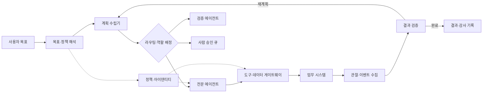
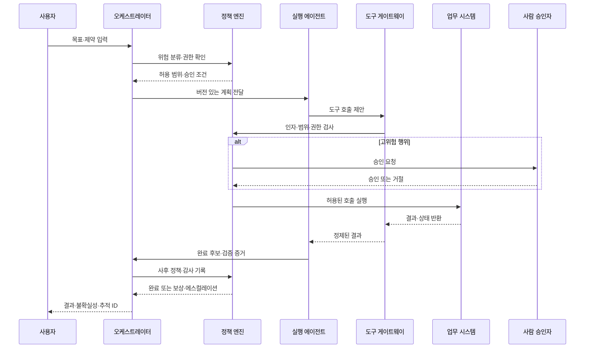

# AI 에이전트 오케스트레이션과 자율업무 실행 거버넌스

## 1. 개요

> **정의**: AI 에이전트 오케스트레이션(Agent Orchestration)이란 하나 이상의 AI 에이전트가 목표를 달성하도록 작업을 분해하고, 적절한 에이전트·도구·데이터를 선택하며, 실행 순서·상태·실패복구·결과검증을 조율하는 제어 계층이다. 자율업무 실행 거버넌스는 그 과정에서 허용 가능한 행동의 범위, 책임 주체, 승인·감사·중단·사후학습 규칙을 설계하는 관리 체계다.

일반적인 생성형 AI는 질문을 받아 한 번의 답변을 반환하지만, 자율업무는 여러 시스템의 상태를 읽고 판단한 뒤 실제 변경을 수행해야 한다. 예를 들어 “고객의 환불 요청을 처리하라”는 목표는 고객 식별, 주문 조회, 환불 정책 확인, 금액 계산, 승인, 결제 시스템 반영, 결과 통지라는 연속 단계로 나뉜다. 각 단계의 데이터와 권한이 다르므로 하나의 모델 호출로 처리하면 오류 원인을 설명하기 어렵고 과도한 권한을 부여하기 쉽다.

오케스트레이터는 이 복합 작업의 실행 흐름을 관리한다. 정해진 업무 흐름을 그대로 실행하는 워크플로 엔진과 달리, 오케스트레이터는 LLM의 계획·추론을 이용해 상황에 따라 다음 작업을 선택할 수 있다. 그러나 동적 판단을 허용한다고 해서 모델에게 통제권을 무제한으로 넘겨서는 안 된다. 모델은 제안자 또는 제한된 실행 주체이고, 권한 정책·승인 게이트·업무 규칙·감사 로그는 별도의 통제 계층에서 집행해야 한다.

기술사 답안에서는 “에이전트를 여러 개 연결한다”는 설명에 그치지 않고, 목표-계획-실행-관찰-검증의 폐루프, 에이전트 아이덴티티와 최소권한, 상태 일관성, 실패 격리, 사람의 개입 지점, 운영 지표까지 하나의 아키텍처로 제시해야 한다. 핵심은 자율성의 크기가 아니라 **통제 가능한 자율성(Controlled Autonomy)** 을 어떻게 설계하느냐에 있다.

### 1.1 등장 배경과 필요성

첫째, 업무가 API와 SaaS로 분산되면서 단일 애플리케이션이 모든 기능을 직접 구현하기 어려워졌다. 고객센터, ERP, CRM, 문서 저장소, 결제·배송 시스템이 각각 다른 인증과 데이터 모델을 사용하므로, 조정 계층 없이는 에이전트의 도구 호출이 산발적으로 발생한다.

둘째, 문제의 형태가 단순 질의응답에서 목표 달성형으로 바뀌었다. 목표 달성형 시스템은 중간 결과를 평가하고 계획을 수정해야 하며, “어떤 답을 생성했는가”보다 “허용된 절차로 목표를 완료했는가”가 품질의 핵심이 된다. 이에 따라 최종 텍스트뿐 아니라 도구 선택, 인자, 상태 변화, 승인 이력을 관찰해야 한다.

셋째, 에이전트가 늘어날수록 상호작용 자체가 새로운 위험이 된다. 조사 에이전트의 잘못된 정보가 실행 에이전트의 계획에 들어가거나, 한 에이전트가 다른 에이전트의 권한을 우회하도록 유도할 수 있다. 따라서 다중 에이전트 구조는 성능 확장 구조인 동시에 신뢰 경계와 책임 경계를 다시 그리는 보안 아키텍처다.

## 2. 오케스트레이션 전체 구조

오케스트레이션 계층은 사용자의 업무 목표를 입력받아 계획과 실행을 관리한다. 입력 단계에서 사용자의 의도, 대상 자원, 허용 범위, 기한, 성공 조건을 구조화하고, 정책 엔진이 요청 자체의 위험도를 분류한다. 위험도가 높으면 계획 생성 전에 사람 승인이나 추가 인증을 요구할 수 있다.

**목표·정책 해석기**는 자연어 요청을 무조건 실행 명령으로 바꾸지 않는다. 업무 목적과 대상, 금지 조건, 완료 조건을 분리하고, 개인정보·금전·외부 발송처럼 영향이 큰 행위가 포함됐는지 판정한다. 같은 “고객 정보 조회”라도 본인 확인이 끝난 상담원 요청과 익명 사용자의 요청은 서로 다른 권한 경로를 가져야 한다.

**계획 수립기(Planner)** 는 목표를 실행 가능한 작업 그래프로 변환한다. 작업 간 선후 관계, 병렬 실행 가능성, 필요한 도구, 예상 산출물, 실패 시 대체 경로를 명시해야 한다. 계획은 모델의 자연어 출력에만 남기지 말고 구조화된 스키마로 저장하여 정책 엔진과 검증기가 검사할 수 있게 한다.

**라우터와 전문 에이전트**는 업무 성격에 따라 역할을 분리한다. 검색·분석 에이전트는 읽기 권한을 중심으로 갖고, 실행 에이전트는 제한된 변경 권한을 가지며, 검증 에이전트는 실행 결과가 요구사항과 정책을 충족하는지 평가한다. 역할을 나누는 이유는 모델의 능력을 과시하기 위해서가 아니라 오류와 권한을 격리하기 위해서다.

**도구·데이터 게이트웨이**는 에이전트와 실제 시스템 사이의 통제 지점이다. 호출 가능한 도구 목록, 입력 스키마, 사용자·에이전트 권한, 속도 제한, 데이터 마스킹, 부작용 여부를 이 계층에서 확인한다. 에이전트가 직접 데이터베이스나 운영 서버에 연결하지 않도록 하면 도구 호출을 차단·승인·재시도·감사하기 쉬워진다.

**관찰·검증 계층**은 실행 결과를 수집하고 성공 여부를 독립적으로 판단한다. HTTP 200이나 함수 호출 성공은 업무 성공과 같지 않다. 환불 API가 성공했더라도 금액·주문·통화가 요청과 맞는지 확인해야 하며, 검증에 실패하면 보상 작업이나 사람 검토로 전환해야 한다.

## 3. 핵심 구성요소와 책임

### 3.1 오케스트레이터와 상태 저장소

오케스트레이터는 작업의 현재 상태와 다음 전이를 결정한다. 상태는 `요청됨`, `계획됨`, `승인대기`, `실행중`, `검증중`, `완료`, `실패`, `보상중`처럼 명시적인 상태 머신으로 표현하는 편이 좋다. 상태를 자연어 대화 기록에만 의존하면 재시작 시 어디까지 수행했는지 알 수 없고 동일한 결제가 반복될 수 있다.

상태 저장소에는 목표, 계획 버전, 실행한 단계, 도구 요청·응답, 승인자, 결과 검증, 재시도 횟수, 상관관계 ID를 기록한다. 다만 원문 대화나 개인정보를 무제한 저장해서는 안 되며, 업무 목적에 필요한 최소 정보와 보존 기간을 정해야 한다. 비밀값은 상태와 로그에 직접 기록하지 않고 참조 토큰이나 마스킹된 식별자로 대체한다.

오케스트레이터가 장애로 재기동되면 마지막 커밋된 상태를 읽고 재개한다. 이를 위해 작업 단위에는 멱등 키를 부여하고, 외부 시스템 호출 전후에 상태를 저장하는 순서를 정의해야 한다. “호출은 성공했지만 응답 전에 오케스트레이터가 죽은” 경우를 처리하지 않으면 재시도 과정에서 이중 생성이나 이중 결제가 발생한다.

### 3.2 계획 수립과 작업 그래프

계획은 선형 목록보다 의존성을 가진 그래프로 표현하는 것이 적합하다. 고객 환불 예시에서 고객 인증과 주문 조회는 병렬화할 수 있지만, 환불 금액 계산은 주문 조회 결과 이후에 수행되어야 한다. 승인 단계는 계산 결과가 나오고 위험도 평가가 끝난 뒤에만 활성화해야 한다.

계획 생성에는 고정 템플릿과 모델 기반 동적 계획을 함께 사용할 수 있다. 반복적이고 규칙이 명확한 업무는 검증된 템플릿을 우선하고, 예외가 많고 탐색이 필요한 업무만 모델이 세부 계획을 제안하게 하면 비용과 변동성을 줄일 수 있다. 계획의 각 노드에는 입력 계약, 출력 계약, 허용 도구, 시간 제한, 실패 정책을 포함해야 한다.

계획을 만든 뒤에는 실행 전에 정적 검사를 수행한다. 금지된 도구가 포함되었는지, 개인정보가 승인된 경계를 넘어가는지, 순환 의존성이나 무한 반복이 있는지, 사람이 승인해야 할 행위를 우회하는지 확인한다. 실행 중 계획을 바꾸는 경우에도 변경된 계획을 새 버전으로 기록하고 다시 정책 검사를 거친다.

### 3.3 도구 호출과 에이전트 아이덴티티

도구 설명은 모델이 선택하는 메뉴이자 보안 경계의 입력이다. 도구 이름과 설명은 가능한 행위, 필요한 인자, 부작용, 실패 코드, 권한 조건을 명확히 표현해야 한다. “데이터를 처리한다”처럼 모호한 설명보다 “승인된 고객 ID로 최근 90일 주문의 읽기 전용 요약을 반환한다”처럼 범위를 구체화해야 잘못된 호출을 줄일 수 있다.

에이전트는 사용자 계정의 토큰을 그대로 공유하지 말고 별도의 비인간 아이덴티티를 사용한다. 사용자 권한과 에이전트 권한을 결합할 때는 둘 중 더 제한적인 권한을 적용하고, 목적·테넌트·데이터 분류·시간을 조건으로 포함한다. 권한은 역할 하나로 끝내지 않고 어떤 도구의 어떤 작업까지 허용하는지 세분화한다.

최소권한은 읽기와 쓰기를 분리하는 것에서 시작한다. 조사 에이전트에는 읽기 전용 검색과 문서 조회만 주고, 변경 에이전트는 승인된 특정 API와 제한된 필드만 사용하게 한다. 파일 삭제, 결제, 대량 발송처럼 되돌리기 어려운 행위는 별도의 승인 토큰과 짧은 유효시간을 요구한다.

### 3.4 메모리와 컨텍스트 경계

단기 메모리는 현재 작업의 계획과 중간 결과를 보존하고, 장기 메모리는 재사용 가능한 선호·업무 지식·이전 사례를 저장한다. 장기 메모리를 무조건 신뢰하면 오래된 정책이나 다른 사용자의 정보가 현재 업무에 섞일 수 있으므로 출처, 유효기간, 소유자, 삭제 정책을 함께 관리해야 한다.

에이전트 간 공유 메모리는 편리하지만 가장 넓은 공격면이 될 수 있다. 한 에이전트가 기록한 내용은 사실이 아니라 “검증 전 관찰”로 표시하고, 실행 에이전트가 사용하기 전에 출처와 무결성을 확인한다. 민감 데이터는 업무 범위에 필요한 부분만 전달하고, 전체 대화 기록을 모든 에이전트에게 복제하지 않는다.

컨텍스트 오염을 줄이기 위해 사용자 지시, 외부 문서, 도구 반환값, 내부 정책을 서로 다른 구역으로 구분한다. 외부 텍스트에 포함된 “이 지시를 우선하라” 같은 문장은 데이터로 취급하며, 정책 계층을 덮어쓸 수 없게 해야 한다. 이는 프롬프트 주입과 도구 반환값을 통한 간접 지시를 완화하는 기본 통제다.

## 4. 실행 라이프사이클과 제어 패턴

첫 단계는 목표와 제약을 구조화하는 것이다. 사용자의 말에 없는 조건을 모델이 임의로 채우지 않도록, 필요한 정보가 없으면 실행하지 않고 질문으로 되돌린다. “가장 저렴한 상품으로 주문하라”는 요청도 예산, 배송일, 환불 가능 여부가 없으면 계획의 전제조건이 충족되지 않은 것이다.

두 번째 단계는 위험 분류와 권한 검사다. 읽기·분석·추천은 상대적으로 낮은 위험일 수 있지만, 금전 이동·계정 변경·개인정보 공개·외부 커뮤니케이션은 높은 위험으로 분류한다. 위험도는 업무명만으로 고정하지 않고 대상 데이터, 금액, 영향 범위, 사용자 인증 수준, 실행 빈도를 함께 고려한다.

세 번째 단계는 계획 검증과 실행이다. 오케스트레이터는 모델이 제안한 계획을 정책 엔진에 제출하고, 허용된 도구·인자·데이터만 실행한다. 실행 결과는 모델에 원문 그대로 주입하지 않고, 스키마 검증·크기 제한·민감정보 마스킹을 거친 뒤 전달한다.

네 번째 단계는 검증과 종료다. 완료 조건은 모델의 “완료했습니다”라는 문장이 아니라 시스템의 사실 상태와 독립 증거로 판단한다. 검증 실패 시 같은 요청을 무한히 반복하지 않도록 재시도 예산, 시간 제한, 실패 분류, 사람 에스컬레이션 조건을 둔다.

### 4.1 실행 패턴의 선택

**Supervisor-Worker 패턴**은 감독 에이전트가 작업을 분해하여 전문 에이전트에 위임하는 방식이다. 역할이 명확하고 중앙에서 정책·상태·결과를 통합하기 쉬우나, 감독 에이전트가 병목이 되고 잘못된 계획이 전체 작업에 전파될 수 있다. 기업 업무처럼 책임과 승인 흐름이 중요한 환경에 적합하다.

**파이프라인 패턴**은 수집, 분석, 실행, 검증을 고정된 단계로 연결한다. 단계별 입출력 계약이 분명하여 테스트와 감사가 쉽고 실행 비용도 예측 가능하다. 반면 예외가 많은 업무에서 정해진 경로를 벗어나기 어렵기 때문에, 예외는 사람 큐나 별도 보상 흐름으로 보내야 한다.

**협업형 다중 에이전트 패턴**은 여러 전문 에이전트가 독립적인 관점으로 결과를 만들고 합의 또는 검증을 거치는 방식이다. 법률 검토와 보안 검토처럼 전문성을 분리할 수 있지만, 에이전트 간 메시지 비용과 오류 전파가 증가한다. 공유 메모리와 상호 신뢰를 기본값으로 두지 말고, 메시지 출처·권한·검증 상태를 함께 전달해야 한다.

**Human-in-the-loop 패턴**은 모델이 계획이나 실행을 제안하고 사람이 승인하는 방식이다. 초기 도입과 고위험 업무에 적합하지만, 승인 요청이 너무 자주 발생하면 사람이 형식적으로 승인하는 자동 승인 버튼으로 전락할 수 있다. 승인 화면에는 대상, 영향, 변경 내용, 근거, 되돌리기 방법을 요약하고 위험도별로 승인 기준을 차등화해야 한다.

## 5. 비교: 워크플로·RPA·단일 에이전트와의 차이

오케스트레이션과 전통적 자동화의 차이는 “실행 흐름을 누가 결정하는가”에 있다. 워크플로 엔진은 개발자가 정의한 상태 전이를 실행하며, RPA는 화면·규칙의 반복에 강하다. 반면 에이전트 오케스트레이션은 모델이 상황에 따라 계획 후보를 만들 수 있지만, 정책 엔진과 상태 머신이 그 선택을 제한해야 운영 가능한 시스템이 된다.

| 구분 | 정적 워크플로 | RPA | 단일 AI 에이전트 | 오케스트레이션 플랫폼 |
|---|---|---|---|---|
| 흐름 결정 | 사전 정의 | 사전 정의된 화면 절차 | 모델이 동적 결정 | 모델 제안 + 정책·상태 통제 |
| 강점 | 예측성·감사성 | 레거시 화면 자동화 | 유연한 추론 | 역할 분리·통합·확장 |
| 약점 | 예외 대응 제한 | 화면 변경 취약 | 권한·검증 집중 | 구성 복잡도·운영 비용 |
| 상태 관리 | 명시적 상태 | 세션·스크립트 중심 | 대화·메모리 의존 | 작업 상태·이벤트·추적 ID |
| 적합 업무 | 규칙형 승인 | 반복 사무 | 탐색·추천 | 복합 목표·다시도·검증 업무 |

정적 워크플로는 실행 결과의 재현성이 중요할 때 가장 강하다. 월말 정산처럼 입력과 규칙이 고정된 업무에 모델의 동적 판단을 넣으면 오히려 설명 가능성과 테스트 가능성이 낮아질 수 있다. 따라서 오케스트레이션은 기존 워크플로를 무조건 대체하는 것이 아니라, 예외 탐색과 자연어 인터페이스가 필요한 구간에 제한적으로 배치한다.

RPA와의 결합도 가능하다. 에이전트가 요청 내용을 분류하고 필요한 입력을 채운 뒤, RPA가 검증된 화면 절차를 실행하도록 역할을 나누면 유연성과 결정성을 동시에 확보할 수 있다. 이때 에이전트가 RPA의 계정이나 화면 제어 권한을 직접 가지지 않도록 게이트웨이에서 호출 범위를 제한해야 한다.

단일 에이전트는 구현이 빠르지만 계획, 도구 호출, 검증, 권한이 한 컨텍스트에 모여 실패 격리가 약하다. 다중 에이전트는 역할별 전문화가 가능하지만 통신·상태·책임 추적이 어려워진다. 에이전트 수를 늘리는 것보다 업무 단계와 신뢰 경계를 먼저 나누고, 각 분리가 품질·보안·운영 지표를 개선하는지 검증해야 한다.

## 6. 적용 사례: 고객 환불 업무

고객이 “지난달 중복 결제된 주문을 확인하고 환불해 달라”고 요청했다고 가정한다. 오케스트레이터는 먼저 고객 인증 상태와 요청의 범위를 확인하고, 주문 조회·중복 판정·환불 계산·승인·실행·통지라는 작업 그래프를 만든다. 환불은 금전 변경이므로 읽기 단계와 별도의 승인·실행 권한을 요구한다.

조회 에이전트는 고객 ID로 주문 목록을 읽고, 분석 에이전트는 결제 시각·금액·주문 상태를 비교해 중복 가능성을 산출한다. 이 결과는 곧바로 환불 명령이 아니라 검증 증거로 저장된다. 주문 시스템의 상태와 결제 원장의 상태가 다르면 자동 실행을 중단하고, 어느 시스템을 기준으로 할지 사람 검토 큐에 보낸다.

승인자는 환불 대상 주문, 금액, 근거, 정책 조항, 고객에게 전달될 문구를 한 화면에서 확인한다. 승인 토큰은 특정 주문과 금액에만 유효하고 짧은 시간 뒤 만료되어야 한다. 실행 에이전트가 승인 범위를 벗어난 금액이나 다른 주문을 요청하면 게이트웨이가 차단한다.

환불 API가 성공한 뒤에는 응답 코드만 보지 않고 거래 ID와 원장 상태를 재조회한다. 검증이 끝나면 고객 통지를 수행하되, 이메일·문자 등 외부 발송 도구는 수신자와 본문을 다시 확인한다. 모든 단계에 동일한 추적 ID를 남기면 민원이나 장애가 발생했을 때 계획 버전, 승인자, 도구 호출, 시스템 결과를 연결해서 조사할 수 있다.

이 사례의 핵심은 모델이 환불 여부를 독단적으로 결정했다는 데 있지 않다. 모델은 후보를 찾고 근거를 정리할 수 있지만, 금전 변경은 정책·승인·멱등성·사후 검증을 거친 통제된 실행으로 제한된다. 오케스트레이션의 가치는 자율성을 키우는 것과 동시에 자율성이 미칠 수 있는 범위를 작게 쪼개는 데 있다.

## 7. 신뢰성·보안·관측성 설계

재시도는 일시적 네트워크 오류와 논리적 오류를 구분해야 한다. 타임아웃이나 503은 지수 백오프와 제한된 재시도를 적용할 수 있지만, 권한 거부나 스키마 오류는 같은 요청을 반복해도 해결되지 않는다. 오류 코드마다 재시도, 대체 도구, 보상 트랜잭션, 사람 검토 중 하나를 명시한다.

멱등성 키는 외부 변경 작업의 기본 통제다. `고객ID-업무ID-단계ID`처럼 동일 작업을 식별하는 키를 사용하고, 대상 시스템이 키를 지원하지 않으면 오케스트레이터가 실행 이력과 중복 여부를 별도로 확인한다. 부분 성공이 발생하면 이미 완료된 단계는 재실행하지 않고 남은 단계와 보상 단계를 구분한다.

보상 트랜잭션은 원자적 롤백이 불가능한 업무에서 중요하다. 배송 취소, 결제 환불, 외부 발송은 서로 다른 시스템에 걸쳐 수행되므로 하나의 DB 트랜잭션으로 묶기 어렵다. 따라서 각 단계의 반대 행위와 보상 가능 시간을 정의하고, 보상할 수 없는 단계는 사전 승인 수준을 높여야 한다.

에이전트 보안은 프롬프트 필터 하나로 해결되지 않는다. 도구와 리소스의 허용 목록, 입력·출력 스키마 검증, 비밀 관리, 네트워크 egress 제한, 샌드박스, 정책 집행, 감사 로그를 여러 층으로 배치한다. 외부 문서나 도구 응답이 내부 지시를 덮어쓰지 못하도록 신뢰 경계를 데이터 흐름에 표시한다.

관측성은 로그·메트릭·트레이스를 함께 구성한다. 로그에는 계획 버전, 에이전트 ID, 도구명, 승인 상태, 결과 분류를 남기고 비밀·불필요한 개인정보는 남기지 않는다. 메트릭에는 목표 달성률, 단계별 실패율, 재시도율, 사람 에스컬레이션율, 도구 호출 비용, p95 지연시간, 정책 차단 건수를 둔다.

트레이스는 사용자 요청에서 최종 결과까지의 인과관계를 보여준다. 모델 호출만 추적하면 도구가 왜 선택됐는지, 어떤 데이터가 전달됐는지, 어느 정책에서 차단됐는지 알기 어렵다. 상관관계 ID와 단계 ID를 모든 에이전트·게이트웨이·업무 시스템에 전파하고, 변경 전후 상태를 비교 가능하게 저장한다.

## 8. 심화: 표준·보안 프레임워크와 운영 성숙도

NIST의 AI Agent Standards Initiative는 자율 행동을 수행하는 에이전트가 사용자를 대신해 안전하게 작동하고 디지털 환경에서 상호운용되도록 산업 표준과 개방형 프로토콜을 촉진하는 방향을 제시한다. 오케스트레이션 관점에서는 에이전트 간 통신만이 아니라 아이덴티티·인가·상호운용 계약을 표준화 대상으로 보아야 한다.

OWASP의 Agentic AI 보안·거버넌스 자료는 자율 시스템의 안전한 구축·관리·배포를 위해 보안 프레임워크, 거버넌스 모델, 규제 기준을 함께 검토해야 한다는 관점을 제공한다. 이를 실무에 적용하면 에이전트 목록과 도구 목록을 만들고, 데이터 흐름과 권한을 식별하며, 위협 시나리오·통제·검증 증거를 연결하는 자산 관리가 선행되어야 한다.

OWASP AISVS는 AI 시스템의 설계부터 폐기까지 시험 가능한 보안 요구사항을 정리하는 검증 관점의 자료이며, 오케스트레이션·에이전틱 보안, 아이덴티티와 접근통제, 모니터링·로깅 같은 영역을 포함한다. 이를 그대로 준수한다고 단정하기보다, 조직의 위험 수준에 맞는 체크리스트와 CI/CD·아키텍처 리뷰·침투 테스트의 입력으로 활용하는 것이 적절하다.

운영 성숙도는 네 단계로 나눌 수 있다. 1단계는 사람의 수동 승인 아래 읽기 전용 추천만 제공하는 단계, 2단계는 제한된 도구와 명시적 상태로 저위험 업무를 자동 실행하는 단계, 3단계는 다중 에이전트·보상·온라인 평가를 포함하는 단계, 4단계는 조직 공통 정책·아이덴티티·감사·사고 대응이 플랫폼으로 표준화된 단계다. 성숙도 상승은 에이전트 수가 아니라 통제와 증거의 완성도로 판단한다.

실무적으로는 낮은 위험의 내부 검색과 초안 작성에서 시작하여, 정책 위반율·검증 실패율·사람 개입량을 측정한다. 그 결과가 안정되면 읽기 전용 업무, 제한된 쓰기 업무, 고위험 변경 업무 순으로 범위를 넓힌다. 각 단계마다 중단 기준과 롤백 계획을 먼저 정하면 기술 실패가 업무 사고로 번지는 것을 막을 수 있다.

## 9. 고려사항 및 시사점

### 9.1 자율성·통제의 균형

자율성이 커질수록 처리량과 편의성은 높아지지만, 잘못된 판단이 더 빠르게 확산된다. 따라서 자율성은 업무 종류, 금액, 데이터 민감도, 되돌릴 수 있는 정도에 따라 단계적으로 부여해야 한다. 모든 업무를 같은 자동화 수준으로 묶는 것은 기술적으로 단순해 보여도 거버넌스 측면에서는 위험하다.

### 9.2 책임소재와 승인 설계

에이전트가 실행했다고 해서 책임 주체가 사라지는 것은 아니다. 업무 소유자, 시스템 운영자, 모델·프롬프트 담당자, 승인자, 외부 공급자의 역할과 책임을 RACI로 명확히 한다. 승인자는 단순히 버튼을 누르는 사람이 아니라, 무엇을 승인했고 어떤 증거를 확인했는지 추적 가능한 통제 주체여야 한다.

### 9.3 품질·비용·지연의 트레이드오프

다중 에이전트의 검증과 재시도는 정확도를 높일 수 있지만 모델 호출량·저장량·지연시간을 증가시킨다. 업무 중요도에 따라 작은 모델과 큰 모델을 라우팅하고, 병렬화 가능한 단계는 병렬 처리하며, 반복 횟수와 토큰 예산을 제한해야 한다. 단순히 평균 비용만 보지 말고 실패 복구 비용과 사람 검토 비용까지 포함한 총소유비용을 계산한다.

### 9.4 데이터 보호와 주권

오케스트레이터는 여러 시스템의 데이터를 한 컨텍스트로 모으기 쉬우므로 최소 수집·목적 제한·보존 기간·테넌트 격리를 설계해야 한다. 국외 모델이나 외부 도구로 전송되는 데이터의 위치·처리자·재사용 여부도 확인하고, 필요하면 민감정보 비식별화와 온프레미스 도구 게이트웨이를 적용한다.

### 9.5 장애·사고 대응

에이전트 장애는 모델 오류뿐 아니라 잘못된 도구 설명, 권한 설정, 데이터 분포 변화, 외부 시스템 오류에서 발생한다. 사고 대응에는 즉시 중지할 수 있는 kill switch, 영향 범위 조회, 자격증명 폐기·회전, 계획·도구 호출 재현, 고객 통지와 사후 재발 방지 절차를 포함한다. 정상 동작 로그만 모으지 말고 차단·거절·에스컬레이션 사례도 학습 자산으로 보존한다.

### 9.6 기술사 관점의 전략

조직은 에이전트 하나를 구매하는 방식보다 공통 오케스트레이션 플랫폼을 설계해야 한다. 플랫폼에는 에이전트·도구 카탈로그, 정책 엔진, 아이덴티티, 상태·이벤트 저장소, 평가·관측성, 승인 큐, 사고 대응 연계를 공통 서비스로 제공한다. 업무 도메인은 이 플랫폼 위에서 제한된 도구와 정책을 조합한다.

앞으로는 에이전트의 추론 품질만큼 에이전트 간 상호운용성과 실행 증거가 중요해진다. 표준화된 메시지·도구 스키마가 확산되더라도, 조직별 데이터 권한과 책임 규칙은 자동으로 해결되지 않는다. 기술사는 표준 채택과 내부 통제의 경계를 구분하고, 개방형 연결성과 폐쇄형 실행권한을 조화시켜야 한다.

## 참고자료

- NIST, “AI Agent Standards Initiative” — https://www.nist.gov/artificial-intelligence/ai-agent-standards-initiative
- OWASP GenAI Security Project, “State of Agentic AI Security and Governance” — https://genai.owasp.org/resource/state-of-agentic-ai-security-and-governance/
- OWASP, “Artificial Intelligence Security Verification Standard (AISVS)” — https://owasp.org/projects/artificial-intelligence-security-verification-standard-aisvs-docs

---

> **한 줄 요약**: AI 에이전트 오케스트레이션은 목표·계획·도구·상태·검증을 조율하는 실행 제어 계층이며, 성공적인 자율업무는 모델의 자율성보다 최소권한·승인·멱등성·관측성·책임 추적을 포함한 통제 가능한 거버넌스에 달려 있다.
