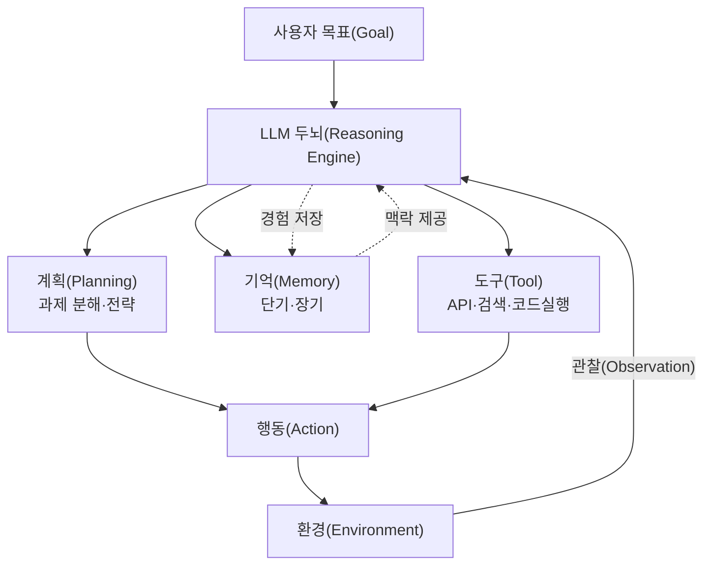
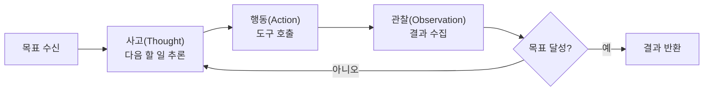

# AI 에이전트(AI Agent)와 에이전틱 AI(Agentic AI)

## 1. 개요

> **AI 에이전트(AI Agent)** 란 거대언어모델(LLM) 등 파운데이션 모델을 추론 엔진으로 삼아, 주어진 목표(Goal)를 달성하기 위해 **스스로 계획(Planning)을 수립하고 도구(Tool)를 호출하며 환경과 상호작용하는 과정을 자율적으로 반복(Loop)** 하는 지능형 소프트웨어 시스템을 말한다. 여러 에이전트가 협업하거나 인간 개입을 최소화한 자율 실행 지향의 패러다임을 특히 **에이전틱 AI(Agentic AI)** 라 한다.

기존의 LLM 활용은 사용자가 프롬프트를 입력하면 모델이 단발성(One-shot) 텍스트를 생성하는 **질의응답형(Chatbot)** 에 머물렀다. 그러나 이러한 방식은 세 가지 근본적 한계를 안고 있었다. 첫째, 모델은 학습 시점 이후의 최신 정보나 기업 내부 데이터에 접근할 수 없어 **지식 단절(Knowledge Cutoff)** 과 환각(Hallucination)에 취약하다. 둘째, 텍스트 생성만 가능할 뿐 실제 조회·예약·결제·코드 실행 같은 **행위(Action)** 를 수행하지 못한다. 셋째, 복잡한 문제를 여러 단계로 쪼개어 순차적으로 해결하는 **다단계 추론(Multi-step Reasoning)** 능력이 프롬프트 한 번의 응답으로는 부족하다.

AI 에이전트는 바로 이 한계를 극복하기 위해 등장하였다. LLM을 단순 "생성기"가 아니라 "**두뇌(Reasoning Engine)**"로 재정의하고, 그 두뇌에 기억(Memory)·도구(Tool)·계획(Planning)이라는 손발을 붙여, 목표가 달성될 때까지 관찰-사고-행동을 스스로 반복하게 만든 것이다. 예컨대 "다음 주 서울 출장 항공권과 숙소를 예산 100만 원 내에서 예약하라"는 목표가 주어지면, 에이전트는 스스로 하위 작업을 분해하고 검색·비교·예약 API를 호출하며 제약을 만족할 때까지 반복한다. 2023년 AutoGPT의 등장을 기점으로 개념이 대중화되었고, 2024~2025년에는 **함수 호출(Function Calling)** 의 정교화, **MCP(Model Context Protocol)** 같은 표준화된 도구 연결 규약, 다중 에이전트 프레임워크의 성숙으로 실무 적용이 본격화되고 있다.

## 2. AI 에이전트의 핵심 구성요소와 동작 구조

AI 에이전트는 LLM 두뇌를 중심으로 **계획·기억·도구·행동** 모듈이 유기적으로 결합된 구조를 가진다. 각 구성요소는 인간이 문제를 푸는 방식 — 목표를 나누고, 아는 것을 떠올리고, 필요한 도구를 쓰고, 결과를 보고 다시 판단하는 과정 — 을 소프트웨어로 형식화한 것이다.

**계획(Planning)** 은 복잡한 목표를 실행 가능한 하위 작업(Subtask)으로 분해하고 순서를 정하는 능력이다. 단순히 한 번에 답을 내는 대신, "먼저 무엇을 하고 그 결과에 따라 다음에 무엇을 할지"를 사고 사슬(Chain-of-Thought)로 전개한다. 대표 기법인 **ReAct(Reasoning + Acting)** 는 "생각(Thought)→행동(Action)→관찰(Observation)"을 교차 반복하여, 매 단계의 도구 실행 결과를 다음 추론에 반영함으로써 환각을 줄이고 근거 있는 행동을 유도한다. 여기에 자기 실행 결과를 스스로 비판·수정하는 **Reflexion(자기성찰)** 이 결합되면 오류 복원력이 크게 향상된다.

**기억(Memory)** 은 에이전트가 맥락을 유지하고 경험을 축적하는 저장소다. 진행 중 대화·중간 결과를 담는 **단기기억(Short-term, 컨텍스트 윈도우)** 과, 과거 상호작용·지식을 벡터 임베딩으로 저장해 필요 시 검색(RAG)하는 **장기기억(Long-term, 벡터 DB)** 으로 나뉜다. 장기기억 덕분에 에이전트는 세션을 넘어 사용자 선호를 기억하고, 방대한 지식 베이스를 참조하여 근거 있는 응답을 생성할 수 있다.

**도구(Tool)** 는 에이전트가 외부 세계와 실제로 상호작용하는 수단이다. LLM은 "어떤 도구를, 어떤 인자로 호출할지"를 구조화된 형식(JSON 등)으로 출력하며(**함수 호출, Function Calling**), 런타임이 이를 실행하고 결과를 다시 모델에 돌려준다. 웹 검색, 데이터베이스 조회, 사내 API, 코드 인터프리터, 파일 시스템 등이 도구가 되며, 최근에는 이 연결을 표준화한 **MCP(Model Context Protocol)** 가 확산되어 도구·데이터 소스와 에이전트를 느슨하게 결합(Loose Coupling)하는 사실상 표준으로 자리잡고 있다.

| 구성요소 | 역할 | 대표 기술 | 부재 시 문제 |
|---|---|---|---|
| 계획(Planning) | 목표 분해·전략 수립 | ReAct, ToT, Reflexion | 복잡 과제 해결 실패 |
| 기억(Memory) | 맥락 유지·경험 축적 | 컨텍스트 윈도우, 벡터 DB | 세션 간 일관성 상실 |
| 도구(Tool) | 외부 세계 작용 | Function Calling, MCP | 실행·최신정보 접근 불가 |
| 행동(Action) | 실제 실행·반복 | Agent Loop, Orchestrator | 단발성 응답에 그침 |

## 3. 에이전트 추론·제어 기법과 자율성 수준

에이전트의 지능은 "얼마나 잘 계획하고, 실패를 얼마나 잘 복원하는가"에 달려 있으며, 이를 좌우하는 것이 추론·제어 기법이다. 대표적으로 **ReAct** 는 추론과 행동을 교차하고, **ToT(Tree of Thoughts)** 는 여러 사고 경로를 트리로 탐색해 최선을 고르며, **Plan-and-Execute** 는 전체 계획을 먼저 세운 뒤 하위 작업을 순차 실행한다. 이들의 공통점은 단선적 생성이 아니라 **탐색·평가·수정의 반복 구조**를 도입했다는 점이다.

자율성의 수준은 인간 개입 정도에 따라 단계적으로 구분된다. 가장 낮은 단계는 사람이 각 단계를 승인하는 **인간-주도(Human-in-the-loop)**, 중간은 사람이 감독하되 개입은 예외 시에만 하는 **인간-감독(Human-on-the-loop)**, 가장 높은 단계는 사람 개입 없이 목표까지 완주하는 **완전 자율(Full Autonomy)** 이다. 자율성이 높을수록 생산성은 커지지만, 잘못된 행동이 곧바로 실세계에 반영되는 위험도 함께 커지므로, 결제·삭제·외부 발송처럼 되돌리기 어려운(Irreversible) 행동에는 반드시 **승인 게이트(Approval Gate)** 를 두는 것이 실무 원칙이다.

한편 단일 에이전트로는 감당하기 어려운 복합 업무는 **다중 에이전트 시스템(Multi-Agent System)** 으로 분업한다. 총괄 관리자(Orchestrator/Supervisor) 에이전트가 작업을 나누어 전문 에이전트(예: 리서처·코더·검증자)에게 위임하고 결과를 통합하는 구조로, 역할 특화를 통해 정확도와 확장성을 높인다. 다만 에이전트 간 통신 오버헤드와 오류 전파(한 에이전트의 실수가 연쇄) 위험이 있어, 명확한 인터페이스와 검증 에이전트 배치가 중요하다.

## 4. RAG·워크플로 자동화와의 비교

AI 에이전트는 RAG나 기존 워크플로 자동화(RPA)와 혼동되기 쉬우나, **자율적 의사결정과 반복 실행 여부**에서 본질적으로 다르다. 그 차이가 생기는 이유는 "누가 실행 흐름(Control Flow)을 결정하는가"에 있다. 전통적 자동화와 RAG는 흐름이 개발자가 미리 정의한 고정 경로를 따르지만, 에이전트는 LLM이 매 순간 상황을 보고 다음 행동을 **동적으로 결정**한다.

| 구분 | 단순 LLM 챗봇 | RAG | AI 에이전트 |
|---|---|---|---|
| 실행 흐름 결정 | 없음(단발 응답) | 고정(검색→생성) | LLM이 동적 결정 |
| 외부 도구 사용 | 불가 | 검색만 | 다양한 도구·API |
| 다단계 반복 | 없음 | 없음 | 목표까지 반복 |
| 상태·기억 | 없음/단기 | 없음 | 단기+장기 |
| 대표 용도 | Q&A | 근거 기반 답변 | 자율 과업 수행 |

RAG는 "지식 접근"을 해결하지만 여전히 정해진 한 번의 검색·생성으로 끝나며 스스로 행동하지 않는다. 반대로 RPA는 정해진 화면·규칙을 그대로 반복할 뿐 예외 상황에 유연하게 대응하지 못한다. 에이전트는 이 둘을 아우른다 — 필요하면 RAG로 지식을 가져오고, 필요하면 API를 호출하며, 결과가 기대와 다르면 계획을 수정한다. 실제로 **구체 사례**를 보면, 소프트웨어 개발 보조 에이전트는 버그 리포트를 받아 관련 코드를 스스로 검색(RAG)하고, 수정안을 생성한 뒤, 테스트를 실행(도구)하여 통과할 때까지 반복하고, 최종적으로 PR을 생성(행동)한다. 단발성 코드 생성 도구가 통상 한 번에 정답을 내지 못하는 것과 달리, 이 반복 루프 덕분에 실제 문제 해결률이 유의하게 향상되는 것으로 보고된다.

## 5. 심화: 실무 적용 동향과 표준화

에이전트 기술은 2024~2025년을 거치며 "실험"에서 "운영"으로 이동하고 있다. 산업 현장에서는 고객 응대(문의 분류→내부 시스템 조회→답변·조치), 소프트웨어 엔지니어링(이슈 해결·코드 리뷰), 데이터 분석(자연어 질의→SQL 생성·실행·시각화), 백오피스 자동화(문서 처리·승인 워크플로) 등에서 파일럿과 상용화가 확산되고 있다. 이 과정에서 두 가지 표준화 흐름이 두드러진다.

첫째, **도구 연결 표준화**다. 앤트로픽이 2024년 말 공개한 **MCP(Model Context Protocol)** 는 에이전트와 외부 데이터·도구를 잇는 개방형 규약으로, 각 도구마다 별도 통합 코드를 작성하던 부담을 줄이고 재사용 가능한 커넥터 생태계를 형성하고 있다. 둘째, **에이전트 간 상호운용 표준**이다. 서로 다른 벤더의 에이전트가 협업할 수 있도록 하는 A2A(Agent-to-Agent) 계열의 프로토콜 논의가 진행되며, 이는 향후 이기종 에이전트가 하나의 목표를 두고 협력하는 "에이전트 웹(Agentic Web)"의 토대가 될 것으로 전망된다. 다만 이러한 최신 규약·버전은 빠르게 변하므로, 도입 시에는 각 규약의 최신 명세와 성숙도를 확인하는 것이 바람직하다.

기술적 성숙과 별개로 **거버넌스** 과제도 부상하고 있다. 자율 에이전트가 잘못된 도구를 호출하거나 악의적 프롬프트 주입(Prompt Injection)으로 탈취될 경우 실제 피해가 발생할 수 있어, 행동 범위 제한(최소권한), 감사 로그(Observability), 승인 게이트, 샌드박스 실행 같은 안전장치가 아키텍처의 필수 요소로 요구된다. EU AI Act 등 규제 환경에서도 자율성이 높은 시스템일수록 투명성·통제가능성 요건이 강화되는 추세다.

## 6. 고려사항 및 시사점

AI 에이전트의 도입은 단순한 모델 채택이 아니라 **자율성과 통제 사이의 균형을 설계하는 아키텍처 의사결정**이다. 기술사 관점에서 다음을 종합적으로 고려해야 한다.

- **자율성-안전성 트레이드오프**: 자율성을 높이면 생산성은 오르지만 오작동 위험도 커진다. 되돌릴 수 없는 행동(결제·삭제·외부 발송)에는 승인 게이트를, 도구 권한에는 최소권한 원칙을 적용하여 위험을 통제 가능한 범위로 한정해야 한다.
- **신뢰성과 검증 체계**: LLM의 확률적 특성상 에이전트는 비결정적으로 동작한다. 자기검증(Self-critique)·검증 에이전트·휴먼 리뷰를 계층적으로 배치하고, 재현 가능한 평가(Eval) 파이프라인으로 품질을 지속 측정하는 체계가 필수다.
- **비용·성능·지연의 최적화**: 반복 루프와 다중 에이전트는 토큰 비용과 응답 지연을 급증시킨다. 과제 복잡도에 따라 대·소형 모델을 혼용(라우팅)하고, 불필요한 반복을 제한(Step 상한)하며, 캐싱·병렬화로 효율을 확보하는 설계가 필요하다.
- **보안·거버넌스 내재화**: 프롬프트 주입·도구 오남용·데이터 유출에 대비해 입력 검증, 샌드박스, 감사 로그(Observability), 접근통제를 아키텍처 단계부터 내재화(Security by Design)해야 하며, 규제 요건(투명성·설명가능성·책임소재)을 충족해야 한다.
- **점진적 도입 전략**: 처음부터 완전 자율을 추구하기보다 Human-in-the-loop에서 시작해, 신뢰가 검증된 영역부터 자율성을 단계적으로 확대하는 성숙도 기반 접근이 실패 위험을 낮춘다.

전망하건대, AI 에이전트는 개별 업무 보조를 넘어 조직의 워크플로를 재구성하는 **디지털 노동력(Digital Workforce)** 으로 진화하고, 표준화된 도구·에이전트 생태계 위에서 상호 협력하는 방향으로 나아갈 것이다. 기술사는 이러한 흐름 속에서 자율성의 가치를 활용하되 통제·신뢰·안전을 함께 설계하는 균형 잡힌 관점을 견지해야 한다.

## 참고자료

- Anthropic, "Model Context Protocol" — https://modelcontextprotocol.io/
- Yao et al., "ReAct: Synergizing Reasoning and Acting in Language Models" — https://arxiv.org/abs/2210.03629
- Shinn et al., "Reflexion: Language Agents with Verbal Reinforcement Learning" — https://arxiv.org/abs/2303.11366

---

> **한 줄 요약**: AI 에이전트는 LLM 두뇌에 계획·기억·도구·행동을 결합해 목표 달성까지 관찰-사고-행동을 자율 반복하는 시스템으로, ReAct·다중 에이전트·MCP 표준을 축으로 확산되며 자율성과 통제·안전의 균형 설계가 핵심 과제다.
