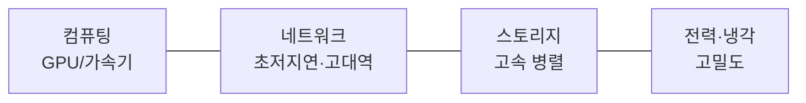

# 대규모 AI 서비스를 위한 데이터센터 구축 기술

## 1. 개요

### 가. 정의
> 초거대 AI(LLM) 학습·추론을 위해 **수천~수만 개 GPU/가속기를 초저지연·고대역 네트워크로 연결**하고 대규모 전력·냉각을 갖춘 AI 특화 데이터센터(AI Factory).

### 나. 등장 배경
- LLM 파라미터·데이터 폭증 → **분산학습·초고속 통신** 필수
- 일반 IDC로는 GPU 밀집도·전력·발열 감당 곤란

## 2. 핵심 요구사항

| 요구 | 내용 |
|---|---|
| **컴퓨팅** | GPU·NPU·TPU 클러스터, 고밀도 집적 |
| **네트워크** | 초저지연·무손실 — 통신이 학습 성능 좌우 |
| **스토리지** | 대용량·고속 병렬 파일시스템(체크포인트) |
| **전력·냉각** | 랙당 수십 kW, 액침·수랭 냉각 |

## 3. 저지연·스케일링 기술 (가)

| 기술 | 설명 |
|---|---|
| **RDMA(RoCE)** | CPU 개입 없이 메모리 직접 전송(저지연) |
| **InfiniBand** | 무손실·초저지연 인터커넥트(HPC 표준) |
| **NVLink/NVSwitch** | 노드 내 GPU 간 초고대역 직접 연결 |
| **GPUDirect** | GPU-네트워크/스토리지 직접 통신 |
| **집단통신(NCCL)** | All-Reduce 등 분산학습 통신 최적화 |

**분산학습 병렬화**

| 병렬화 | 내용 |
|---|---|
| **데이터 병렬** | 배치 분할 + 그래디언트 All-Reduce |
| **모델/텐서 병렬** | 레이어·연산(행렬)을 GPU에 분할 |
| **파이프라인 병렬** | 레이어를 단계별 파이프라인 처리 |

## 4. DCI(Data Center Interconnect) 기술 (나)

> 분산된 데이터센터를 **초고속·저지연 광전송**으로 연결해 용량 확장·재해복구·부하분산을 실현.

| 기술 | 내용 |
|---|---|
| **DWDM** | 파장분할다중화로 단일 광섬유 대용량 전송 |
| **OTN** | 광전송망 표준, 대용량·저지연 백본 |
| **코히어런트 광전송** | 400G/800G 장거리 고속 전송 |
| **활용** | DC 간 복제, 재해복구(DR), 워크로드 분산, 클러스터 확장 |

## 5. 고려사항 및 시사점
- **네트워크 병목**이 GPU 활용률·학습 성능 결정 → Fat-Tree 등 토폴로지 설계
- **전력·탄소**: PUE 개선, 신재생(RE100)·액침냉각 등 그린 데이터센터
- CXL·PIM 등 메모리 중심 기술, 멀티 DC 분산학습으로 확장
- 국가 AI 경쟁력(소버린 AI)의 핵심 인프라 — 대규모 투자·집적화 가속

---

> **한 줄 요약**: 대규모 AI 데이터센터는 *GPU 클러스터를 RDMA·InfiniBand·NVLink로 초저지연 연결* 하고 데이터·모델·파이프라인·텐서 병렬로 분산학습하며, DWDM·OTN 기반 DCI와 고밀도 전력·냉각으로 초거대 AI를 뒷받침한다.
