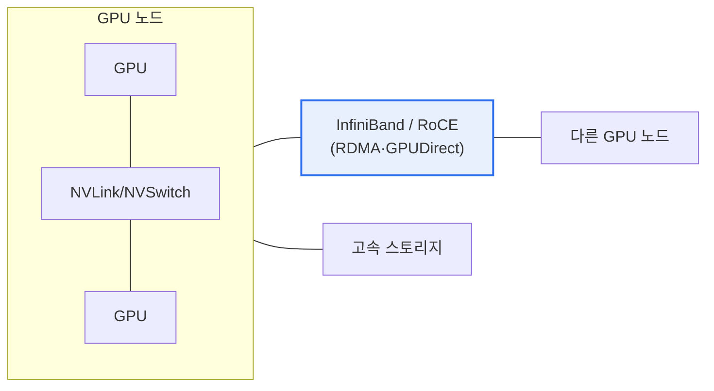

# 대규모 AI 서비스를 위한 데이터센터 구축 기술

## 1. 개요

### 가. 정의
> 초거대 AI(LLM)의 **학습·추론을 위한 대규모 GPU 클러스터 기반 데이터센터**를 구축하는 기술. 수천~수만 장의 가속기를 저지연·고대역 네트워크로 연결하고 전력·냉각을 최적화한다.

### 나. 등장 배경
- 파라미터 수 급증(LLM) → **연산·메모리·네트워크 병목**
- 대규모 분산학습에서 **통신 지연·확장성·전력·발열** 이 핵심 과제

## 2. 저지연 기술과 스케일링 확보 기술 (가)

| 구분 | 기술 |
|---|---|
| **저지연** | RDMA(RoCE)·InfiniBand, GPUDirect, NVLink/NVSwitch(노드 내), 무손실 네트워크 |
| **스케일링(확장)** | 분산학습(데이터·모델·파이프라인 병렬), 스케일아웃(클러스터), 스케일업(HBM·멀티GPU) |
| **전력·냉각** | 액침냉각·수냉(고밀도 발열 대응), 전력 효율(PUE) 최적화 |

## 3. DCI (Data Center Interconnect) 기술 (나)

> 지리적으로 분산된 데이터센터를 **초고속·저지연 광전송**으로 연결하여 용량 확장·재해복구·부하분산을 실현.

| 기술 | 내용 |
|---|---|
| **DWDM** | 파장분할다중화로 단일 광섬유 대용량 전송 |
| **OTN** | 광전송망 표준, 대용량·저지연 백본 |
| **고속 인터페이스** | 400G/800G 이더넷, 코히어런트 광전송 |
| **활용** | DC 간 데이터 복제, 재해복구(DR), 워크로드 분산, 클러스터 확장 |

## 4. 시사점
- AI DC는 **네트워크(통신 병목) 최적화가 성능의 핵심** — GPU 활용률 좌우
- 전력·냉각(지속가능성)과 **DCI 기반 멀티 DC 확장**이 대규모화 관건
- CXL·PIM 등 메모리 중심 기술, 친환경(RE100)과 연계

---

> **한 줄 요약**: 대규모 AI 데이터센터는 *RDMA/InfiniBand·NVLink 저지연 + 분산학습·스케일아웃 확장 + DWDM/OTN 기반 DCI* 로 초거대 AI의 연산·통신·확장 요구를 충족한다.
