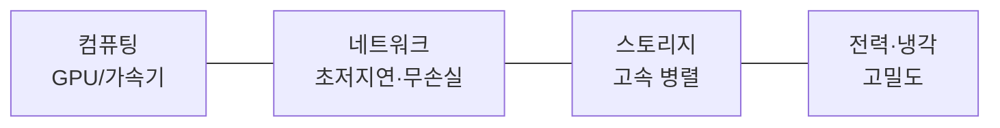

# 대규모 AI 서비스를 위한 데이터센터 구축 기술

## 1. 개요

### 가. 정의
> 초거대 AI(LLM)의 학습·추론을 위해 **수천~수만 개의 GPU/가속기를 초저지연·고대역 네트워크로 연결**하고, 고밀도 전력·냉각을 갖춘 AI 특화 데이터센터로, 흔히 **AI Factory**로도 불린다.

### 나. 등장 배경 및 필요성
LLM의 파라미터와 학습 데이터가 폭증하면서, 단일 GPU는 물론 단일 서버로도 모델을 담을 수 없게 됐다. 수천 개 GPU가 하나의 모델을 **나눠 학습(분산학습)** 해야 하는데, 이때 GPU들은 매 스텝마다 그래디언트를 주고받으므로 **GPU 간 통신 속도가 전체 학습 속도를 좌우**한다. 즉 AI 데이터센터의 핵심 난제는 연산이 아니라 "**통신 병목과 전력·발열**"이다. 일반 IDC는 GPU 밀집도(랙당 수십 kW)·발열·초고속 통신을 감당할 수 없어, AI 전용 인프라 설계가 별도로 요구됐다.

## 2. 핵심 요구사항

AI 데이터센터는 네 요소가 균형을 이뤄야 하며, 어느 하나라도 병목이면 값비싼 GPU가 놀게 된다. 특히 **네트워크**가 결정적인데, 분산학습에서 GPU가 통신을 기다리는 시간이 길면 연산 유닛의 활용률(MFU)이 급락하기 때문이다.

| 요구 | 내용 |
|---|---|
| 컴퓨팅 | GPU·NPU·TPU 클러스터, 고밀도 집적 |
| 네트워크 | 초저지연·무손실 — 통신이 학습 성능 좌우 |
| 스토리지 | 대용량·고속 병렬 파일시스템(체크포인트) |
| 전력·냉각 | 랙당 수십 kW, 액침·수랭 냉각 |

체크포인트 하나가 수 TB에 달하고 이를 수시로 저장·복구해야 하므로 스토리지도 고속 병렬(예: Lustre·GPFS)이 필수다.

## 3. 저지연 · 스케일링 기술 (가)

GPU 간 통신은 두 계층으로 최적화된다. **노드 내부**에서는 GPU들을 PCIe보다 훨씬 빠른 전용 링크로 직결하고, **노드 간**에서는 CPU를 우회하는 초저지연 네트워크를 쓴다. CPU를 거치면 지연이 커지므로, **RDMA(Remote Direct Memory Access)** 로 CPU 개입 없이 원격 GPU 메모리에 직접 접근하는 것이 핵심 원리다.

| 기술 | 원리·설명 |
|---|---|
| **RDMA(RoCE)** | CPU 개입 없이 메모리 직접 전송으로 저지연 |
| **InfiniBand** | 무손실·초저지연 인터커넥트(HPC 표준) |
| **NVLink/NVSwitch** | 노드 내 GPU 간 초고대역 직접 연결 |
| **GPUDirect** | GPU가 네트워크·스토리지와 직접 통신 |
| **집단통신(NCCL)** | All-Reduce 등 분산학습 통신 패턴 최적화 |

분산학습은 모델·데이터를 어떻게 쪼개느냐에 따라 세 가지 병렬화를 조합(3D 병렬)한다. 각각은 해결하는 문제가 다르다.

| 병렬화 | 원리 | 해결 문제 |
|---|---|---|
| **데이터 병렬** | 배치를 나눠 각 GPU가 처리 후 그래디언트 All-Reduce | 학습 속도 향상 |
| **모델/텐서 병렬** | 레이어·행렬 연산을 GPU에 분할 | 모델이 GPU 메모리 초과 |
| **파이프라인 병렬** | 레이어를 단계별로 파이프라인 처리 | 깊은 모델의 메모리·효율 |

예컨대 GPT급 모델은 텐서 병렬로 한 레이어를 여러 GPU에 나누고, 파이프라인 병렬로 레이어 묶음을 노드에 배치하며, 그 위에 데이터 병렬을 얹어 수천 GPU를 동시에 돌린다. 이때 통신량이 막대해 InfiniBand·NVLink가 없으면 확장이 불가능하다.

## 4. DCI(Data Center Interconnect) 기술 (나)

> 지리적으로 분산된 데이터센터를 **초고속·저지연 광전송**으로 연결해 용량 확장·재해복구·부하분산을 실현하는 기술.

단일 데이터센터의 전력·공간에는 한계가 있어, 여러 DC를 하나처럼 묶는 DCI가 필요하다. 한 가닥의 광섬유로 최대한 많은 데이터를 보내야 하므로, 서로 다른 파장(색)에 데이터를 실어 동시에 전송하는 **DWDM**이 기반 기술이다.

| 기술 | 원리·설명 |
|---|---|
| **DWDM** | 파장분할다중화로 단일 광섬유에 대용량 전송 |
| **OTN** | 광전송망 표준, 대용량·저지연 백본 |
| **코히어런트 광전송** | 위상·진폭 변조로 400G/800G 장거리 고속 전송 |
| **활용** | DC 간 데이터 복제, 재해복구(DR), 워크로드 분산, 클러스터 확장 |

## 5. 고려사항 및 시사점
- **네트워크 병목이 곧 성능**: GPU 활용률과 학습 속도는 네트워크가 좌우하므로, 어느 두 노드든 균등한 대역을 갖도록 **Fat-Tree(리프-스파인)** 같은 논블로킹 토폴로지를 설계한다.
- **전력·탄소**: 랙 밀도가 높아 **PUE 개선**과 함께 신재생 전력(RE100)·**액침냉각**으로 그린 데이터센터를 지향한다. 전력 조달 자체가 입지의 제약이 된다.
- **차세대 기술**: 메모리 병목을 완화하는 **CXL·PIM**, 여러 DC에 걸친 분산학습으로 확장이 진행 중이다.
- **국가 전략**: AI 데이터센터는 **소버린 AI(주권형 AI)** 의 핵심 인프라로, 대규모 투자·집적화가 국가 경쟁력 차원에서 가속되고 있다.

---

> **한 줄 요약**: 대규모 AI 데이터센터는 *GPU 클러스터를 RDMA·InfiniBand·NVLink로 초저지연 연결* 하고 데이터·텐서·파이프라인 병렬로 분산학습하며, DWDM·OTN 기반 DCI와 고밀도 전력·액침냉각으로 초거대 AI를 뒷받침하는 소버린 AI 인프라다.
