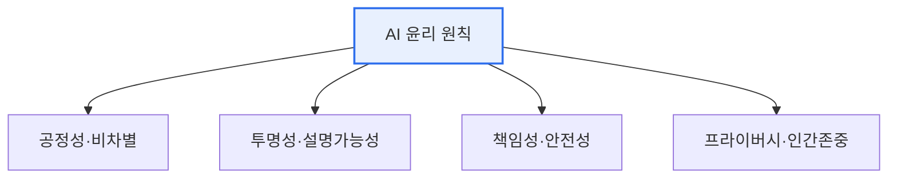
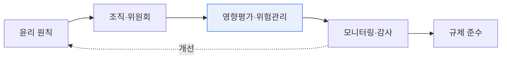

# AI 윤리와 거버넌스 모형

## 1. 개요

### 가. 정의
> AI 개발·적용 과정에서 지켜야 할 **윤리 원칙**과, AI를 효과적으로 관리·규제하기 위한 **거버넌스 체계(모형)**. 신뢰할 수 있는 AI(Trustworthy AI) 실현을 목적으로 한다.

AI 윤리가 중요한 이유는 AI의 결정이 채용·대출·의료처럼 **사람의 삶에 직접 영향**을 미치기 때문이다. 성능만 좋으면 되던 시대를 지나, "공정한가, 투명한가, 책임질 수 있는가"가 AI 도입의 전제가 되었다. 윤리 원칙이 '무엇을 지켜야 하는가'라면, 거버넌스 모형은 '이를 조직·사회가 어떻게 강제·관리하는가'의 실행 체계다.

## 2. AI 윤리 주요 내용

| 원칙 | 내용 |
|---|---|
| **공정성** | 데이터·알고리즘 편향 제거, 차별 방지 |
| **투명성·설명가능성** | 판단 근거 공개(XAI), 이해 가능성 |
| **책임성** | 결과에 대한 책임 주체 명확화 |
| **안전성·견고성** | 오작동·오남용 방지, 강건성 |
| **프라이버시** | 개인정보 보호, 데이터 최소화 |
| **인간 중심** | 인간의 자율성·감독(Human-in-the-loop) 존중 |

## 3. AI 거버넌스 모형

| 계층 | 구성 |
|---|---|
| **원칙·정책** | AI 윤리기준, 내부 정책·가이드라인 |
| **조직·체계** | AI 윤리위원회, 책임자(CAIO), R&R |
| **프로세스** | AI 영향평가, 위험 분류·관리, 감사 |
| **기술·운영** | XAI, MLOps 모니터링, 편향·드리프트 감시 |
| **규제 대응** | EU AI Act(위험기반), 국내 AI 기본법, NIST AI RMF·ISO 42001 |

## 4. 시사점
- **설계 단계부터 내재화**(Responsible AI by Design) — 사후 대응은 비용 큼
- 자율규제(윤리)+타율규제(법)의 균형, 위험기반 차등 관리
- 생성형 AI 확산으로 저작권·딥페이크·허위정보 등 새 윤리 이슈 대두

---

> **한 줄 요약**: AI 윤리는 *공정성·투명성·책임성·프라이버시·인간중심* 원칙을 다루며, 거버넌스 모형은 이를 *원칙→조직→영향평가→모니터링→규제 준수* 의 체계로 실행해 신뢰할 수 있는 AI를 실현한다.
