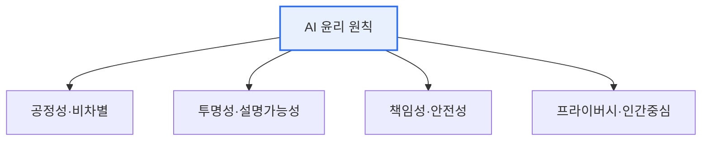
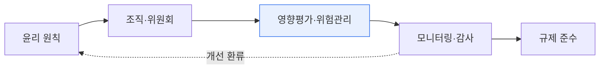

# AI 윤리와 거버넌스 모형

## 1. 개요

### 가. 정의
> AI를 개발·적용하는 과정에서 지켜야 할 **윤리 원칙**과, AI를 효과적으로 관리·규제하기 위한 **거버넌스 체계(모형)**. 신뢰할 수 있는 AI(Trustworthy AI)의 실현을 목적으로 한다.

AI 윤리가 유독 중요해진 이유는, AI의 결정이 더 이상 추천 광고 같은 사소한 영역에 머물지 않고 **채용·대출·의료·형사사법처럼 사람의 삶을 좌우하는 영역**으로 들어왔기 때문이다. 성능만 좋으면 됐던 시대를 지나, "이 AI가 특정 집단을 차별하지 않는가(공정성), 왜 그런 결정을 내렸는지 설명할 수 있는가(투명성), 잘못되면 누가 책임지는가(책임성)"가 AI 도입의 전제 조건이 되었다. 여기서 윤리 원칙이 '무엇을 지켜야 하는가'를 규정한다면, 거버넌스 모형은 '그 원칙을 조직과 사회가 어떻게 강제하고 관리하는가'라는 실행 체계를 제공한다. 원칙만 있고 거버넌스가 없으면 선언에 그치고, 거버넌스만 있고 원칙이 없으면 방향을 잃는다.

### 나. 등장 배경
생성형 AI의 대중화로 강력한 AI를 누구나 쓰게 되면서 편향·허위정보·저작권·프라이버시 문제가 사회 표면으로 드러났고, EU AI Act·국내 AI 기본법 등 규제가 강화되며 AI 이슈의 선제 관리가 기업 생존과 직결되게 되었다.

## 2. AI 윤리 주요 원칙

AI 윤리의 핵심 원칙들은 서로 얽혀 있다. **공정성** 은 데이터·알고리즘의 편향을 제거해 차별을 막는 것인데, 편향은 대개 학습 데이터에 이미 존재하던 사회적 편견이 모델에 반영·증폭된 결과이므로 데이터 단계부터 점검해야 한다. **투명성·설명가능성** 은 AI가 왜 그런 판단을 했는지 근거를 제시(XAI)하는 것으로, 공정성을 검증하는 전제가 된다. **책임성** 은 결과에 대한 책임 주체를 명확히 하는 것이고, **안전성** 은 오작동·오남용을 막는 것이며, **프라이버시·인간 중심** 은 개인정보를 보호하고 최종 판단에 인간이 개입(Human-in-the-loop)하도록 보장하는 것이다.

| 원칙 | 내용 |
|---|---|
| **공정성** | 데이터·알고리즘 편향 제거, 차별 방지 |
| **투명성·설명가능성** | 판단 근거 공개(XAI), 이해 가능성 |
| **책임성** | 결과 책임 주체 명확화 |
| **안전성·견고성** | 오작동·적대적 공격 방지 |
| **프라이버시·인간중심** | 개인정보 보호, 인간 감독 유지 |

## 3. AI 거버넌스 모형

거버넌스 모형은 윤리 원칙을 실제 조직 운영으로 옮기는 계층 구조다. 최상위에 **원칙·정책**(AI 윤리기준·내부 가이드라인)이 있고, 이를 실행할 **조직·체계**(AI 윤리위원회, 책임자)가 구성된다. 그 아래 **프로세스**(AI 영향평가, 위험 분류·관리, 감사)가 돌아가고, **기술·운영**(XAI, MLOps 모니터링, 편향·드리프트 감시)이 이를 뒷받침하며, 전체가 **규제 대응**(EU AI Act, NIST AI RMF, ISO/IEC 42001)과 정렬된다.

| 계층 | 구성 |
|---|---|
| **원칙·정책** | AI 윤리기준, 내부 정책 |
| **조직·체계** | AI 윤리위원회, 책임자(CAIO) |
| **프로세스** | AI 영향평가, 위험 분류·관리, 감사 |
| **기술·운영** | XAI, MLOps 모니터링, 편향 감시 |
| **규제 대응** | EU AI Act(위험기반), NIST AI RMF, ISO 42001 |

## 4. 고려사항 및 시사점

1. **설계 단계부터의 내재화(Responsible AI by Design)** 가 핵심이다. 문제가 터진 뒤 대응하면 신뢰 회복 비용이 훨씬 크므로, 개발 초기부터 편향·설명가능성·안전성을 요구사항으로 넣는다.
2. **자율규제(윤리)와 타율규제(법)의 균형** 이 필요하다. 위험이 큰 용도(고위험 AI)는 강하게 규제하고 저위험은 자율에 맡기는 위험 기반 접근이 혁신과 안전을 조화시킨다.
3. **인간 감독(Human-in-the-loop)의 유지** 가 마지막 안전장치다. 특히 고위험 영역에서 AI가 최종 결정을 독점하지 않고 인간이 검토·책임지도록 설계해야 한다.

---

> **한 줄 요약**: AI 윤리는 *공정성·투명성·책임성·프라이버시·인간중심* 원칙을 다루고, 거버넌스 모형은 이를 *원칙→조직→영향평가→모니터링→규제 준수* 계층으로 실행하며, 설계 단계 내재화와 인간 감독으로 신뢰할 수 있는 AI를 실현한다.
