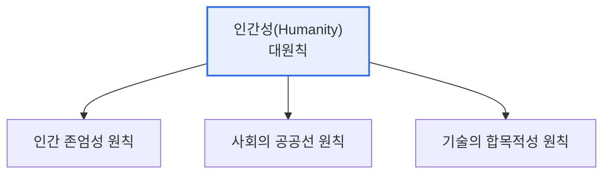

# 인공지능(AI) 윤리기준 — 3대 기본원칙과 10대 핵심요건

## 1. 개요

### 가. 정의
> 과학기술정보통신부가 발표한 **국가 인공지능 윤리기준(2020.12)** 으로, 인공지능 개발·활용 전 과정에서 지켜야 할 최고 가치인 '**인간성(Humanity)**'을 구현하기 위한 3대 기본원칙과 10대 핵심요건을 제시한 자율규범이다.

이 윤리기준의 핵심 지향점은 '**인간성을 위한 인공지능(AI for Humanity)**'이다. AI가 인간을 대체하거나 위협하는 것이 아니라, 인간의 존엄과 삶의 질을 높이는 도구가 되어야 한다는 대원칙 아래 3대 기본원칙과 10대 요건이 배치된다. 강제 규제가 아니라 개발자·기업·이용자가 자율적으로 실천하도록 방향을 제시하는 성격이며, 특정 기술·산업에 얽매이지 않는 일반 원칙으로 설계되어 상황에 맞게 적용된다. 즉 "무엇을 하지 마라"는 금지 목록이 아니라, AI가 지향해야 할 가치와 지켜야 할 요건을 담은 나침반이다.

### 나. 등장 배경
AI가 사회 전반에 확산되며 편향·프라이버시·안전 등 윤리 문제가 대두되자, 신뢰할 수 있는 AI 생태계를 조성하기 위한 국가 차원의 공통 기준이 필요해졌다.

## 2. 3대 기본원칙

세 기본원칙은 인간성이라는 대원칙을 세 방향에서 구체화한다. **인간 존엄성 원칙** 은 AI가 인간의 생명·안전·기본권을 침해하지 않고 인간을 수단이 아닌 목적으로 대해야 한다는 것이다. **사회의 공공선 원칙** 은 AI가 사회적 약자를 배려하고 공공의 이익과 지속가능성에 기여해야 한다는 것이다. **기술의 합목적성 원칙** 은 AI 기술이 인류의 삶에 유익한 목적을 위해 개발·활용되며 그 과정이 윤리적이어야 한다는 것이다.

| 기본원칙 | 내용 |
|---|---|
| **인간 존엄성** | 생명·안전·기본권 보호, 인간을 목적으로 |
| **사회의 공공선** | 사회적 약자 배려, 공공 이익·지속가능성 |
| **기술의 합목적성** | 인류에 유익한 목적, 윤리적 개발·활용 |

## 3. 10대 핵심요건

10대 요건은 3대 원칙을 실제 개발·운영에서 지키기 위한 실천 항목이다.

| 핵심요건 | 요지 |
|---|---|
| **인권 보장** | 인간의 권리·자유 보호 |
| **프라이버시 보호** | 개인정보·사생활 보호 |
| **다양성 존중** | 편향 없는 공정, 다양성 배려 |
| **침해 금지** | 인간에 해악 금지 |
| **공공성** | 공익·사회적 편익 추구 |
| **연대성** | 이해관계자 협력·상생 |
| **데이터 관리** | 데이터 품질·목적 내 활용 |
| **책임성** | 결과에 대한 책임 주체 명확화 |
| **안전성** | 오작동·위험 통제 |
| **투명성** | 설명가능성·정보 공개 |

## 4. 고려사항 및 시사점

1. **자율규범에서 법제화로의 흐름**을 이해해야 한다. 국가 AI 윤리기준은 자율 실천을 지향하지만, EU AI Act·국내 AI 기본법 등 강행 규제와 연계되며 실효성이 강화되고 있다.
2. **설계 단계 내재화(Ethics by Design)** 가 필요하다. 사후 점검이 아니라 개발 초기부터 투명성·공정성·안전성을 요구사항으로 반영해야 한다.
3. **AI 거버넌스·영향평가와 연계**된다. 윤리기준을 조직의 AI 거버넌스 체계와 AI 영향평가(자율점검표)로 구체화해 실천 가능한 절차로 만들어야 한다.

---

> **한 줄 요약**: 국가 AI 윤리기준은 '인간성'을 최고 가치로 *인간 존엄성·사회 공공선·기술 합목적성* 의 3대 기본원칙과 인권보장·프라이버시·투명성 등 10대 핵심요건을 제시한 자율규범으로, 설계 단계 내재화와 AI 거버넌스 연계로 실천된다.
