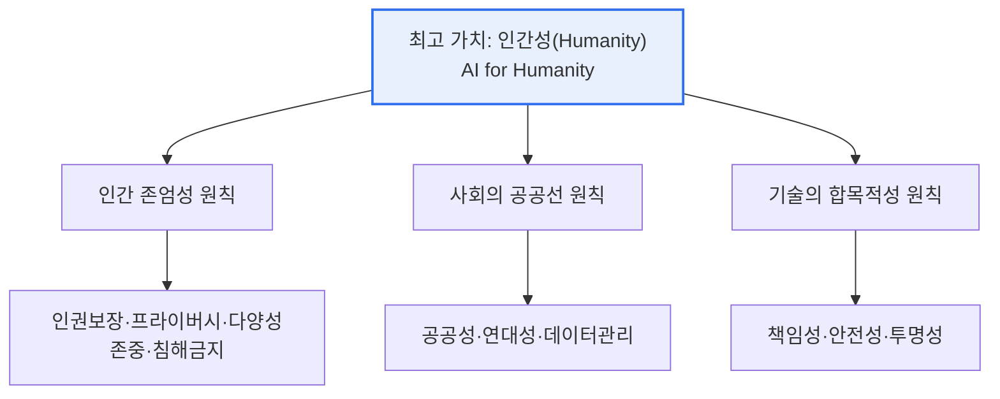
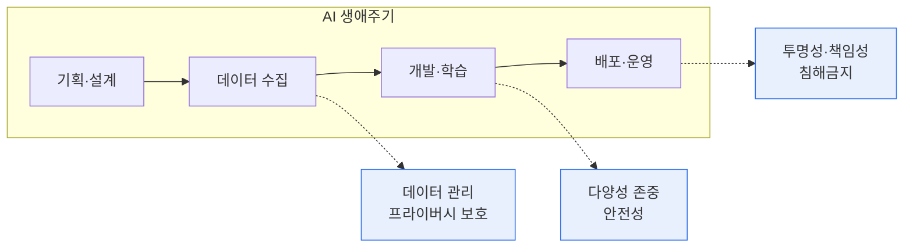

# 인공지능(AI) 윤리기준 — 3대 기본원칙과 10대 핵심요건

## 1. 개요

### 가. 정의
> **국가 인공지능 윤리기준**은 과학기술정보통신부가 정보통신정책연구원(KISDI)과 함께 발표한(2020.12) 것으로, 인공지능 개발·활용 전 과정에서 지켜야 할 최고 가치인 '**인간성(Humanity)**'을 구현하기 위한 **3대 기본원칙과 10대 핵심요건**을 제시한 자율규범이다.

이 윤리기준의 핵심 지향점은 '**인간성을 위한 인공지능(AI for Humanity)**'이다. 즉 AI가 인간을 대체하거나 위협하는 것이 아니라, 인간의 존엄과 삶의 질을 높이는 도구가 되어야 한다는 대원칙 아래 3대 기본원칙과 10대 요건이 배치된다. 이 문서를 이해할 때 놓치기 쉬운 것은 그 **규범적 성격**이다. 이는 위반 시 제재가 따르는 강행 규제가 아니라, 개발자·운영자·이용자가 자율적으로 실천하도록 방향을 제시하는 연성규범(soft law)이다. 그래서 "무엇을 하지 마라"는 금지 목록이 아니라, AI가 지향해야 할 가치와 지켜야 할 요건을 담은 **나침반**의 성격을 가진다.

또한 이 기준은 특정 기술·산업에 얽매이지 않는 **일반 원칙(general principle)** 으로 설계되었다. 얼굴인식이든 자율주행이든 생성형 AI든, 기술의 종류를 가리지 않고 공통으로 적용할 수 있도록 추상 수준을 높게 잡은 것이다. 이는 기술 발전 속도가 규제 속도를 앞지르는 AI 분야에서, 특정 기술을 못박은 규정이 금세 낡아버리는 문제를 피하려는 의도적 설계다. 대신 추상적인 만큼 실제 현장에서 어떻게 구체화하느냐가 관건이 되며, 이 지점이 후속 가이드라인·자율점검표·AI 기본법으로 이어지는 배경이 된다.

### 나. 등장 배경
AI가 채용·대출·의료·형사사법 등 사회 전반의 의사결정에 스며들면서, 학습 데이터에 내재한 **편향(bias)** 이 특정 집단에 대한 차별로 증폭되거나, 대규모 개인정보 수집으로 **프라이버시**가 침해되거나, 자율시스템의 오작동으로 **안전**이 위협받는 사례가 잇따랐다. 대표적으로 편향된 데이터로 학습해 특정 인종·성별에 불리하게 작동한 해외 채용·재범예측 알고리즘 논란은 'AI는 중립적'이라는 통념을 깨뜨렸다. 이에 신뢰할 수 있는 AI 생태계를 조성하기 위한 국가 차원의 공통 기준이 필요해졌고, EU·OECD 등 국제사회의 AI 윤리 논의 흐름과 발맞춰 우리 정부도 2020년 12월 국가 AI 윤리기준을 마련했다.

### 다. 위상과 적용 대상
이 기준은 AI 생애주기(기획→데이터 수집→개발→배포→운영→폐기) 전반에 적용되며, 적용 주체를 **개발자·운영자(공급자)** 와 **이용자(수요자)** 로 폭넓게 상정한다. 어느 한 주체의 책임으로 환원되지 않고, AI를 만드는 사람·서비스하는 사람·쓰는 사람 모두가 함께 지켜야 할 사회적 합의라는 점에서 여타 기술 표준과 성격이 다르다.

## 2. 최고 가치와 3대 기본원칙 — 전체 구조

3대 기본원칙은 '인간성'이라는 대원칙을 서로 다른 세 방향에서 구체화한 것이다. 각각은 독립적이라기보다 인간성을 떠받치는 세 기둥으로, 함께 작동할 때 온전한 의미를 가진다.

```mermaid
flowchart TB
  H["최고 가치: 인간성(Humanity)<br/>AI for Humanity"] --> P1["인간 존엄성 원칙"]
  H --> P2["사회의 공공선 원칙"]
  H --> P3["기술의 합목적성 원칙"]
  P1 --> R1["인권보장·프라이버시·다양성존중·침해금지"]
  P2 --> R2["공공성·연대성·데이터관리"]
  P3 --> R3["책임성·안전성·투명성"]
  style H fill:#e8f0fe,stroke:#2f6fed,stroke-width:2px
```

**인간 존엄성 원칙** 은 AI가 인간의 생명·신체 안전과 기본권을 침해하지 않고, 인간을 수단이 아닌 **목적 그 자체**로 대해야 한다는 것이다. 칸트적 인간관을 AI에 투영한 것으로, AI의 효율성이 아무리 커도 인간의 존엄을 도구화하는 방향으로는 쓰일 수 없다는 한계선을 긋는다. 예컨대 사회적 통제·감시를 위한 무차별 얼굴인식이나, 인간의 판단을 완전히 배제한 채 생명에 관한 결정을 자동화하는 것은 이 원칙에 반한다.

**사회의 공공선 원칙** 은 AI가 소수·취약 계층을 포함한 **모든 사회 구성원**에게 골고루 혜택이 돌아가도록 하고, 공공의 이익과 지속가능성에 기여해야 한다는 것이다. AI의 편익이 소수에게 집중되어 디지털 격차를 키우거나, 환경·사회적 비용을 외부화하는 것을 경계한다. 이는 AI가 '누구를 위한 기술인가'라는 분배적 정의의 질문을 담고 있다.

**기술의 합목적성 원칙** 은 AI 기술이 인류에게 유익한 목적을 위해 개발·활용되어야 하며, 그 목적을 달성하는 **과정과 수단 또한 윤리적**이어야 한다는 것이다. 목적이 선하다는 이유로 부당한 데이터 수집이나 불투명한 방법이 정당화될 수 없음을 뜻한다. 이 원칙은 뒤의 책임성·투명성 요건과 직접 연결된다.

| 기본원칙 | 핵심 내용 | 대응 관념 |
|---|---|---|
| **인간 존엄성** | 생명·안전·기본권 보호, 인간을 목적으로 대우 | 인권·존엄 |
| **사회의 공공선** | 취약계층 배려, 공공 이익·지속가능성·격차 해소 | 분배적 정의 |
| **기술의 합목적성** | 인류에 유익한 목적 + 윤리적 과정·수단 | 목적·수단의 정당성 |

## 3. 10대 핵심요건 — 원칙의 실천 항목

10대 핵심요건은 추상적인 3대 원칙을 실제 개발·운영 현장에서 지키기 위한 **실천 체크포인트**다. 앞의 구조도에서 보듯 각 요건은 특정 기본원칙에 뿌리를 두되, 실제로는 여러 원칙에 걸쳐 작동한다.

```mermaid
flowchart LR
  subgraph LC["AI 생애주기"]
    direction LR
    D1["기획·설계"] --> D2["데이터 수집"] --> D3["개발·학습"] --> D4["배포·운영"]
  end
  D2 -.-> Q1["데이터 관리<br/>프라이버시 보호"]
  D3 -.-> Q2["다양성 존중<br/>안전성"]
  D4 -.-> Q3["투명성·책임성<br/>침해금지"]
  style Q1 fill:#e8f0fe,stroke:#2f6fed
  style Q2 fill:#e8f0fe,stroke:#2f6fed
  style Q3 fill:#e8f0fe,stroke:#2f6fed
```

각 요건을 조금 더 풀어보면 다음과 같다. **인권 보장·프라이버시 보호·다양성 존중** 은 인간 존엄성 원칙의 실천으로, AI가 인간의 권리·자유를 지키고 개인정보와 사생활을 보호하며 편향 없이 공정하게 작동하도록 요구한다. 특히 다양성 존중은 학습 데이터·알고리즘의 편향을 제거해 성별·연령·장애·인종 등에 따른 차별을 방지하라는, AI 윤리의 가장 실무적 쟁점을 담는다. **침해 금지·공공성·연대성** 은 AI가 인간에게 직간접적 해악을 끼치지 않고, 공익과 사회적 편익을 지향하며, 이해관계자 간 협력·상생을 추구하라는 요건이다. **데이터 관리·책임성·안전성·투명성** 은 기술적·거버넌스적 요건으로, 데이터를 목적 범위 내에서 품질 있게 관리하고, 결과에 대한 책임 주체를 명확히 하며, 오작동·위험을 통제하고, 판단 근거를 설명·공개할 수 있어야 함을 뜻한다.

| 핵심요건 | 요지 | 연계 개념 |
|---|---|---|
| **인권 보장** | 인간의 권리·자유 보호 | 기본권 |
| **프라이버시 보호** | 개인정보·사생활 보호 | 개인정보보호법 |
| **다양성 존중** | 편향 제거·공정성·다양성 배려 | 알고리즘 공정성 |
| **침해 금지** | 인간에 대한 직간접 해악 금지 | 안전·책임 |
| **공공성** | 공익·사회적 편익 추구 | 공공선 |
| **연대성** | 이해관계자 협력·상생·세대 간 배려 | 지속가능성 |
| **데이터 관리** | 데이터 품질·목적 내 활용 | 데이터 거버넌스 |
| **책임성** | 결과에 대한 책임 주체 명확화 | AI 거버넌스 |
| **안전성** | 오작동·위험 통제, 견고성 | AI 신뢰성 |
| **투명성** | 설명가능성·정보 공개 | XAI |

## 4. 비교와 위치 — 국제 규범과의 관계

우리 국가 AI 윤리기준은 국제사회의 흐름과 궤를 같이하면서도 강조점에서 차이가 있다. **OECD AI 원칙(2019)** 은 포용적 성장·인간중심 가치·투명성·견고성·책임성을 제시하고, **EU의 신뢰가능 AI 윤리 가이드라인(2019)** 은 인간의 감독·기술적 견고성·프라이버시·투명성·다양성·사회적 웰빙·책임성의 7대 요건을 든다. 세 규범 모두 '인간 중심·투명성·책임성·공정성'이라는 공통 뼈대를 공유한다. 다만 우리 기준은 '**인간성(Humanity)**'이라는 단일 최고 가치를 정점에 두고 3원칙-10요건으로 위계화한 점, 그리고 처음부터 자율규범임을 명확히 한 점이 특징이다.

이러한 차이가 생기는 이유와 실무적 함의는 다음과 같다. EU는 일찍부터 **AI Act**라는 강행 규제(위험 기반 차등 규율)로 나아가 위반 시 과징금을 부과하는 반면, 우리는 자율규범으로 출발해 산업 위축을 최소화하면서 점진적으로 법제화 단계를 밟는 전략을 택했다. 그 결과 국내에서도 자율규범만으로는 실효성이 부족하다는 지적이 이어졌고, 이것이 뒤에서 볼 AI 기본법 제정으로 이어졌다. 즉 윤리기준은 '가치의 선언', AI 기본법은 '이행의 강제'라는 상호 보완 관계로 이해해야 한다.

## 5. 심화 — 자율규범에서 AI 기본법으로

국가 AI 윤리기준(2020)의 가장 중요한 후속 흐름은 **법제화**다. 자율 실천만으로는 편향·안전·투명성 문제를 실효적으로 다루기 어렵다는 공감대 속에, 「**인공지능 발전과 신뢰 기반 조성 등에 관한 기본법**」(약칭 **AI 기본법**)이 제정되어 **2026년 1월 시행**을 앞두게 되었다. 이 법은 2020년 윤리기준의 가치를 계승하면서도, 국민의 생명·안전·기본권에 중대한 영향을 미치는 '**고영향 AI(high-impact AI)**'와 생성형 AI에 대해 사업자의 책무(위험관리·설명·표시·안전성 확보 등)를 규정한다는 점에서 자율규범을 넘어선 이행 규범의 성격을 가진다. 실제 하위 규범인 시행령·가이드라인(투명성·안전성 확보, 고영향 AI 사업자 책무 등)에 대한 의견 수렴 절차가 진행되며 구체화되고 있다.

한편 정부는 2020년 윤리기준 자체도 시대 변화에 맞춰 개정을 추진하고 있다. 에이전틱 AI(스스로 계획·행동하는 자율 에이전트), 피지컬 AI(로봇·자율주행 등 물리세계 결합) 같은 새로운 기술 흐름과, AI 기본법 시행 이후 달라진 정책 여건을 반영한 새 AI 윤리원칙이 준비되고 있다. 이는 윤리 규범이 '한 번 만들고 끝'이 아니라 기술 발전에 맞춰 **지속적으로 갱신**되어야 함을 보여준다. 기술사 관점에서 이 주제를 답안화할 때는, "2020 자율규범(가치 선언) → 자율점검표·가이드라인(구체화) → AI 기본법(이행 강제, 2026 시행) → 윤리원칙 개정(신기술 반영)"의 진화 축을 그려 최신 동향까지 연결하면 차별화된다. 관련 주제로 AI 신뢰성([[ai-trustworthiness]]), AI 거버넌스([[ai-ethics-governance]]), AI 개인정보 자율점검표([[ai-privacy-checklist]]), ISO/IEC 42001 AI 경영시스템([[iso-42001-ai-management-system]])과 함께 묶어 학습하는 것이 효과적이다.

## 6. 고려사항 및 시사점

1. **자율규범에서 법제화로의 흐름을 통합적으로 이해해야 한다.** 국가 AI 윤리기준(2020)은 자율 실천을 지향하지만, EU AI Act와 국내 AI 기본법(2026.1 시행)으로 이행 규범이 마련되며 실효성이 강화되고 있다. 윤리기준은 가치 선언, 기본법은 강제 이행이라는 상보 관계로 파악해야 한다.
2. **설계 단계 내재화(Ethics by Design)가 핵심이다.** 사후 점검이 아니라 개발 초기부터 투명성·공정성·안전성·프라이버시를 요구사항으로 반영해야 실질적 준수가 가능하다. 이는 개인정보보호의 PbD([[privacy-by-design]])와 같은 원리로, 나중에 덧붙이는 비용이 처음부터 설계하는 비용보다 훨씬 크기 때문이다.
3. **추상적 원칙을 실행 가능한 절차로 구체화해야 한다.** 10대 요건은 그 자체로는 추상적이므로, 조직의 AI 거버넌스 체계·AI 영향평가·자율점검표·모델 문서화(model card)·편향 테스트 같은 구체적 통제로 번역되어야 한다. 특히 다양성 존중·투명성은 편향 측정 지표와 설명가능 AI(XAI) 기법으로 뒷받침될 때 검증 가능해진다.
4. **책임 주체와 거버넌스 체계를 명확히 해야 한다.** AI의 오작동·차별로 인한 피해가 발생했을 때 개발자·운영자·이용자 중 누가 어떤 책임을 지는지가 불분명하면 요건이 공허해진다. 책임성 요건을 조직 내 의사결정 권한·감독 구조·사고 대응 절차로 제도화하는 것이 요구된다.
5. **전망: 신기술에 대응하는 지속적 갱신이 필요하다.** 생성형 AI·에이전틱 AI·피지컬 AI의 등장으로 위험의 양상이 달라지므로, 윤리 규범도 이를 반영해 개정을 거듭해야 한다. 기술사는 특정 시점의 조문 암기가 아니라, 인간성이라는 불변의 가치를 축으로 변화하는 규제 지형을 해석·적용하는 능력을 갖춰야 한다.

## 참고자료
- 과학기술정보통신부, "국가 인공지능 윤리기준"(2020.12) 보도자료 및 원문: https://www.msit.go.kr
- "AI 만들고 쓸 때 지켜야 할 AI윤리…규제 아닌 자율규범"(파이낸셜뉴스, 2026): https://www.fnnews.com/news/202608141218124650
- "AI 기본법, 2026년 시행…고영향 AI·생성형 AI 의무사항"(피카부랩스): https://peekaboolabs.ai/blog/ai-basic-law-guide
- 인공지능기본법 시행령 입법예고(Lexology): https://www.lexology.com/library/detail.aspx?g=790de95e-d2c2-4504-ab14-4d399c8f69c9

---

> **한 줄 요약**: 국가 AI 윤리기준(2020.12)은 '인간성(AI for Humanity)'을 최고 가치로 *인간 존엄성·사회 공공선·기술 합목적성* 의 3대 기본원칙과 인권보장·프라이버시·다양성존중·투명성 등 10대 핵심요건을 제시한 자율규범으로, 설계 단계 내재화(Ethics by Design)와 AI 거버넌스 연계로 실천되며, AI 기본법(2026.1 시행)으로 이행 규범이 강화되고 신기술에 맞춰 지속 갱신된다.
