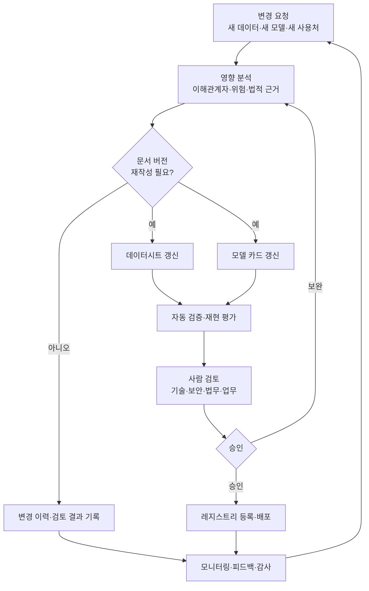

# AI 모델 카드(Model Card)와 데이터셋 데이터시트(Datasheet) 기반 AI 투명성

## 1. 개요

> **정의**: AI 모델 카드는 학습·배포된 모델의 목적, 성능, 적용 범위, 한계, 위험 및 평가 조건을 기록하는 문서이고, 데이터셋 데이터시트는 데이터셋의 생성·수집·구성·사용 목적·품질·편향·제약을 기록하는 문서이다.

인공지능 시스템의 품질을 정확도 하나로 설명하기 어려운 이유는 모델의 동작이 데이터, 학습 절차, 평가 환경, 운영 맥락의 결합으로 결정되기 때문이다. 동일한 모델도 학습 데이터와 다른 인구집단이나 언어, 조명, 업무 프로세스에서 성능이 달라질 수 있다. 따라서 “몇 퍼센트의 정확도를 얻었다”는 숫자만으로는 사용 가능성이나 위험을 판단할 수 없다.

모델 카드와 데이터시트는 이러한 블랙박스 문제를 문서화와 책임성의 문제로 전환한다. 모델 카드는 모델 소비자가 어떤 상황에서 모델을 사용해야 하고 어떤 상황에서는 사용하지 말아야 하는지 판단하도록 돕는다. 데이터시트는 데이터 생산자와 소비자가 데이터의 출처와 구성, 누락, 라벨링 방식, 사회적 영향을 함께 검토하도록 한다.

이 문서의 핵심은 문서를 형식적으로 만드는 데 있지 않다. 실제 가치가 있으려면 문서의 항목이 데이터 계보, 실험 기록, 모델 레지스트리, 승인 절차, 모니터링 결과와 연결되어야 한다. 수작업으로 작성한 선언문은 배포 시점에 오래되기 쉽지만, 파이프라인에서 자동으로 생성되고 책임자가 검토한 증거 묶음은 운영 통제의 일부가 된다.

Google Research의 모델 카드 제안은 모델의 의도된 용도와 다양한 조건·하위집단에서의 성능을 함께 공개하자는 방향을 제시했다. 데이터셋 데이터시트 연구는 데이터셋이 어떻게 만들어졌고 어떤 특성과 잠재적 왜곡을 가지는지 설명하는 표준화된 질문의 필요성을 제기했다. 두 문서는 서로 대체 관계가 아니라 데이터와 모델의 양쪽 경계를 설명하는 보완 관계다.

기술사는 모델 카드와 데이터시트를 AI 거버넌스의 부속 문서로만 보지 말고, 요구사항 분석부터 폐기까지 이어지는 AI 시스템 생명주기의 통제점으로 설계해야 한다. 문서의 작성 주체, 승인 기준, 변경 시 재검토 조건, 외부 공개 범위와 개인정보 보호 수준까지 운영 모델에 포함해야 한다.

## 2. 투명성 문서의 전체 구조

AI 투명성은 데이터 출처만 공개하는 활동도, 모델 구조만 공개하는 활동도 아니다. 영향받는 이해관계자가 위험을 이해하고 이의를 제기하며 적절한 사용 여부를 판단할 수 있도록 필요한 정보를 목적에 맞게 제공하는 활동이다. 연구자, 개발자, 조달 담당자, 현업 사용자, 감사자, 규제기관, 영향을 받는 시민은 서로 다른 수준의 정보를 필요로 한다.

모델 카드와 데이터시트는 이 이해관계자에게 같은 원문을 전달하는 대신, 공통 사실을 중심으로 역할별 표현과 공개 범위를 설계한다. 내부에는 상세한 데이터셋 버전, 실험 로그, 보안 취약점, 개인정보 처리 근거를 보관하고 외부에는 안전한 요약과 사용 조건을 제공할 수 있다. 그러나 공개용 문서가 내부 문서와 모순되어서는 안 되며, 비공개 사유와 검토 책임도 남겨야 한다.

위 흐름에서 데이터시트는 모델 학습 전에만 한 번 작성하는 문서가 아니다. 데이터셋이 추가되거나 라벨 정책이 바뀌거나 수집 지역이 확대되면 새 버전을 만들어야 한다. 마찬가지로 모델 카드는 모델 파라미터가 바뀔 때뿐 아니라 추론 프롬프트, 전처리, 임계값, 보호장치, 사용 대상이 바뀔 때도 영향 분석 후 갱신해야 한다.

문서와 시스템을 연결하려면 각 문서에 고유 식별자와 버전을 부여한다. `dataset_id`, `dataset_version`, `model_id`, `model_version`, 평가 실행 ID, 승인 티켓을 서로 참조하게 하면 어떤 모델이 어떤 데이터와 실험 결과에 근거했는지 재현할 수 있다. 파일 이름만으로 버전을 관리하면 동일한 이름의 파일이 덮어써져 감사 증거가 약해진다.

투명성은 공개의 양이 아니라 의사결정에 필요한 정보의 적합성으로 평가한다. 영업비밀을 모두 공개하지 않아도 모델의 사용 금지 영역, 알려진 오류, 감독 방법, 이의제기 경로를 명확히 제시할 수 있다. 반대로 수십 페이지의 표를 공개하면서 실제 사용자에게 위험한 사례를 설명하지 못하면 형식적 투명성에 그친다.

## 3. 모델 카드의 구성과 작성 원리

### 가. 모델 식별과 의도된 용도

모델 카드의 시작점은 모델 이름, 버전, 소유 조직, 담당자, 출시일, 기반 모델 및 라이선스다. 모델의 파라미터만 식별해서는 충분하지 않으며 토크나이저, 전처리, 후처리, 프롬프트 템플릿, 검색 인덱스, 안전 필터처럼 결과에 영향을 주는 구성도 범위에 포함해야 한다. 운영 모델은 학습 산출물 하나가 아니라 주변 구성까지 포함한 배포 단위이기 때문이다.

의도된 용도는 “분류 모델”처럼 추상적으로 쓰지 않는다. 입력 대상, 이용자, 출력의 의사결정상 위치, 허용되는 자동화 수준, 사람이 검토해야 하는 조건을 구체적으로 기술한다. 예를 들어 고객 문의를 우선순위별로 분류하는 보조 모델과 대출 승인 여부를 자동 결정하는 모델은 같은 분류 문제라도 허용 가능한 오류와 통제 수준이 다르다.

금지 또는 비권장 용도도 동일한 중요도로 기록한다. 학습 데이터가 특정 언어와 지역에 치우쳤다면 다른 언어의 법률 문서 자동 판정에 사용하지 않아야 한다. 사람의 안전, 고용, 신용, 복지와 관련된 고위험 영역에서는 모델 출력이 최종 결정을 대체하지 않는다는 원칙과 예외 승인 절차를 명시해야 한다.

### 나. 성능과 평가 조건

성능 표에는 지표 이름, 평가 데이터 버전, 샘플링 방법, 기준선, 신뢰구간 또는 변동성, 평가 기간을 함께 기록한다. 정확도, 정밀도, 재현율, F1, AUROC가 무엇을 의미하는지 업무 맥락으로 설명하지 않으면 숫자 비교가 오해를 만든다. 불균형 데이터에서 정확도만 제시하면 소수 클래스 오류를 감추는 결과가 될 수 있다.

전체 평균과 하위집단 성능을 분리한다. 성별, 연령, 지역, 언어, 장애, 기기, 채널처럼 결과 차이가 우려되는 축을 사전에 정하고, 개인을 재식별하지 않는 집계 수준으로 평가한다. 하위집단을 추가로 공개할 때는 표본 수가 너무 작아 개인이 추정되지 않는지 확인하고, 통계적 불확실성을 함께 표시한다.

오프라인 벤치마크의 점수와 실제 운영 성능은 다를 수 있다. 실제 사용자의 입력은 학습·평가 데이터와 분포가 다르고, 사용자가 모델 오류를 보고하는 방식도 결과에 영향을 준다. 그러므로 모델 카드에는 오프라인 성능과 운영 모니터링 지표를 구분하고, 배포 후 재평가 주기와 중단 기준을 둔다.

### 다. 한계, 위험, 안전장치

한계는 “완벽하지 않을 수 있음”이라는 포괄적 문장 대신 실패 조건과 영향으로 쓴다. 이미지 모델의 어두운 환경 오류, 음성 모델의 방언 인식 저하, 생성 모델의 근거 없는 응답, 분류 모델의 신규 유형 미탐지처럼 관찰 가능한 상황을 제시한다. 가능하면 대표 오류 사례와 재현 조건을 내부 증거에 연결한다.

위험은 모델 자체의 오류뿐 아니라 모델이 업무 프로세스에 삽입되는 방식에서 발생한다. 현업 사용자가 확률 점수를 확정 판단으로 오해하거나, 조직이 모델의 추천을 검토 없이 대량 자동화하거나, 공격자가 입력을 조작하여 안전장치를 우회하는 경우가 있다. 모델 카드는 운영 절차, 권한 분리, 사람 검토, 로깅, 이의제기와 함께 읽혀야 한다.

안전장치는 모델 카드의 선언이 아니라 검증 가능한 통제여야 한다. 입력 검증, 민감정보 마스킹, 프롬프트·출력 필터, 불확실성 임계값, 거부 응답, 사람 승인, 감사 로그, 롤백 모델을 각각 누가 운영하는지 정한다. 통제 실패가 발생하면 배포 중지와 사고 대응으로 전환하는 조건도 명시한다.

| 영역 | 모델 카드에 기록할 핵심 질문 | 운영 증거 |
|---|---|---|
| 목적 | 누구의 어떤 업무를 어느 수준까지 지원하는가? | 요구사항·승인 범위·사용자 안내 |
| 데이터 | 어떤 데이터와 전처리로 학습·검증했는가? | 데이터시트·계보·품질 리포트 |
| 성능 | 어떤 조건에서 어느 정도의 오류가 발생하는가? | 재현 가능한 평가 실행·하위집단 지표 |
| 안전 | 어떤 오용과 공격을 고려했는가? | 레드팀·보안 시험·통제 로그 |
| 운영 | 언제 재평가·중단·롤백하는가? | 모니터링 대시보드·사고 티켓 |

표의 항목은 문서 목차이면서 승인 체크포인트다. 성능 값만 채워졌다고 모델 카드를 완성한 것으로 보지 말고, 실제 운영에서 검증 가능한 증거의 위치를 연결해야 한다. 특히 위험과 운영 항목이 비어 있는 모델은 연구용으로는 남길 수 있어도 업무 서비스에 자동 승인해서는 안 된다.

## 4. 데이터셋 데이터시트의 구성과 작성 원리

### 가. 동기·구성·수집 과정

데이터시트는 데이터셋의 이름과 크기보다 왜 만들어졌는지를 먼저 설명한다. 원래 목적이 연구인지 상용 서비스인지, 어떤 사용자를 위한 것인지, 어떤 사용은 고려하지 않았는지 기록한다. 목적이 변경되면 동일 데이터셋의 단순 재사용으로 보지 말고 목적 적합성과 권리·위험을 다시 검토한다.

구성 항목에는 레코드 수, 파일 형식, 변수와 라벨의 정의, 결측치, 중복, 시간 범위, 지역 범위, 언어와 도메인을 포함한다. 단순 통계뿐 아니라 데이터가 대표하지 않는 집단과 관측되지 않은 상황도 서술한다. 데이터의 부재는 모델의 한계로 이어지므로 “알 수 없음”도 중요한 메타데이터다.

수집 과정은 원천, 수집 시점, 수집 도구, 동의 또는 이용 근거, 필터링 규칙, 라벨러와 품질관리 방법을 추적한다. 공개 데이터셋을 다시 가공했다면 원본 버전과 변환 코드, 제거·추가된 항목, 라이선스 조건을 남긴다. 공급업체가 데이터를 제공하는 경우 계약상 재사용·감사·삭제 가능성도 데이터시트의 범위다.

### 나. 라벨·품질·편향

라벨은 객관적인 진실값이 아니라 정의와 판단 과정을 가진 관측값일 수 있다. 라벨 가이드, 라벨러 자격, 다중 라벨러의 불일치 처리, 애매한 사례의 처리, 품질 표본검사 결과를 기록한다. 자동 생성 라벨이나 약한 감독을 사용했다면 오류 전파 가능성과 정제 방법도 공개한다.

품질은 완전성, 정확성, 일관성, 적시성, 유일성, 대표성의 관점으로 나누어 본다. 결측률이 낮아도 특정 집단에만 결측이 집중되면 공정성 문제가 남는다. 중복 제거율이 높아도 시간 순서와 원천별 중복을 잘못 제거하면 중요한 사건을 없앨 수 있다.

편향 분석은 데이터셋에 “편향 없음”이라고 선언하는 일이 아니다. 어떤 기준으로 대표성을 평가했는지, 어떤 집단과 상황을 포함하지 못했는지, 그 한계를 모델 사용 조건으로 어떻게 반영할지 기록하는 과정이다. 공개 문서에서는 민감한 속성을 조심스럽게 다루되, 위험을 숨기는 근거로 개인정보 보호를 사용하지 않도록 집계·비식별화와 설명의 균형을 잡는다.

### 다. 권리·보안·보존

데이터시트에는 저작권, 개인정보, 영업비밀, 초상·음성·위치정보, 계약상 사용 제한을 포함한다. 법적 사용 가능성이 기술적 접근 가능성을 의미하지는 않는다. 다운로드할 수 있다는 이유만으로 학습·재배포가 허용되는 것은 아니므로 법무와 데이터 보호 책임자가 확인한 근거를 남긴다.

보안 측면에서는 악성 파일, 프롬프트 주입 데이터, 데이터 중독, 공급자 계정 탈취, 학습 데이터 유출을 고려한다. 해시와 서명으로 버전을 검증하고, 원본과 정제본의 접근권한을 분리하며, 민감정보가 포함된 데이터는 최소 권한과 보존기간을 적용한다. 데이터셋 공개본과 내부 원본이 있다면 둘의 관계와 차이를 설명한다.

보존과 삭제는 모델 학습 이후까지 이어진다. 원본 데이터 삭제 요청이 들어왔을 때 모델 재학습이 필요한지, 파생 특성과 캐시를 어떻게 처리할지, 백업에서 언제 사라지는지 결정해야 한다. 데이터시트에 이러한 절차를 기록하면 데이터 주체의 권리와 모델 운영자의 재현성 사이의 충돌을 조정할 수 있다.

## 5. 작성·검증·배포 프로세스

문서 작성은 프로젝트 말미의 보고서 작업으로 미루지 않는다. 요구사항 단계에서 의도된 용도와 금지 용도를 정하고, 데이터 준비 단계에서 데이터시트를 초안으로 만든다. 학습 단계에서는 실험 ID와 모델 버전을 기록하고, 평가 단계에서 성능·공정성·강건성·보안을 함께 검증한다.

자동 검증은 링크가 존재하는지 확인하는 수준을 넘어야 한다. 문서의 모델 버전이 레지스트리의 버전과 같은지, 평가 데이터 버전이 실행 기록과 같은지, 사용 금지 영역이 서비스 설정에 반영됐는지 검사한다. 데이터시트에 기록된 라벨 스키마와 실제 학습 파이프라인의 스키마가 다르면 승인 전에 실패하도록 한다.

사람 검토는 문서의 표현을 다듬는 절차가 아니라 책임을 분담하는 절차다. 데이터 담당자는 출처와 품질을, 모델 개발자는 성능과 한계를, 보안 담당자는 공격과 통제를, 법무·개인정보 담당자는 권리와 공개를, 업무 책임자는 실제 영향과 이의제기를 검토한다. 각 검토자는 승인 범위와 조건을 남겨야 한다.

배포 후에는 문서에 기록된 가정이 여전히 맞는지 확인한다. 데이터 분포, 오류율, 하위집단 격차, 거부율, 사람의 override 비율, 사용자 신고, 보안 이벤트를 모니터링한다. 임계치를 넘으면 재평가·경고·부분 중지·전면 롤백 중 어떤 대응을 할지 사전에 정한다.

## 6. 모델 카드와 데이터시트 비교 및 연계

모델 카드는 모델의 행동과 사용 조건을 설명하고 데이터시트는 데이터의 출처와 구성, 생성 맥락을 설명한다. 전자는 모델 소비자에게 가까운 문서이고 후자는 데이터 생산·관리자와 모델 개발자에게 가까운 문서지만, 실제 위험을 설명하려면 양쪽 문서를 함께 읽어야 한다.

예를 들어 모델 카드에서 특정 언어의 성능이 낮다고 기록했는데 데이터시트에 그 언어의 학습 표본이 부족하다는 사실이 있으면 원인과 완화 방향을 연결할 수 있다. 반대로 모델 카드의 성능이 높아도 데이터시트에 동의 범위가 불분명하거나 라벨의 사회적 편향이 기록되어 있다면 상용 배포의 승인 근거로 충분하지 않다.

| 구분 | 모델 카드 | 데이터셋 데이터시트 | 연계 질문 |
|---|---|---|---|
| 주 대상 | 학습·배포 모델 | 학습·평가 데이터셋 | 이 모델은 어떤 데이터에 근거하는가? |
| 핵심 초점 | 성능·한계·사용·위험 | 출처·구성·라벨·권리 | 데이터 특성이 모델 오류와 연결되는가? |
| 주요 버전 | 모델·파이프라인 버전 | 데이터·스키마·라벨 버전 | 두 버전 조합을 재현할 수 있는가? |
| 책임 주체 | 모델·서비스 소유자 | 데이터 소유·수집·관리자 | 변경 승인자는 누구인가? |
| 갱신 조건 | 모델·설정·용도 변경 | 데이터·목적·권리 변경 | 변경 영향이 재평가되었는가? |

두 문서를 합치면 간결해 보일 수 있지만, 데이터 원천의 세부 정보와 모델 배포의 세부 통제가 서로 다른 독자를 가진다는 점을 잃기 쉽다. 단일 포털에서 연결하되 문서는 분리하고, 공통 ID와 링크로 관계를 표현하는 방식이 실무적으로 유리하다. 민감한 원천 정보는 권한에 따라 다른 뷰를 제공하되, 비공개 결정과 공개 요약을 감사 가능하게 만든다.

## 7. 적용 사례: 금융 상담 보조 모델

금융기관이 고객 상담 내용을 요약하고 관련 상품 설명을 추천하는 생성형 모델을 도입한다고 가정한다. 이 모델은 대출 승인 자체를 결정하지 않고 상담원의 업무를 보조하지만, 잘못된 금리·자격 조건·고객 개인정보가 출력되면 고객 피해와 규제 리스크가 발생한다. 모델 카드의 의도된 용도에는 상담 요약과 내부 검색 보조만 허용하고, 고객에게 직접 확정 금융 조언을 제공하는 용도는 제외한다.

데이터시트에는 상담 기록의 기간, 채널, 언어, 익명화 방법, 라벨러의 요약 기준, 상품 문서의 유효기간을 기록한다. 오래된 상품 약관을 학습 데이터에 포함하면 모델이 과거 조건을 현재 조건처럼 말할 수 있으므로, 데이터 버전과 문서 유효기간을 검색 단계에서 검증해야 한다. 개인정보 마스킹이 주민등록번호에만 적용되고 계좌번호·주소·희귀 사건 서술을 놓치면 재식별 위험이 남는다.

모델 카드의 평가에는 요약 사실성, 누락률, 민감정보 노출률, 상품 조건 검색 정확도, 거부 응답 적절성, 상담원 수정률을 포함한다. 전체 평균뿐 아니라 고령 고객, 비정형 발화, 사투리, 상담 채널별 결과도 별도로 분석한다. 상담원이 모델 출력을 그대로 복사하는 비율이 높아지면 사람 검토가 형식화된 것이므로 교육과 화면 설계를 함께 바꿔야 한다.

운영에서는 최신 상품 문서를 근거로 답하도록 검색증강 구조를 사용하고, 근거 문서의 버전과 인용 위치를 화면에 표시한다. 모델이 근거를 찾지 못하면 추정 답변을 하지 않고 상담원에게 확인을 요청한다. 금리나 자격처럼 변경 가능성이 큰 항목은 모델의 자유 생성보다 규칙·조회 API의 결과를 우선하도록 업무 경계를 정한다.

이 사례에서 문서의 성공 여부는 카드와 데이터시트의 문장 수가 아니라 사고 대응력으로 평가한다. 잘못된 추천이 신고되면 어떤 데이터·모델·프롬프트·상품 문서가 사용되었는지 재현하고, 영향 고객을 추정하며, 해당 버전을 중지할 수 있어야 한다. 문서 ID가 로그와 연결되어 있지 않다면 원인 분석과 책임 있는 통지가 늦어진다.

## 8. 품질지표와 통제 설계

문서 품질은 완성도, 정확성, 최신성, 추적성, 이해가능성의 다섯 축으로 평가할 수 있다. 완성도는 필수 항목이 채워졌는지, 정확성은 문서의 값이 실제 시스템과 일치하는지, 최신성은 변경 후 정해진 기한 내 갱신되는지, 추적성은 근거와 실행 기록으로 이동할 수 있는지, 이해가능성은 비전문가도 위험을 판단할 수 있는지를 뜻한다.

조직은 다음 지표를 대시보드로 운영할 수 있다. 첫째, 승인 모델 중 최신 카드가 연결된 비율이다. 둘째, 운영 모델의 데이터시트·평가 실행 연결률이다. 셋째, 변경 후 재평가가 기한 내 완료된 비율이다. 넷째, 문서의 선언과 실제 모니터링 지표 사이의 불일치 건수다. 다섯째, 모델 관련 사고에서 원인 모델과 데이터셋을 재현하는 데 걸린 시간이다.

지표를 높이기 위해 문서를 자동 생성하면 형식적 완성도는 올라가지만 의미 있는 설명이 보장되지는 않는다. 자동 생성 항목과 사람이 판단해야 하는 항목을 구분한다. 학습 데이터 해시, 평가 수치, 실행 시각은 자동 추출하되, 의도된 용도, 금지 용도, 사회적 영향과 잔여 위험은 담당자가 서술하고 승인해야 한다.

접근권한도 차등화한다. 공개 문서는 사용자에게 필요한 안전정보를, 내부 문서는 운영·보안·계약 세부를, 제한 문서는 개인정보와 취약점 증거를 포함할 수 있다. 그러나 접근 제한이 문서의 존재 자체를 숨기는 방식이 되어서는 안 되며, 누가 언제 어떤 사유로 제한했는지 메타데이터를 보존한다.

## 9. 심화: AI 거버넌스와 기술사 답안 연계

NIST AI RMF는 신뢰할 수 있는 AI의 특성으로 유효성·신뢰성, 안전성, 보안·회복탄력성, 책임성·투명성, 설명가능성·해석가능성, 개인정보 강화, 공정성과 유해한 편향 관리를 제시한다. 모델 카드와 데이터시트는 이 특성을 구현하는 단일 해법은 아니지만, 각 위험의 가정·증거·책임자를 연결하는 실무 수단이 될 수 있다.

OECD AI 원칙의 투명성과 책임 있는 공개 방향도 모든 내부 정보를 공개하라는 뜻으로 해석하기보다 상황에 맞는 의미 있는 정보를 제공하라는 방향으로 이해해야 한다. 고위험 시스템에서는 영향을 받는 사람이 결과의 이유와 이의제기 경로를 알아야 하고, 조직은 변경과 사고를 추적할 수 있어야 한다. 따라서 공개 문서, 내부 감사 문서, 규제기관 제출 문서의 목적과 범위를 설계한다.

기술사 시험 답안에서는 모델 카드와 데이터시트를 “AI 윤리 문서”로만 쓰면 깊이가 부족하다. 문제를 데이터 거버넌스, MLOps, 품질관리, 개인정보 보호, 보안, IT 서비스 운영의 연계 문제로 확장한다. 데이터 계보와 모델 레지스트리, CI/CD 게이트, 편향·강건성 평가, 모니터링과 사고 대응을 하나의 생명주기 아키텍처로 제시하면 기술적 실행 가능성과 관리적 책임을 함께 설명할 수 있다.

예상 논점은 생성형 AI와 파운데이션 모델의 사용 조건, 외부 모델·데이터 공급망, 자동화된 문서 생성의 신뢰성, 모델 업데이트에 따른 재승인, 개인정보 삭제 요청과 재학습, 설명가능성과 영업비밀의 균형이다. 각각에 대해 “무엇을 공개할 것인가”보다 “어떤 위험 판단을 가능하게 하고 어떤 증거로 검증할 것인가”를 중심으로 답안을 구성한다.

## 10. 고려사항 및 시사점

### 가. 목적과 영향 중심의 문서화

문서 템플릿을 먼저 배포하기보다 AI가 영향을 미치는 의사결정과 이해관계자를 먼저 식별한다. 동일한 모델이라도 내부 검색 보조와 복지 수급자 판정에 적용되는 통제 수준은 달라야 한다. 사용 목적, 금지 목적, 사람의 개입 지점을 승인 기준에 포함해야 한다.

### 나. 자동화와 사람 검토의 균형

지표와 버전 같은 반복 항목은 파이프라인에서 자동 생성하여 누락과 오탈자를 줄인다. 반면 편향의 사회적 영향, 잔여 위험, 금지 용도는 자동 문장 생성만으로 승인하지 않는다. 문서 자동화가 책임 회피 수단이 되지 않도록 작성자와 승인자를 분리한다.

### 다. 데이터·모델·서비스의 추적성

모델 카드와 데이터시트를 모델 레지스트리, 데이터 카탈로그, 실험 추적, 배포 파이프라인, 로그와 연결한다. 문제가 발생했을 때 모델 버전만 찾는 것이 아니라 입력 스키마, 프롬프트, 검색 문서, 정책 버전까지 재현할 수 있어야 한다. 변경 영향 분석을 위한 공통 식별자와 계보가 핵심이다.

### 라. 개인정보와 공개의 조화

투명성을 높이기 위해 원본 데이터를 공개하면 개인정보와 보안 위험이 커질 수 있다. 원본 대신 집계·비식별·샘플·통계적 요약을 제공하고, 재식별 가능성과 소표본 문제를 검토한다. 공개하지 않는 정보에는 사유, 보호기간, 검토 책임을 남겨 투명성의 공백을 관리한다.

### 마. 공급망과 외부 모델 통제

외부 데이터셋과 사전학습 모델을 도입할 때 공급자의 설명만 신뢰하지 말고 계약, 버전, 라이선스, 평가 재현성, 취약점 통지를 확인한다. 외부 모델의 카드가 없거나 내용이 불충분하면 자체 평가와 사용 제한을 통해 위험을 보완한다. 공급망 변경이 발생하면 내부 모델 카드와 서비스 영향평가도 갱신한다.

### 바. 지속적 재평가와 책임성

모델 카드는 출시 승인을 위한 문서인 동시에 운영 중단과 재학습을 결정하는 기준이다. 분포 변화, 성능 저하, 하위집단 격차, 보안사고, 법령·정책 변경을 재평가 트리거로 등록한다. 조직은 문서를 보관하는 데서 끝나지 않고, 문서의 경고가 실제 배포·사용·사고 대응에 반영되는지 감사해야 한다.

## 참고자료

1. Google Research, “Model Cards for Model Reporting”, https://research.google/pubs/model-cards-for-model-reporting/
2. Timnit Gebru et al., “Datasheets for Datasets”, Stanford AI Lab PDF, https://ai.stanford.edu/~tgebru/papers/datasheets.pdf
3. NIST, “Artificial Intelligence Risk Management Framework (AI RMF 1.0)”, https://nvlpubs.nist.gov/nistpubs/ai/NIST.AI.100-1.pdf
4. NIST AI Resource Center, “AI Risks and Trustworthiness”, https://airc.nist.gov/airmf-resources/airmf/3-sec-characteristics/
5. OECD, “AI Principles”, https://www.oecd.org/en/topics/ai-principles.html

---

> **한 줄 요약**: 모델 카드는 모델의 사용·성능·위험을, 데이터시트는 데이터의 출처·품질·권리를 설명하며, 두 문서를 생명주기·계보·모니터링과 연결할 때 AI 투명성이 실제 책임성과 통제로 전환된다.
