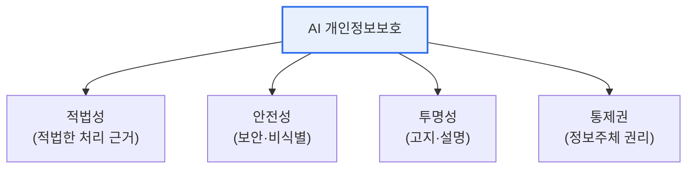
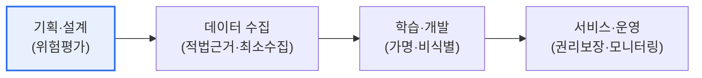

# AI 개인정보보호 자율점검표

## 1. 개요

### 가. 개념
> **AI 개인정보보호 자율점검표**는 개인정보보호위원회가 마련한 지침으로, **AI 서비스의 기획·개발·운영 전 과정에서 개인정보를 적법·안전하게 처리하도록 사업자가 스스로 점검**할 수 있게 한 자율규범이다.

이 점검표가 필요한 근본 이유는 '**AI는 대량의 개인정보를 학습·활용하는데, 기존 규율만으로는 새로운 위험을 담기 어렵다**'는 데 있다. AI는 방대한 데이터를 학습해 성능을 낸다. 그 데이터에는 개인정보가 대량 포함되기 쉽고, 학습·추론 과정에서 정보주체가 예상치 못한 방식으로 정보가 처리되거나(목적 외 이용), 학습 데이터에서 개인이 재식별되거나, 편향된 결과로 차별이 생길 수 있다. 이런 AI 특유의 프라이버시 위험은 사후 규제만으로는 막기 어렵다. 그래서 강제 규제로 AI 혁신을 위축시키기보다, 사업자가 개발 단계부터 스스로 개인정보 위험을 점검·관리하도록 유도하는 것이 자율점검표의 취지다. AI 생애주기(기획→데이터 수집→학습→서비스)의 각 단계에서 개인정보보호 원칙(적법성·투명성·안전성 등)을 지키고 있는지 스스로 확인하게 함으로써, 혁신과 보호를 조화시키려는 접근이다. 이는 개인정보 보호 원칙을 설계에 내재화하는 'Privacy by Design'의 실천이기도 하다. [[privacy-by-design]]

### 나. 목적
AI 개발·운영 과정의 개인정보 침해 위험을 사업자가 선제적으로 진단·예방하여, AI 혁신과 개인정보 보호를 조화시키는 것이 목적이다.

## 2. 기본 원칙

자율점검표는 개인정보보호 원칙을 AI 맥락에 맞춰 제시한다.

| 원칙 | 내용 |
|---|---|
| **적법성** | 개인정보 수집·이용의 적법한 근거 확보 |
| **안전성** | 가명·익명처리, 접근통제 등 안전조치 |
| **투명성** | 처리 사실·목적의 고지, 자동화 결정 설명 |
| **정보주체 권리** | 열람·정정·삭제 등 권리 보장 |
| **책임성** | 처리 전 과정의 관리·책임 체계 |

## 3. 총괄 흐름도 (AI 생애주기 단계별 점검)

자율점검표는 AI 서비스의 생애주기에 따라 단계별로 점검 항목을 제시한다. 각 단계에서 개인정보 처리의 적법성·안전성을 스스로 확인한다.

| 단계 | 주요 점검 |
|---|---|
| **기획·설계** | 개인정보 영향평가, Privacy by Design 반영 |
| **데이터 수집** | 적법 근거, 최소 수집, 동의·목적 명확화 |
| **학습·개발** | 가명·비식별 처리, 재식별 방지 |
| **서비스·운영** | 정보주체 권리 보장, 지속 모니터링·사고 대응 |

## 4. 고려사항 및 시사점

1. **혁신과 보호의 균형**이 핵심이다. 자율규범은 강제 규제의 경직성을 피하면서 사업자의 자발적 책임을 유도하는 접근으로, AI 발전을 저해하지 않으면서 개인정보를 보호하려는 균형점이다.
2. **설계 단계 내재화(Privacy by Design)** 가 중요하다. 사후 점검이 아니라 기획·설계부터 개인정보 위험을 고려해야 실효성이 있으며, 자율점검표는 이를 각 단계 점검으로 유도한다.
3. **생성형 AI로 확대**된다. 대규모 언어모델·생성형 AI가 학습 데이터의 개인정보 노출·재현 위험을 키우면서, 자율점검·거버넌스의 중요성이 더욱 커지고 있다. [[genai-security]]

---

> **한 줄 요약**: AI 개인정보보호 자율점검표는 *AI 생애주기 전 과정에서 개인정보를 적법·안전하게 처리하도록 사업자가 스스로 점검* 하는 자율규범으로, 적법성·안전성·투명성·권리보장 원칙을 단계별로 점검해 혁신과 보호를 조화시킨다.
