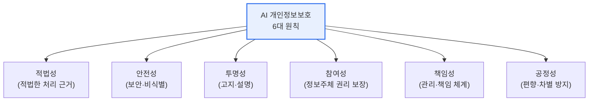
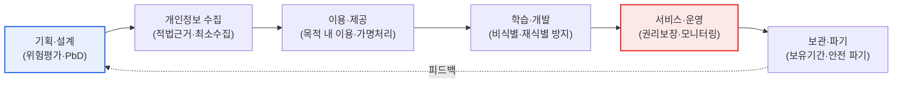

# AI 개인정보보호 자율점검표

## 1. 개요

### 가. 개념

> **AI 개인정보보호 자율점검표**는 개인정보보호위원회가 마련한 지침으로, **AI 서비스의 기획·개발·운영 전 과정에서 개인정보를 적법·안전하게 처리하도록 사업자가 스스로 점검**할 수 있게 한 자율규범이다. 개인정보위는 2021년 5월 이를 제정·공개했으며, 개인정보 보호법상 주요 의무와 권장사항을 AI 업무 처리 단계에 맞춰 재배열해 사업자가 자율적으로 이행 여부를 확인하도록 설계했다.

이 점검표가 필요한 근본 이유는 '**AI는 대량의 개인정보를 학습·활용하는데, 기존 규율만으로는 새로운 위험을 담기 어렵다**'는 데 있다. AI는 방대한 데이터를 학습해 성능을 낸다. 그 데이터에는 개인정보가 대량 포함되기 쉽고, 학습·추론 과정에서 정보주체가 예상치 못한 방식으로 정보가 처리되거나(목적 외 이용), 학습 데이터에서 개인이 재식별되거나, 편향된 결과로 차별이 생길 수 있다. 예컨대 2020년 국내 대화형 AI 서비스가 학습 데이터에 포함된 실제 이용자의 대화·개인정보를 충분히 가명·비식별 처리하지 않아 개인정보위 조사와 과징금·과태료 부과로 이어진 사례는, 데이터 수집 단계의 적법성과 학습 단계의 비식별이 부실하면 서비스 출시 직후 대규모 침해로 번진다는 점을 드러냈다. 이런 AI 특유의 프라이버시 위험은 사후 규제만으로는 막기 어렵다.

그래서 강제 규제로 AI 혁신을 위축시키기보다, 사업자가 개발 단계부터 스스로 개인정보 위험을 점검·관리하도록 유도하는 것이 자율점검표의 취지다. 법은 최소한의 강행 규범을 정하지만, AI 기술은 법 개정 속도보다 빠르게 진화한다. 따라서 세부 기술에 대해서는 '무엇을 확인해야 하는가'를 체크리스트 형태로 제공해, 사업자가 자사 서비스 특성에 맞춰 유연하게 이행하도록 한 것이다. AI 생애주기(기획→데이터 수집→학습→서비스→관리)의 각 단계에서 개인정보보호 원칙(적법성·투명성·안전성 등)을 지키고 있는지 스스로 확인하게 함으로써, 혁신과 보호를 조화시키려는 접근이다.

이는 개인정보 보호 원칙을 설계에 내재화하는 'Privacy by Design'의 실천이기도 하다. 즉 개인정보 보호를 사후 대응(문제가 터진 뒤 조치)이 아니라 사전 설계(문제가 안 생기게 아키텍처·프로세스에 심는 것)로 옮기는 사상이며, 자율점검표는 그 실천 도구를 단계별 확인 항목으로 구체화한 것이다. [[privacy-by-design]]

### 나. 등장 배경과 목적

자율점검표가 등장한 배경에는 세 가지 흐름이 겹친다. 첫째, 데이터 3법 개정(2020)으로 가명정보 개념이 도입되면서 AI 학습용 데이터 활용의 법적 근거가 정비됐지만, 실무에서 '어디까지 적법한가'에 대한 사업자의 혼란이 컸다. 둘째, 대화형·추천형 AI가 실서비스에 빠르게 확산되면서 학습 데이터 재식별·목적 외 이용 같은 신종 위험이 현실화했다. 셋째, EU를 비롯한 국제 사회가 AI 규제(뒤의 EU AI Act 등)를 준비하면서 국내에서도 선제적 가이드라인 필요성이 제기됐다. 이런 맥락에서 개인정보위는 강제 규제 이전 단계의 연성규범(soft law)으로 자율점검표를 내놓았다.

목적은 명확하다. **AI 개발·운영 과정의 개인정보 침해 위험을 사업자가 선제적으로 진단·예방하여, AI 혁신과 개인정보 보호를 조화시키는 것**이다. 규제 준수 부담을 최소화하면서도 정보주체 신뢰를 확보해, 결과적으로 AI 서비스의 지속가능성을 높이는 것이 궁극적 지향이다.

## 2. 기본 원칙 (6대 원칙)

```mermaid
flowchart TB
  A["AI 개인정보보호<br/>6대 원칙"] --> L["적법성<br/>(적법한 처리 근거)"]
  A --> S["안전성<br/>(보안·비식별)"]
  A --> T["투명성<br/>(고지·설명)"]
  A --> P["참여성<br/>(정보주체 권리 보장)"]
  A --> R["책임성<br/>(관리·책임 체계)"]
  A --> F["공정성<br/>(편향·차별 방지)"]
  style A fill:#e8f0fe,stroke:#2f6fed,stroke-width:2px
```

자율점검표는 개인정보보호 원칙을 AI 맥락에 맞춰 여섯 가지로 제시한다. 각 원칙은 서로 독립적이지 않고 맞물려 작동한다. 아래 표는 비교·정리를 돕는 보조 수단이며, 각 원칙이 '왜 필요한지'는 이어지는 문단에서 설명한다.

| 원칙 | 내용 | AI 특유의 함의 |
|---|---|---|
| **적법성** | 개인정보 수집·이용의 적법한 근거 확보 | 크롤링·공개데이터 학습의 근거 정당성 |
| **안전성** | 가명·익명처리, 접근통제 등 안전조치 | 학습 데이터 재식별 방지 |
| **투명성** | 처리 사실·목적의 고지, 자동화 결정 설명 | 알고리즘 설명가능성(XAI) |
| **참여성** | 열람·정정·삭제 등 정보주체 권리 보장 | 학습 데이터 삭제 요구권(잊힐 권리) |
| **책임성** | 처리 전 과정의 관리·책임 체계 | AI 거버넌스·DPO 지정 |
| **공정성** | 편향·차별 없는 처리 | 데이터·모델 편향 완화 |

**적법성**은 모든 처리의 출발점이다. AI 학습에서 특히 문제되는 것은 웹 크롤링·공개 데이터의 활용인데, '공개돼 있다'는 사실만으로 무제한 학습이 정당화되지 않는다. 정보주체가 공개한 목적과 합리적으로 예상 가능한 범위를 벗어나면 위법이 될 수 있으므로, 수집 근거(동의·법령·정당한 이익 등)를 학습 데이터 단위로 관리해야 한다.

**안전성**은 AI에서 재식별 방지로 구체화된다. 가명처리를 했더라도 다른 정보와 결합하면 개인이 특정될 수 있고(연결공격), 모델이 학습 데이터를 그대로 외워 출력하는 암기(memorization) 현상으로 원본이 재현될 수 있다. 따라서 비식별 조치는 일회성이 아니라 결합 위험·모델 출력 위험까지 고려한 지속 관리여야 한다.

**투명성·참여성·책임성·공정성**은 정보주체와의 신뢰 축이다. 자동화된 의사결정(예: AI 대출심사 거절)에 대해 그 근거를 설명하고(투명성), 정보주체가 이의를 제기하고 자신의 데이터 삭제를 요구할 수 있게 하며(참여성), 이를 조직 차원에서 책임지고(책임성), 특정 집단에 불리한 편향을 걸러낸다(공정성)는 것이다. 이 네 원칙이 무너지면 기술적으로 안전해도 사회적 수용성을 잃는다.

## 3. AI 생애주기 단계별 점검 흐름

자율점검표는 AI 서비스의 생애주기(업무 처리 단계)에 따라 점검 항목을 배치한다. 개인정보위는 이를 대략 기획·설계 → 개인정보 수집 → 이용·제공 → 보관·파기 → 서비스 관리·감독 → 이용자 보호에 이르는 흐름으로 구성하고, 단계별 점검항목과 세부 확인사항(수십 개 규모)을 제시한다. 각 단계에서 사업자는 개인정보 처리의 적법성·안전성을 스스로 확인한다.

```mermaid
flowchart LR
  P["기획·설계<br/>(위험평가·PbD)"] --> D["개인정보 수집<br/>(적법근거·최소수집)"]
  D --> U["이용·제공<br/>(목적 내 이용·가명처리)"]
  U --> L["학습·개발<br/>(비식별·재식별 방지)"]
  L --> O["서비스·운영<br/>(권리보장·모니터링)"]
  O --> M["보관·파기<br/>(보유기간·안전 파기)"]
  M -.피드백.-> P
  style P fill:#e8f0fe,stroke:#2f6fed,stroke-width:2px
  style O fill:#fde8e8,stroke:#ed2f2f,stroke-width:2px
```

**가. 기획·설계 단계.** 이 단계의 핵심은 '나중에 고치기 어려운 것을 지금 정한다'는 데 있다. 서비스 아키텍처가 확정되고 나면 개인정보 흐름을 바꾸는 비용이 급증하므로, 기획 시점에 개인정보 영향평가(PIA)와 Privacy by Design 관점을 반영해야 한다. 어떤 데이터를 왜 수집하는지, 익명·가명으로 대체 가능한지, 처리 최소화가 가능한지를 설계도에 못박아야 실효성이 있다. 이 단계를 건너뛰면 이후 모든 점검이 사후약방문이 된다.

**나. 개인정보 수집 단계.** 적법 근거 확보, 최소 수집, 수집 목적의 명확화가 요체다. AI는 '많을수록 좋다'는 데이터 탐욕이 있기 때문에, 목적과 무관한 정보까지 쓸어 담기 쉽다. 수집 단계에서 목적 적합성과 최소성을 검증하지 않으면 이후 학습·서비스 전 과정이 위법의 씨앗을 안고 간다. 동의를 근거로 삼는다면 그 동의가 학습 이용까지 포괄하는지, 정당한 이익을 근거로 삼는다면 정보주체 권익과의 비교형량이 이뤄졌는지 확인한다.

**다. 학습·개발 단계.** 가명·비식별 처리와 재식별 방지가 중심이다. 학습 데이터에서 개인 식별자를 제거하되, 앞서 말한 결합공격·모델 암기 위험을 고려한다. 최근에는 차등 프라이버시(differential privacy), 연합학습(federated learning) 같은 프라이버시 강화기술(PET)을 적용해 원본 노출 없이 학습하는 방식도 확인 항목에 포함될 수 있다. 개발자는 '비식별했으니 안전하다'는 가정을 검증(재식별 시도 테스트)해야 한다.

**라. 서비스·운영·파기 단계.** 정보주체 권리(열람·정정·삭제) 보장, 지속 모니터링, 사고 대응, 보유기간 경과 후 안전한 파기가 핵심이다. AI에서 삭제권은 특히 까다로운데, 이미 학습된 모델에서 특정 개인의 영향을 지우는 것(machine unlearning)이 기술적으로 어렵기 때문이다. 따라서 삭제 요구에 어떻게 대응할지를 운영 절차로 미리 정해두어야 한다. 운영 중 새로운 위험이 발견되면 기획 단계로 피드백해 개선하는 순환 구조가 바람직하다.

## 4. 유사 제도·규범과의 비교

자율점검표를 제대로 이해하려면 인접 규범과의 관계를 봐야 한다. 아래 비교는 항목 나열이 아니라 '왜 이렇게 나뉘는지'의 관점에서 정리한다.

| 구분 | AI 자율점검표 | 개인정보 영향평가(PIA) | EU AI Act |
|---|---|---|---|
| **성격** | 자율규범(soft law) | 법정 의무(공공 등) | 강행 규제(hard law) |
| **초점** | AI 생애주기 개인정보 | 특정 시스템 위험 진단 | AI 위험등급별 의무 |
| **강제성** | 권고·자율 | 대상기관 의무 | 위반 시 제재 |
| **적용 시점** | 전 과정 상시 | 구축 전 | 출시·운영 |

자율점검표와 PIA는 '사전 위험 진단'이라는 점에서 닮았지만, PIA가 특정 시스템 구축 전에 한 번 수행하는 정형화된 법정 절차인 반면, 자율점검표는 AI 생애주기 전반에 걸쳐 상시로 스스로 확인하는 연성규범이라는 차이가 있다. 실무적으로는 PIA 결과를 자율점검표의 기획·설계 단계 점검에 입력값으로 연계하면 중복을 줄이고 정합성을 높일 수 있다.

EU AI Act와 비교하면 접근 철학의 차이가 두드러진다. AI Act는 AI를 위험등급(금지·고위험·제한적·최소)으로 분류하고 고위험 AI에 강행 의무를 부과하는 '규제 우선' 방식이다. 반면 국내 자율점검표는 우선 자율규범으로 사업자 책임을 유도하고, 필요 시 법제화로 나아가는 '자율 우선' 방식이다. 이 차이는 혁신 촉진과 권리 보호 사이에서 무게중심을 어디에 두느냐의 정책 선택을 반영한다. 다만 국내에서도 향후 AI 관련 법제(인공지능 기본법 등)가 정비되면 자율규범과 강행규범의 역할 분담이 재편될 것으로 보인다.

## 5. 심화 — 생성형 AI 시대의 확장과 실무 적용

자율점검표 제정 당시(2021)와 견주면, 생성형 AI(LLM)의 대중화는 개인정보 위험의 양상을 크게 바꿔 놓았다. 첫째, **학습 데이터 규모의 폭증**이다. 수천억 토큰 규모의 웹 데이터를 학습하는 대규모 언어모델은 그 안에 포함된 개인정보의 출처·적법성을 개별 확인하기가 사실상 불가능하다. 이는 적법성·최소수집 원칙과 정면으로 긴장한다. 둘째, **암기·재현 위험의 심화**다. LLM이 학습 데이터의 이름·주소·전화번호를 특정 프롬프트에 그대로 뱉어내는 사례가 보고되면서, 비식별의 실효성 검증이 필수가 됐다. 셋째, **프롬프트를 통한 신규 수집**이다. 이용자가 대화창에 입력한 민감정보가 다시 학습에 쓰이는 경로가 생기면서, 수집·이용 단계 점검이 서비스 운영 중에도 계속돼야 한다.

넷째, **글로벌 규제 강화와의 동조**다. EU가 2024년 AI Act를 확정하고 GDPR상 자동화 결정·프로파일링 규율을 강화하면서, 국내 사업자도 해외 서비스를 위해 유사 수준의 사전 점검을 요구받게 됐다. 자율점검표는 이런 국제 규제에 대응하는 국내 기준선(baseline) 역할을 한다.

실무 적용 관점에서 자율점검표는 조직 내 **AI 거버넌스 체계**의 뼈대로 활용된다. 예를 들어 한 공공기관이 민원 상담 챗봇을 도입하면서, 학습 데이터에 포함된 실제 민원인의 이름·연락처를 가명처리하지 않은 채 사용했다가 자율점검표의 '학습·개발 단계' 확인사항(재식별 방지 조치 여부)에 걸려 서비스 출시 전 비식별 파이프라인을 재구축한 사례처럼, 점검표는 출시 이후의 대형 사고를 사전에 걸러내는 게이트로 기능한다. 예컨대 금융·의료처럼 민감정보를 다루는 산업에서는 개인정보 보호책임자(CPO/DPO)가 자율점검표 항목을 사내 개발 표준(secure/privacy SDLC)에 편입해, 모델 학습 착수 전 데이터 적법성 검토(DPIA)와 재식별 테스트를 게이트로 두는 방식이 확산되고 있다. 또한 글로벌 기업들은 자율점검표의 정신을 ISO/IEC 42001(AI 경영시스템)·NIST AI RMF 같은 국제 프레임워크와 매핑해, 국내외 규제를 하나의 통제 체계로 통합 관리하기도 한다. 이처럼 자율점검표는 단순 체크리스트를 넘어, 개인정보 보호를 조직의 개발·운영 프로세스에 심는 거버넌스 앵커로 기능한다. [[genai-security]]

## 6. 고려사항 및 시사점 (기술사 관점)

1. **혁신과 보호의 균형이 핵심이다.** 자율규범은 강제 규제의 경직성을 피하면서 사업자의 자발적 책임을 유도하는 접근으로, AI 발전을 저해하지 않으면서 개인정보를 보호하려는 균형점이다. 다만 자율에만 맡기면 '지키는 자만 손해'라는 역선택이 생길 수 있어, 인증·인센티브(안전한 처리 사업자에 대한 규제 완화)와 결합할 때 실효성이 커진다.

2. **설계 단계 내재화(Privacy by Design)가 관건이다.** 사후 점검이 아니라 기획·설계부터 개인정보 위험을 고려해야 실효성이 있으며, 자율점검표는 이를 각 단계 점검으로 유도한다. 기술사 관점에서는 개인정보 흐름도(data flow)를 아키텍처 설계 산출물로 명시화하고, 프라이버시 요구사항을 비기능 요구사항으로 관리하는 방안이 필요하다.

3. **프라이버시 강화기술(PET)과의 연계가 전망이다.** 차등 프라이버시·연합학습·동형암호·합성데이터 등은 '데이터를 보호하면서도 학습·활용'을 가능케 한다. 자율점검표의 안전성 원칙을 기술적으로 뒷받침하는 수단으로, 향후 표준 점검 항목에 편입될 가능성이 높다. 비용·성능 트레이드오프(예: 차등 프라이버시의 정확도 손실)를 함께 관리해야 한다.

4. **삭제권·잊힐 권리와 machine unlearning의 기술적 난제를 대비해야 한다.** 학습이 끝난 모델에서 특정 개인의 흔적을 제거하는 것은 재학습 비용이 크고 완전성 검증이 어렵다. 정책적으로는 삭제 요구 대응 절차(재학습 주기·근사적 언러닝·출력 필터링)를 사전에 설계해 두는 것이 현실적 타협점이다.

5. **국제 규제와의 정합성 확보가 필요하다.** EU AI Act·GDPR, ISO/IEC 42001, NIST AI RMF 등과 국내 자율점검표를 상호 매핑해 하나의 통제 체계로 운영하면, 글로벌 서비스의 규제 대응 비용을 낮추고 국경 간 데이터 이전 리스크를 줄일 수 있다.

6. **자율규범의 한계와 인증·감사 연계가 과제다.** 자율점검은 사업자의 선의에 의존하므로, 실제 이행 수준을 외부가 검증하기 어렵다는 근본 한계가 있다. 따라서 개인정보 보호 인증(ISMS-P 등)이나 제3자 감사와 연계해 자율점검 결과의 신뢰성을 담보하고, 미이행 시 책임을 물을 수 있는 사후 검증 체계를 함께 갖추는 방향으로 진화할 필요가 있다.

## 참고자료

- 개인정보보호위원회, 「인공지능(AI) 개인정보보호 자율점검표」(2021.5. 제정) — https://www.privacy.go.kr/front/bbs/bbsView.do?bbsNo=BBSMSTR_000000000049&bbscttNo=12468
- 대한민국 정책브리핑, 「개인정보위, 인공지능(AI) 관련 개인정보보호 자율점검표 공개」 보도자료 — https://m.korea.kr/briefing/pressReleaseView.do?newsId=156552450
- 개인정보보호위원회 개인정보보호 종합포털 — https://www.privacy.go.kr

---

> **한 줄 요약**: AI 개인정보보호 자율점검표는 *개인정보위가 2021년 마련한, AI 생애주기 전 과정에서 개인정보를 적법·안전하게 처리하도록 사업자가 스스로 점검하는 자율규범* 으로, 적법성·안전성·투명성·참여성·책임성·공정성의 6대 원칙을 단계별로 점검해 혁신과 보호를 조화시키며, 생성형 AI 시대에 PET·거버넌스와 결합해 중요성이 커지고 있다.
