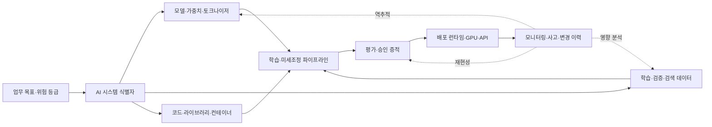
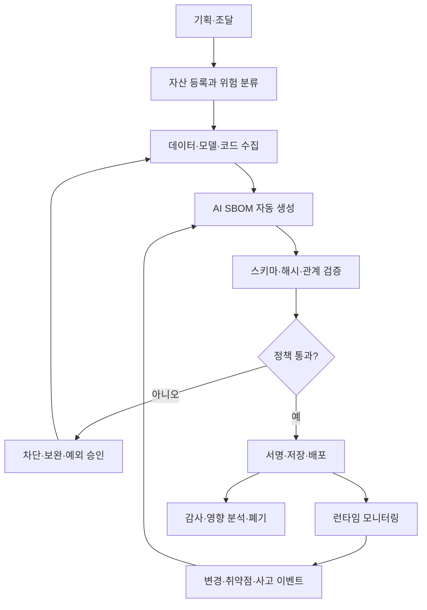

# AI 소프트웨어 BOM(AI SBOM)과 인공지능 공급망 투명성

## 1. 개요

> **정의**: AI 소프트웨어 BOM(AI Software Bill of Materials, AI SBOM 또는 AIBOM)은 인공지능 시스템을 구성하는 모델·데이터셋·소프트웨어·파이프라인·인프라·외부 서비스와 이들 사이의 공급망 관계를 버전, 출처, 라이선스, 무결성 정보와 함께 기계판독형으로 기록하는 구성명세서이다.

전통적인 SBOM은 애플리케이션을 구성하는 패키지, 라이브러리, 컨테이너와 의존관계를 식별하여 소프트웨어 공급망의 가시성을 높인다.
AI 시스템은 여기에 더해 모델 가중치, 학습 데이터, 라벨링 과정, 임베딩 모델, 프롬프트, 검색 인덱스, 평가셋, GPU 런타임과 외부 추론 API까지 결과에 영향을 주는 자산이 존재한다.
따라서 코드 의존성만 나열한 SBOM으로는 모델의 출처가 어디인지, 어떤 데이터로 학습되었는지, 어떤 모델을 계승했는지, 배포 시 어떤 서비스와 연결되는지를 충분히 설명하기 어렵다.

AI SBOM의 목적은 단순한 목록 작성이 아니다.
구성요소의 존재를 확인하고, 구성요소 간 관계를 추적하며, 변경이 성능·보안·법적 책임에 미치는 영향을 빠르게 판단하는 것이 핵심이다.
예를 들어 RAG 서비스에서 임베딩 모델만 교체해도 검색 결과의 분포와 개인정보 노출 가능성이 달라질 수 있다.
AI SBOM이 모델·데이터·인덱스·평가 결과를 연결하고 있다면 변경된 노드에서 영향받는 서비스와 재검증 항목을 역으로 찾아낼 수 있다.

AI 공급망 투명성은 개발 조직만의 과제가 아니다.
조달 담당자는 외부 모델의 라이선스와 사용 제한을 확인해야 하고, 보안 담당자는 악성 모델 파일과 취약한 라이브러리를 점검해야 하며, 개인정보 담당자는 학습·검색 데이터의 처리 근거와 삭제 요청 반영 여부를 확인해야 한다.
운영 조직은 모델 업데이트 후 품질 저하와 드리프트를 추적하고, 감사 조직은 의사결정 당시의 구성과 승인 증적을 재현할 수 있어야 한다.

이 답안에서는 AI SBOM의 구성 원리, 생명주기별 생성·검증 방식, CycloneDX와 SPDX의 활용, 기존 문서와의 차이, 도입 사례 및 기술사 관점의 고려사항을 논술한다.
AI SBOM은 모델 카드나 데이터시트를 대체하는 단일 문서가 아니라, 여러 설명 문서와 자동 생성된 구성관계를 연결하는 식별·추적 계층으로 이해해야 한다.

## 2. AI SBOM의 구성 원리와 관리 대상

### 2.1 전통 SBOM에서 AI SBOM으로 확장되는 이유

소프트웨어 패키지는 버전과 해시를 비교하면 동일성 여부를 비교적 명확하게 확인할 수 있다.
반면 모델은 동일한 이름이라도 가중치 파일, 토크나이저, 양자화 방식, 시스템 프롬프트와 추론 런타임이 달라지면 다른 동작을 보인다.
데이터셋도 원본 데이터의 수집 시점, 필터링 규칙, 중복 제거, 라벨 품질에 따라 실질적인 학습 결과가 바뀐다.
즉 AI 구성요소의 식별자는 단순한 이름이 아니라 버전·출처·변환 이력·관계의 묶음이어야 한다.

또한 AI 시스템의 위험은 구성요소 자체뿐 아니라 결합 방식에서 발생한다.
공개 모델은 안전하더라도 권한이 넓은 도구 호출 에이전트와 결합하면 새로운 공격면이 된다.
정상적인 데이터셋이라도 개인정보가 포함된 임베딩 인덱스와 공개 검색 API가 연결되면 재식별 위험이 커질 수 있다.
AI SBOM은 이러한 결합관계를 표현하여 “무엇이 들어갔는가”에서 “어떻게 연결되어 어떤 책임을 만드는가”로 관리 범위를 넓힌다.

### 2.2 전체 구성 개념도

가장 먼저 업무 목적과 위험 등급을 시스템 식별자에 연결해야 한다.
동일한 기반 모델을 고객상담과 의료 의사결정 보조에 사용한다면 모델은 같아도 사용 맥락, 허용오류, 감독 요건이 다르다.
따라서 AI SBOM의 최상위 단위는 모델 파일만이 아니라 목적과 운영 경계를 가진 AI 시스템 또는 배포 단위로 두는 것이 바람직하다.

모델 영역에는 모델명, 버전, 아키텍처, 가중치 식별자, 기반 모델 계보, 파인튜닝 여부와 토크나이저를 기록한다.
데이터 영역에는 데이터셋 이름과 버전, 출처, 수집·동의 근거, 전처리, 라벨링, 분할, 보존기간과 삭제 처리를 연결한다.
코드 영역은 일반 SBOM과 겹치지만, 학습·추론 프레임워크 및 모델 변환 도구까지 포함해야 한다.

파이프라인 영역은 학습과 배포의 재현성에 직접 연결된다.
학습 코드의 커밋, 하이퍼파라미터, 사용 GPU, 평가셋과 결과를 하나의 실험 또는 모델 릴리스와 연결하면 “같은 모델”이라는 표현을 검증할 수 있다.
RAG라면 문서 수집, 청킹, 임베딩, 벡터 데이터베이스, 검색 랭킹, 프롬프트 템플릿도 관계로 표현해야 한다.
운영 영역은 배포 리전, 엔드포인트, 외부 API, 권한, 모니터링과 사고 티켓을 담아 실제 사용되는 구성과 개발 산출물의 차이를 줄인다.

### 2.3 관리 대상별 핵심 정보

| 관리 대상 | 기록할 핵심 정보 | 관리 목적 |
|---|---|---|
| 모델·가중치 | 이름, 버전, 해시, 기반 모델, 파인튜닝·양자화 이력, 라이선스 | 모델 동일성·계보·사용권 확인 |
| 데이터셋 | 출처, 수집 시점, 처리·라벨링, 동의·라이선스, 분할, 품질지표 | 데이터 권리·품질·편향·삭제 대응 |
| 소프트웨어 | 패키지, 버전, 해시, 취약점, 라이선스, 빌드 관계 | 코드 공급망 취약점과 재현성 관리 |
| 파이프라인 | 학습·평가·검색 단계, 코드 커밋, 파라미터, 도구 버전 | 실험 재현과 변경 영향 분석 |
| 인프라 | GPU·TPU, 런타임, 컨테이너, 리전, 저장소, 네트워크 경계 | 운영 보안·성능·비용·장애 분석 |
| 외부 서비스 | 제공자, API 버전, 계약·SLA, 데이터 처리 위치, 장애 이력 | 제3자·N차 공급망 위험 관리 |
| 거버넌스 | 목적, 위험등급, 승인자, 평가결과, 제한조건, 폐기계획 | 책임성·감사성·규제 대응 |

표의 항목을 채우는 것만으로 투명성이 완성되지는 않는다.
예를 들어 데이터셋의 출처 URL을 기록했더라도 전처리로 어떤 레코드가 제거되었는지, 모델 가중치가 그 데이터셋의 어느 버전을 사용했는지 연결되지 않으면 추적이 끊긴다.
따라서 각 항목은 고유 식별자와 생성 시각을 가지고, `derived-from`, `uses`, `trained-on`, `deployed-as`, `evaluated-by`와 같은 관계를 통해 그래프로 연결되어야 한다.

## 3. 생명주기별 생성·검증 프로세스

### 3.1 생성·소비·피드백 흐름

기획 단계에서는 시스템의 목적, 사용자, 허용되는 자동화 수준과 위험 등급을 정한다.
이 단계에서부터 AI 자산의 소유자와 공급자에게 어떤 AI SBOM 필드를 요구할지 계약서와 조달 기준에 넣어야 한다.
나중에 모델 제공자가 출처와 학습데이터 정보를 공개하지 않으면 운영 단계에서 보완하기 어렵기 때문이다.

개발 단계에서는 수작업 설문보다 저장소, 모델 레지스트리, 데이터 카탈로그, 실험 추적 시스템과 CI/CD에서 사실을 수집한다.
모델 파일은 강한 해시와 모델 레지스트리 버전을 함께 기록하고, 데이터셋은 원본과 파생본의 관계 및 접근권한을 기록한다.
자동 수집이 불가능한 정책·제한사항·인간 감독 요건은 담당자가 서명하는 증적 영역으로 분리하되, 해당 값의 근거 문서를 링크한다.

검증 단계에서는 형식 검증과 내용 검증을 나누어 수행한다.
형식 검증은 스키마, 필수 필드, 식별자 문법과 관계의 참조 무결성을 확인한다.
내용 검증은 모델 해시가 실제 배포 파일과 일치하는지, 라이선스가 사용 목적에 허용되는지, 데이터 접근권한이 승인되었는지, 평가 결과가 현재 버전에 귀속되는지를 확인한다.

배포 단계에서는 AI SBOM을 릴리스 아티팩트로 서명하고 모델·컨테이너·매니페스트와 함께 보관한다.
배포된 모델의 해시 또는 외부 API 버전이 AI SBOM과 맞지 않으면 정책 엔진이 배포를 중지하거나 예외 승인 절차로 보낸다.
운영 단계의 중요한 원칙은 SBOM을 한 번 생성하고 잊지 않는 것이다.
모델 업데이트, 데이터 삭제, 취약점 발표, 외부 API 변경, 프롬프트 변경과 사고가 발생할 때마다 새 버전을 생성하고 이전 버전과 차이를 남긴다.

### 3.2 최소 데이터 모델과 증적의 의미

AI SBOM 레코드는 대체로 `component`, `version`, `supplier`, `license`, `hash`, `relationship`, `source`, `timestamp`, `lifecycle`, `evidence`의 구조로 설계할 수 있다.
`component`는 모델·데이터·코드·서비스의 유형을 구분하고, `relationship`는 구성·파생·학습·배포·평가 관계를 표현한다.
`evidence`에는 모델 카드, 데이터시트, 평가 보고서, 계약서, 승인 티켓의 식별자를 연결한다.
이렇게 하면 AI SBOM이 설명 문서의 대체물이 아니라 설명 문서의 진위와 적용 범위를 확인하는 색인이 된다.

식별자에는 사람이 읽는 이름과 기계가 비교할 수 있는 안정적인 식별자를 함께 둔다.
파일 해시는 동일한 파일 여부에는 유용하지만, 데이터셋의 의미적 변경이나 외부 API의 동작 변경까지 보장하지 않는다.
그러므로 데이터셋은 버전·스냅샷·수집 조건을, API는 제공자·계약 버전·모델 라우팅 정책을 함께 기록해야 한다.
“알 수 없음”을 빈칸으로 두는 것도 위험하다.
확인하지 못한 값은 `unknown`으로 명시하고, 책임자·확인 기한·위험 수용 여부를 같이 기록해야 관리의 사각지대를 드러낼 수 있다.

### 3.3 품질 검증 지표

AI SBOM 품질은 문서의 길이보다 실제 의사결정에 사용할 수 있는 정도로 평가한다.
첫째, 완전성은 알려진 모델·데이터·코드·서비스가 누락 없이 표현되었는지를 의미한다.
둘째, 정확성은 레코드가 실제 산출물의 버전과 해시에 맞는지를 의미한다.
셋째, 최신성은 변경 후 정해진 시간 안에 다시 생성되었는지를 의미한다.
넷째, 추적성은 구성요소에서 배포 서비스와 승인 증적까지 양방향으로 이동할 수 있는지를 의미한다.

예를 들어 조직은 “중요 시스템의 릴리스 중 AI SBOM 생성 성공률 100%”, “모델·데이터 변경의 24시간 이내 반영률 95%”, “중요 구성요소의 소유자 지정률 100%”와 같은 지표를 둘 수 있다.
그러나 생성률만 높이고 필수 관계의 정확성을 확인하지 않으면 빈 껍데기 자동화가 된다.
샘플링된 릴리스에 대해 SBOM의 모델 해시, 데이터 스냅샷, 배포 매니페스트를 실제 시스템과 대조하는 품질 감사가 필요하다.

## 4. 표준과 유사 문서의 비교

### 4.1 CycloneDX와 SPDX의 활용

CycloneDX는 소프트웨어·하드웨어·서비스·의존성·취약점과 머신러닝 모델을 하나의 BOM 모델로 표현할 수 있는 형식이다.
2025년 10월 공개된 CycloneDX 1.7은 2025년 12월 ECMA-424 제2판으로 채택되었으며, 머신러닝 모델과 공급망 투명성을 포함하는 범용 BOM으로 설명된다.
조직이 기존 SBOM 생성 파이프라인을 이미 사용한다면 모델과 데이터 관련 요소를 같은 BOM 생태계에 연결하기 쉽다는 장점이 있다.

SPDX 3.0 계열은 AI Profile과 Dataset Profile을 분리된 프로파일로 제공한다.
AI Profile은 AI 시스템과 모델 산출물, 관련 소프트웨어 구성요소 및 의존성의 교환을 다루고, Dataset Profile은 데이터셋의 이름·버전·출처·라이선스·특성과 같은 정보를 다룬다.
따라서 AI 구성과 데이터 설명을 세분화하여 교환하려는 조직에 적합하지만, 여러 프로파일 간 관계를 설계하고 소비 도구의 지원 범위를 확인해야 한다.

| 비교 기준 | CycloneDX 1.7 | SPDX 3.0 계열 |
|---|---|---|
| 중심 관점 | 다양한 BOM 유형을 하나의 객체 모델로 표현 | 프로파일별로 BOM 교환 범위와 적합성 표현 |
| AI·ML 표현 | 머신러닝 모델, 구성, 계보·출처를 범용 BOM에 통합 | AI Profile과 Dataset Profile로 AI·데이터 영역을 구분 |
| 표준화 맥락 | OWASP 프로젝트 기반, ECMA-424 제2판 채택 | SPDX 국제 표준 계보와 3.0 프로파일 구조 |
| 도입 강점 | CI/CD와 기존 SBOM 도구에 연결하기 쉬움 | AI·데이터·라이선스의 프로파일별 상호운용성 |
| 유의점 | 조직의 AI 거버넌스 필드를 확장 설계해야 함 | 프로파일 조합과 도구 지원 여부를 검증해야 함 |

두 형식 중 하나를 고르는 것이 곧 AI 거버넌스 설계를 끝내는 것은 아니다.
표준은 데이터의 문법과 의미를 맞추지만, 어떤 필드를 필수로 할지, 민감한 학습데이터의 출처를 어느 수준으로 공개할지, 위험 승인을 누가 할지는 조직 정책의 문제다.
실무에서는 내부 파이프라인과 도구가 잘 지원하는 형식으로 생성하고, 공급자 조달이나 감사 교환에서 요구되는 형식으로 변환하는 전략도 가능하다.
변환 과정에서 모델 계보나 데이터 관계가 소실되지 않도록 원본 식별자와 변환 로그를 보존해야 한다.

### 4.2 모델 카드·데이터시트·SBOM과의 차이

모델 카드는 모델의 의도된 용도, 한계, 평가 결과와 윤리적 고려사항을 사람이 읽기 좋게 설명한다.
데이터시트 또는 데이터 카드 는 데이터의 수집·구성·처리·품질·제약을 설명한다.
일반 SBOM은 소프트웨어 구성요소와 의존관계, 취약점과 라이선스를 중심으로 한다.
AI SBOM은 이 문서들을 대체하지 않고, 각각의 산출물과 실제 릴리스 구성요소를 식별자와 관계로 연결한다.

| 문서 | 주된 질문 | 강점 | AI SBOM과의 관계 |
|---|---|---|---|
| 모델 카드 | 이 모델은 어떤 용도와 한계를 가지는가? | 해석·사용 지침과 평가 서술 | 모델 레코드의 설명 증적 |
| 데이터시트·데이터 카드 | 데이터는 어떻게 만들어지고 어떤 제약이 있는가? | 출처·품질·편향·처리 배경 | 데이터셋 레코드의 근거 |
| 일반 SBOM | 소프트웨어 구성과 취약점은 무엇인가? | 패키지·버전·라이선스 자동화 | AI SBOM의 코드 하위집합 |
| AI SBOM | 현재 AI 시스템은 무엇으로 구성되고 어떻게 연결되는가? | 계보·변경·영향 분석·공급망 추적 | 다른 문서와 산출물을 연결하는 기준점 |

문서가 많아질수록 중복 입력을 줄이는 설계가 중요하다.
예를 들어 모델 카드의 모델 버전과 AI SBOM의 모델 버전이 서로 다르면 두 문서 중 어느 것이 최신인지 알 수 없다.
모델 레지스트리의 단일 식별자를 기준으로 설명 문서, 평가 결과, 배포 BOM이 참조하도록 하고, 문서 본문에는 사람을 위한 설명을 유지하는 방식이 적절하다.

## 5. 구현 아키텍처와 통제 방안

### 5.1 참조 아키텍처

AI SBOM 저장소는 데이터 카탈로그, 모델 레지스트리, 코드 저장소, CI/CD, 평가 플랫폼, 배포 플랫폼과 연계한다.
수집기는 각 시스템에서 구성정보를 읽어 표준 객체로 변환하고, 관계 분석기는 학습·파생·배포·평가 관계를 보강한다.
정책 엔진은 라이선스 금지, 출처 미확인, 위험 평가 미완료, 취약한 런타임, 해시 불일치 같은 조건을 릴리스 게이트로 검사한다.
서명된 BOM 저장소는 릴리스별 불변성을 보장하고, 검색 인덱스는 감사·영향 분석을 빠르게 수행하도록 한다.

권한은 생성자, 소비자, 감사자로 분리한다.
개발자는 모델과 코드 구성요소를 생성할 수 있지만 개인정보가 포함된 데이터의 상세 원문을 볼 필요는 없을 수 있다.
감사자는 관계와 승인 증적을 읽을 수 있어야 하지만 가중치나 원본 데이터의 다운로드 권한까지 가질 필요는 없다.
AI SBOM 자체에도 민감한 공급자 정보와 보안 취약점 정보가 들어갈 수 있으므로 공개용, 내부용, 제한용 뷰를 분리한다.

### 5.2 도입 절차

1. 먼저 업무 시스템과 AI 자산의 범위를 정하고, 모델·데이터·코드·서비스·인프라의 소유자를 지정한다.
2. 그 다음 기존 SBOM, 데이터 카탈로그, 모델 레지스트리에서 이미 얻을 수 있는 필드를 조사하여 중복 수집을 줄인다.
3. 위험도가 높은 생성형 AI, 외부 모델 API, 개인정보 처리 시스템을 파일럿 대상으로 선정한다.
4. 표준 형식을 정하고 필수 필드, 허용되는 `unknown`, 증적 보존기간, 변경 이벤트를 정책으로 문서화한다.
5. CI/CD에서 커밋·빌드·모델 등록 시 AI SBOM을 자동 생성하고, 생성 실패를 릴리스 실패로 처리한다.
6. 배포 매니페스트와 서명된 BOM을 함께 보관하며 런타임에서 실제 구성과 대조한다.
7. 취약점·라이선스·데이터 삭제·모델 드리프트 이벤트가 발생하면 영향 분석으로 관련 시스템을 찾아 재평가한다.
8. 분기별로 샘플 릴리스를 선정하여 완전성·정확성·최신성·추적성을 감사하고 정책을 개선한다.

### 5.3 보안과 개인정보 통제

AI SBOM은 투명성을 높이지만 공격자에게 구성정보를 제공할 수도 있다.
모델 파일의 위치, 취약한 라이브러리, 내부 API와 데이터셋 이름을 외부에 그대로 공개하면 공급망 공격의 정찰 정보가 된다.
따라서 외부 공개 BOM은 최소 정보와 요약 식별자만 제공하고, 상세 BOM은 강한 인증과 목적별 권한 아래에 둔다.

학습데이터의 출처를 기록하는 것과 원본 개인정보를 BOM에 복사하는 것은 다르다.
BOM에는 데이터 카탈로그의 식별자, 처리 근거, 보존 정책, 삭제 요청 상태를 참조로 남기고 원문은 별도 보호 저장소에 둔다.
삭제 또는 정정 요청이 들어오면 해당 데이터셋 버전에서 파생된 모델·임베딩·캐시·백업을 찾아 재학습과 재배포의 범위를 결정해야 한다.
이때 AI SBOM의 `trained-on`과 `derived-from` 관계가 개인정보 처리의 영향 분석을 돕는다.

모델 가중치와 BOM에 전자서명을 적용하고, 서명키는 별도의 키 관리 시스템에서 보호한다.
BOM이 변조되지 않았다는 사실만으로 모델이 안전해지는 것은 아니지만, 릴리스 시점의 구성과 사후 변경을 구분할 수 있는 기반이 된다.
외부 모델과 데이터는 신뢰할 수 있는 공급자, 해시 검증, 악성 파일 검사, 라이선스 검사, 평가 결과 확인을 통과한 경우에만 레지스트리에 등록한다.

## 6. 적용 사례

### 6.1 사례 1: 사내 지식 RAG 서비스

한 기업이 사내 규정과 프로젝트 문서를 검색하여 답변하는 RAG 서비스를 운영한다고 가정한다.
초기에는 LLM 이름과 API 키만 관리했지만, 임베딩 모델과 청킹 규칙을 변경한 뒤 검색 정확도와 접근통제가 함께 흔들릴 수 있다.
AI SBOM에는 원문 저장소의 스냅샷, 문서 수집 커밋, 청킹 버전, 임베딩 모델 해시, 벡터 인덱스 버전, 검색 랭킹 설정, 프롬프트 템플릿, 외부 LLM API 버전을 연결한다.

개인정보 삭제 요청이 발생하면 데이터 카탈로그에서 삭제 대상을 찾고, AI SBOM의 관계를 따라 문서 스냅샷·임베딩·인덱스·캐시·평가셋을 조회한다.
모델을 바꾸는 배포에서는 이전 BOM과 새 BOM의 차이를 산출하여 검색 품질, 권한 우회, 환각률 평가를 다시 수행한다.
이 방식은 단순히 “RAG를 사용한다”라고 기록하는 것보다 변경의 원인과 영향을 설명할 수 있게 한다.

### 6.2 사례 2: 외부 기반 모델 조달

금융회사가 외부 제공자의 기반 모델을 구매하여 상담 지원에 사용한다고 가정한다.
계약 전에는 모델의 버전·가중치 또는 API 버전, 학습데이터 출처의 공개 범위, 상업적 사용권, 입력 데이터의 재학습 사용 여부, 장애·업데이트 통지 조건을 요구한다.
공급자가 제공하는 AI SBOM과 모델 카드, 평가 보고서를 내부 레코드와 연결하고, 공개되지 않은 필드는 `unknown`으로 남긴 뒤 위험 수용자와 보완기한을 지정한다.

배포 후 공급자가 모델 라우팅을 변경하면 같은 API 이름이라도 실질적인 구성은 달라진다.
SLA의 변경 통지 이벤트를 받아 새 BOM을 저장하고, 금융 상담이라는 사용 목적에 필요한 정확도·편향·개인정보·설명가능성 평가를 다시 한다.
계약 종료 시에는 모델·프롬프트·검색 데이터·로그·파생 산출물의 반환과 삭제 범위를 BOM 관계로 확인한다.
이 사례에서 AI SBOM은 기술 문서이면서 동시에 조달·감사·책임분계의 기준점으로 기능한다.

## 7. 심화: 2026년 표준·정책 동향과 출제 포인트

최근 AI 공급망 논의는 모델의 성능 경쟁에서 구성과 출처의 검증 경쟁으로 확장되고 있다.
CISA와 국제 파트너의 AI SBOM 최소요소 안내는 전통적인 SBOM만으로 포착하기 어려운 모델·데이터·시스템 수준의 투명성 정보를 보완하려는 방향을 제시한다.
다만 안내 문서의 최소요소는 모든 조직의 위험과 산업 규제를 완전히 대체하는 의무 체크리스트로 해석해서는 안 되며, 조직은 사용 맥락과 위험등급에 맞게 필드를 확장해야 한다.

CycloneDX 1.7 및 ECMA-424 제2판은 소프트웨어와 하드웨어뿐 아니라 서비스, 취약점, 암호화 자산, 머신러닝 모델을 공급망 투명성 관점에서 표현할 수 있는 범용 BOM으로 발전했다.
SPDX 3.0 계열은 AI Profile과 Dataset Profile을 통해 AI 시스템·모델과 데이터셋의 정보를 교환하는 프로파일 구조를 제공한다.
두 형식은 경쟁적으로 하나만 채택해야 하는 관계라기보다, 도구 생태계·조달 요구·데이터 거버넌스 성숙도에 따라 선택하거나 변환할 수 있는 상호운용성 수단이다.

기술사 답안에서는 AI SBOM을 단순한 “AI 구성요소 목록”으로 정의하면 부족하다.
첫째, 기존 SBOM과의 차이를 모델·데이터·파이프라인·외부 서비스의 관계로 설명해야 한다.
둘째, 자동 생성과 서명, 릴리스 게이트, 런타임 대조, 변경 영향 분석의 폐쇄루프를 제시해야 한다.
셋째, 투명성과 기밀성의 트레이드오프, 데이터 최소수집과 삭제 요청, 공급자 미공개 정보의 `unknown` 처리까지 함께 논해야 한다.
마지막으로 표준 형식 자체보다 책임자·품질지표·감사·예외 승인이라는 거버넌스가 성공 조건임을 결론에서 강조해야 한다.

## 8. 고려사항 및 시사점

### 8.1 범위와 식별 단위의 일관성

AI SBOM의 최상위 단위를 모델로 할지 서비스로 할지 조직마다 다를 수 있다.
그러나 프로젝트마다 임의로 정하면 동일 모델을 여러 번 세거나, 하나의 서비스에 숨은 데이터·도구 의존성을 놓치게 된다.
업무 목적·배포 경계·위험등급을 가진 시스템 식별자를 기준으로 하고, 그 아래 모델·데이터·코드·서비스를 계층적으로 연결해야 한다.

### 8.2 자동화와 사람의 판단 분리

코드·컨테이너·모델 해시·파이프라인 버전은 가능한 한 자동으로 생성해야 최신성과 정확성을 높일 수 있다.
반면 사용 목적, 동의 근거, 편향 허용수준, 인간 감독과 위험 수용은 자동 스캔만으로 결정할 수 없다.
자동 생성 영역과 책임자 승인 영역을 구분하고, 수동 입력에도 근거 문서와 만료일을 요구하는 것이 바람직하다.

### 8.3 표준 채택보다 의미 보존

CycloneDX와 SPDX 사이를 변환할 때 이름과 버전만 옮기면 모델 계보, 데이터 처리, 평가 증적의 의미가 사라질 수 있다.
조직은 표준 선택 전에 필요한 관계와 필드를 목록화하고, 변환 테스트로 정보 손실을 측정해야 한다.
변환할 수 없는 값은 임의로 버리지 말고 확장 필드나 외부 참조로 보존한다.

### 8.4 보안성과 공개성의 균형

투명성은 공급망 위험을 발견하게 하지만 상세 BOM 자체가 민감한 운영정보가 될 수 있다.
외부 공급자·감사자·개발자·운영자별 뷰를 만들고, 취약점과 내부 위치는 최소권한으로 제한해야 한다.
BOM의 무결성·가용성·기밀성을 정보보호 관리체계의 자산으로 분류하고 보존·폐기정책을 정한다.

### 8.5 개인정보와 데이터 주권

데이터 출처와 계보를 자세히 남길수록 원본 개인정보를 과도하게 복제할 위험도 커진다.
AI SBOM은 원본을 보관하는 곳이 아니라 데이터 카탈로그와 처리기록을 참조하는 곳으로 설계하고, 삭제·정정 요청을 파생 모델과 임베딩까지 연결한다.
국외 클라우드·외부 API를 사용하는 경우 처리 지역, 재학습 사용 여부, 국외 이전과 위탁 관계를 공급자 레코드에 명시한다.

### 8.6 지속적인 품질·운영 체계

AI SBOM은 릴리스 한 번의 문서 작업이 아니라 변경관리와 운영관측의 일부다.
모델 드리프트, 데이터 분포 변화, 취약점 공지, 외부 API 변경, 사고 티켓을 SBOM 갱신 이벤트로 정의하고, 영향 분석 결과가 재평가로 이어지게 해야 한다.
완전성·정확성·최신성·추적성 지표를 경영진과 기술조직에 함께 보고하여 비용을 통제하면서도 중요한 시스템의 공백을 우선 해소한다.

## 참고자료

- CISA, Software Bill of Materials for AI - Minimum Elements: https://www.cisa.gov/resources-tools/resources/software-bill-materials-ai-minimum-elements
- CISA, 2026 Minimum Elements for a Software Bill of Materials: https://www.cisa.gov/resources-tools/resources/2026-minimum-elements-software-bill-materials-sbom
- Ecma International, ECMA-424, 2nd edition, December 2025: https://ecma-international.org/publications-and-standards/standards/ecma-424/
- CycloneDX Specification Overview: https://cyclonedx.org/specification/overview/
- CycloneDX Authoritative Guide to ML-BOM: https://cyclonedx.org/guides/OWASP_CycloneDX-Authoritative-Guide-to-AI-ML-BOM-en.pdf
- SPDX Specification 3.0.1 AI Profile: https://spdx.github.io/spdx-spec/v3.0.1/model/AI/AI/
- SPDX Specification 3.0.1 Conformance: https://spdx.github.io/spdx-spec/v3.0.1/conformance/
- NIST AI Risk Management Framework: https://www.nist.gov/itl/ai-risk-management-framework

---

> **한 줄 요약**: AI SBOM은 모델·데이터·코드·파이프라인·서비스의 구성과 계보를 서명·검증 가능한 관계로 관리하여 AI 공급망의 투명성, 재현성, 영향 분석과 책임성을 높이는 운영 기반이다.
