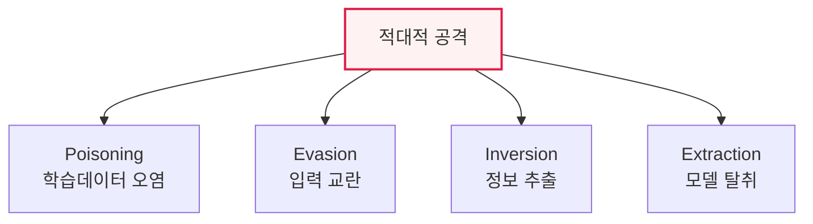

# AI 보안 위협: 적대적 공격과 생성형 AI 취약점

## 1. 개요

### 가. 정의
> AI 기술 활용 증가에 따라 나타나는 보안 위협으로, 머신러닝 **학습·추론 과정을 겨냥한 적대적 공격**과 **생성형 언어모델 특유의 취약점**을 포함한다.

AI 보안이 기존 보안과 다른 점은 '**모델 자체가 공격 대상**'이라는 것이다. 시스템이 아니라 학습 데이터·모델 파라미터·입력을 조작해 AI가 잘못된 판단을 내리게 만든다. 특히 AI가 자율주행·의료·보안에 쓰이면서 이런 조작은 곧 실제 피해로 이어진다.

## 2. 머신러닝 적대적 공격 4가지와 방어 (1)

| 공격 | 내용 | 방어 |
|---|---|---|
| **포이즈닝(Poisoning)** | 학습 데이터에 악의적 데이터 주입 | 데이터 검증·정제, 이상탐지 |
| **회피(Evasion)** | 추론 시 입력을 미세 교란해 오분류 유도 | 적대적 학습, 입력 정규화 |
| **전도(Inversion)** | 출력으로 학습데이터·개인정보 역추출 | 차분 프라이버시, 출력 제한 |
| **추출(Extraction)** | 질의로 모델 복제·탈취 | 쿼리 제한·워터마킹 |

## 3. 생성형 언어모델(LLM) 보안 취약점 (2)

| 취약점 | 내용 |
|---|---|
| **프롬프트 인젝션** | 악의적 입력으로 지시 탈취·우회 |
| **탈옥(Jailbreak)** | 안전장치 우회로 유해 출력 유도 |
| **데이터 유출** | 학습·대화 데이터 노출, 민감정보 누출 |
| **환각(Hallucination)** | 허위 정보 생성으로 오판·허위 유포 |
| **오남용** | 피싱·악성코드·딥페이크 생성 악용 |

> OWASP LLM Top 10이 대표적 취약점 분류 기준이다.

## 4. 대응 방안
- **적대적 학습·강건성 테스트**, 입력·출력 필터링(가드레일)
- 프롬프트 인젝션 방어(입력 검증·권한 분리), RAG 팩트체크
- MLOps 모니터링(드리프트·이상), AI 레드팀·거버넌스

## 5. 시사점
- AI 생명주기(데이터-학습-배포-운영) **전 단계 보안 내재화**(Secure AI)
- 생성형 AI 확산으로 공격 자동화·고도화 → 방어도 AI로
- 신뢰 AI(안전성·견고성)와 보안의 융합

---

> **한 줄 요약**: AI 보안 위협은 *포이즈닝·회피·전도·추출* 의 적대적 공격과 *프롬프트 인젝션·탈옥·데이터 유출·환각* 등 생성형 LLM 취약점을 포함하며, 적대적 학습·가드레일·거버넌스로 전 생명주기에서 대응한다.
