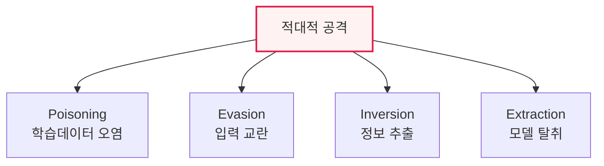

# AI 보안 위협: 적대적 공격과 생성형 AI 취약점

## 1. 개요

### 가. 정의
> AI 기술 활용 증가에 따라 나타나는 보안 위협으로, 머신러닝의 **학습·추론 과정을 겨냥한 적대적 공격(Adversarial Attack)** 과 **생성형 언어모델(LLM) 특유의 취약점** 을 포함한다.

AI 보안이 기존 정보보안과 근본적으로 다른 점은 '**모델 자체가 공격의 대상이자 통로**'라는 것이다. 전통적 해킹이 시스템의 취약점을 파고든다면, AI 공격은 학습 데이터·모델 파라미터·입력값을 교묘히 조작해 AI가 잘못된 판단을 내리게 만든다. 예를 들어 정지 표지판에 사람 눈에는 안 보이는 미세한 스티커를 붙여 자율주행차가 이를 속도제한 표지로 오인하게 하는 식이다. AI가 자율주행·의료 진단·보안 관제처럼 중요한 판단을 맡으면서, 이런 조작은 곧바로 물리적·사회적 피해로 이어진다. 게다가 생성형 AI가 대중화되면서 프롬프트를 통한 탈취, 유해 콘텐츠 생성 같은 새로운 유형의 위협이 더해졌다.

### 나. 필요성
AI가 핵심 인프라와 의사결정에 깊이 관여할수록, 그 오작동을 유발하는 공격의 파급력이 커진다. AI 생명주기 전반에 걸친 보안 내재화가 필수 과제가 되었다.

## 2. 머신러닝 적대적 공격 4가지와 방어

적대적 공격은 AI 생명주기의 어느 지점을 노리느냐로 나뉜다. **포이즈닝** 은 학습 단계에서 악의적 데이터를 주입해 모델을 오염시키고, **회피** 는 추론 단계에서 입력을 미세 교란해 오분류를 유도한다. **전도** 는 모델 출력을 분석해 학습에 쓰인 개인정보를 역추출하고, **추출** 은 반복 질의로 모델을 복제·탈취한다. 각각에 대한 방어는 데이터 검증, 적대적 학습, 프라이버시 보호, 질의 제한이다.

| 공격 | 내용 | 방어 |
|---|---|---|
| **포이즈닝(Poisoning)** | 학습 데이터에 악의적 데이터 주입 | 데이터 검증·정제, 이상탐지 |
| **회피(Evasion)** | 추론 시 입력 미세 교란으로 오분류 | 적대적 학습, 입력 정규화 |
| **전도(Inversion)** | 출력으로 학습데이터·개인정보 추출 | 차분 프라이버시, 출력 제한 |
| **추출(Extraction)** | 질의로 모델 복제·탈취 | 쿼리 제한·워터마킹 |

## 3. 생성형 언어모델(LLM) 보안 취약점

생성형 AI는 자연어로 지시받고 응답하는 특성상 새로운 취약점을 가진다. **프롬프트 인젝션** 은 악의적 입력으로 원래 지시를 무력화하거나 탈취하고, **탈옥(Jailbreak)** 은 안전장치를 우회해 유해한 출력을 끌어낸다. 학습·대화 데이터가 노출되는 **데이터 유출**, 그럴듯한 거짓을 생성하는 **환각**, 피싱·악성코드·딥페이크 생성에 악용되는 **오남용** 도 위협이다(OWASP LLM Top 10이 대표 분류다).

| 취약점 | 내용 |
|---|---|
| **프롬프트 인젝션** | 악의적 입력으로 지시 탈취·우회 |
| **탈옥(Jailbreak)** | 안전장치 우회로 유해 출력 유도 |
| **데이터 유출** | 학습·대화 데이터·민감정보 노출 |
| **환각(Hallucination)** | 허위 정보 생성으로 오판·허위 유포 |
| **오남용** | 피싱·악성코드·딥페이크 생성 |

## 4. 대응 방안

방어는 AI 생명주기 전반에 걸쳐 다층으로 이뤄진다. 적대적 학습과 강건성 테스트로 모델을 견고하게 하고, 입력·출력을 검증하는 가드레일을 두며, 프롬프트 인젝션에는 입력 검증·권한 분리로 대응한다. RAG로 환각을 줄이고 팩트체크를 붙이며, MLOps 모니터링으로 이상·드리프트를 감시하고, AI 레드팀·거버넌스로 지속 점검한다.

## 5. 고려사항 및 시사점

1. **AI 생명주기 전 단계 보안 내재화(Secure AI)** 가 원칙이다. 데이터 수집·학습·배포·운영 각 단계마다 고유한 위협이 있으므로, 보안을 설계 초기부터 통합해야 한다.
2. **공격의 자동화·고도화에 AI로 대응**한다. 생성형 AI로 공격이 정교해지는 만큼, 방어도 AI 기반 탐지·대응으로 맞서는 창과 방패의 경쟁이 심화되고 있다.
3. **신뢰 AI(안전성·견고성)와 보안의 융합**이 필요하다. AI 보안은 단순 해킹 방어를 넘어, 편향·환각 같은 신뢰성 문제와 결합해 통합적으로 다뤄야 한다.

---

> **한 줄 요약**: AI 보안 위협은 *포이즈닝·회피·전도·추출* 의 적대적 공격과 *프롬프트 인젝션·탈옥·데이터 유출·환각* 등 생성형 LLM 취약점을 포함하며, 적대적 학습·가드레일·거버넌스로 AI 생명주기 전 단계에서 대응한다.
