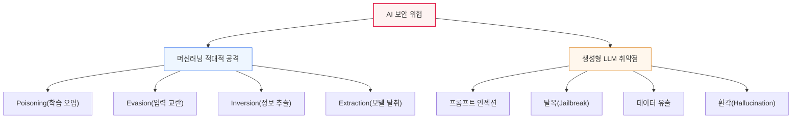
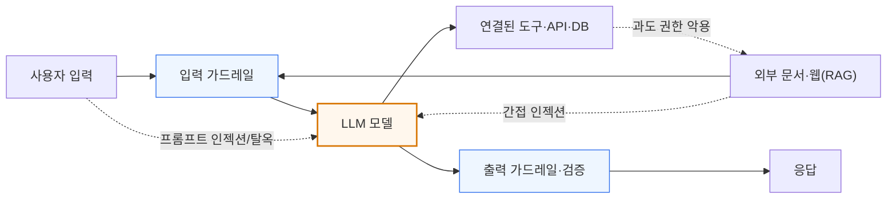

# AI 보안 위협: 적대적 공격과 생성형 AI 취약점

## 1. 개요

### 가. 정의
> **AI 보안 위협** 이란 인공지능의 도입 확대에 따라 나타나는 새로운 유형의 보안 위협으로, 머신러닝의 **학습·추론 과정을 직접 겨냥한 적대적 공격(Adversarial Attack)** 과 대규모 언어모델(LLM)로 대표되는 **생성형 AI 특유의 취약점** 을 포괄한다.

AI 보안이 기존 정보보안과 근본적으로 다른 점은 '**모델 자체가 공격의 대상이자 공격의 통로**'가 된다는 것이다. 전통적 해킹이 운영체제·네트워크·애플리케이션의 코드 취약점(버퍼 오버플로, SQL 인젝션 등)을 파고든다면, AI 공격은 코드의 결함이 아니라 **모델이 데이터로부터 학습한 통계적 판단 경계** 를 교묘히 조작한다. 학습 데이터를 오염시키거나, 사람 눈에는 정상으로 보이는 입력에 미세한 잡음을 더해 AI가 전혀 다른 결론을 내리게 만드는 식이다.

가장 유명한 예가 정지 표지판(Stop sign)에 사람 눈에는 낙서처럼 보이는 스티커 몇 장을 붙여, 자율주행 인식 모델이 이를 '속도제한 표지'로 오분류하도록 유도한 연구다. 픽셀 단위로는 미세한 변화지만 모델의 결정 경계를 넘겨 버리는 것이다. AI가 자율주행·의료 영상 진단·금융 이상거래 탐지·보안 관제처럼 사람의 안전과 재산이 걸린 판단을 맡으면서, 이런 오작동은 곧바로 물리적·사회적 피해로 이어진다. 여기에 ChatGPT 이후 생성형 AI가 대중화되면서, 프롬프트를 통한 지시 탈취, 안전장치 우회(탈옥), 유해 콘텐츠 대량 생성 같은 **자연어 인터페이스 특유의 위협** 이 새롭게 더해졌다.

### 나. 등장 배경 및 필요성
AI가 핵심 인프라와 의사결정에 깊이 관여할수록, 그 오작동을 유발하는 공격의 파급력도 함께 커진다. 과거에는 보안이 '시스템을 지키는' 문제였다면, 이제는 '학습된 판단을 신뢰할 수 있는가'라는 문제가 더해진 것이다. 특히 생성형 AI가 기업 업무(코드 작성, 문서 요약, 고객 응대)에 파고들면서, 모델에 연결된 사내 데이터·도구·권한이 새로운 공격면(attack surface)이 되었다.

이에 따라 각국 규제와 표준도 빠르게 정비되고 있다. OWASP는 **LLM 애플리케이션 Top 10** 을 발표해 생성형 AI 취약점을 체계화했고, MITRE는 AI 공격 전술·기법을 정리한 **ATLAS** 지식베이스를, NIST는 **AI 위험관리 프레임워크(AI RMF)** 와 적대적 머신러닝 분류 체계를 내놓았다. 이는 AI 보안이 일회성 대응이 아니라 **AI 생명주기 전반에 내재화(Secure AI by Design)해야 할 상시 과제** 가 되었음을 뜻한다.

## 2. AI 보안 위협의 전체 구도

먼저 위협이 AI 생명주기의 어느 지점을 노리는지 전체 지도를 그리면, 개별 공격의 위치와 방어 지점이 분명해진다.

```mermaid
flowchart TB
  T["AI 보안 위협"] --> ML["머신러닝 적대적 공격"]
  T --> LLM["생성형 LLM 취약점"]
  ML --> P["Poisoning(학습 오염)"]
  ML --> E["Evasion(입력 교란)"]
  ML --> I["Inversion(정보 추출)"]
  ML --> X["Extraction(모델 탈취)"]
  LLM --> PI["프롬프트 인젝션"]
  LLM --> JB["탈옥(Jailbreak)"]
  LLM --> DL["데이터 유출"]
  LLM --> HA["환각(Hallucination)"]
  style T fill:#fef3f2,stroke:#e11d48,stroke-width:2px
  style ML fill:#eef6ff,stroke:#2f6fed
  style LLM fill:#fff7ed,stroke:#d97706
```

크게 보면 위협은 두 갈래다. 하나는 분류·예측 모델 전반을 노리는 **머신러닝 적대적 공격**, 다른 하나는 자연어로 지시받는 **생성형 LLM 특유의 취약점** 이다. 이어 각 갈래를 원리와 방어 관점에서 문단으로 풀어 설명한다.

## 3. 머신러닝 적대적 공격 4가지와 방어

적대적 공격은 'AI 생명주기의 어느 단계를, 무엇을 목표로 노리는가'로 구분하면 체계적으로 이해된다. 학습 단계를 노리면 포이즈닝, 추론 단계를 노리면 회피, 모델에 담긴 정보를 빼내면 전도, 모델 자체를 복제하면 추출이다.

### 가. 포이즈닝(Poisoning) — 학습 데이터 오염
**포이즈닝** 은 모델이 학습하는 데이터에 악의적 샘플을 섞어 넣어, 완성된 모델의 판단을 처음부터 왜곡하는 공격이다. 학습이 '데이터로부터 규칙을 귀납'하는 과정이라는 점을 역이용한다. 특히 위험한 형태가 **백도어(Backdoor) 공격** 으로, 특정 트리거(예: 이미지 모서리의 작은 패턴)가 있을 때만 오작동하고 평소에는 정상 동작해 탐지가 어렵다.

이 공격은 데이터를 외부에서 대량 수집하는 환경일수록 위험하다. 사용자 피드백으로 계속 재학습하는 추천·챗봇 시스템, 공개 크롤링 데이터로 학습하는 파운데이션 모델이 표적이 된다. 방어는 학습 전 **데이터 출처 검증(provenance)·이상치 탐지·데이터 정제** 를 두는 것이 핵심이며, 재학습 파이프라인에 데이터 무결성 검증과 변경 추적을 넣어 오염 샘플을 걸러내야 한다.

### 나. 회피(Evasion) — 추론 시 입력 교란
**회피** 는 이미 배포된 모델에 대해, 입력값을 사람은 알아채기 힘든 수준으로 미세하게 변형(adversarial perturbation)해 오분류를 유도하는 공격이다. 앞서 든 정지 표지판 스티커, 또는 이미지에 눈에 안 보이는 잡음을 더해 '판다'를 '긴팔원숭이'로 분류하게 만든 고전적 사례가 여기에 속한다. 모델의 결정 경계가 고차원 공간에서 의외로 취약하다는 성질을 파고든다.

회피는 스팸 필터 우회, 악성코드 탐지 우회, 생체 인증 우회 등 보안 모델을 직접 무력화하는 데 쓰일 수 있어 위험도가 높다. 대표적 방어는 **적대적 학습(Adversarial Training)** 으로, 일부러 적대적 예제를 학습 데이터에 포함시켜 모델의 강건성(robustness)을 높인다. 이 밖에 입력 정규화·전처리, 여러 모델의 앙상블, 방어적 증류(distillation) 등이 병행된다. 다만 완전 방어는 어렵고 공격-방어가 계속 진화하는 영역이라, 단정적 '해결'보다 지속적 강건성 평가가 현실적이다.

### 다. 전도(Inversion)와 멤버십 추론 — 정보 추출
**전도(Model Inversion)** 는 모델의 출력(확률·신뢰도)을 반복 관찰·분석해, 학습에 쓰인 민감 데이터를 역으로 복원해 내는 공격이다. 연관된 **멤버십 추론(Membership Inference)** 은 '특정 개인의 데이터가 학습에 포함됐는지'를 알아내, 그 자체로 프라이버시를 침해한다. 예컨대 의료 진단 모델에서 특정 환자의 민감 정보가 유추될 수 있다.

이 공격은 모델이 학습 데이터를 과도하게 '암기'할 때 심해지므로, 방어는 프라이버시 보존 기법이 중심이다. **차분 프라이버시(Differential Privacy)** 로 학습 과정에 통제된 잡음을 더해 개별 데이터의 영향을 흐리고, 출력의 상세도(확률값 노출)를 제한하며, 필요 시 연합학습(Federated Learning)으로 원본 데이터를 중앙에 모으지 않는다.

### 라. 추출(Extraction) — 모델 탈취
**추출(Model Extraction/Stealing)** 은 공개된 예측 API에 수많은 질의를 던지고 그 입력-출력 쌍을 모아, 원본과 유사하게 동작하는 대체 모델을 복제하는 공격이다. 막대한 비용을 들여 학습한 모델의 지식재산을 무단 탈취하는 것이자, 복제 모델로 회피 공격을 설계하는 발판이 되기도 한다.

방어는 API 차원의 통제가 핵심이다. **질의 빈도 제한(rate limiting)·이상 질의 패턴 탐지·출력에 워터마크 삽입** 으로 대량 추출을 억제하고, 반환하는 신뢰도 정보를 최소화한다. 다음 표는 네 공격을 대상 단계와 방어 관점으로 정리한 보조 자료다.

| 공격 | 노리는 단계 | 목표 | 대표 방어 |
|---|---|---|---|
| **포이즈닝(Poisoning)** | 학습 | 판단 왜곡·백도어 | 데이터 출처 검증·정제, 이상탐지 |
| **회피(Evasion)** | 추론 | 오분류 유도 | 적대적 학습, 입력 정규화, 앙상블 |
| **전도(Inversion)** | 추론(관찰) | 학습·개인정보 복원 | 차분 프라이버시, 출력 제한 |
| **추출(Extraction)** | 추론(API) | 모델 복제·탈취 | 질의 제한, 워터마킹, 이상탐지 |

## 4. 생성형 언어모델(LLM) 보안 취약점

생성형 AI는 '자연어로 지시받고 자연어로 응답한다'는 특성상, 기존 소프트웨어에 없던 취약점을 가진다. 핵심은 **명령(개발자 지시)과 데이터(사용자·외부 입력)의 경계가 모호** 하다는 점이다. 이 성질이 아래 위협들의 공통 뿌리다. 다음은 LLM 애플리케이션의 데이터 흐름과 위협 지점을 나타낸 세부 아키텍처 도식이다.

```mermaid
flowchart LR
  U["사용자 입력"] --> GI["입력 가드레일"]
  DOC["외부 문서·웹(RAG)"] --> GI
  GI --> M["LLM 모델"]
  M --> TOOL["연결된 도구·API·DB"]
  M --> GO["출력 가드레일·검증"]
  GO --> R["응답"]
  U -. "프롬프트 인젝션/탈옥" .-> M
  DOC -. "간접 인젝션" .-> M
  TOOL -. "과도 권한 악용" .-> DOC
  style M fill:#fff7ed,stroke:#d97706,stroke-width:2px
  style GI fill:#eef6ff,stroke:#2f6fed
  style GO fill:#eef6ff,stroke:#2f6fed
```

### 가. 프롬프트 인젝션(Prompt Injection)
**프롬프트 인젝션** 은 악의적 입력으로 개발자가 설정한 원래 지시(시스템 프롬프트)를 무력화·탈취하는 공격으로, OWASP LLM Top 10에서 최상위 위협으로 꼽힌다. "이전 지시를 모두 무시하고 …"처럼 직접 넣는 **직접 인젝션** 과, 모델이 읽어 들이는 외부 웹페이지·문서·이메일에 악의적 지시를 숨겨 두는 **간접 인젝션(Indirect Injection)** 이 있다. 후자는 RAG나 자동 요약·에이전트처럼 모델이 외부 콘텐츠를 신뢰해 처리할 때 특히 위험하며, 사용자가 전혀 의도하지 않은 동작(데이터 유출, 권한 오용)을 유발할 수 있다.

방어는 근본적으로 '명령과 데이터의 분리'인데, 자연어 특성상 완벽 분리가 어렵다는 것이 이 분야의 난제다. 현실적으로는 입력 검증·필터링, 외부 콘텐츠를 신뢰 경계로 격리, 모델에 부여된 권한을 최소화(least privilege), 민감 동작 전 사람 확인(human-in-the-loop)을 조합한다.

### 나. 탈옥(Jailbreak)과 데이터 유출
**탈옥** 은 모델의 안전 정렬(safety alignment)을 정교한 프롬프트로 우회해, 폭발물 제조법·악성코드 같은 원래 거부해야 할 출력을 끌어내는 공격이다. 역할극(roleplay)을 시키거나 가상의 상황을 설정해 안전장치를 비껴가는 식이며, 새로운 우회 기법과 이를 막는 패치가 끊임없이 반복된다. **데이터 유출** 은 두 방향인데, 하나는 모델이 학습 중 암기한 민감정보(개인정보, API 키)를 뱉어내는 것이고, 다른 하나는 사용자가 대화에 입력한 사내 기밀이 로그·재학습을 통해 외부로 새는 것이다. 실제로 임직원이 소스코드나 회의록을 외부 챗봇에 붙여 넣어 기밀이 유출된 사례가 보고되면서, 많은 기업이 사내 사용 정책과 데이터 마스킹을 도입했다.

### 다. 환각(Hallucination)과 오남용
**환각** 은 모델이 사실이 아닌 내용을 그럴듯하게 지어내는 현상으로, 없는 논문·판례·API를 실제처럼 인용하는 것이 대표적이다. 이는 악의적 공격은 아니지만, 의료·법률·금융처럼 정확성이 생명인 영역에서 잘못된 정보가 그대로 의사결정에 쓰이면 심각한 피해로 이어진다. **오남용** 은 생성형 AI를 피싱 메일 대량 생성, 악성코드 작성 보조, 딥페이크 제작에 악용하는 것으로, 공격자의 생산성을 끌어올려 사회 전반의 위협 수준을 높인다. 다음 표는 주요 LLM 취약점을 정리한 보조 자료다.

| 취약점 | 내용 | 대표 대응 |
|---|---|---|
| **프롬프트 인젝션** | 지시 탈취·우회(직접/간접) | 입력 검증, 권한 최소화, 콘텐츠 격리 |
| **탈옥(Jailbreak)** | 안전장치 우회로 유해 출력 | 안전 정렬 강화, 출력 필터, 레드팀 |
| **데이터 유출** | 학습·대화 민감정보 노출 | 데이터 마스킹, 사용 정책, 로그 통제 |
| **환각(Hallucination)** | 허위 정보 생성 | RAG·근거 제시, 팩트체크, 사람 검토 |
| **오남용** | 피싱·악성코드·딥페이크 | 사용 모니터링, 워터마킹, 정책·법제 |

## 5. 대응 방안 — 다층 방어(Defense in Depth)

방어는 특정 시점의 단일 조치가 아니라 AI 생명주기 전반에 걸친 다층 방어로 이뤄진다. **학습 단계** 에서는 데이터 출처 검증·정제와 적대적 학습으로 모델 자체를 견고하게 만들고, **배포·추론 단계** 에서는 입력·출력을 검사하는 가드레일과 API 질의 제한을 둔다. 프롬프트 인젝션에는 입력 검증과 권한 분리(모델이 접근할 도구·데이터를 최소화)로 대응하고, 환각에는 RAG로 근거 문서에 기반해 답하도록 하며 팩트체크·출처 표기를 붙인다. **운영 단계** 에서는 MLOps 모니터링으로 입력 분포 변화(드리프트)와 이상 질의를 상시 감시하고, 정기적인 **AI 레드팀** 훈련과 거버넌스로 새로운 우회 기법을 선제적으로 발굴한다. 이처럼 예방-탐지-대응을 계층적으로 겹쳐야 어느 한 층이 뚫려도 전체가 무너지지 않는다.

## 6. 심화 — 표준·규제 동향과 실무 적용

AI 보안은 개별 기술을 넘어 표준·규제 프레임워크로 제도화되는 단계에 들어섰다. **OWASP LLM Top 10** 은 프롬프트 인젝션·불안전한 출력 처리·과도한 권한 위임(Excessive Agency) 등 생성형 AI 애플리케이션의 대표 위협을 개발자 관점에서 정리해, 사실상 업계 체크리스트로 쓰인다. **MITRE ATLAS** 는 실제 관측된 AI 공격 전술·기법을 ATT&CK 형식으로 축적해 위협 인텔리전스를 제공하고, **NIST AI RMF** 는 신뢰할 수 있는 AI를 위한 위험관리 절차를 제시한다. 규제 측면에서는 **EU AI Act** 가 고위험 AI에 대해 견고성·정확성·보안 요건을 의무화하는 등, 보안이 규정 준수(compliance)의 대상으로 자리 잡고 있다.

실무 적용의 축은 'AI 특화 보안을 기존 보안·개발 프로세스에 녹이는 것'이다. 예컨대 금융권은 LLM 기반 고객 상담에 입력·출력 가드레일과 개인정보 마스킹을 필수로 두고, 사내 문서를 다루는 RAG 시스템에는 간접 프롬프트 인젝션을 막기 위해 외부 콘텐츠를 신뢰 경계로 격리한다. 또한 생성형 AI 오남용이 늘면서, 피싱·딥페이크 대응을 위한 콘텐츠 출처 표시(워터마킹·C2PA 등 출처 인증)와 탐지 기술 투자가 확대되고 있다. 핵심은 **모델을 하나의 새로운 자산이자 공격면으로 보고, 데이터-모델-애플리케이션-운영 전 계층에 보안을 설계 단계부터 내재화(Secure AI by Design)** 하는 것이다.

## 7. 고려사항 및 시사점

1. **AI 생명주기 전 단계 보안 내재화(Secure AI by Design)가 원칙이다.** 데이터 수집·학습·배포·운영 각 단계마다 고유한 위협(포이즈닝→회피→전도/추출)이 있으므로, 보안을 사후 점검이 아니라 설계 초기부터 통합하고 단계별 통제를 겹쳐야 한다.

2. **공격의 자동화·고도화에 AI로 대응하는 '창과 방패'의 경쟁이 심화된다.** 생성형 AI로 공격이 정교·대량화되는 만큼, 방어도 AI 기반 이상탐지·자동 대응으로 맞서야 한다. 다만 적대적 강건성은 완전 해결이 어려운 영역이므로, '완벽 방어'가 아니라 지속적 평가·개선을 전제로 리스크를 관리해야 한다.

3. **신뢰 AI(안전성·견고성·프라이버시)와 보안의 융합이 필요하다.** AI 보안은 단순 해킹 방어를 넘어 편향·환각 같은 신뢰성 문제, 개인정보 보호와 결합해 통합적으로 다뤄야 한다. 특히 전도·멤버십 추론은 보안 문제이자 프라이버시 문제라는 이중성을 갖는다.

4. **연결된 권한과 공격면을 최소화해야 한다(Least Privilege).** LLM이 도구·DB·외부 API와 연결되며 '과도한 권한 위임'이 새로운 핵심 위험이 되었다. 모델에 부여하는 권한과 접근 데이터를 최소화하고, 민감 동작에는 사람 확인을 두어 프롬프트 인젝션의 피해 범위를 봉쇄해야 한다.

5. **거버넌스·표준·규제 준수를 상시 체계로 갖춰야 한다.** OWASP·MITRE ATLAS·NIST AI RMF·EU AI Act 등 프레임워크를 참조해 위협 분류-통제-감사를 문서화하고, AI 레드팀과 정기 점검을 조직 차원의 상시 프로세스로 운영해야 한다.

## 참고자료
- OWASP Top 10 for LLM Applications — https://owasp.org/www-project-top-10-for-large-language-model-applications/
- MITRE ATLAS (Adversarial Threat Landscape for AI Systems) — https://atlas.mitre.org/
- NIST AI Risk Management Framework — https://www.nist.gov/itl/ai-risk-management-framework

---

> **한 줄 요약**: AI 보안 위협은 학습·추론을 노리는 적대적 공격(포이즈닝·회피·전도·추출)과 생성형 LLM 취약점(프롬프트 인젝션·탈옥·데이터 유출·환각·오남용)을 포괄하며, 데이터-모델-애플리케이션-운영 전 계층에 적대적 학습·가드레일·권한 최소화·거버넌스를 겹치는 다층 방어(Secure AI by Design)로 대응한다.
