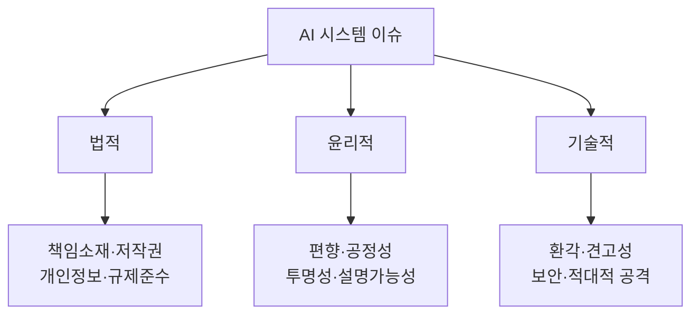
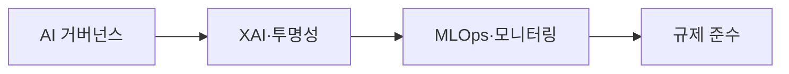

# AI 시스템의 법적·윤리적·기술적 이슈 및 해결 방안

## 1. 개요

### 가. 정의
> AI 시스템의 확산으로 발생하는 **법적 책임·윤리적 신뢰·기술적 안전성** 문제. 신뢰할 수 있는 AI(Trustworthy AI) 실현을 위해 통합 대응이 필요하다.

### 나. 배경
- 생성형 AI 대중화 → 책임·편향·안전 문제 표면화
- **AI 기본법·EU AI Act** 등 규제 강화, 사회적 수용성 요구

## 2. 이슈 분류

## 3. 이슈별 내용 및 해결 방안

| 구분 | 이슈 | 해결 방안 |
|---|---|---|
| **법적** | 사고 책임소재 불명확, 학습데이터 저작권, 개인정보 침해 | AI 기본법·규제 준수, 책임체계 정립, 데이터 적법성(라이선스) |
| **윤리적** | 데이터·알고리즘 편향, 차별, 불투명성 | 편향 완화·공정성 검증, **XAI(설명가능 AI)**, AI 윤리기준 |
| **기술적** | 환각(Hallucination), 견고성 부족, 적대적 공격, 프라이버시 유출 | RAG·팩트체크, 강건성 테스트, 적대적 방어, PET·차분프라이버시 |

## 4. 통합 해결 방안

| 방안 | 내용 |
|---|---|
| **AI 거버넌스** | 개발·운영 전주기 책임·윤리 체계, AI 영향평가 |
| **XAI·투명성** | 판단 근거 설명, 모델 카드·데이터시트 |
| **MLOps·모니터링** | 지속적 성능·편향·드리프트 감시 |
| **규제 준수** | EU AI Act(위험기반), 국내 AI 기본법 대응 |

## 5. 관련 규제·표준

| 구분 | 내용 |
|---|---|
| **EU AI Act** | 위험 기반(금지·고위험·제한·최소) 규제 |
| **NIST AI RMF** | Govern·Map·Measure·Manage |
| **ISO/IEC 42001** | AI 경영시스템(AIMS) 국제표준 |

## 6. 고려사항 및 시사점
- 사후 규제보다 **설계 단계부터(Responsible AI by Design)** 내재화
- 기술·제도·윤리의 **삼각 균형**이 신뢰 AI의 조건
- **인간 감독(Human-in-the-loop)** 유지, 고위험 영역 통제 강화

---

> **한 줄 요약**: AI 시스템은 *법적(책임·저작권)·윤리적(편향·투명성)·기술적(환각·보안)* 이슈를 가지며, *AI 거버넌스·XAI·MLOps·규제 준수* 로 신뢰할 수 있는 AI를 실현한다.
