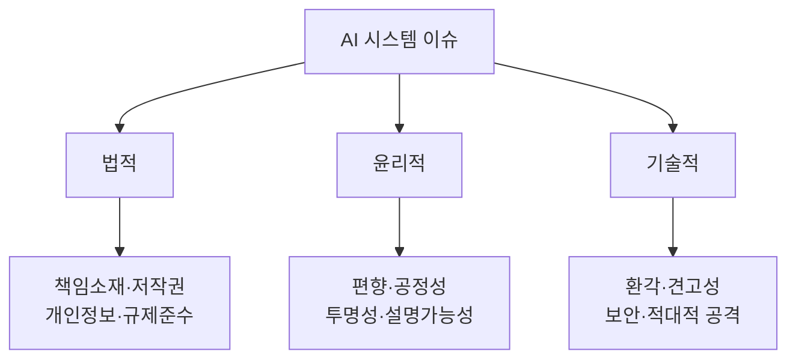
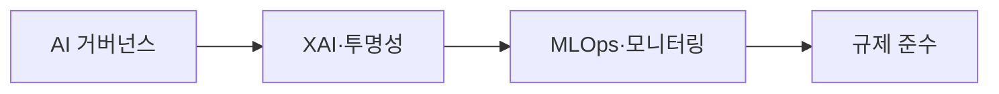

# AI 시스템의 법적·윤리적·기술적 이슈 및 해결 방안

## 1. 개요

### 가. 정의
> AI 시스템의 급속한 확산에 따라 발생하는 **법적 책임·윤리적 신뢰·기술적 안전성** 문제로, 이를 통합 관리해 **신뢰할 수 있는 AI(Trustworthy AI)** 를 실현하는 것이 과제다.

AI의 이슈가 특별한 이유는 세 층위가 **서로 얽혀 있기** 때문이다. 알고리즘 편향(윤리)은 곧 차별 소송(법적)으로 이어지고, 환각(기술)은 허위정보 유포에 따른 책임(법적) 문제를 낳는다. 따라서 한 층위만 다루면 문제가 다른 층위로 옮겨갈 뿐이며, 법·윤리·기술을 **통합적으로** 다뤄야 한다.

### 나. 등장 배경 및 필요성
생성형 AI가 대중화되면서 누구나 강력한 AI를 손쉽게 쓰게 되었고, 그만큼 책임 소재·편향·안전 문제가 사회 표면으로 드러났다. AI가 내린 결정이 채용·대출·의료처럼 사람의 삶에 직접 영향을 미치면서, "기계의 판단을 어디까지 믿고 누가 책임지는가"라는 물음이 규제로 이어졌다. EU AI Act, 국내 AI 기본법 같은 제도가 강화되고 사회적 수용성이 요구되면서, AI의 이슈를 선제적으로 관리하는 일이 기업 생존과 직결되게 되었다.

## 2. 이슈 분류

이슈는 성격에 따라 셋으로 나뉜다. **법적** 이슈는 제도·계약·권리의 문제로 "누가 책임지고 무엇이 합법인가"를 다루고, **윤리적** 이슈는 규범·가치의 문제로 "공정하고 투명한가"를 묻는다. **기술적** 이슈는 시스템 자체의 결함으로 "정확하고 안전한가"의 문제다. 앞서 말했듯 이 셋은 독립적이지 않고 연쇄적으로 상호작용한다.

## 3. 이슈별 내용 및 해결 방안

각 층위의 이슈는 원인이 다르므로 해결 접근도 달라야 한다. 법적 이슈는 제도·계약으로, 윤리적 이슈는 검증·투명화로, 기술적 이슈는 공학적 방어로 대응한다. 예컨대 학습데이터의 저작권 분쟁(법적)은 라이선스가 명확한 데이터로 학습하고 이용 근거를 계약으로 확보해야 하고, 채용 AI의 성별 편향(윤리적)은 데이터 재균형과 공정성 지표 검증으로 완화하며, 챗봇의 환각(기술적)은 RAG와 팩트체크로 억제한다.

| 구분 | 주요 이슈 | 해결 방안 |
|---|---|---|
| **법적** | 사고 책임소재 불명확, 학습데이터 저작권, 개인정보 침해 | AI 기본법·규제 준수, 책임체계 정립, 데이터 적법성(라이선스) 확보 |
| **윤리적** | 데이터·알고리즘 편향, 차별, 불투명성 | 편향 완화·공정성 검증, XAI(설명가능 AI), AI 윤리기준 준수 |
| **기술적** | 환각(Hallucination), 견고성 부족, 적대적 공격, 프라이버시 유출 | RAG·팩트체크, 강건성 테스트, 적대적 방어, PET·차분 프라이버시 |

특히 편향은 대개 **학습 데이터에 이미 존재하던 사회적 편향**이 모델에 반영·증폭된 결과이므로, 알고리즘만 손보는 것으로는 부족하고 데이터 단계부터 점검해야 한다는 점이 중요하다.

## 4. 통합 해결 방안

개별 대응을 넘어, 개발·운영 전주기를 관통하는 **거버넌스 체계**가 있어야 이슈가 재발하지 않는다. AI 거버넌스가 책임·윤리 원칙을 세우면, XAI가 판단 근거를 투명하게 하고, MLOps가 운영 중 성능·편향·드리프트를 지속 감시하며, 규제 준수가 이 모두를 법적 요구에 맞춘다.

| 방안 | 내용 |
|---|---|
| **AI 거버넌스** | 개발·운영 전주기 책임·윤리 체계, AI 영향평가 |
| **XAI·투명성** | 판단 근거 설명, 모델 카드·데이터시트 공개 |
| **MLOps·모니터링** | 지속적 성능·편향·데이터 드리프트 감시 |
| **규제 준수** | EU AI Act(위험기반), 국내 AI 기본법 대응 |

모델을 한 번 검증하고 끝내지 않고 **MLOps로 상시 감시**해야 하는 이유는, 실제 운영 데이터가 학습 시점과 달라지는 데이터 드리프트로 성능·공정성이 서서히 무너질 수 있기 때문이다.

## 5. 관련 규제·표준

규제·표준은 대응의 기준선을 제시한다. EU AI Act는 위험이 클수록 강하게 규제하는 **위험 기반(risk-based)** 접근을 택해, 소셜 스코어링 같은 용도는 금지하고 고위험(의료·채용 등)은 엄격한 의무를 부과한다. NIST AI RMF와 ISO/IEC 42001은 이를 조직 내부에서 실행하는 관리 체계를 제공한다.

| 구분 | 내용 |
|---|---|
| **EU AI Act** | 위험 기반 규제(금지·고위험·제한·최소 위험) |
| **NIST AI RMF** | Govern·Map·Measure·Manage 프레임워크 |
| **ISO/IEC 42001** | AI 경영시스템(AIMS) 국제표준 |

## 6. 고려사항 및 시사점
기술사 관점에서 가장 중요한 원칙은 **사후 규제가 아닌 설계 단계부터의 내재화(Responsible AI by Design)** 다. 문제가 터진 뒤 대응하면 신뢰 회복 비용이 훨씬 크므로, 개발 초기부터 편향 점검·설명가능성·안전성을 요구사항으로 넣어야 한다. 둘째, 기술·제도·윤리의 **삼각 균형**이 신뢰 AI의 조건이며, 어느 하나만 앞서면 전체 신뢰가 무너진다. 셋째, 특히 고위험 영역에서는 AI가 최종 결정을 독점하지 않도록 **인간 감독(Human-in-the-loop)** 을 유지하고 최종 책임을 사람에게 두는 통제 장치가 필수다. 결국 신뢰 AI는 기술 성능이 아니라 사회적 수용성의 문제이며, 이를 확보하는 조직이 AI 시대의 경쟁력을 갖는다.

---

> **한 줄 요약**: AI 시스템은 *법적(책임·저작권)·윤리적(편향·투명성)·기술적(환각·보안)* 이슈가 상호 얽혀 있으며, AI 거버넌스·XAI·MLOps·규제 준수를 설계 단계부터 통합해 인간 감독 하에 신뢰할 수 있는 AI를 실현하는 것이 핵심이다.
