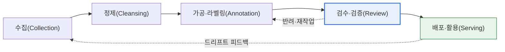
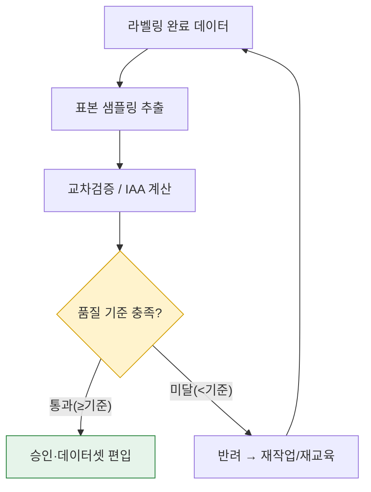

# AI 학습용 데이터셋 품질관리

## 1. 개요

### 가. 정의

> **AI 학습용 데이터셋 품질관리** 란 AI 모델 학습에 사용할 데이터를 **수집·정제·가공(라벨링)·검수·활용** 하는 전 과정에서 데이터의 **정확성(Accuracy)·완전성(Completeness)·일관성(Consistency)·대표성(Representativeness)·충분성(Sufficiency)** 을 확보·유지하기 위한 체계적 활동이다. 특히 지도학습에서는 정답 레이블의 품질이 관리의 중심이 된다.

AI 학습용 데이터 품질이 결정적으로 중요한 이유는 '**Garbage In, Garbage Out(GIGO)**'이라는 오래된 진리 때문이다. 아무리 정교한 신경망이라도 레이블이 틀렸거나 편향된 데이터로 학습하면 그 오류와 편향을 그대로 내재화한다. 특히 지도학습(Supervised Learning)에서는 정답(레이블)의 품질이 곧 **모델 성능의 상한선(Ceiling)** 을 결정한다. 사람이 잘못 라벨링한 데이터로 학습한 모델은 그 오류를 '정답'으로 배우기 때문에, 알고리즘을 아무리 개선해도 그 상한을 넘을 수 없다.

이 때문에 최근 AI 개발의 무게중심은 '**모델 중심(Model-centric)**'에서 '**데이터 중심(Data-centric AI)**'으로 옮겨가고 있다. 앤드류 응(Andrew Ng)이 주창한 이 관점은 "모델·코드는 고정하고 데이터 품질을 체계적으로 끌어올려 성능을 개선한다"는 것으로, 실제 산업 현장에서는 모델 아키텍처를 바꾸는 것보다 레이블 노이즈를 줄이고 데이터 일관성을 높이는 편이 더 크고 안정적인 성능 향상을 가져오는 경우가 많다. 예컨대 결함 검사·의료 영상처럼 데이터가 적고 정밀한 도메인에서는 수천 장의 데이터를 새로 모으는 것보다 기존 라벨의 오류 수백 건을 바로잡는 편이 정확도를 더 크게 끌어올린다는 사례가 반복적으로 보고된다.

### 나. 등장 배경과 필요성

품질관리가 필수가 된 배경에는 세 가지 흐름이 있다. 첫째, **AI의 고위험 영역 확산** 이다. 자율주행의 객체 인식, 의료 영상의 병변 판독처럼 오류가 곧 사고·오진으로 이어지는 영역이 늘면서, 데이터 결함이 안전·생명·법적 책임의 문제로 직결되었다. 둘째, **편향과 공정성 리스크** 다. 특정 성별·인종·연령·지역이 데이터에서 과소·과대 대표되면 모델은 그 집단에 불리한 차별적 판단을 학습한다. 실제로 안면인식 모델이 유색인종·여성에서 오류율이 크게 높았던 연구(예: MIT 미디어랩의 Gender Shades 연구에서 밝은 피부 남성 대비 어두운 피부 여성의 오분류율이 현저히 높게 나타남)는 데이터 대표성 결핍이 사회적 차별로 귀결됨을 보여준다. 셋째, **데이터 허브·공공 데이터 사업의 대규모화** 다. 대량의 크라우드소싱 라벨링이 이뤄지면서 작업자 간 편차·오류를 정량 관리하는 체계 없이는 규모의 품질을 담보할 수 없게 되었다.

## 2. 데이터 생애주기와 품질 확보 활동 개념도

품질관리는 특정 단계에 국한된 일회성 활동이 아니라 데이터가 흐르는 전 생애주기에 걸친 활동이다. 먼저 데이터가 어떤 단계를 거치며, 검수에서 문제가 발견되면 어떻게 되먹임되는지를 전체 흐름도로 조망한다.

전체 흐름이 '수집→정제→라벨링→검수→활용'의 순환이라는 점을 잡았다면, 다음으로 품질의 최종 관문인 **검수 단계의 내부 아키텍처** 를 세부적으로 볼 필요가 있다. 검수는 단순 눈검사가 아니라, 다수 작업자의 결과를 비교(IAA)하고 표본을 정량 검사하며, 기준 미달분을 반려하는 판정 로직으로 이뤄진다.

## 3. 단계별 품질 확보 활동

품질 확보는 생애주기 각 단계에서 서로 다른 초점으로 이뤄진다. 각 단계가 '무엇을, 왜' 점검하는지를 원리 수준에서 살펴본다.

### 가. 수집(Collection) — 대표성과 적법성

수집 단계의 핵심 질문은 '이 데이터가 **풀려는 문제를 대표하는가**'이다. 학습 데이터의 분포가 실제 운영 환경(모집단)과 다르면, 모델은 실험실에서만 잘 맞는 편향된 결정을 배운다. 예컨대 낮 시간 맑은 날씨 영상만으로 학습한 자율주행 인식 모델은 야간·악천후에서 급격히 성능이 떨어진다. 따라서 수집 단계에서 클래스 균형, 다양한 환경·조건의 커버리지, 희소 클래스(long-tail)의 확보를 점검한다. 동시에 **적법성·윤리** 도 이 단계에서 판가름 난다. 저작권이 있는 데이터의 무단 수집, 개인정보(얼굴·번호판·음성)의 동의 없는 수집은 이후 단계에서 되돌리기 어려운 법적 리스크를 남기므로, 수집 시점에 비식별화·동의·라이선스를 확인해야 한다.

### 나. 정제(Cleansing) — 노이즈 제거

정제 단계는 원천 데이터의 결측치·이상치·중복·형식 불일치를 제거해 후속 라벨링·학습의 토대를 다진다. 결측치는 단순 삭제할지 대체(imputation)할지, 이상치는 오류인지 실제 희귀 사례인지 도메인 지식을 근거로 판단해야 한다. 중복 데이터는 특정 샘플을 과대 대표하게 만들어 편향을 유발하고, 특히 학습·검증·테스트셋에 같은 데이터가 섞이는 **데이터 누수(Data Leakage)** 는 성능을 실제보다 부풀리는 치명적 오류이므로 정제 단계에서 반드시 걸러야 한다.

### 다. 가공·라벨링(Annotation) — 일관성

라벨링은 사람이 개입하는 만큼 편차가 가장 크게 발생하는 지점이다. 같은 이미지를 두 작업자가 다르게 라벨링하면 모델은 모순된 신호를 학습한다. 따라서 **명확한 라벨링 가이드라인(경계 사례 규정 포함)과 작업자 교육** 이 일관성의 핵심이다. 가이드라인이 모호할수록 작업자 간 해석 차이가 커지므로, 애매한 경계 사례(예: '부분적으로 가려진 객체를 라벨링할 것인가')를 예시와 함께 명문화하고, 초기 소량 라벨링 결과로 가이드라인을 보정한 뒤 본작업에 들어가는 방식이 효과적이다.

라벨링 방식 자체도 품질에 영향을 준다. 이미지의 경계 상자(Bounding Box)·분할(Segmentation), 텍스트의 개체명(NER)·분류, 음성의 전사(STT) 등 과업 유형마다 오류가 나타나는 형태가 다르므로 검수 기준도 달라야 한다. 예를 들어 경계 상자는 '박스가 객체를 얼마나 정확히 감싸는가(IoU)'가, 분류는 '레이블 자체가 맞는가'가 핵심 오류 축이다. 또한 비용을 낮추려는 자동·반자동 라벨링(모델 예측을 사람이 확인·수정하는 Human-in-the-loop)이 늘고 있는데, 이 경우 모델의 초기 편향이 라벨에 전이되지 않도록 검수가 오히려 더 엄격해야 한다.

### 라. 검수·검증(Review) — 정량 관문

검수는 품질의 최종 관문이다. 핵심 도구는 **작업자 간 일치도(IAA, Inter-Annotator Agreement)** 로, 여러 작업자가 같은 데이터에 얼마나 일관되게 라벨을 붙였는지를 코헨/플라이스 카파(Cohen's/Fleiss' Kappa) 등으로 정량화한다. 우연에 의한 일치를 보정한 카파 값이 낮으면(예: 0.6 미만) 가이드라인이 모호하거나 작업자 교육이 부족하다는 신호이므로 재교육·가이드라인 개정으로 되돌린다. 여기에 전수 검사가 불가능한 대규모 데이터에서는 **표본 샘플링 검사(예: AQL 기반 표본 추출)** 로 오류율을 추정하고, 기준(예: 오류율 2% 이하)을 넘는 배치는 반려한다. 즉 검수는 '느낌'이 아니라 통계적 기준으로 합격/반려를 판정하는 정량 관문이다.

| 활동 | 초점 | 대표 기법·지표 |
|---|---|---|
| **수집 관리** | 대표성·적법성 | 클래스 균형, 커버리지 점검, 비식별화·라이선스 확인 |
| **정제·가공** | 노이즈 제거 | 결측·이상치 처리, 중복·데이터 누수 제거 |
| **라벨링** | 일관성 | 가이드라인, 작업자 교육, 경계 사례 명문화 |
| **검수·검증** | 정량 판정 | IAA(카파), 교차검증, 표본 샘플링, 오류율 기준 |
| **품질 지표** | 측정·관리 | 정확성·완전성·일관성·유효성 정량화 |

## 4. 데이터 생애주기별 품질관리 절차와 사례

품질관리는 계획→수집→가공→검수→활용의 순환으로 운영된다. 계획 단계에서 품질 목표·기준·지표(KPI)를 정의하고, 수집·가공·검수 단계에서 이를 적용·측정하며, 활용 단계에서도 지속적으로 모니터링·갱신한다. 여기서 특히 중요한 것이 운영 중 발생하는 **데이터 드리프트(Data Drift)와 개념 드리프트(Concept Drift)** 다. 학습 시점의 데이터 분포와 실제 운영 데이터가 시간이 지나며 달라지면(예: 소비 패턴 변화, 계절성, 신조어 등장) 모델 성능이 서서히 저하된다. 따라서 운영 데이터의 분포 변화를 감지해 재학습에 반영하는 되먹임 고리가 절차에 내장되어야 한다.

국내 사례로는 과기정통부·NIA가 추진한 'AI 학습용 데이터 구축(데이터 댐)' 사업이 대표적이다. 대규모 크라우드소싱 라벨링을 수행하면서 구축 가이드라인, 다단계 검수, 정량 품질 지표(구문·의미 정확성 등)를 표준화해 공공 데이터셋의 품질을 관리했다. 산업 사례로는 자율주행 기업들이 수억 건 규모의 주행 영상에 대해 이중·삼중 검수와 능동학습(Active Learning) 기반 우선 라벨링을 결합해, 모델이 확신하지 못하는(불확실성이 높은) 데이터를 선별적으로 라벨링함으로써 비용 대비 품질 효율을 높인 것을 들 수 있다.

이 되먹임 고리가 왜 중요한지는 실패 사례가 잘 보여준다. 마이크로소프트의 대화형 챗봇 'Tay'(2016)는 운영 중 유입되는 사용자 데이터를 여과 없이 학습에 반영하면서 불과 하루 만에 혐오 발언을 쏟아내 서비스가 중단되었다. 이는 '수집→검수'의 품질 게이트 없이 운영 데이터를 그대로 학습에 흡수했을 때의 위험을 상징한다. 반대로 잘 설계된 시스템은 운영 데이터의 분포 변화를 지표로 감시하다가 임계치를 넘으면 재수집·재라벨링·재학습을 자동으로 트리거해, 성능 저하가 사고로 번지기 전에 차단한다. 즉 활용 단계의 모니터링은 '끝난 데이터'를 다시 '수집 단계'로 되돌리는 순환의 출발점이다.

| 단계 | 품질관리 활동 | 산출물·기준 |
|---|---|---|
| **계획** | 품질 목표·기준·지표(KPI) 정의 | 품질 관리 계획서, 목표 오류율 |
| **수집** | 원천 적합성·대표성·적법성 검증 | 데이터 명세서, 편향·라이선스 점검표 |
| **가공·라벨링** | 표준 가이드라인 적용, 편향 점검 | 라벨링 가이드, 작업자 교육 이수 |
| **검수** | 다단계 검수, IAA·표본검사 | 검수 리포트, 합격/반려 판정 |
| **활용·관리** | 버전 관리, 드리프트 모니터링·갱신 | 데이터 버전, 재학습 트리거 |

## 5. 심화 — 데이터 중심 AI와 MLOps 내재화 동향

데이터 품질관리는 '수작업 검수'에서 '**파이프라인에 자동 내재화된 지속 검증**'으로 진화하고 있다. 첫째, **데이터 중심 AI(Data-centric AI)** 방법론의 부상이다. 모델을 고정한 채 라벨 노이즈 탐지·자동 교정, 데이터 슬라이스별 성능 분석, 체계적 데이터 증강으로 품질을 끌어올린다. 라벨 오류를 통계적으로 탐지하는 도구(예: cleanlab 계열)와 데이터 품질 검증 프레임워크(예: Great Expectations, TFDV)가 실무에 확산되고 있다.

둘째, **MLOps 파이프라인 내재화** 다. 데이터가 유입될 때마다 스키마 검증·통계 프로파일링·이상 탐지를 자동 수행하고, 학습·서빙 데이터의 분포 차이(Training-Serving Skew)와 드리프트를 상시 모니터링한다. 여기에 **데이터·모델 버전 관리(DVC, Feature Store)** 와 **데이터 계보(Lineage) 추적** 이 결합되어, 문제가 생긴 예측을 데이터 원천까지 역추적할 수 있게 한다.

셋째, **생성형 AI 시대의 새로운 과제** 다. LLM·파운데이션 모델의 학습 데이터는 규모가 방대해 전수 검수가 불가능하므로, 유해·편향·중복·개인정보 콘텐츠의 자동 필터링, 저작권·라이선스 정합성, 그리고 모델이 만든 데이터로 다시 학습할 때 품질이 퇴화하는 **모델 붕괴(Model Collapse)** 위험 관리가 새로운 품질 이슈로 대두되고 있다. 또한 데이터 출처와 처리 이력을 문서화하는 **데이터시트(Datasheets for Datasets)·데이터 카드** 같은 투명성 표준이 요구된다.

## 6. 고려사항 및 시사점

1. **라벨 품질은 모델 성능의 상한**: 지도학습 성능의 천장은 레이블 품질이 정한다. 따라서 IAA(카파)·이중/삼중 검수·표본 검사 같은 정량 검수 체계와, 무엇보다 **명확한 라벨링 가이드라인** 확보가 품질관리의 최우선 과제다. 가이드라인의 모호성이 곧 작업자 간 불일치로 나타난다는 점을 관리 지표로 삼아야 한다.

2. **대표성 결핍은 사회적 차별로 직결**: 특정 집단의 과소·과대 대표는 모델의 차별적 판단을 낳는다(안면인식 오류율 편차 사례). 수집 단계부터 클래스·집단 균형과 커버리지를 정량 점검하고, 공정성 지표로 편향을 상시 측정해야 한다.

3. **품질·비용·시간의 트레이드오프**: 전수 검수·다중 라벨링은 품질을 높이지만 비용·기간이 급증한다. 능동학습(불확실 데이터 우선 라벨링), 표본 기반 검수, 자동 라벨 오류 탐지를 결합해 '한정된 예산에서 최대 품질'을 얻는 최적화 전략이 필요하다.

4. **품질검증의 자동 내재화(MLOps)**: 품질관리는 구축 시점의 일회성 활동이 아니라 운영 전체에 걸친 지속 활동이다. 파이프라인에 스키마·통계·드리프트 검증을 자동 삽입하고, 데이터 버전·계보를 추적해 재현성과 역추적성을 확보해야 한다.

5. **생성형 AI·거버넌스 대응**: 대규모·생성 데이터 시대에는 유해·편향·개인정보 자동 필터링, 저작권 정합성, 모델 붕괴 방지, 데이터시트·데이터 카드 기반 투명성이 새로운 품질·규제 요건으로 부상한다. 품질관리를 데이터 거버넌스·AI 윤리 체계와 연계해야 한다.

## 참고자료
- Andrew Ng, "Data-centric AI" 개념 — https://landing.ai/data-centric-ai
- Buolamwini & Gebru, "Gender Shades" (편향 연구) — https://www.media.mit.edu/projects/gender-shades/
- Gebru et al., "Datasheets for Datasets" — https://arxiv.org/abs/1803.09010
- NIA(한국지능정보사회진흥원), AI 학습용 데이터 구축·품질관리 — https://www.nia.or.kr/
- Google, "TensorFlow Data Validation(TFDV)" — https://www.tensorflow.org/tfx/guide/tfdv

---

> **한 줄 요약**: AI 학습용 데이터 품질관리는 *수집→정제→라벨링→검수→활용* 생애주기 전반에서 정확성·일관성·대표성을 관리하는 활동으로, 라벨 검수(IAA)·편향 점검이 모델 성능의 상한과 공정성을 좌우하며, 최근 **데이터 중심 AI와 MLOps 자동 검증**으로 진화하고 있다.
