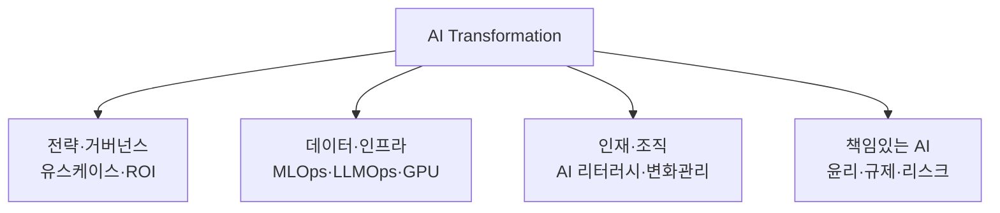

# AX(AI Transformation, AI 전환)

## 1. 개요

### 가. 정의
> 기업의 제품·서비스, 업무 프로세스, 의사결정, 나아가 비즈니스 모델 전반에 **AI를 핵심 동력으로 내재화**하여 운영체계 자체를 재설계하는 전사적(全社的) 혁신 활동. 디지털 전환(DX)의 다음 단계로, "디지털화된 것" 위에서 **AI가 판단·생성·자동화를 수행**하도록 조직을 재편하는 것을 목표로 한다.

AX의 본질은 AI를 **하나의 기능·도구가 아니라 운영의 축(operating backbone)으로 끌어올린다**는 데 있다. 과거의 AI 도입은 특정 부서가 챗봇이나 예측 모델을 붙이는 '점(点)'단위 프로젝트였지만, AX는 데이터·인프라·인재·프로세스·거버넌스를 함께 바꿔 AI가 조직 전체에 흐르게 하는 '면(面)'단위 전환이다. 즉 "AI를 쓰는 회사"에서 "AI로 돌아가는 회사(AI-native)"로 체질을 바꾸는 것이 AX다.

### 나. 등장 배경 및 필요성
AX가 화두가 된 결정적 계기는 **생성형 AI(LLM)의 등장**이다. 과거 AI는 별도의 데이터 과학자가 문제마다 모델을 학습시켜야 하는 진입장벽 높은 기술이었으나, 이제는 자연어로 지시하면 문서 요약·코드 생성·고객 응대를 수행하는 **범용 기술(GPT, General Purpose Technology)** 이 되었다. 이로써 AI 활용이 일부 전문가에서 전 직원으로 확산될 수 있는 조건이 갖춰졌고, 경쟁사가 AI로 생산성을 수십 % 끌어올리면 그렇지 못한 기업은 원가·속도에서 밀리게 되었다. 게다가 DX를 거치며 축적된 방대한 데이터가 AI의 '연료'로 쓰일 수 있게 되면서, "쌓아둔 데이터를 어떻게 가치로 전환할 것인가"라는 물음의 답으로 AX가 부상했다. 요컨대 AX는 **선택이 아니라 생존을 위한 경쟁력 재편**의 성격을 띤다.

## 2. AX 추진 체계(구성요소)

AX는 어느 한 축만으로 성립하지 않는다. 뛰어난 모델을 도입해도 데이터가 정비되지 않으면 성과가 나지 않고, 인프라가 있어도 직원이 쓰지 못하면 무용하며, 거버넌스가 없으면 환각·유출 사고로 오히려 위험이 커진다. 네 축이 맞물려야 전환이 지속된다.

| 구성요소 | 핵심 내용 | 왜 필요한가 |
|---|---|---|
| **전략·거버넌스** | AI 비전, 유스케이스 발굴·우선순위화, ROI 측정, CoE(전담조직) | 무엇을·왜 하는지 없으면 'AI를 위한 AI'로 표류 |
| **데이터·인프라** | 데이터 파이프라인·품질, MLOps/LLMOps, GPU·클라우드, RAG·벡터DB | AI 성능은 결국 데이터·운영 기반이 좌우 |
| **인재·조직** | AI 리터러시 교육, 리스킬링, 일하는 방식·프로세스 재설계 | 사람이 바뀌지 않으면 기술 도입은 파일럿에서 멈춤 |
| **책임있는 AI** | 환각·편향·저작권·프라이버시 통제, AI 윤리·규제 대응 | 신뢰가 없으면 확산 자체가 불가능 |

**전략·거버넌스**는 AX의 나침반이다. 현장에서 나오는 수많은 아이디어를 '효과 크기 × 실현 가능성'으로 우선순위화하고, 흩어진 시도를 조율하는 **AI CoE(Center of Excellence)** 를 두어 중복 투자와 표류를 막는다. **데이터·인프라**는 AX의 토대로, 특히 생성형 AI 시대에는 사내 지식을 답변에 결합하는 **RAG(검색증강생성)** 와 벡터DB, 그리고 모델의 배포·모니터링·재학습을 자동화하는 **LLMOps**가 핵심이 된다. **인재·조직**은 가장 어렵고 결정적인 축인데, 도구를 아무리 깔아도 직원이 업무 흐름 안에서 AI를 자연스럽게 쓰지 못하면 성과로 이어지지 않기 때문이다. 그래서 리터러시 교육과 함께 **일하는 방식 자체의 재설계**가 병행되어야 한다. 마지막으로 **책임있는 AI**는 확산의 전제 조건이다. 환각으로 잘못된 답을 고객에게 내보내거나 학습·프롬프트로 기밀이 유출되면 단 한 번의 사고로 전사 신뢰가 무너지므로, 통제 장치가 먼저 깔려야 확산이 가능하다.

## 3. DX와 AX의 차이(비교)

AX를 정확히 이해하려면 앞선 **DX(디지털 전환)** 와 대조하는 것이 효과적이다. 둘은 연속선 위에 있지만, **주체와 지향점**이 다르다. DX는 아날로그·수작업 프로세스를 디지털로 옮겨 **효율화·자동화**하는 데 초점이 있고, 여기서 사람은 여전히 판단의 주체이며 시스템은 이를 보조한다. 반면 AX는 그렇게 디지털화된 데이터 위에서 **AI가 판단·예측·생성을 직접 수행**하도록 하는 **지능화**로, 사람의 역할이 '실행'에서 'AI의 결과를 검증·조율하는 감독'으로 이동한다. 결정적 차이가 생기는 이유는 **데이터의 위상**에 있다. DX에서 데이터는 디지털화의 '산출물'이었지만, AX에서 데이터는 AI를 학습·구동하는 '연료'가 된다. 그래서 DX가 부실해 데이터가 정비되지 않은 조직은 AX에서 곧바로 벽에 부딪힌다.

| 구분 | DX(디지털 전환) | AX(AI 전환) |
|---|---|---|
| **지향점** | 효율화·자동화(디지털화) | 지능화·자율화(AI 내재화) |
| **핵심 주체** | 사람(시스템이 보조) | AI(사람이 감독·검증) |
| **데이터 위상** | 디지털화의 산출물 | AI를 구동하는 연료 |
| **대표 기술** | 클라우드·모바일·빅데이터 | LLM·생성형 AI·MLOps·RAG |
| **성과 지표** | 처리 시간·비용 절감 | 의사결정 품질·창의적 산출·자율 운영 |

## 4. AX 성숙도 단계

AX는 한 번에 완성되지 않고 성숙도를 밟아 올라간다. 각 단계는 앞 단계의 기반 위에서만 가능하므로, 데이터·조직 준비 없이 상위 단계로 건너뛰려는 시도는 대부분 실패한다.

| 단계 | 상태 | 예시 |
|---|---|---|
| **1. 도입(실험)** | 부서별 파일럿, 개인용 도구 활용 | 직원이 챗봇으로 문서 초안 작성 |
| **2. 활용(부분 통합)** | 특정 업무에 AI 내장, 유스케이스 확산 | 콜센터 AI 상담 어시스턴트 상시 운영 |
| **3. 내재화(전사 확산)** | 핵심 프로세스·의사결정에 AI 결합, 데이터·MLOps 표준화 | 수요예측·가격책정을 AI가 상시 수행 |
| **4. AI-Native(재창조)** | 비즈니스 모델 자체가 AI 기반, AI 없이는 운영 불가 | AI 에이전트가 업무를 자율 수행 |

1·2단계에서 3단계로 넘어가는 지점이 가장 어렵다. 개인·부서 단위 실험은 쉽게 시작되지만, 이를 전사 프로세스에 녹이려면 데이터 거버넌스·MLOps·조직 변화가 동시에 받쳐줘야 하기 때문이다. 많은 기업이 여기서 파일럿만 잔뜩 쌓인 채 확산되지 못하는 **'POC의 늪'** 에 빠진다.

## 5. 적용 사례

AX의 효과는 구체 사례에서 드러난다. **고객센터**에서는 상담원 옆에 실시간으로 답변 초안과 매뉴얼을 띄워주는 AI 어시스턴트를 붙여 평균 처리시간과 신입 상담원의 숙련 기간을 단축한 사례가 널리 보고된다. **소프트웨어 개발**에서는 코드 어시스턴트(예: 코드 자동완성·생성)를 도입해 반복 코드 작성 시간을 줄이고 개발자가 설계·검증에 집중하도록 역할을 재배치한다. **제조**에서는 설비 센서 데이터로 고장을 사전 예측하는 예지보전(PdM)으로 비계획 정지를 줄이고, **제약·소재** 분야에서는 AI가 후보 물질을 탐색해 신약·신소재 개발 주기를 단축한다. 공통점은 AI가 사람을 대체하기보다 **사람의 생산성과 판단을 증폭(augmentation)** 하는 방향으로 설계되었다는 점이다.

## 6. 고려사항 및 시사점(기술사 관점)
- **데이터 거버넌스가 전제**: AX의 성패는 결국 "믿을 수 있는 데이터를 얼마나 확보했는가"로 귀결된다. DX·데이터 정비가 부실하면 AX는 사상누각이 되므로, 데이터 품질·표준·접근권한 체계를 선행 구축해야 한다.
- **유스케이스 우선순위와 ROI**: 기술 자체가 목적이 되면 'AI를 위한 AI'로 표류한다. 효과 크기와 실현 가능성으로 유스케이스를 선별하고, 성과를 정량 측정해 확산 여부를 판단하는 규율이 필요하다.
- **POC의 늪 탈출**: 파일럿 성공과 전사 확산은 전혀 다른 문제다. 처음부터 확장(scale)을 전제로 데이터·MLOps·조직 변화를 함께 설계해야 3단계 내재화로 넘어갈 수 있다.
- **책임있는 AI·섀도우 AI 관리**: 환각·편향·저작권·개인정보 리스크에 대한 통제와, 직원이 통제 밖 외부 AI에 기밀을 입력하는 **섀도우 AI(Shadow AI)** 를 관리할 사내 안전한 AI 활용 정책·플랫폼이 필요하다.
- **변화관리와 리스킬링**: AX의 최대 장애물은 기술이 아니라 사람이다. AI가 대체하는 것이 아니라 역할을 바꾼다는 점을 이해시키고, 리스킬링과 인센티브로 저항을 조직 역량으로 전환해야 한다.
- **에이전트로의 진화 전망**: 단일 질의응답을 넘어 스스로 계획·도구사용·실행하는 **AI 에이전트**로 발전하면서, AX의 지향점은 '보조'에서 '자율 운영'으로 이동하고 있다. 이에 맞춘 신뢰성·통제 체계 설계가 다음 과제다.

---

> **한 줄 요약**: AX는 *전략·데이터/인프라·인재·책임있는 AI* 네 축으로 AI를 전사 운영에 내재화하는 전환으로, 프로세스를 디지털화하는 DX를 넘어 *AI가 판단·생성을 수행하는 지능화*를 지향하며, 데이터 거버넌스를 전제로 유스케이스·ROI 규율과 변화관리로 'POC의 늪'을 넘어 AI-Native로 나아간다.
