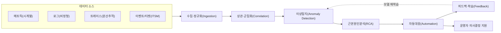
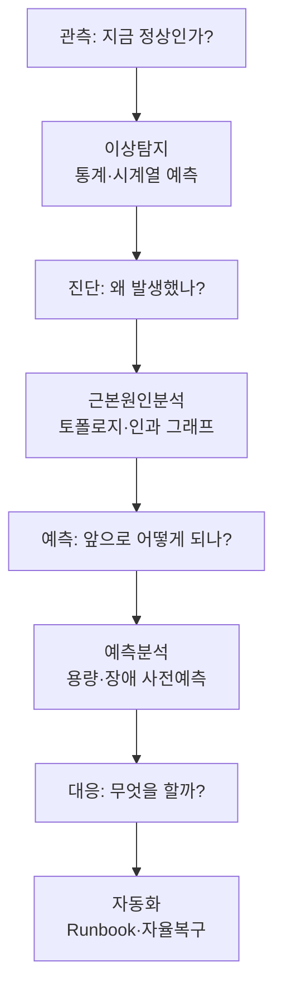

# AIOps(지능형 IT 운영, AI for IT Operations)

## 1. 개요

> **정의**: AIOps는 빅데이터와 머신러닝을 IT 운영에 적용하여, 방대한 운영 데이터(메트릭·로그·트레이스·이벤트)로부터 이상을 자동 탐지하고 근본 원인을 추론하며 대응을 자동화함으로써, 사람 중심의 사후 대응형 운영을 데이터 기반의 예측·자율형 운영으로 전환하는 접근 방식이다.

AIOps라는 용어는 2016년 가트너가 "Algorithmic IT Operations"의 의미로 제시한 뒤 "AI for IT Operations"로 정착했다.
등장 배경은 운영 환경 자체의 구조적 변화에 있다.
과거 모놀리식·물리 서버 시대에는 관리 대상이 정적이고 수가 적어, 숙련된 운영자가 임계치 기반 경보와 대시보드로 상황을 통제할 수 있었다.
그러나 마이크로서비스·컨테이너·서버리스·멀티클라우드가 확산되면서 하나의 사용자 요청이 수십 개 서비스를 거치고, 인스턴스는 수 분 단위로 생성·소멸하며, 하루에 수십억 건의 이벤트가 쏟아진다.
이런 환경에서는 사람이 로그를 눈으로 좇아 원인을 찾는 방식이 물리적으로 불가능해졌고, 경보의 양 또한 사람이 감당할 수 없는 수준(alert storm)으로 폭증했다.

두 번째 배경은 데이터의 사일로화이다.
모니터링 도구가 메트릭·로그·APM·네트워크별로 분리되어 있어, 하나의 장애를 여러 화면을 오가며 수작업으로 상관관계를 맞춰야 했다.
AIOps는 이 이질적 데이터를 하나의 파이프라인으로 수집·정규화하고, 통계·머신러닝으로 신호 대 잡음비를 높여, 운영자가 "무엇을 봐야 하는지"를 알고리즘이 먼저 좁혀 주는 것을 목표로 한다.

세 번째 배경은 비즈니스 요구이다.
디지털 서비스가 곧 매출인 시대에 장애의 평균 복구 시간(MTTR)은 직접적 손실로 이어진다.
MTTR의 대부분은 탐지가 아니라 "원인 규명(진단)"에 소요되므로, 진단을 자동화·가속하는 AIOps는 신뢰성(SRE)과 사업 연속성의 전제 조건이 된다.

AIOps는 단일 제품이 아니라 **데이터 수집 → 상관·군집 → 이상탐지 → 근본원인분석(RCA) → 자동대응**으로 이어지는 역량의 집합임을 답안에서 강조해야 한다.
또한 AIOps는 운영자를 대체하는 것이 아니라, 반복·대량 판단을 자동화하여 운영자가 고차원 의사결정에 집중하도록 돕는 **증강(augmentation)** 관점으로 이해하는 것이 실무·시험 모두에서 타당하다.

## 2. AIOps 전체 구조와 데이터 파이프라인

AIOps는 이질적 소스에서 데이터를 모아 단계적으로 가치를 정제하는 파이프라인 구조를 가진다.
아래 개념도는 데이터가 수집부터 자율대응까지 흐르는 전체 골격을 나타낸다.

**데이터 수집·정규화** 단계는 서로 다른 포맷·타임스탬프·태그 체계를 통일하는 작업이다.
메트릭은 규칙적 시계열이지만 로그는 비정형 텍스트이고 트레이스는 그래프 구조여서, 공통 엔티티(서비스·호스트·요청 ID)로 연결(join)할 수 있도록 표준화(예: OpenTelemetry 규약)하는 것이 이후 모든 분석의 품질을 좌우한다.
정규화가 부실하면 서로 다른 신호를 같은 사건으로 묶지 못해, 이후 상관분석이 무력화된다.

**상관·군집화** 단계는 폭증하는 경보를 사건(incident) 단위로 압축한다.
동일 원인에서 파생된 수천 개의 경보를 시간·토폴로지·텍스트 유사도 기준으로 묶어(alert clustering/de-duplication), 운영자가 봐야 할 대상을 수십 개에서 하나로 줄인다.
예컨대 DB 하나가 느려지면 이를 호출하는 40개 서비스가 동시에 지연 경보를 내지만, 상관화는 이를 "DB 지연"이라는 단일 사건으로 통합한다.

**이상탐지** 단계는 정적 임계치의 한계를 극복한다.
전통적 방식은 "CPU 80% 초과 시 경보"처럼 고정 임계치를 쓰지만, 트래픽은 주중·주말·시간대에 따라 크게 달라져 오탐(false positive)과 미탐(false negative)이 잦다.
AIOps는 계절성·추세를 학습한 동적 기준선(dynamic baseline)을 만들고, 실제 값이 예측 구간을 벗어날 때만 경보한다.

## 3. 핵심 기법과 분석 계층

AIOps의 분석 계층은 목적에 따라 서로 다른 머신러닝 기법을 조합한다.
아래 다이어그램은 각 계층이 어떤 질문에 답하는지를 프로세스 관점으로 표현한다.

### 가. 이상탐지(Anomaly Detection)

이상탐지는 AIOps의 출발점으로, "무엇이 평소와 다른가"를 판별한다.
시계열 지표에는 계절성 분해(STL)나 지수평활·ARIMA 계열의 예측 모델로 기대값과 예측구간을 산출하고, 관측값이 이를 벗어나면 이상으로 표시한다.
비정형 로그에는 로그를 템플릿으로 파싱(log parsing)한 뒤 등장 빈도·순서의 급변을 탐지하며, 다차원 지표에는 Isolation Forest·오토인코더 같은 비지도 학습으로 정상 패턴에서 멀리 떨어진 점을 이상치로 본다.
핵심 설계 과제는 **오탐과 미탐의 균형**이다.
민감도를 높이면 경보 피로가 커지고, 낮추면 실제 장애를 놓친다.
따라서 운영자의 확인·기각 결과를 다시 학습에 반영하는 피드백 루프가 실용성의 관건이 된다.

### 나. 상관분석과 노이즈 감소(Correlation & Noise Reduction)

대규모 시스템에서 하나의 근본 원인은 수많은 증상 경보를 낳는다.
상관분석은 시간적 근접성, 서비스 의존 토폴로지, 로그 텍스트 유사도를 이용해 이들을 하나의 사건으로 묶는다.
실무에서 이 단계만으로도 경보량을 90% 이상 줄였다는 사례가 보고되며, 이는 운영자의 인지 부하를 결정적으로 낮춘다.
토폴로지 정보(서비스 맵, CMDB)를 결합하면 "상류(upstream) 서비스의 장애가 하류로 전파된 것"임을 구분해 진짜 원인에 가까운 경보만 남길 수 있다.

### 다. 근본원인분석(Root Cause Analysis, RCA)

RCA는 묶인 사건에서 최초 원인을 추론하는 가장 어려운 계층이다.
서비스 의존 그래프에서 이상이 전파된 경로를 역추적하고, 변경 이벤트(배포·설정 변경·인프라 스케일링)와의 시간적 인과를 대조한다.
"장애 직전 배포가 있었는가", "특정 노드에서만 발생하는가" 같은 특징을 결합해 후보 원인의 순위를 매긴다.
최근에는 인과추론(causal inference)과 그래프 신경망을 활용해 상관과 인과를 구분하려는 연구가 활발하며, LLM을 결합해 로그·변경 이력을 자연어로 요약하고 가설을 제시하는 방향(생성형 AIOps)도 부상하고 있다.

### 라. 예측분석과 자동화(Prediction & Automation)

예측분석은 추세를 학습해 용량 소진 시점이나 디스크 포화, 성능 저하를 사전에 경고한다(예: "3일 뒤 스토리지 95% 도달").
자동화(자율복구)는 탐지·진단 결과를 사전 정의된 런북(runbook)이나 정책과 연결해 조치를 실행한다.
자동 스케일 아웃, 파드 재기동, 트래픽 우회, 티켓 자동 생성·분류 등이 대표적이다.
자동화는 신뢰 수준에 따라 **사람 승인형(human-in-the-loop) → 권고형 → 완전 자율형**으로 단계적으로 확대하는 것이 안전하다.

아래 표는 각 계층의 목적과 대표 기법을 정리한 보조 자료이다.

| 계층 | 답하는 질문 | 대표 기법 | 산출물 |
|------|------------|-----------|--------|
| 이상탐지 | 지금 이상한가 | STL·ARIMA·오토인코더·Isolation Forest | 이상 신호 |
| 상관·군집 | 같은 사건인가 | 시간·토폴로지·텍스트 유사도 군집 | 통합 사건 |
| 근본원인분석 | 왜 발생했나 | 의존그래프·변경대조·인과추론 | 원인 후보 순위 |
| 예측분석 | 앞으로 어떻게 | 시계열 예측·회귀 | 용량·장애 예측 |
| 자동화 | 무엇을 할까 | 런북·정책엔진·RPA | 자율/권고 조치 |

## 4. 유사 개념 비교와 도입 사례

AIOps는 인접 개념과 자주 혼동되므로 차이를 원리 수준에서 구분해야 한다.
전통 **모니터링**은 사람이 정의한 임계치·규칙에 의존해 "알려진 실패"만 탐지하지만, AIOps는 학습된 기준선으로 "알지 못한 이상"까지 다룬다.
**옵저버빌리티**는 시스템이 충분한 텔레메트리를 방출하도록 하는 *속성*이고, AIOps는 그 텔레메트리를 *지능적으로 분석*하는 계층으로, 옵저버빌리티가 좋은 입력 데이터를 만들면 AIOps의 정확도가 높아지는 상호 보완 관계다.
**MLOps**는 머신러닝 모델 자체의 개발·배포·운영 생애주기를 관리하는 것인 반면, AIOps는 IT 인프라·서비스 운영에 머신러닝을 *적용*하는 것으로 목적이 다르다.
**DevOps**가 개발과 운영의 프로세스·문화 통합이라면, AIOps는 그 운영 단계를 데이터로 지능화하는 기술적 보강이라 할 수 있다.

도입 사례를 보면, 대형 커머스·금융 기업들은 블랙프라이데이·명절 트래픽 급증 구간에서 동적 기준선 기반 이상탐지로 오탐 경보를 크게 줄이고, 상관화로 장애 사건 수를 수천 건에서 수십 건으로 압축했다고 보고한다.
통신·클라우드 사업자는 네트워크 장비 로그에 예측 모델을 적용해 장애를 사전 인지하고 자동 우회함으로써 MTTR을 단축한 사례를 제시한다.
국내에서도 대규모 공공·금융 시스템 운영에 이상탐지·경보 통합을 우선 적용해 야간·주말 운영 인력의 부담을 낮추는 방향으로 확산되고 있다.
다만 이런 성과는 데이터 품질과 토폴로지 정보의 정합성에 크게 좌우되므로, 사례의 수치를 일반화하기보다 자사 환경의 데이터 성숙도에 맞춰 기대치를 조정해야 한다.

## 5. 심화: 도입 성숙도와 최신 동향

AIOps 도입은 한 번에 자율운영에 도달하지 않으며, 성숙도 단계를 밟는 것이 현실적이다.
1단계는 **데이터 통합·가시화**로 사일로를 없애는 것, 2단계는 **이상탐지·경보 통합**으로 노이즈를 줄이는 것, 3단계는 **근본원인분석·예측**으로 진단을 가속하는 것, 4단계는 **자율복구**로 대응까지 자동화하는 것이다.
많은 조직이 2~3단계에 머무는데, 이는 완전 자율화가 잘못된 자동 조치로 장애를 확대할 위험(automation risk)을 동반하기 때문이다.

최신 동향으로는 **생성형 AI·LLM의 결합**이 두드러진다.
LLM은 방대한 로그·변경 이력·문서를 자연어로 요약하고, "왜 이 장애가 났고 무엇을 해야 하는가"를 대화형으로 제시하는 코파일럿(copilot) 형태로 운영자를 보조한다.
다만 LLM의 환각(hallucination) 위험 때문에 근거 데이터에 기반한 검증(RAG·인용)과 사람 확인이 병행되어야 한다.
또한 관측 데이터가 개인정보·기밀을 포함할 수 있어, 학습·추론 과정의 데이터 최소화와 접근통제가 신뢰성 확보의 필수 조건으로 부상하고 있다.
표준화 측면에서는 OpenTelemetry가 텔레메트리 수집의 사실상 표준으로 자리 잡으며 벤더 종속을 낮추고 있어, AIOps 도구 선택의 유연성을 높이는 기반이 되고 있다.

## 6. 고려사항 및 시사점

기술사 관점에서 AIOps 도입은 다음을 종합적으로 고려해야 한다.

- **데이터 품질이 성패를 좌우한다**: 태그 체계·타임스탬프·토폴로지(CMDB) 정합성이 낮으면 어떤 알고리즘도 오답을 낸다. AIOps 투자에 앞서 데이터 표준화(OpenTelemetry 등)와 서비스 맵 정비가 선행되어야 하며, "쓰레기를 넣으면 쓰레기가 나온다"는 원칙이 그대로 적용된다.
- **오탐·미탐과 신뢰의 트레이드오프**: 민감도를 높이면 경보 피로가, 낮추면 장애 누락이 발생한다. 초기에는 권고형으로 운영하며 피드백으로 모델을 교정하고, 신뢰가 쌓인 시나리오부터 점진적으로 자동화를 확대하는 단계적 접근이 안전하다.
- **자동화 리스크와 통제 장치**: 자율복구는 효율을 높이지만 잘못된 조치가 장애를 증폭할 수 있다. 조치 범위 제한, 롤백 전략, 서킷 브레이커, 사람 승인 게이트 같은 안전장치를 함께 설계해야 한다.
- **조직·프로세스 변화(문화)**: AIOps는 도구 도입이 아니라 운영 방식의 전환이다. 운영자는 "경보 처리자"에서 "모델을 길들이고 검증하는 감독자"로 역할이 바뀌며, ITSM 프로세스·SRE 문화와의 정합이 필요하다.
- **보안·프라이버시·거버넌스**: 운영 데이터에는 민감정보가 섞일 수 있고, 자동 조치는 감사 추적이 필요하다. 데이터 최소화·접근통제·조치 로깅을 갖춰 설명가능성과 책임추적성을 확보해야 한다.
- **전망과 연계 기술**: 옵저버빌리티·SRE·MLOps·플랫폼 엔지니어링과 결합해 "관측 → 분석 → 자율대응"의 폐루프를 이루는 방향으로 진화하며, 생성형 AI 코파일럿과 인과추론의 성숙에 따라 진단의 자동화 수준이 한층 높아질 것으로 전망된다.

---

> **한 줄 요약**: AIOps는 빅데이터·머신러닝으로 IT 운영의 이상탐지·상관분석·근본원인분석·예측·자동대응을 지능화하여, 사후 대응형 운영을 예측·자율형으로 전환하는 접근으로, 데이터 품질과 단계적 자동화, 안전장치 설계가 성패를 가른다.
