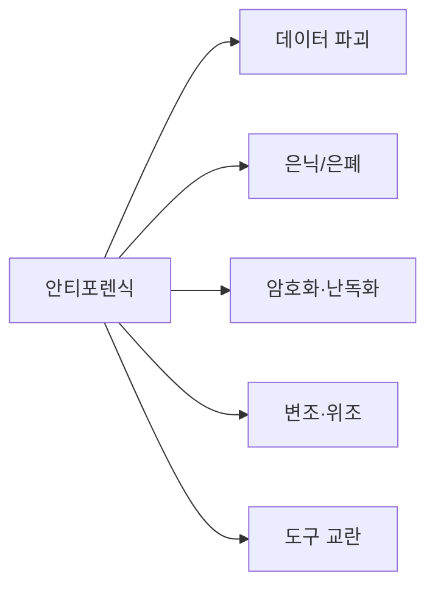
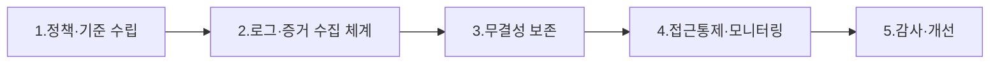

# 안티포렌식(Anti-Forensic)과 대응 컴플라이언스

## 1. 개요

### 가. 정의
> 디지털 포렌식의 **증거 수집·분석·법적 제출**을 방해·회피·무력화할 목적으로 데이터를 **은닉·삭제·변조·위조**하거나 분석 도구를 교란하는 기술 및 행위.

### 나. 등장 배경
- 포렌식 수사 기법의 **고도화·표준화**에 대한 반작용(창과 방패)
- 범죄 은폐, 내부정보 유출 증거 인멸, 랜섬웨어·해킹 흔적 제거
- 암호화·클라우드·대용량 저장매체 확산으로 **은닉 표면 확대**

## 2. 안티포렌식 기술 분류

| 유형 | 세부 기법 | 대응 난이도 |
|---|---|---|
| **데이터 파괴** | 와이핑(Gutmann·DoD 방식), 디가우징, 물리 파괴 | 복구 거의 불가 |
| **은닉(Hiding)** | 스테가노그래피, 슬랙공간·HPA/DCO, 숨김 파티션, ADS | 높음 |
| **암호화·난독화** | 풀디스크 암호화(BitLocker), 볼륨 암호화, 패킹 | 키 확보 관건 |
| **변조·위조** | 타임스탬프 변조(Timestomp), 로그 삭제·위조, 메타데이터 조작 | 무결성 검증 필요 |
| **도구 교란** | 포렌식 툴 취약점 악용, 안티디버깅, 메모리 상주형(무파일) | 매우 높음 |

## 3. 대응: 컴플라이언스 시스템 구축 프로세스

| 단계 | 활동 내용 |
|---|---|
| **정책·기준 수립** | 증거관리 정책, 법적 요건(전자문서법·형소법) 정의, 보존기간 |
| **로그·증거 수집** | 통합로그(SIEM), 엔드포인트(EDR), 이미징 자동화 — **삭제 전 선제 수집** |
| **무결성 보존** | 해시(SHA-256)·전자서명·타임스탬프, **WORM 저장**, 이중화 |
| **접근통제·모니터링** | 최소권한·직무분리, 이상행위(대량삭제·와이핑) 탐지 |
| **감사·개선** | 정기 감사, CoC(Chain of Custody) 점검, 사후 개선 |

## 4. 대응 활용 프로세스(사고 발생 시)

| 단계 | 내용 |
|---|---|
| **탐지(Detect)** | 삭제·변조·이상행위 실시간 탐지(EDR·SIEM 룰) |
| **보존(Preserve)** | 증거보전, **CoC** 유지(수집→보관→분석→제출 이력) |
| **분석(Analyze)** | 타임라인 분석, 복구(카빙), 은닉 데이터 탐색 |
| **대응·보고(Respond)** | 법적 대응, 재발방지 통제 강화, 감사 보고 |

## 5. 고려사항 및 시사점
- **선제적 증거 수집**이 핵심 — 삭제된 뒤엔 복구 한계
- 암호화·클라우드 환경에서는 **키 관리·라이브 포렌식**(메모리) 병행
- 법적 증거능력을 위해 **무결성·CoC·적법절차**(영장주의) 준수
- AI 기반 이상탐지·자동 이미징으로 대응 자동화 확대

---

> **한 줄 요약**: 안티포렌식은 *증거를 파괴·은닉·변조·위조하고 도구를 교란해 포렌식을 무력화* 하는 기술이며, 컴플라이언스 시스템은 정책→선제적 증거수집→무결성 보존(해시·WORM·CoC)→모니터링→감사로 구축하고, 사고 시 탐지-보존-분석-대응 프로세스로 활용한다.
