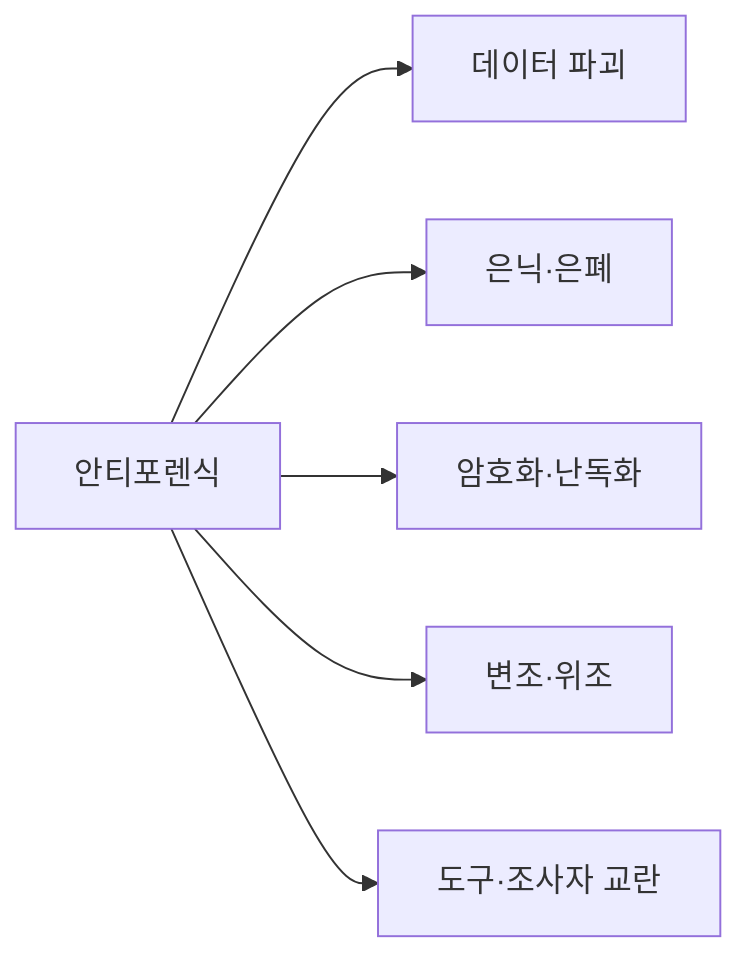
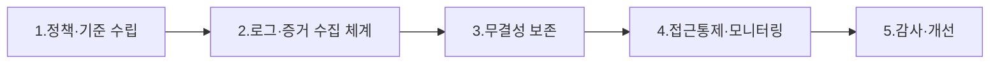

# 안티포렌식(Anti-Forensic)과 대응 컴플라이언스

## 1. 개요

### 가. 정의
> 디지털 포렌식의 **증거 수집·분석·법적 제출**을 방해·회피·무력화할 목적으로, 데이터를 **은닉·삭제·변조·위조**하거나 분석 도구·조사자를 교란하는 기술 및 행위의 총칭.

안티포렌식은 포렌식과 **창과 방패의 관계**에 있다. 포렌식이 삭제된 데이터를 복구하고 행위 흔적을 타임라인으로 재구성하는 기술을 발전시킬수록, 이를 무력화하려는 안티포렌식도 정교해진다. 목적은 증거의 세 가지 속성 즉 **존재·무결성·해석 가능성** 중 하나 이상을 파괴해, 증거로서의 가치나 법적 증거능력을 떨어뜨리는 데 있다.

### 나. 등장 배경 및 필요성
포렌식 수사 기법이 고도화·표준화되자 그 반작용으로 흔적 제거 도구가 대중화됐고, 범죄 은폐·내부정보 유출 증거 인멸·랜섬웨어와 해킹 흔적 삭제 등에서 광범위하게 쓰인다. 여기에 풀디스크 암호화의 기본 탑재, 클라우드·대용량 저장매체 확산, 메모리 상주형(무파일) 공격의 증가로 **증거가 숨을 수 있는 표면 자체가 넓어졌다**. 이 때문에 기업·기관은 사고 후 대응이 아니라, 증거가 삭제되기 전에 미리 확보·보존하는 **선제적 컴플라이언스 체계**를 갖추어야 한다.

## 2. 안티포렌식 기술 분류

기법들은 "증거를 **없애는가**(파괴), **숨기는가**(은닉·암호화), **속이는가**(변조·위조), **분석을 방해하는가**(도구 교란)"라는 목적에 따라 나뉜다. 목적이 다르므로 대응 방식도 달라지는데, 파괴는 사전 백업으로, 은닉은 탐색 기법으로, 변조는 무결성 검증으로, 도구 교란은 다중 도구·라이브 포렌식으로 각각 맞선다.

| 유형 | 세부 기법 | 대응 난이도 | 대응의 초점 |
|---|---|---|---|
| **데이터 파괴** | 와이핑(Gutmann·DoD 방식), 디가우징, 물리 파괴 | 복구 거의 불가 | 삭제 전 선제 수집·백업 |
| **은닉(Hiding)** | 스테가노그래피, 슬랙공간·HPA/DCO, 숨김 파티션, ADS | 높음 | 저수준 이미징·은닉영역 탐색 |
| **암호화·난독화** | 풀디스크 암호화(BitLocker), 볼륨 암호화, 패킹 | 키 확보가 관건 | 라이브 포렌식·키/메모리 확보 |
| **변조·위조** | 타임스탬프 변조(Timestomp), 로그 삭제·위조, 메타데이터 조작 | 무결성 교차검증 필요 | 다중 소스 대사·해시 검증 |
| **도구 교란** | 포렌식 툴 취약점 악용, 안티디버깅, 메모리 상주형(무파일) | 매우 높음 | 메모리 포렌식·다중 도구 |

특히 **데이터 파괴**는 왜 대응이 어려운가 하면, Gutmann·DoD 방식의 다중 덮어쓰기나 디가우징은 자기 기록 자체를 물리적으로 지우기 때문에 사후 복구가 사실상 불가능하다. 그래서 이 유형만큼은 "**삭제되기 전에 이미 수집해 두는 것**"이 유일하게 확실한 대응이며, 이것이 아래 컴플라이언스 체계의 설계 원리가 된다.

## 3. 대응: 컴플라이언스 시스템 구축 프로세스

컴플라이언스 체계의 핵심 설계 원칙은 "**선제성**"과 "**무결성**"이다. 안티포렌식의 상당수가 증거를 나중에 지우거나 바꾸는 것을 노리므로, 방어는 증거를 **실시간으로 외부의 변경 불가능한 저장소에 복제·보존**하는 데 초점을 둔다.

| 단계 | 활동 내용 | 왜 필요한가 |
|---|---|---|
| **정책·기준 수립** | 증거관리 정책, 법적 요건(전자문서법·형소법) 정의, 보존기간 | 적법절차·증거능력의 근거 마련 |
| **로그·증거 수집** | 통합로그(SIEM), 엔드포인트(EDR), 이미징 자동화 — **삭제 전 선제 수집** | 파괴 전 증거 확보가 유일한 확실책 |
| **무결성 보존** | 해시(SHA-256)·전자서명·타임스탬프, **WORM 저장**, 이중화 | 사후 변조·위조 원천 차단 |
| **접근통제·모니터링** | 최소권한·직무분리, 이상행위(대량삭제·와이핑) 탐지 | 내부자의 증거 인멸 억제·조기 탐지 |
| **감사·개선** | 정기 감사, CoC(Chain of Custody) 점검, 사후 개선 | 절차 준수 검증·체계 개선 |

여기서 **WORM(Write Once Read Many) 저장**과 해시 체인이 왜 결정적인가 하면, 한 번 기록되면 수정·삭제가 불가능하므로 관리자 권한을 탈취한 공격자도 이미 남긴 로그를 되돌릴 수 없다. 로그를 로컬에만 두면 침입자가 함께 지우지만, WORM·원격 SIEM으로 즉시 밀어내면 삭제를 무력화한다.

## 4. 대응 활용 프로세스(사고 발생 시)

사고가 실제로 나면 표준 절차를 따라 움직여야 증거능력이 유지된다. 순서를 어기면(예: 보존 전 분석) 무결성이 깨져 법정에서 배척될 수 있다.

| 단계 | 내용 | 유의점 |
|---|---|---|
| **탐지(Detect)** | 삭제·변조·이상행위 실시간 탐지(EDR·SIEM 룰) | 대량삭제·와이핑 패턴 룰화 |
| **보존(Preserve)** | 증거보전, **CoC** 유지(수집→보관→분석→제출 이력) | 원본 훼손 금지, 사본으로 분석 |
| **분석(Analyze)** | 타임라인 분석, 복구(파일 카빙), 은닉 데이터 탐색 | 다중 소스 교차검증으로 변조 판별 |
| **대응·보고(Respond)** | 법적 대응, 재발방지 통제 강화, 감사 보고 | 근본원인 기반 통제 보강 |

**CoC(Chain of Custody, 증거관리 연속성)** 는 증거가 수집부터 제출까지 누가·언제·어떻게 다뤘는지의 끊김 없는 이력을 말한다. 이 사슬이 한 곳이라도 끊기면 "그 사이 조작됐을 수 있다"는 의심으로 증거능력을 잃으므로, 안티포렌식 대응의 법적 성패를 가르는 요소다.

## 5. 고려사항 및 시사점
- **선제적 증거 수집이 핵심**: 와이핑·디가우징으로 파괴된 뒤에는 복구가 불가능하므로, 실시간 로그 전송과 자동 이미징으로 "지워지기 전에" 확보하는 것이 방어의 출발점이다.
- **암호화·클라우드 환경 대응**: 풀디스크 암호화가 걸린 시스템은 전원을 끄면 키가 사라져 복호화가 어렵다. 따라서 시스템이 켜져 있을 때 메모리·키를 확보하는 **라이브 포렌식**을 병행해야 한다.
- **적법절차 준수**: 아무리 증거를 잘 모아도 영장주의·적법절차·CoC·무결성을 어기면 증거능력을 잃는다. 기술과 법적 요건을 함께 설계해야 한다.
- **자동화·AI 확대**: 대량삭제·비정상 접근을 AI 기반 이상탐지로 실시간 포착하고 자동 이미징으로 대응하는 방향으로 진화하고 있다.

---

> **한 줄 요약**: 안티포렌식은 *증거를 파괴·은닉·암호화·변조·위조하고 도구를 교란해 포렌식을 무력화*하는 기술이며, 대응 컴플라이언스는 정책→**선제적 증거수집**→무결성 보존(해시·WORM·CoC)→모니터링→감사로 구축하고, 사고 시 탐지-보존-분석-대응 절차와 적법절차 준수로 증거능력을 지킨다.
