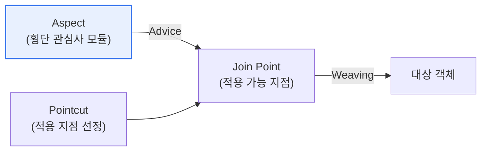

# AOP(Aspect Oriented Programming, 관점 지향 프로그래밍)

## 1. 개요

### 가. 정의
> 로깅·보안·트랜잭션처럼 여러 모듈에 걸쳐 반복되는 **횡단 관심사(Cross-cutting Concern)를 별도의 모듈(Aspect)로 분리**하여 관리하는 프로그래밍 패러다임. 객체지향(OOP)을 보완한다.

AOP의 핵심 발상은 '**흩어져 반복되는 공통 기능을 한곳에 모으는 것**'이다. 객체지향으로 잘 설계해도, 로깅·인증·트랜잭션·성능측정 같은 기능은 거의 모든 메서드에 똑같이 끼어들어야 한다. 이런 코드를 각 메서드마다 넣으면 핵심 비즈니스 로직이 부가 기능 코드에 파묻혀 지저분해지고, 로깅 방식을 바꾸려면 수백 곳을 고쳐야 한다. AOP는 이 **횡단 관심사를 Aspect라는 독립 모듈로 뽑아내고**, 실행 시점에 원하는 지점(Join Point)에 자동으로 끼워 넣는다(Weaving). 그러면 핵심 로직은 깨끗해지고, 공통 기능은 한곳에서 관리되어 변경이 쉬워진다. Spring 프레임워크의 트랜잭션·보안 처리가 대표적 활용이다.

### 나. 등장 배경
객체지향은 기능을 클래스로 잘 분리하지만, 여러 클래스에 공통으로 필요한 부가 기능(횡단 관심사)은 중복되거나 흩어지는 한계가 있었다. 이 모듈화의 사각지대를 해결하기 위해 AOP가 등장했다.

## 2. 구성요소

AOP는 몇 가지 핵심 개념으로 이뤄진다. **Aspect** 는 횡단 관심사를 모듈화한 단위이고, **Advice** 는 그 안에서 실제 수행할 부가 기능(코드)이다. **Join Point** 는 Advice가 끼어들 수 있는 지점(메서드 호출 등)이고, **Pointcut** 은 그 많은 Join Point 중 실제로 적용할 곳을 선정하는 표현식이다. **Weaving** 은 이 Aspect를 대상 코드에 실제로 엮어 넣는 과정이다.

| 구성요소 | 내용 |
|---|---|
| **Aspect** | 횡단 관심사를 모은 모듈 |
| **Advice** | 실제 수행할 부가 기능(Before·After·Around 등) |
| **Join Point** | Advice 적용 가능 지점(메서드 실행 등) |
| **Pointcut** | 적용할 Join Point 선정 표현식 |
| **Weaving** | Aspect를 대상에 엮는 과정(컴파일·로드·런타임) |

## 3. 기대효과

| 효과 | 내용 |
|---|---|
| **관심사 분리** | 핵심 로직과 부가 기능 분리로 코드 명료 |
| **중복 제거·재사용** | 공통 기능을 한곳에서 관리 |
| **유지보수성** | 부가 기능 변경 시 Aspect만 수정 |

## 4. 고려사항 및 시사점

1. **OOP의 보완재**로 이해해야 한다. AOP는 객체지향을 대체하는 것이 아니라, 객체지향이 잘 다루지 못하는 횡단 관심사를 보완해 함께 쓰인다.
2. **디버깅·추적의 어려움**에 유의한다. 코드에 명시되지 않은 기능이 실행 시점에 끼어들므로, 흐름 추적이 어려울 수 있어 Pointcut을 명확히 관리해야 한다.
3. **프레임워크 기반 활용**이 일반적이다. Spring AOP처럼 트랜잭션·보안·로깅을 선언적으로 적용하는 방식으로 널리 쓰이며, 관심사 분리로 클린 아키텍처를 지원한다.

---

> **한 줄 요약**: AOP는 *로깅·보안·트랜잭션 같은 횡단 관심사를 Aspect로 분리* 해 실행 시점에 Weaving으로 끼워 넣는 패러다임으로, Aspect·Advice·Pointcut·Join Point로 구성되며 OOP를 보완해 코드 명료성과 유지보수성을 높인다.
