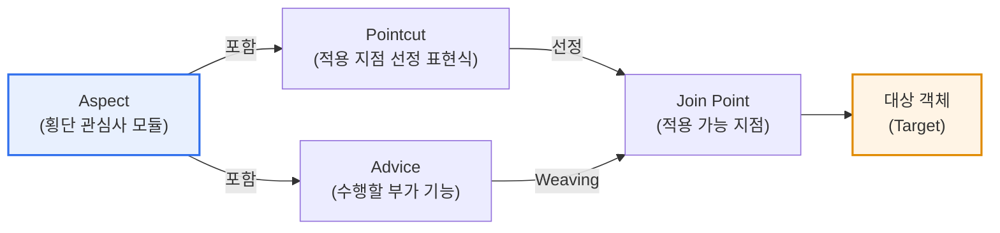
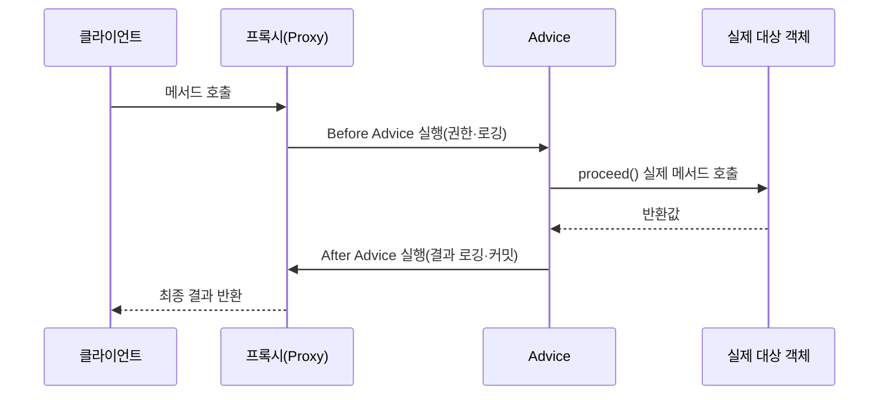

# AOP(Aspect Oriented Programming, 관점 지향 프로그래밍)

## 1. 개요

### 가. 정의
> 로깅·보안·트랜잭션처럼 여러 모듈에 걸쳐 반복되는 **횡단 관심사(Cross-cutting Concern)를 Aspect라는 독립 모듈로 분리**하고, 실행 흐름의 특정 지점(Join Point)에 자동으로 엮어 넣어(Weaving) 핵심 로직과 부가 기능을 분리하는 프로그래밍 패러다임. 객체지향(OOP)을 대체하지 않고 보완한다.

AOP의 핵심 발상은 '**흩어져 반복되는 공통 기능을 한곳에 모으는 것**'이다. 객체지향으로 아무리 잘 설계해도 로깅·인증·트랜잭션·성능측정·예외처리 같은 기능은 거의 모든 메서드에 똑같이 끼어들어야 한다. 이런 코드를 각 메서드마다 직접 넣으면 핵심 비즈니스 로직이 부가 기능 코드에 파묻혀 가독성이 떨어지고, 나중에 로깅 방식 하나를 바꾸려 해도 수백 곳을 일일이 고쳐야 한다. 이는 단순 불편을 넘어 변경 누락에 따른 결함(예: 특정 서비스 메서드에만 트랜잭션이 빠져 데이터 정합성이 깨지는 사고)으로 이어진다.

AOP는 이 문제를 **횡단 관심사를 Aspect라는 별도 모듈로 뽑아내고**, 컴파일·클래스로딩·런타임 중 원하는 시점에 대상 코드의 특정 지점에 자동으로 끼워 넣는 방식으로 해결한다. 그 결과 핵심 로직은 순수한 업무 코드만 남아 깨끗해지고, 공통 기능은 한곳에서 관리되어 변경이 쉬워진다. 대표적으로 Spring 프레임워크는 `@Transactional` 애너테이션 하나로 메서드 실행 전후에 트랜잭션 시작·커밋·롤백 코드를 자동으로 엮어 넣는데, 이것이 바로 AOP를 이용한 선언적 트랜잭션 처리다. 개발자는 트랜잭션 경계를 매번 손으로 코딩하지 않고 "이 메서드는 트랜잭션 대상"이라고 선언만 하면 된다.

### 나. 등장 배경과 필요성
객체지향은 기능을 클래스라는 수직적 단위로 잘 분리한다. 그러나 로깅·보안·트랜잭션처럼 **여러 클래스를 가로지르며 공통으로 필요한 부가 기능은 어느 한 클래스에도 온전히 속하지 않는다**. 이런 기능을 억지로 상속이나 유틸리티 호출로 처리하면 코드 중복(Code Scattering)과 관심사 엉킴(Code Tangling)이라는 두 가지 고질적 문제가 생긴다. 코드 산재는 같은 로깅 코드가 수백 메서드에 흩어지는 현상이고, 관심사 엉킴은 한 메서드 안에 업무 로직·로깅·보안 검사가 뒤섞이는 현상이다.

AOP는 1997년 제록스 팔로알토 연구소(Xerox PARC)의 그레고르 키자레스(Gregor Kiczales) 연구팀이 제안했고, 이후 Java 진영의 AspectJ와 Spring AOP를 통해 실무에 널리 자리 잡았다. 즉 AOP는 객체지향의 "모듈화 사각지대"를 메우기 위한 보완 패러다임으로 등장했으며, 오늘날 엔터프라이즈 프레임워크의 트랜잭션·보안·모니터링을 떠받치는 핵심 기술이 되었다.

### 다. 특징
AOP는 ① 횡단 관심사의 **모듈화**, ② 핵심 로직과 부가 기능의 **관심사 분리(SoC)**, ③ 선언적 방식으로 부가 기능을 적용하는 **비침투성(Non-invasive)** 을 특징으로 한다. 특히 Spring AOP는 대상 코드를 직접 수정하지 않고 프록시로 감싸 부가 기능을 적용하므로, 기존 비즈니스 코드를 건드리지 않고도 공통 기능을 얹거나 뗄 수 있다.

## 2. 핵심 구성요소

AOP를 이해하려면 다섯 가지 핵심 개념이 어떻게 맞물리는지 알아야 한다. 아래 전체 구조도는 이 개념들의 관계를, 그다음 상세 흐름도는 실제 메서드 호출 시점에 Advice가 어떻게 끼어드는지를 보여준다.

```mermaid
flowchart LR
  A["Aspect<br/>(횡단 관심사 모듈)"] -->|포함| AD["Advice<br/>(수행할 부가 기능)"]
  A -->|포함| PC["Pointcut<br/>(적용 지점 선정 표현식)"]
  PC -->|선정| J["Join Point<br/>(적용 가능 지점)"]
  AD -->|Weaving| J
  J --> T["대상 객체<br/>(Target)"]
  style A fill:#e8f0fe,stroke:#2f6fed,stroke-width:2px
  style T fill:#fff4e5,stroke:#e08a00,stroke-width:2px
```

**Aspect** 는 횡단 관심사를 모듈화한 단위로, 그 안에 "무엇을 할지(Advice)"와 "어디에 적용할지(Pointcut)"를 함께 담는다. **Advice** 는 Aspect가 실제로 수행하는 부가 기능 코드이며 실행 시점에 따라 여러 종류로 나뉜다. **Join Point** 는 Advice가 끼어들 수 있는 프로그램 실행상의 모든 후보 지점(메서드 호출, 예외 발생 등)이고, **Pointcut** 은 그 수많은 후보 중 실제로 적용할 지점을 골라내는 표현식이다. **Weaving** 은 이렇게 고른 지점에 Aspect를 실제로 엮어 넣는 과정이다.

| 구성요소 | 역할 | 예시 |
|---|---|---|
| **Aspect** | 횡단 관심사를 모은 모듈 | `LoggingAspect`, `TxAspect` |
| **Advice** | 실제 수행할 부가 기능 | 메서드 전후 로그 기록 |
| **Join Point** | Advice 적용 가능 지점 | 메서드 실행, 예외 처리 |
| **Pointcut** | 적용할 Join Point 선정 표현식 | `execution(* service..*(..))` |
| **Weaving** | Aspect를 대상에 엮는 과정 | 컴파일·로드·런타임 위빙 |
| **Target** | Advice가 적용되는 대상 객체 | 실제 비즈니스 빈(Bean) |

### 가. Advice의 종류 — 실행 시점이 만드는 차이
Advice는 대상 메서드의 어느 시점에 끼어드느냐에 따라 나뉘며, 이 선택이 실무에서 매우 중요하다. **Before** 는 메서드 실행 직전에(예: 권한 검사), **After Returning** 은 정상 반환 직후에(예: 결과 로깅), **After Throwing** 은 예외 발생 시에(예: 오류 알림), **After(finally)** 는 성공·실패와 무관하게 항상, **Around** 는 메서드 실행 전후를 모두 감싸 실행 자체를 제어(예: 실행 시간 측정, 캐싱, 재시도)한다.

이 중 Around가 가장 강력하지만 그만큼 위험하다. Around는 대상 메서드의 호출 여부까지 직접 결정하므로, 개발자가 `proceed()` 호출을 빠뜨리면 정작 핵심 로직이 실행되지 않는 결함이 생긴다. 따라서 단순 로깅에는 Before/After를, 실행 흐름 제어가 꼭 필요한 트랜잭션·캐싱에는 Around를 쓰는 식으로 목적에 맞게 선택하는 것이 원칙이다.

### 나. Weaving 시점 — 세 가지 방식의 트레이드오프
Weaving을 언제 하느냐에 따라 AspectJ 계열은 컴파일 타임 위빙(CTW)·로드 타임 위빙(LTW)을, Spring AOP는 런타임 위빙을 사용한다. 아래 상세 흐름도는 런타임 프록시 기반 위빙에서 클라이언트 호출이 프록시를 거쳐 Advice와 실제 메서드로 이어지는 과정을 나타낸다.

```mermaid
sequenceDiagram
  participant C as 클라이언트
  participant P as 프록시(Proxy)
  participant AD as Advice
  participant T as 실제 대상 객체
  C->>P: 메서드 호출
  P->>AD: Before Advice 실행(권한·로깅)
  AD->>T: proceed() 실제 메서드 호출
  T-->>AD: 반환값
  AD->>P: After Advice 실행(결과 로깅·커밋)
  P-->>C: 최종 결과 반환
```

컴파일 타임 위빙은 소스·바이트코드 컴파일 단계에서 Aspect를 직접 짜 넣어 런타임 성능이 가장 좋지만 전용 컴파일러(ajc)가 필요하다. 로드 타임 위빙은 클래스가 JVM에 로딩되는 순간 바이트코드를 변환하므로 유연하지만 별도 에이전트 설정이 필요하다. 런타임 위빙은 프록시 객체로 감싸는 방식이라 설정이 간단하고 순수 Java만으로 동작하지만, 프록시를 거치는 호출 오버헤드가 있고 프록시 특성상 **같은 객체 내부에서 자기 메서드를 직접 호출(self-invocation)하면 Advice가 적용되지 않는** 한계가 있다. 실제로 Spring에서 `@Transactional` 메서드를 같은 클래스의 다른 메서드가 직접 호출하면 트랜잭션이 걸리지 않는 유명한 함정이 여기서 비롯된다.

## 3. 기대효과와 적용 사례

AOP의 효과는 단순히 "코드가 깔끔해진다"를 넘어 정량적 이득으로 나타난다. 예컨대 100개 서비스 메서드에 각각 트랜잭션·로깅·권한 검사 코드를 넣으면 부가 코드만 수백 줄이 중복되지만, AOP로 분리하면 Aspect 3개(약 수십 줄)로 동일 기능을 처리하면서 핵심 메서드에서는 부가 코드가 완전히 사라진다. 로깅 정책을 바꿀 때 고칠 지점도 수백 곳에서 단 1곳(해당 Aspect)으로 줄어든다.

| 효과 | 내용 | 실무 함의 |
|---|---|---|
| **관심사 분리(SoC)** | 핵심 로직과 부가 기능 분리 | 비즈니스 코드 가독성·집중도 향상 |
| **중복 제거·재사용** | 공통 기능을 한곳에서 관리 | 변경 지점 수백→1곳으로 축소 |
| **유지보수성** | 부가 기능 변경 시 Aspect만 수정 | 변경 누락 결함 예방 |
| **비침투성** | 대상 코드 수정 없이 적용/해제 | 레거시에도 점진적 적용 가능 |

실제 산업 적용을 보면, 금융권 계정계 시스템은 모든 거래 서비스에 AOP로 트랜잭션과 감사 로그(누가·언제·무엇을 조회/변경했는지)를 일괄 적용해 규제(전자금융감독규정)가 요구하는 추적성을 확보한다. 대형 커머스 플랫폼은 AOP로 API 응답 시간을 지점별로 측정해 병목을 모니터링하고, 특정 메서드에 캐싱·재시도 로직을 선언적으로 얹어 장애 내성을 높인다. 또한 마이크로서비스에서는 AOP와 유사한 발상이 서비스 메시(Sidecar 프록시)로 확장되어, 인증·트래픽 제어·관측(Observability)을 애플리케이션 코드 밖에서 횡단적으로 처리한다.

### 가. Spring AOP와 AspectJ의 선택
실무에서 자주 부딪히는 결정은 "Spring AOP로 충분한가, AspectJ까지 가야 하는가"이다. 두 기술은 같은 AOP 개념을 구현하지만 적용 범위와 방식이 다르다. Spring AOP는 스프링 컨테이너가 관리하는 빈(Bean)의 **메서드 실행 Join Point만** 대상으로 하고 런타임 프록시로 동작한다. 설정이 간단하고 별도 컴파일러가 필요 없어 대다수 엔터프라이즈 애플리케이션에는 이것으로 충분하다.

반면 AspectJ는 필드 접근·생성자 호출·정적 초기화 등 **훨씬 넓은 Join Point**를 지원하고 컴파일/로드 타임 위빙으로 프록시 없이 바이트코드에 직접 짜 넣는다. 따라서 스프링 빈이 아닌 일반 객체에도 Aspect를 적용해야 하거나, 프록시 오버헤드·self-invocation 한계를 피해야 하는 고성능·세밀 제어 상황에서는 AspectJ가 적합하다. 정리하면, "관리 빈의 메서드 수준 공통 기능"은 Spring AOP, "그 경계를 넘는 전면적·세밀한 위빙"은 AspectJ라는 기준으로 선택한다.

| 구분 | Spring AOP | AspectJ |
|---|---|---|
| **Join Point 범위** | 스프링 빈의 메서드 실행 | 메서드·필드·생성자 등 광범위 |
| **위빙 방식** | 런타임 프록시 | 컴파일·로드 타임 바이트코드 |
| **성능** | 프록시 호출 오버헤드 | 프록시 없어 우수 |
| **적용 난이도** | 간단(순수 Java) | 전용 컴파일러·에이전트 필요 |
| **적합 상황** | 일반 엔터프라이즈 공통 기능 | 세밀·전면적 위빙, 고성능 |

## 4. OOP·AOP 비교

AOP는 OOP와 대립하는 것이 아니라 서로 다른 축의 모듈화를 담당한다. OOP가 데이터와 기능을 수직으로 캡슐화한다면, AOP는 여러 객체를 수평으로 가로지르는 관심사를 모듈화한다. 이 차이 때문에 둘은 경쟁이 아니라 병행 관계이며, 실무에서는 OOP로 도메인을 설계하고 AOP로 횡단 관심사를 얹는 조합이 표준이 되었다.

| 구분 | OOP | AOP |
|---|---|---|
| **모듈화 축** | 수직(클래스·상속) | 수평(횡단 관심사) |
| **주 관심** | 도메인 핵심 로직 | 로깅·보안·트랜잭션 등 공통 기능 |
| **분리 단위** | 클래스·객체 | Aspect |
| **관계** | 기반 패러다임 | OOP 보완재 |

## 5. 심화 — 현대 아키텍처에서의 확장과 출제 전략

AOP의 개념은 프레임워크 내부에 국한되지 않고 현대 클라우드 네이티브 아키텍처로 확장되고 있다. 대표적으로 **서비스 메시(Service Mesh, 예: Istio·Linkerd)** 는 각 서비스 옆에 사이드카 프록시(Envoy)를 붙여 인증(mTLS)·재시도·서킷브레이커·분산추적을 애플리케이션 코드 바깥에서 처리한다. 이는 "횡단 관심사를 코드에서 분리해 인프라 계층에서 위빙한다"는 점에서 AOP의 발상을 네트워크 수준으로 끌어올린 것으로 볼 수 있다. 또한 관측성(Observability) 표준인 OpenTelemetry의 자동 계측(auto-instrumentation)도 바이트코드 위빙 기법으로 메서드에 추적 코드를 삽입한다는 점에서 AOP와 기술적 뿌리를 공유한다.

기술사 시험 관점에서 AOP는 "SW공학·프레임워크" 영역의 단골 주제로, 단독 약술뿐 아니라 스프링 트랜잭션·클린 아키텍처·마이크로서비스 관측성과 엮어 출제될 수 있다. 답안 구성 시에는 ① 정의와 등장 배경(코드 산재·엉킴 문제), ② 5대 구성요소와 다이어그램, ③ Advice 종류·Weaving 시점의 트레이드오프, ④ Spring 실무 적용(선언적 트랜잭션)과 self-invocation 함정, ⑤ 서비스 메시로의 확장까지 계층적으로 전개하면 깊이를 보여줄 수 있다. 특히 "AOP의 한계나 주의점"을 묻는 변형 문제에는 프록시 오버헤드·디버깅 난이도·자기호출 함정을 근거와 함께 제시하는 것이 고득점 포인트다.

## 6. 고려사항 및 시사점

1. **OOP의 보완재로 위치시켜야 한다.** AOP는 객체지향을 대체하는 것이 아니라 객체지향이 다루지 못하는 횡단 관심사를 보완한다. 따라서 도메인 설계는 OOP로, 공통 기능은 AOP로 나누는 역할 분담 원칙을 지켜야 남용을 피할 수 있다.
2. **디버깅·추적의 어려움에 대비한다.** 코드에 명시되지 않은 기능이 실행 시점에 끼어들므로 흐름 추적이 어렵다. Pointcut 표현식을 명확하고 좁게 정의하고, 어떤 Aspect가 어디에 적용되는지 문서화·검증(테스트)해 "숨은 부작용"을 통제해야 한다.
3. **성능과 적용 방식의 트레이드오프를 판단한다.** 런타임 프록시 위빙은 설정이 간단하지만 호출 오버헤드와 self-invocation 한계가 있고, 컴파일/로드 타임 위빙은 성능은 좋으나 빌드·배포 복잡도가 올라간다. 시스템의 성능 요구와 운영 편의를 저울질해 위빙 방식을 선택해야 한다.
4. **과도한 적용(Aspect 남용)을 경계한다.** 모든 것을 Aspect로 빼면 오히려 실행 흐름이 불투명해지고 유지보수가 어려워진다. 로깅·트랜잭션·보안·감사처럼 진짜 횡단적인 관심사에 한정해 적용하는 절제가 필요하다.
5. **클라우드 네이티브로의 진화를 연계한다.** AOP의 관심사 분리 철학은 서비스 메시·OpenTelemetry 자동 계측 등 인프라 계층으로 확장되고 있으므로, 애플리케이션 AOP와 인프라 계층 횡단 처리를 조합해 전체 아키텍처의 관심사 분리를 설계하는 관점이 요구된다.

## 참고자료
- Spring Framework Reference — Aspect Oriented Programming with Spring: https://docs.spring.io/spring-framework/reference/core/aop.html
- The AspectJ Programming Guide (Eclipse): https://eclipse.dev/aspectj/doc/latest/progguide/index.html

---

> **한 줄 요약**: AOP는 *로깅·보안·트랜잭션 같은 횡단 관심사를 Aspect로 분리* 해 실행 시점(Join Point)에 Weaving으로 엮는 패러다임으로, Aspect·Advice·Pointcut·Join Point·Weaving으로 구성되며 OOP를 보완해 코드 명료성·유지보수성을 높이고 서비스 메시 등 클라우드 네이티브로 확장된다.
