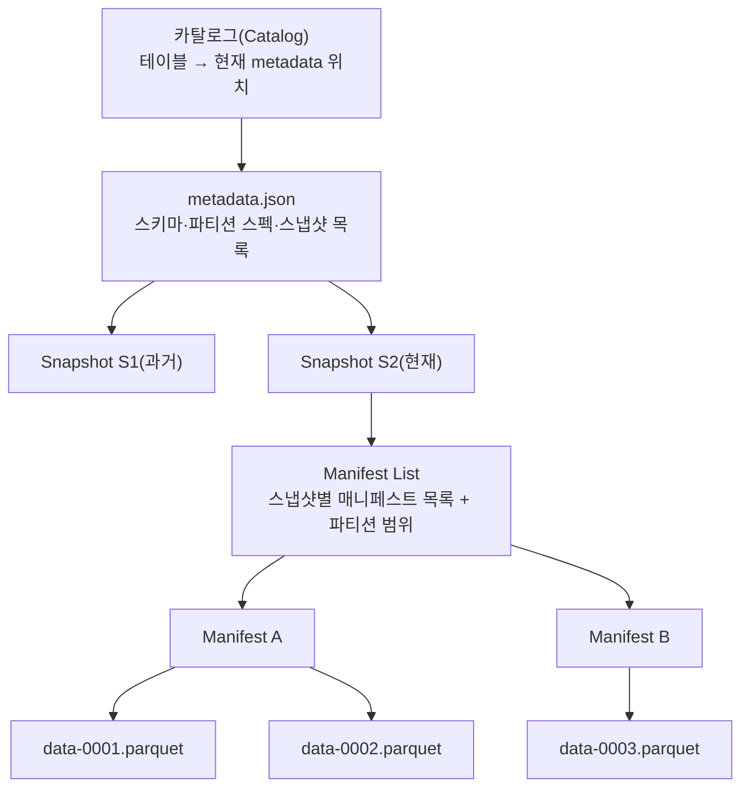
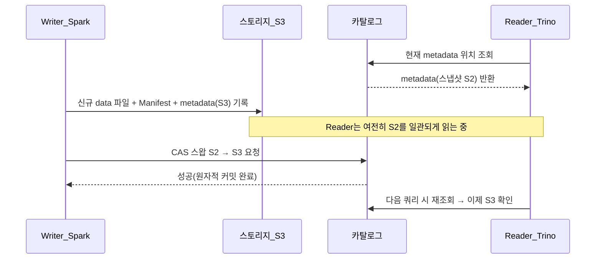

# 오픈 테이블 포맷(Apache Iceberg)

## 1. 개요

> **정의**: Apache Iceberg는 대규모 분석 데이터셋을 위한 **개방형 테이블 포맷(Open Table Format)**으로, 객체 스토리지(S3·HDFS·GCS 등) 위의 파일 집합에 **관계형 테이블의 의미론(ACID 트랜잭션·스키마 진화·타임 트래블)**을 부여하는 메타데이터 사양이다. 데이터 파일 자체가 아니라, "어떤 파일들이 특정 시점의 테이블을 구성하는가"를 기술하는 **메타데이터 계층의 표준**이다.

데이터 레이크는 저렴한 객체 스토리지에 원본 데이터를 그대로 적재할 수 있다는 장점 때문에 급속히 확산되었으나, 초기 데이터 레이크는 사실상 "디렉터리에 쌓인 파일 뭉치"에 불과했다. 대표적으로 Hive 테이블은 **디렉터리 경로(예: `/sales/dt=2026-09-19/`)를 파티션으로 간주**하는 방식이었는데, 이 구조는 세 가지 근본적 한계를 안고 있었다. 첫째, 파일 목록을 파악하려면 스토리지의 디렉터리를 재귀적으로 나열(LIST)해야 해서 파일이 수백만 개로 늘면 쿼리 플래닝 자체가 병목이 되었다. 둘째, 여러 작업이 동시에 같은 테이블에 쓰면 부분적으로 갱신된 파일이 그대로 노출되어 **원자성이 보장되지 않았다**(읽는 쪽이 절반만 쓰인 결과를 볼 수 있다). 셋째, 파티션 컬럼을 바꾸거나 스키마를 변경하면 데이터를 전면 재작성해야 했다.

Apache Iceberg는 이러한 "데이터 레이크의 신뢰성 부재" 문제를 해결하기 위해 Netflix가 2017년 내부적으로 개발했고, 2018년 Apache 재단에 기증되어 2020년 Top-Level Project가 되었다. 핵심 아이디어는 **디렉터리 나열을 메타데이터 파일 추적으로 대체**하는 것이다. 테이블을 구성하는 모든 데이터 파일의 목록과 통계를 메타데이터로 명시적으로 관리함으로써, 스토리지 나열 없이도 어떤 파일을 읽어야 하는지를 O(파일 수)가 아닌 메타데이터 조회만으로 결정한다. 이로써 데이터 레이크가 데이터 웨어하우스 수준의 트랜잭션성과 성능을 갖추는 **레이크하우스(Lakehouse)**의 저장 기반이 되었다.

Netflix가 이 문제에 부딪힌 맥락은 시사하는 바가 크다. 당시 Netflix는 S3에 수십 페타바이트의 데이터를 Hive 테이블로 운영했는데, 하나의 대형 테이블에서 특정 파티션을 조회하는 단순 쿼리조차 S3에 대한 수백만 건의 LIST·GET 호출로 인해 플래닝에만 수 분이 걸렸고, 동시 쓰기 시 원자성이 없어 잘못된 결과가 분석에 유입되는 사고가 반복되었다. Iceberg는 "쿼리 엔진이 스토리지를 뒤지게 하지 말고, 메타데이터가 정답을 미리 갖고 있게 하자"는 관점의 전환으로 이 문제를 근원적으로 풀었다. 이는 데이터베이스의 인덱스·카탈로그가 수행하던 역할을, 파일 기반 데이터 레이크에 이식한 것과 같다.

Iceberg의 특징은 다음과 같이 요약된다. **엔진 중립성**(Spark·Trino·Flink·Snowflake·Dremio 등 여러 엔진이 동일 테이블을 공유), **파일 포맷 중립성**(Parquet·ORC·Avro 지원), **스토리지 중립성**(파일 경로를 메타데이터에 절대경로로 기록해 디렉터리 구조에 종속되지 않음), 그리고 **스냅샷 기반 격리**를 통한 직렬화 가능 수준의 일관성이다.

정리하면 Iceberg가 해결한 핵심 명제는 "값싼 객체 스토리지의 확장성·경제성은 유지하면서, 관계형 데이터베이스가 제공하던 트랜잭션·스키마 관리·시점 조회의 신뢰성을 되찾는 것"이다. 이 명제는 데이터가 폭증하고 분석·AI 수요가 다변화되는 현대 데이터 플랫폼에서 반드시 풀어야 할 과제이며, 그렇기에 Iceberg는 정보관리기술사 관점에서 데이터 아키텍처 설계의 필수 검토 대상이 되었다.

## 2. 전체 구조와 메타데이터 계층

Iceberg 테이블은 크게 **카탈로그 → 메타데이터 파일 → 매니페스트 리스트 → 매니페스트 → 데이터 파일**로 이어지는 계층형 포인터 구조를 갖는다. 이 다층 구조가 곧 Iceberg의 성능과 트랜잭션성을 만들어내는 핵심 메커니즘이다. 각 계층은 상위가 하위를 불변(immutable) 포인터로 참조하며, 어떤 변경도 새 파일을 만들어 최상위 포인터만 교체하는 방식으로 반영된다는 원칙을 공유한다. 이 "쓰기는 항상 추가, 전환은 포인터 교체" 원리가 아래에서 설명할 원자성·격리·타임 트래블을 하나의 일관된 메커니즘으로 묶어낸다.

**카탈로그(Catalog)**는 테이블 이름을 현재 유효한 `metadata.json`의 위치로 매핑하는 최상위 포인터다. 트랜잭션의 원자성은 바로 이 지점에서 보장된다. 쓰기 작업은 새 데이터 파일과 새 메타데이터를 모두 준비한 뒤, **마지막 순간에 카탈로그의 포인터를 이전 metadata에서 새 metadata로 원자적으로 교체(compare-and-swap)**한다. 이 스왑이 성공하기 전에는 어떤 독자도 새 데이터를 보지 못하고, 성공하는 순간 전체 변경이 한꺼번에 보인다. 카탈로그 구현체로는 Hive Metastore, AWS Glue, JDBC, Nessie, 그리고 2024년 표준화된 **REST Catalog**가 있으며, REST Catalog는 엔진과 카탈로그를 HTTP 프로토콜로 분리해 상호운용성을 크게 높였다.

**메타데이터 파일(metadata.json)**은 테이블의 현재 스키마, 파티션 스펙, 정렬 순서, 그리고 지금까지 생성된 모든 스냅샷의 목록을 담는다. 각 스냅샷은 특정 시점 테이블의 완전한 상태를 나타내며, 이 스냅샷 이력이 타임 트래블과 롤백의 근거가 된다.

**매니페스트 리스트(Manifest List)**는 하나의 스냅샷을 구성하는 매니페스트 파일들의 목록이며, 각 매니페스트가 커버하는 **파티션 값의 범위(하한·상한)**를 함께 저장한다. 덕분에 쿼리 엔진은 매니페스트를 열어보기도 전에 파티션 범위만으로 무관한 매니페스트를 통째로 건너뛸 수 있다.

**매니페스트(Manifest)**는 실제 데이터 파일들의 목록과, 각 파일의 **컬럼별 통계(최소·최댓값, null 개수, 레코드 수)**를 담는다. 이 파일 수준 통계가 Iceberg 성능의 핵심으로, 엔진은 `WHERE price > 1000` 같은 조건을 만족할 가능성이 없는 파일을 통계만 보고 제거(file pruning)한다.

## 3. 핵심 기능과 동작 원리

### 가. 숨은 파티셔닝(Hidden Partitioning)

전통적 Hive 테이블에서 사용자는 파티션 컬럼을 물리적으로 인지하고 쿼리에 명시해야 했다. 예컨대 이벤트 타임스탬프로 일자 파티션을 만들려면 별도의 `event_date` 컬럼을 유지하고, 쿼리에서도 `WHERE event_date = '2026-09-19'`처럼 파티션 컬럼을 직접 조건에 넣어야 파티션 프루닝이 동작했다. 사용자가 실수로 `WHERE event_time BETWEEN ...`만 쓰면 파티션을 못 타서 전체 스캔이 발생하는, 흔하고 치명적인 함정이었다.

Iceberg의 **숨은 파티셔닝**은 파티션을 원본 컬럼에 대한 **변환(transform) 함수**로 정의한다. `days(event_time)`, `bucket(16, user_id)`, `truncate(10, zipcode)` 처럼 선언하면, Iceberg가 쓰기 시 자동으로 파티션 값을 계산해 메타데이터에 기록하고, 읽기 시에는 사용자가 원본 컬럼(`event_time`)으로만 필터링해도 엔진이 변환 관계를 알고 있으므로 알아서 파티션 프루닝을 적용한다. 즉 **파티션의 존재가 사용자에게 투명(숨겨짐)**해지고, 파티션 컬럼을 잘못 써서 성능이 무너지는 사고를 구조적으로 예방한다. 실무에서 대용량 로그 테이블을 `days(ts)`로 파티셔닝하면, 하루치를 조회할 때 수천 개 파일 중 해당 일자 파일만 스캔해 응답 시간이 수십 분에서 수 초로 단축되는 효과를 얻는다.

이 설계의 또 다른 이점은 **파티션 컬럼의 중복 저장을 없앤다는 점**이다. Hive 방식은 파티션 값을 담기 위해 원본 타임스탬프 외에 별도의 `event_date` 컬럼을 물리적으로 저장·유지해야 했고, 이 파생 컬럼이 원본과 어긋나면 데이터 품질 사고로 이어졌다. Iceberg는 변환식만 메타데이터에 선언하므로 파생 컬럼이 불필요하고, 파티션 정의를 진화(예: `days`→`hours`)시켜도 저장된 데이터에 손대지 않는다. 이는 파티셔닝을 "물리적 디렉터리 배치"가 아니라 "논리적 인덱싱 규칙"으로 추상화한 발상의 전환이며, 사용자는 물리적 저장 구조를 몰라도 최적의 성능을 얻는 **물리적 데이터 독립성**의 데이터 레이크판 구현이라 할 수 있다.

### 나. 스키마·파티션 진화(Evolution)

Iceberg는 컬럼을 **이름이 아닌 고유 ID로 추적**한다. 이 설계 덕분에 컬럼 추가·삭제·이름 변경·순서 변경·타입 확대(int→long 등)를 **데이터 파일을 재작성하지 않고 메타데이터만 변경**하여 안전하게 수행할 수 있다. 예를 들어 컬럼 이름을 바꿔도 ID는 그대로이므로 과거 데이터 파일과의 매핑이 깨지지 않는다. 반대로 Hive는 컬럼을 위치(순번)로 매핑했기 때문에 중간에 컬럼을 삭제하면 뒤 컬럼들의 데이터가 밀려 잘못 읽히는 사고가 잦았다.

**파티션 진화**는 한 걸음 더 나아간 기능이다. 데이터가 늘어 파티션 전략을 `days`에서 `hours`로 바꿔야 할 때, Iceberg는 **기존 데이터를 재작성하지 않고 새 파티션 스펙을 추가**한다. 이후 쓰이는 데이터만 새 스펙을 따르며, 매니페스트에는 각 파일이 어떤 파티션 스펙으로 쓰였는지가 기록되어 하나의 테이블에 서로 다른 파티셔닝을 가진 파일이 공존해도 쿼리가 정확히 동작한다. 이는 페타바이트급 테이블의 파티션 전략을 다운타임 없이 변경할 수 있게 해주는, 운영상 매우 큰 이점이다.

이러한 진화 능력이 중요한 이유는 데이터 모델이 **시간이 지나며 반드시 변한다**는 현실 때문이다. 비즈니스가 성장하면 하루 단위 파티션으로는 파일이 너무 커지고, 신규 규제로 컬럼을 추가해야 하며, 잘못 설계한 타입을 넓혀야 할 상황이 온다. 전통적 데이터 레이크에서는 이런 변경 하나하나가 수 시간~수 일의 전면 재작성 배치와 그동안의 서비스 중단을 의미했지만, Iceberg는 이를 **메타데이터 트랜잭션으로 격하**시킴으로써 "데이터 모델을 마치 코드처럼 점진적으로 리팩터링"할 수 있게 만든다. 이 점이 Iceberg를 단순한 파일 포맷이 아니라 장수(長壽) 테이블을 위한 관리 프레임워크로 격상시키는 요소다.

### 다. 스냅샷 격리·타임 트래블·롤백

앞서 설명한 스냅샷 구조는 **직렬화 가능 격리(serializable isolation)**를 자연스럽게 제공한다. 독자는 쿼리 시작 시점의 스냅샷을 끝까지 일관되게 읽고, 작성자는 새 스냅샷을 만들어 카탈로그 포인터를 교체할 뿐 기존 스냅샷을 훼손하지 않는다. 따라서 읽기와 쓰기가 서로를 차단하지 않는다(MVCC와 유사).

이 스냅샷 이력은 **타임 트래블**과 **롤백**으로 직결된다. `SELECT * FROM tbl FOR TIMESTAMP AS OF '2026-09-18 00:00:00'`처럼 과거 시점의 테이블을 그대로 조회하거나, 잘못된 배치 적재를 이전 스냅샷으로 즉시 되돌릴 수 있다. 실무에서 야간 ETL이 잘못된 데이터를 적재했을 때, 백업 복원 없이 `rollback_to_snapshot`으로 수 초 내에 정상 상태로 복구한 사례가 대표적 활용이다.

타임 트래블은 단순 편의 기능을 넘어 **데이터 재현성(reproducibility)**이라는 데이터 엔지니어링의 오랜 난제를 해결한다. 예컨대 머신러닝 모델을 학습한 시점의 데이터 상태를 스냅샷 ID로 고정해 두면, 몇 달 뒤에도 정확히 동일한 학습 데이터로 실험을 재현하거나 모델 성능 저하의 원인이 데이터 변화인지 코드 변화인지를 분리해 규명할 수 있다. 또한 두 스냅샷 간의 차이만 읽어 오는 **증분 조회(incremental read)**를 지원하므로, 전체 테이블을 다시 스캔하지 않고 마지막 처리 이후 새로 추가·변경된 레코드만 하류 파이프라인으로 전달하는 효율적 CDC 소비가 가능하다.

### 라. 행 수준 변경과 컴팩션(MoR/CoW)

Iceberg는 객체 스토리지 파일이 불변(immutable)이라는 제약 위에서 UPDATE·DELETE·MERGE를 구현하기 위해 두 가지 전략을 제공한다. **CoW(Copy-on-Write)**는 변경이 닿는 데이터 파일을 통째로 다시 써서 즉시 정합성을 확보하는 방식으로, 읽기는 빠르지만 소량 변경에도 파일 전체를 재작성해 쓰기 비용이 크다. **MoR(Merge-on-Read)**는 변경분을 별도의 **삭제 파일(position/equality delete)**로 기록해 두었다가 읽는 시점에 병합하는 방식으로, 쓰기는 가볍지만 읽기 때 병합 오버헤드가 있다. 스트리밍 CDC처럼 소량·빈번 갱신에는 MoR가, 배치 위주 대량 갱신에는 CoW가 유리하다.

MoR와 스트리밍 적재는 필연적으로 **작은 파일(small file) 문제**를 낳는다. 파일이 잘게 쪼개지면 매니페스트가 비대해지고 스캔 오버헤드가 커진다. 이를 해결하는 것이 **컴팩션(compaction)**으로, `rewrite_data_files`로 작은 파일을 큰 파일로 병합하고 `expire_snapshots`로 오래된 스냅샷과 그에만 참조되는 데이터 파일을 정리해 스토리지 비용과 메타데이터 크기를 관리한다. 이러한 **테이블 유지관리(maintenance)** 작업의 자동화 수준이 실무 운영 품질을 좌우한다.

구체적으로, 초당 수천 건이 유입되는 스트리밍 테이블은 커밋마다 수 MB짜리 파일이 만들어져 하루 만에 수만~수십만 개의 파일로 불어날 수 있다. 이때 조회 성능은 데이터 총량이 아니라 **파일 개수**에 지배당하는데, 파일 하나마다 최소 한 번의 GET 요청과 메타데이터 파싱이 필요하기 때문이다. 실무 지침은 통상 데이터 파일을 128MB~512MB 수준으로 유지하도록 정기 컴팩션을 스케줄링하는 것이며, 여기에 삭제 파일을 데이터 파일에 물리적으로 병합하는 작업까지 함께 수행해 MoR 테이블의 읽기 성능을 회복시킨다. 또한 매니페스트 자체가 많아지면 `rewrite_manifests`로 매니페스트를 재구성해 쿼리 플래닝 시간을 낮춘다. 이처럼 Iceberg의 성능은 "포맷이 좋아서" 저절로 나오는 것이 아니라 **유지관리 파이프라인을 지속 운영**해야 유지된다는 점을 반드시 인지해야 한다.

## 4. 비교: Iceberg vs Delta Lake vs Hudi vs Hive

세 오픈 테이블 포맷(Iceberg·Delta Lake·Hudi)은 모두 데이터 레이크에 ACID를 부여한다는 목표는 같지만, 태생과 강점이 다르다. 아래 표는 보조적 정리이며, 차이가 생기는 이유는 이어서 서술한다.

| 구분 | Hive(전통) | Apache Iceberg | Delta Lake | Apache Hudi |
|------|-----------|----------------|------------|-------------|
| 추적 단위 | 디렉터리(경로) | 파일 목록(메타데이터) | 트랜잭션 로그(JSON) | 타임라인 + 인덱스 |
| ACID | 미보장 | 스냅샷+CAS | 트랜잭션 로그 | 타임라인 커밋 |
| 파티션 진화 | 재작성 필요 | 지원(무재작성) | 제한적 | 제한적 |
| 숨은 파티셔닝 | 없음 | 지원 | 없음(생성컬럼 필요) | 없음 |
| 강점 | 레거시 호환 | 엔진 중립·대규모 | Spark 생태계 밀착 | 스트리밍 upsert |

Hive와 나머지 셋의 근본 차이는 **"디렉터리 나열이냐 메타데이터 추적이냐"**다. Hive는 파일 목록을 스토리지에서 실시간으로 나열하기 때문에 파일이 많아질수록 느려지고 원자성도 없다. 반면 세 오픈 포맷은 파일 목록을 메타데이터로 명시 관리해 이 문제를 해결했다.

이 차이가 실측 성능으로 어떻게 나타나는지 예를 들면, 100만 개 파일로 구성된 테이블에서 특정 하루치를 조회할 때 Hive는 관련 디렉터리를 재귀적으로 나열하며 수만~수십만 건의 스토리지 API 호출을 발생시켜 쿼리 플래닝에만 수 분이 소요될 수 있다. 반면 Iceberg는 매니페스트 리스트의 파티션 범위로 무관한 매니페스트를 건너뛰고, 매니페스트의 컬럼 통계로 조건에 맞지 않는 데이터 파일을 제거하므로, 실제로 읽어야 할 소수의 파일만 남긴 채 플래닝을 수 초 내에 끝낸다. 파일 수준 통계에 기반한 이 **파일 프루닝**과 데이터 자체를 값 순서로 모아두는 **정렬·Z-order 클러스터링**을 병행하면, 조회가 읽어야 할 데이터량 자체가 크게 줄어 비용(스캔 바이트 과금)과 응답 시간이 동반 개선된다.

Iceberg와 Delta Lake의 차이는 **중립성 대 통합성**의 트레이드오프로 이해하면 명확하다. Iceberg는 처음부터 특정 엔진에 종속되지 않는 개방형 사양(spec)으로 설계되어, 여러 엔진이 대등하게 같은 테이블을 읽고 쓰는 멀티엔진 환경에 강하다. 실제로 Snowflake·Google BigQuery·AWS 등 주요 벤더가 Iceberg를 표준으로 채택하면서 사실상 업계 표준의 위치를 굳혔다(2024년 Databricks의 Tabular 인수, Snowflake의 Polaris 카탈로그 오픈소스화가 이 흐름을 상징한다). Delta Lake는 Spark·Databricks 생태계와 깊이 통합되어 그 환경에서 최적화·기능 성숙도가 높은 대신, 역사적으로 엔진 종속성이 있었다(이후 Delta UniForm으로 상호운용성을 보강). Hudi는 인덱스 기반 upsert에 특화되어 스트리밍 CDC 적재에서 강점을 보인다. 따라서 **멀티엔진·벤더 중립을 최우선한다면 Iceberg**, Databricks 중심이면 Delta, 고빈도 스트리밍 upsert가 핵심이면 Hudi가 합리적 선택이 된다.

## 5. 심화: 표준화 동향과 실무 적용

Iceberg를 둘러싼 최근 가장 중요한 흐름은 **카탈로그의 표준화와 벤더 중립성의 강화**다. 2024년 Iceberg 커뮤니티가 **REST Catalog 사양**을 안정화하면서, 엔진과 카탈로그가 HTTP 기반 표준 프로토콜로 통신하게 되어 특정 카탈로그 구현에 대한 종속이 크게 완화되었다. 같은 해 Snowflake는 REST 사양을 구현한 **Polaris Catalog**를 오픈소스로 공개했고, Databricks는 Iceberg의 상용 지원사 **Tabular**를 인수했다. 이는 데이터 웨어하우스 벤더들이 자체 폐쇄 포맷 대신 Iceberg를 공통 저장 계층으로 수용하는 방향으로 시장이 수렴하고 있음을 보여준다. 기술사 관점에서 이 흐름은 **데이터 아키텍처의 개방화(open data architecture)** — 즉 "한 벌의 데이터를 여러 엔진이 복제 없이 공유"하는 패러다임의 실현으로 해석할 수 있다.

기술 사양 측면에서는 **Iceberg V3** 논의가 진행 중으로, 삭제 벡터(deletion vector)를 이용한 MoR 성능 개선, 행 계보(row lineage) 추적, 지오메트리·가변 타입 등 새로운 데이터 타입 지원이 포함된다. 삭제 벡터는 기존 위치 삭제 파일보다 병합 비용을 낮춰 MoR의 읽기 오버헤드를 줄이는 방향이다.

실무 적용 사례로는, 대형 커머스 기업이 일평균 수십억 건의 클릭스트림을 S3에 Iceberg로 적재하고 Flink로 실시간 적재(MoR), Trino로 애드혹 분석, Spark로 야간 배치 컴팩션을 수행하는 **단일 저장·다중 엔진 아키텍처**가 전형적이다. 이때 하루치 조회는 `days(event_time)` 숨은 파티셔닝과 파일 통계 프루닝으로 전체 스캔을 회피하고, 잘못된 적재는 스냅샷 롤백으로 복구하며, `expire_snapshots`로 스토리지 비용을 통제한다. 금융권에서는 규제 대응을 위해 타임 트래블로 특정 결산 시점의 데이터를 재현·감사하는 용도로도 활용된다.

AI/ML 파이프라인과의 연계도 빠르게 성장하는 영역이다. 피처 스토어의 오프라인 저장소로 Iceberg를 채택하면, 학습에 사용한 피처의 스냅샷을 고정해 재현성을 확보하고 증분 조회로 신규 피처만 효율적으로 갱신할 수 있다. 나아가 데이터 웨어하우스 벤더들이 Iceberg를 공통 계층으로 수용하면서, 동일한 데이터를 복제 없이 BI 도구·SQL 엔진·ML 프레임워크가 함께 소비하는 구조가 현실화되고 있다. 이는 그동안 웨어하우스와 레이크로 이원화되어 데이터가 중복 저장·동기화되던 비효율을 제거하는 방향으로, 총소유비용(TCO) 절감과 데이터 정합성 향상을 동시에 노린다.

## 6. 고려사항 및 시사점

Iceberg 도입을 검토하는 기술사는 다음과 같은 전략적·기술적 관점을 종합해야 한다.

- **카탈로그 선택이 아키텍처의 핵심 결정이다.** 트랜잭션의 원자성이 카탈로그의 CAS에 의존하므로, 멀티엔진 상호운용과 벤더 종속 회피를 원한다면 **REST Catalog 기반**을 우선 검토하고, 기존 AWS 생태계라면 Glue, 하이브리드/온프렘이면 Nessie·JDBC 등 운영 환경에 맞춰 선택하되 **이관 가능성(portability)**을 함께 평가해야 한다.

- **CoW/MoR와 컴팩션은 성능·비용의 트레이드오프로 설계한다.** 워크로드가 배치 대량 갱신이면 CoW, 스트리밍 소량·빈번 갱신이면 MoR를 택하고, MoR를 쓸 경우 작은 파일 누적을 상쇄할 **정기 컴팩션·스냅샷 만료 자동화**를 반드시 파이프라인에 포함해야 한다. 이를 소홀히 하면 쿼리 성능 저하와 스토리지 비용 폭증이 동시에 발생한다.

- **데이터 거버넌스·규제 대응의 지렛대로 활용한다.** 타임 트래블과 스냅샷 이력은 감사 추적·재현성·롤백을 제공하지만, 반대로 오래된 스냅샷을 무기한 보존하면 개인정보 파기 의무(GDPR·개인정보보호법의 삭제권)와 충돌할 수 있다. 따라서 스냅샷 보존 기간을 규제 요구와 정합하도록 정책화하고, 물리적 삭제가 확실히 이뤄지도록 만료·정리 절차를 검증해야 한다.

- **레이크하우스 전환의 저장 표준으로 위치를 부여한다.** Iceberg는 그 자체로 완결적 솔루션이 아니라 쿼리 엔진(Trino·Spark·Flink), 카탈로그, 데이터 계보·품질 도구와 결합되어야 가치를 낸다. 도입은 포맷 채택을 넘어 **메타데이터 관리·거버넌스·운영 자동화를 포함한 플랫폼 설계**로 접근해야 하며, 기존 Hive 테이블은 인플레이스 마이그레이션(`add_files`·`snapshot`)으로 점진 전환하는 전략이 리스크를 낮춘다.

- **동시성 충돌과 커밋 재시도를 설계에 반영한다.** 여러 작업이 같은 테이블에 동시에 쓰면 카탈로그의 CAS 스왑에서 한쪽이 실패하고 재시도해야 한다. 낙관적 동시성 제어이므로 충돌 빈도가 높은 워크로드(다수 스트리밍 라이터가 동일 파티션에 집중)에서는 커밋 재시도가 잦아 처리량이 저하될 수 있다. 라이터를 파티션별로 분리하거나 커밋 배칭·라이터 수 조절로 충돌을 줄이는 설계가 필요하며, 이는 분산 트랜잭션의 트레이드오프를 이해하는 기술사의 판단 영역이다.

- **전망: 개방형 데이터 아키텍처로의 수렴.** 주요 벤더의 Iceberg 채택으로, 향후 데이터 플랫폼은 "데이터를 한 벌만 저장하고 분석·AI·BI 엔진이 이를 공유"하는 방향으로 진화할 가능성이 높다. AI/ML 파이프라인의 피처 저장, 벡터 데이터와의 연계 등에서 Iceberg가 공통 기반이 될 여지가 크므로, 조직의 데이터 전략을 특정 벤더가 아닌 **개방 표준 위에 설계**하는 것이 장기적 유연성 확보에 유리하다.

## 참고자료
- Apache Iceberg 공식 문서: https://iceberg.apache.org/docs/latest/
- Apache Iceberg Spec: https://iceberg.apache.org/spec/
- Iceberg REST Catalog: https://iceberg.apache.org/concepts/catalog/

---
> **한 줄 요약**: Apache Iceberg는 객체 스토리지 위 파일 뭉치에 스냅샷 기반 ACID·숨은 파티셔닝·스키마 진화·타임 트래블을 부여하는 엔진 중립적 개방형 테이블 포맷으로, 벤더 종속 없는 레이크하우스의 사실상 표준 저장 계층이다.
