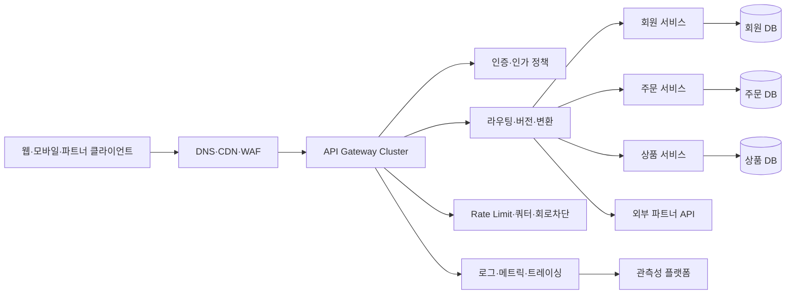
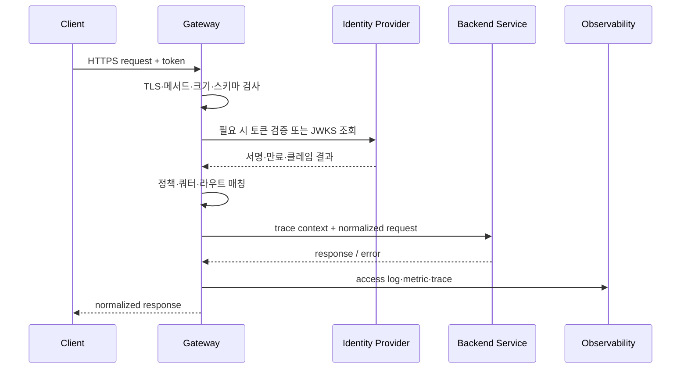

# API 게이트웨이(API Gateway) 아키텍처와 운영

## 1. 개요

> **정의**: API 게이트웨이는 외부 클라이언트와 내부 서비스 사이의 단일 진입점으로서 요청을 적절한 백엔드로 라우팅하고, 인증·인가·변환·트래픽 제어·관측성 같은 공통 정책을 집행하는 서버 측 구성요소이다.

마이크로서비스 아키텍처에서는 기능이 여러 서비스로 분해되고 서비스별 주소, 프로토콜, 배포 주기가 달라진다.
클라이언트가 각 서비스를 직접 호출하면 서비스 위치가 외부에 노출되고, 여러 번의 네트워크 왕복으로 지연과 실패 가능성이 커진다.
또한 모든 서비스가 인증 토큰 검증, 호출량 제한, 감사 로그, TLS 처리와 같은 공통 기능을 각각 구현하게 되어 중복과 정책 불일치가 생긴다.
API 게이트웨이는 이 경계에 정책 집행 지점을 두어 외부 API 계약과 내부 서비스 구현을 분리한다.

게이트웨이는 단순한 역방향 프록시보다 넓은 역할을 맡지만, 업무 로직을 대신하는 애플리케이션 서버는 아니다.
요청의 의미를 해석하여 결제 승인이나 재고 차감 같은 핵심 업무 결정을 수행하기보다, 누가 어떤 API를 어떤 조건에서 호출할 수 있는지를 통제하는 것이 본래 역할이다.
이 경계를 지키지 않으면 게이트웨이가 거대한 모놀리스가 되어 변경 위험과 장애 영향 범위가 오히려 커진다.
따라서 도입 목적은 모든 기능을 한곳에 모으는 것이 아니라 공통 횡단 관심사와 외부 노출 경계를 일관되게 관리하는 데 있다.

시험 답안에서는 API 게이트웨이를 `외부 채널 → 정책 집행 → 내부 서비스`의 흐름으로 제시하고, 기능 목록을 나열하는 데서 멈추지 않아야 한다.
왜 단일 진입점이 필요한지, 어느 정책을 게이트웨이에 둘 것인지, 게이트웨이 장애를 어떻게 격리할 것인지까지 연결해야 설계의 타당성을 설명할 수 있다.
특히 인증과 인가는 서로 다른 책임이며, TLS 종료와 백엔드 구간 암호화를 구분해야 한다.

### 1.1 등장 배경과 필요성

첫째, 서비스 디커플링을 위해 필요하다.
클라이언트는 `/orders`라는 안정적인 외부 계약을 호출하고, 게이트웨이는 현재 주문 서비스의 버전과 위치를 찾아 전달한다.
서비스가 `order-service-v2`에서 다른 클러스터로 이동하더라도 외부 클라이언트의 변경을 최소화할 수 있다.
이는 서비스 디스커버리의 변화와 클라이언트 릴리스 주기를 분리하는 효과가 있다.

둘째, API 조합과 프로토콜 차이를 흡수한다.
모바일 화면 하나가 회원, 상품, 추천 정보를 요구한다면 게이트웨이가 여러 백엔드 호출을 조합하는 BFF(Backend for Frontend) 형태를 선택할 수 있다.
반대로 모든 조합을 게이트웨이에 넣으면 결합도가 커지므로, 조합 규칙이 채널별로 자주 바뀌는 경우에만 제한적으로 적용한다.
게이트웨이의 집계는 네트워크 왕복을 줄일 수 있지만, 부분 실패와 응답 일관성을 새롭게 관리해야 한다.

셋째, 보안과 운영 정책의 기준점을 제공한다.
외부에서 유입되는 요청은 게이트웨이에서 TLS, 토큰 형식, 요청 크기, 허용 메서드, 호출량, 감사 식별자를 검사할 수 있다.
그러나 게이트웨이만 신뢰하면 내부 우회 호출이나 권한 상승을 막을 수 없으므로, 중요한 서비스는 자체 인가와 서비스 간 신원 검증을 추가해야 한다.
즉 게이트웨이는 보안의 유일한 경계가 아니라 방어 심층 구조의 첫 번째 계층이다.

### 1.2 핵심 목표와 비목표

핵심 목표는 외부 API의 안정적인 추상화, 공통 정책의 일관된 집행, 트래픽의 가시성 확보, 서비스 장애의 전파 억제이다.
이 목표들은 서로 충돌할 수 있다.
예를 들어 상세한 변환과 집계를 강화하면 클라이언트 편의성은 높아지지만 게이트웨이의 CPU 사용량과 변경 빈도가 증가한다.
따라서 목표 우선순위를 품질속성으로 정의하고 API별로 필요한 정책만 활성화해야 한다.

비목표는 업무 규칙의 중앙 집중, 데이터베이스 통합, 모든 내부 통신의 중계, 무제한 응답 캐시이다.
주문 금액 계산이나 고객의 대출 한도 판단은 도메인 서비스가 소유해야 한다.
게이트웨이가 내부 데이터베이스를 직접 조회하면 서비스 경계와 감사 추적이 흐려진다.
내부 동서 트래픽 전체를 게이트웨이로 통과시키는 구조도 병목과 장애 도메인을 키울 수 있어 서비스 메시 등 다른 수단과 분리해 검토한다.

## 2. 개념도와 처리 흐름

### 2.1 전체 논리 아키텍처

클라이언트 앞단의 CDN과 WAF는 정적 콘텐츠, 엣지 캐시, 대규모 네트워크 공격 완화에 강점이 있다.
API 게이트웨이는 그 뒤에서 API 계약에 맞춘 라우팅과 애플리케이션 수준 정책을 수행한다.
두 계층을 하나로 생각하면 WAF가 제공하는 네트워크 방어와 게이트웨이가 제공하는 사용자·경로별 정책을 구분하기 어렵다.
각 계층에서 무엇을 차단하고 무엇을 기록할지 책임표를 먼저 작성해야 한다.

게이트웨이 클러스터는 최소 두 개 이상의 인스턴스로 구성하고, 상태를 로컬 메모리에만 저장하지 않는 방향이 기본이다.
라우팅 설정과 인증키는 선언적으로 관리하되, 실제 비밀값은 별도의 비밀 관리 시스템에서 공급한다.
한 인스턴스가 실패해도 로드밸런서가 다른 인스턴스로 연결할 수 있어야 하며, 설정 배포 중에도 기존 연결을 안전하게 drain해야 한다.

### 2.2 요청 처리 파이프라인

처리 순서는 구현 제품에 따라 달라질 수 있으나, 보통 입력 검증과 TLS 처리 이후 신원과 권한을 확인하고 라우팅 및 트래픽 정책을 집행한다.
토큰 검증 결과를 백엔드에 전달할 때는 원본 토큰 전체를 무분별하게 복제하기보다 필요한 주체·역할·범위 클레임만 안전한 헤더나 내부 인증 컨텍스트로 전달한다.
다만 백엔드가 토큰의 원문과 감사 증적을 요구하는 경우에는 노출 가능성을 평가해 별도 보호를 적용한다.

실패 응답도 API 계약의 일부다.
인증 실패는 401, 권한 부족은 403, 호출량 초과는 429, 업스트림 시간 초과는 504처럼 원인을 구분하되 내부 호스트명과 스택 트레이스는 외부에 노출하지 않는다.
클라이언트가 재시도해도 안전한지에 따라 재시도 가능 여부와 `Retry-After` 같은 힌트를 설계해야 한다.

### 2.3 구성요소별 책임

| 구성요소 | 주요 책임 | 설계 시 확인점 |
|---|---|---|
| Listener | 포트·호스트·TLS 수신 | 인증서 수명, SNI, 최소 TLS 버전 |
| Route | 경로·메서드·헤더 기반 매핑 | 우선순위, 중복, 버전 호환 |
| Upstream | 백엔드 주소와 풀 관리 | 헬스체크, 서비스 디스커버리 |
| Policy | 인증·인가·제한·변환 | 적용 범위와 예외 승인 |
| Plugin/Filter | 확장 처리 | 실행 순서, 성능, 실패 기본값 |
| Control Plane | 설정·정책 배포 | 검증, 승인, 롤백 |
| Data Plane | 실제 요청 전달 | 지연, 고가용성, 격리 |
| Telemetry | 로그·메트릭·추적 | 개인정보 마스킹, 상관관계 ID |

컨트롤 플레인은 설정을 저장하고 검증·배포하며, 데이터 플레인은 실제 패킷을 처리한다.
이 둘을 분리하면 데이터 플레인이 일시적으로 컨트롤 플레인과 통신하지 못하더라도 마지막으로 유효한 설정으로 서비스할 수 있다.
반면 정책 변경의 전파 지연이 발생하므로, 보안 긴급 차단에는 별도 차단 경로와 전파 상태 모니터링이 필요하다.

플러그인이나 필터는 편리하지만 요청 경로에 임의의 코드를 계속 삽입하면 순서와 실패 동작을 추적하기 어렵다.
필터마다 타임아웃, 메모리 상한, 오류 시 허용·차단 기본값을 명시하고, 업무별 플러그인보다 공통 정책 중심으로 유지한다.

## 3. 주요 기능과 설계 원리

### 3.1 라우팅과 API 수명주기

라우팅은 URL만 보고 전달하는 단순 기능이 아니다.
호스트, 경로, HTTP 메서드, 헤더, 쿼리, 소비자 키 등을 조합해 가장 구체적인 규칙을 선택하고, 모호한 규칙은 배포 단계에서 거부해야 한다.
예를 들어 `/v1/orders/{id}`와 `/v1/orders/history`가 동시에 존재하면 정적 경로를 변수 경로보다 우선하는 규칙을 명확히 해야 한다.

버전 전략은 URL 경로, 헤더, 미디어 타입 방식으로 나눌 수 있다.
경로 버전은 관찰과 라우팅이 쉽지만 URL이 늘어나고, 헤더 버전은 URL을 안정화하지만 테스트와 디버깅이 어려워진다.
어느 방식을 선택하든 호환 기간, 폐기 공지, 소비자별 사용 현황을 관리해야 한다.

| 버전 방식 | 장점 | 한계 | 적합 상황 |
|---|---|---|---|
| URL 경로 `/v1` | 직관적, 로그 분석 용이 | 엔드포인트 증가 | 공개·파트너 API |
| 헤더 | URL 안정, 표현 분리 | 호출 도구가 복잡 | 내부·정교한 협상 |
| 미디어 타입 | 자원 표현과 버전 결합 | 운영 가시성 낮음 | REST 표현 버전 |
| 호환 진화 | 클라이언트 변경 최소화 | 설계 규율 필요 | 장기 운영 API |

게이트웨이는 API 카탈로그와 연결되어야 한다.
각 라우트에 소유 팀, 데이터 분류, 인증 방식, SLO, 폐기일, 연락처를 기록하면 운영자가 장애나 권한 요청에 빠르게 대응할 수 있다.
라우트가 늘어날수록 등록되지 않은 섀도 API를 탐지하고, 사용되지 않는 엔드포인트를 단계적으로 폐기하는 관리가 중요하다.

### 3.2 인증과 인가

인증은 요청 주체가 누구인지 확인하는 과정이고, 인가는 그 주체가 특정 자원과 행위를 허용받았는지 결정하는 과정이다.
JWT 서명과 만료를 검증했다고 해서 모든 주문 조회 권한이 자동으로 부여되는 것은 아니다.
게이트웨이는 토큰의 issuer, audience, signature, expiry, scope를 검증할 수 있지만 자원 소유자 여부처럼 도메인에 가까운 판단은 백엔드가 다시 확인해야 한다.

OAuth 2.0과 OpenID Connect는 역할이 다르다.
OAuth 2.0은 위임된 접근 권한을 위한 프레임워크이고, OIDC는 인증 정보와 ID 토큰을 더한다.
파트너 연동에서는 클라이언트 자격 증명 흐름과 scope를 검토하고, 사용자 호출에서는 authorization code와 PKCE 같은 흐름을 상황에 맞게 선택한다.
토큰을 쿼리 문자열에 두지 말고, 로그와 오류 응답에 민감한 토큰이 남지 않도록 필터링한다.

mTLS는 통신 상대의 인증서를 이용해 클라이언트와 서버를 상호 인증한다.
외부 사용자 인증을 mTLS 하나로 대체하기보다 파트너·서비스 간 강한 신원 확인에 적합한 수단으로 본다.
인증서 발급·교체·폐기와 시계 동기화까지 운영계획에 포함하지 않으면 기술적으로 강한 방식도 실제 가용성을 떨어뜨린다.

인가 정책은 역할 기반 RBAC, 속성 기반 ABAC, 범위 기반 OAuth scope를 조합할 수 있다.
정책은 “누가 무엇을 어떤 조건에서” 할 수 있는지로 표현하고, 기본 거부와 최소 권한을 원칙으로 한다.
게이트웨이 정책과 서비스 정책이 서로 다른 결론을 내릴 때의 책임 주체와 감사 로그를 정의해야 한다.

### 3.3 트래픽 제어와 공정성

Rate limiting은 일정 시간 동안 허용하는 요청 수를 제한하는 기능이다.
고정 윈도우는 구현이 단순하지만 경계 시점의 순간 폭주가 생기고, 슬라이딩 윈도우는 더 부드럽지만 상태와 계산량이 필요하다.
토큰 버킷은 평균 속도와 버스트 용량을 분리해 제어할 수 있어 API 소비자별 정책에 자주 활용된다.

| 방식 | 핵심 원리 | 강점 | 주의점 |
|---|---|---|---|
| 고정 윈도우 | 시간 구간별 카운트 | 단순·저비용 | 경계 폭주 |
| 슬라이딩 윈도우 | 최근 구간을 연속 계산 | 균일한 제한 | 저장·계산 비용 |
| 토큰 버킷 | 토큰 생성과 버스트 소비 | burst 허용 조절 | 분산 상태 동기화 |
| 누수 버킷 | 일정 속도로 배출 | 출력 속도 평탄화 | 지연 누적 |

제한 키는 IP만으로 정하면 NAT 뒤 정상 사용자를 함께 막을 수 있다.
사용자 ID, 앱 키, 조직, API 경로, 비용 등급을 조합해 공정성을 설계하고, 인증 전 단계에는 IP·디바이스 지문과 같은 제한을 별도로 둔다.
분산 게이트웨이에서는 카운터의 일관성과 지연을 고려해 중앙 저장소, 로컬 근사치, 지역별 quota 중 적합한 방식을 선택한다.

쿼터는 하루 호출량이나 월간 계약량처럼 더 긴 기간의 소비 한도이며, rate limit과 동일하지 않다.
429 응답을 받을 소비자에게 재시도 간격을 안내하고, 운영자는 정상 트래픽·버스트·공격 트래픽을 구분해 제한이 비즈니스에 미친 영향을 측정해야 한다.

### 3.4 변환, 집계, 캐시

게이트웨이는 외부 JSON과 내부 gRPC·SOAP·메시지 형식 사이의 경량 변환을 수행할 수 있다.
변환은 계약 호환과 점진적 현대화에 유용하지만, 데이터 의미를 바꾸는 복잡한 매핑은 도메인 서비스가 소유해야 한다.
특히 오류 필드와 날짜·통화·문자 인코딩 변환을 명세로 고정하고 양방향 테스트를 둔다.

BFF는 웹, 모바일, 파트너 등 채널별 최적 응답을 조합한다.
모바일에는 작은 응답과 적은 왕복이 중요하고, 파트너에는 안정된 공개 계약과 상세 오류가 중요할 수 있다.
하나의 범용 게이트웨이가 모든 채널의 차이를 조건문으로 품기보다 채널별 BFF를 분리하고 공통 보안·관측성 정책만 재사용하는 편이 변경을 통제하기 쉽다.

캐시는 읽기 부하와 지연을 줄이지만 데이터 신선도와 권한 격리 문제가 따른다.
공개 상품 목록처럼 변경 주기와 허용된 stale 범위를 정의할 수 있는 API에 적합하며, 개인별 응답이나 권한에 따라 달라지는 자료는 캐시 키에 주체·scope를 반영하거나 캐시하지 않는다.
무효화 실패를 고려해 TTL, ETag, 조건부 요청, 원본 장애 시 stale 제공 여부를 함께 설계한다.

### 3.5 관측성과 감사

액세스 로그에는 시간, route ID, status, latency, upstream, trace ID, consumer ID의 비식별 식별자를 남기는 것이 기본이다.
Authorization 헤더, 주민등록번호, 결제수단 원문과 같은 민감정보는 수집하지 않거나 마스킹한다.
로그 보존 기간과 열람 권한은 개인정보·감사 정책과 맞춰야 한다.

메트릭은 평균보다 p95·p99 지연, 4xx·5xx 비율, 업스트림별 오류, 제한 초과 수, 연결 풀 고갈을 중심으로 본다.
게이트웨이 자체 지연과 업스트림 지연을 분리해야 병목 위치를 판단할 수 있다.
분산 추적에서는 클라이언트의 trace context를 검증해 전달하되, 외부 입력을 그대로 로그 키로 사용하지 않도록 크기와 형식을 제한한다.

| 관측 대상 | 대표 지표 | 운영 질문 |
|---|---|---|
| 수신량 | RPS, 연결 수 | 갑작스러운 유입인가? |
| 지연 | p50, p95, p99 | 게이트웨이와 백엔드 중 어디가 느린가? |
| 오류 | 4xx, 5xx, timeout | 소비자 오류와 서버 오류가 분리되는가? |
| 제한 | 429, quota 사용률 | 정책이 정상 고객을 막는가? |
| 자원 | CPU, 메모리, pool | 수평 확장이 필요한가? |
| 보안 | 인증 실패, 비정상 경로 | 공격 패턴 또는 오용인가? |

## 4. 고가용성·성능·배포 설계

### 4.1 장애 격리와 복원력

게이트웨이는 모든 호출의 앞단에 있으므로 단일 장애점이 되기 쉽다.
액티브-액티브 인스턴스, 다중 가용영역, 상태 외부화, 헬스체크, 자동 확장을 기본 후보로 두되, 장애 전환 시간과 설정 일관성을 검증해야 한다.
단순히 인스턴스 수를 늘리는 것만으로는 컨트롤 플레인 장애나 인증서 만료를 해결할 수 없다.

타임아웃은 전체 요청, 연결, TLS 핸드셰이크, 업스트림 응답처럼 단계별로 둔다.
재시도는 멱등성이 보장되는 GET이나 명시적 idempotency key를 가진 요청에 제한하고, 재시도가 부하를 증폭시키지 않도록 지수 백오프와 상한을 적용한다.
결제 요청을 네 번 재전송하는 것은 장애 복구가 아니라 중복 거래가 될 수 있다.

서킷 브레이커는 연속 실패한 업스트림으로의 호출을 잠시 차단하여 장애가 다른 서비스로 확산되는 것을 막는다.
격리 풀과 bulkhead를 함께 사용하면 상품 서비스의 지연이 로그인 서비스의 스레드와 연결 풀을 고갈시키는 상황을 줄일 수 있다.
차단 후 half-open 상태에서 소수의 탐색 요청으로 회복을 확인하고, 복구 기준과 운영자 알림을 명확히 한다.

### 4.2 성능 설계

게이트웨이의 지연은 TLS, 인증서·JWKS 조회, 정책 엔진, 직렬화, 플러그인, 네트워크 왕복이 누적되어 결정된다.
매 요청마다 원격 인증 서버를 동기 호출하면 인증 서버가 병목이 되므로 검증 가능한 토큰은 키 캐시와 만료 정책을 설계한다.
키 회전 시에는 새 키와 이전 키의 겹치는 유효기간을 두어 정상 토큰이 갑자기 거부되지 않게 한다.

커넥션 풀과 keep-alive는 핸드셰이크 비용을 줄이지만, 백엔드별 최대 연결 수를 잘못 잡으면 게이트웨이가 오히려 백엔드를 압도한다.
부하 시험에서 평균 처리량만 보지 말고 p99 지연, 동시 연결, 대형 요청, 느린 업스트림, 장애 시 재시도까지 측정한다.
압축은 대역폭을 줄일 수 있으나 CPU와 압축 폭탄 위험을 함께 평가한다.

### 4.3 배포와 설정 변경

라우트와 정책은 코드처럼 버전 관리하고 정적 검증, 보안 규칙 검사, 승인, 단계적 배포를 거친다.
잘못된 정규식 하나가 정상 트래픽을 다른 서비스로 보내거나 인증 우회를 만들 수 있으므로, 설정 파일의 문법 검증만으로는 부족하다.
대표 소비자 시나리오와 금지 경로를 포함한 계약 테스트를 CI에 둔다.

카나리 배포는 전체 트래픽 중 일부 소비자·리전·헤더에 새 설정을 적용하고 오류율과 지연을 비교하는 방식이다.
블루-그린은 이전 환경을 유지해 즉시 전환할 수 있지만 두 환경의 인증서·라우팅 상태를 동기화해야 한다.
긴급 차단은 일반 배포보다 빠르게 할 수 있어야 하지만, 누가 언제 어떤 근거로 실행했는지 감사 이벤트를 남긴다.

| 배포 방식 | 장점 | 위험 | 적합 조건 |
|---|---|---|---|
| 롤링 | 자원 효율, 점진 전환 | 혼합 버전 상태 | 하위 호환 보장 |
| 블루-그린 | 빠른 전환·복귀 | 이중 자원, 데이터 차이 | 독립 환경 가능 |
| 카나리 | 실제 트래픽 검증 | 판정 지표 설계 | 관측성과 라우팅 세분화 |
| 선언적 GitOps | 변경 추적·재현 | 동기화 지연 | 승인된 형상 운영 |

## 5. API 게이트웨이와 유사 기술 비교

리버스 프록시는 클라이언트 대신 백엔드에 연결하고 요청을 전달하는 기본 역할에 초점이 있다.
API 게이트웨이는 그 기능 위에 API 소비자별 인증, 버전, 쿼터, 변환, 개발자 포털과 수명주기 관리까지 포함하는 경우가 많다.
하지만 제품의 이름만으로 책임을 단정할 수 없으므로, 실제 판단은 라우팅·정책·운영 기능의 범위로 해야 한다.

로드밸런서는 여러 서버에 트래픽을 분산해 가용성과 처리량을 높이는 것이 중심이다.
게이트웨이도 로드밸런싱을 수행하지만, API 계약과 정책에 대한 의미 있는 결정을 더 많이 수행한다.
WAF는 공격 패턴과 웹 요청 규칙을 방어하고, 서비스 메시는 주로 서비스 간 동서 트래픽의 신원·암호화·정책을 담당한다.
한 도구가 모든 역할을 완전히 대체한다고 가정하면 중복 정책이나 통제 공백이 발생한다.

| 구분 | API Gateway | Reverse Proxy | Load Balancer | Service Mesh |
|---|---|---|---|---|
| 주 대상 | 외부·파트너 API | 웹·앱 전달 | 서버 풀 | 서비스 간 통신 |
| 핵심 관심사 | 계약·정책·소비자 | 전달·TLS·캐시 | 분산·상태확인 | mTLS·동서 정책 |
| API 버전 | 적극 지원 | 제한적 | 거의 없음 | 내부 계약 중심 |
| 인증·인가 | 소비자·scope 정책 | 기본 인증 가능 | 보통 외부 위임 | 워크로드 신원 |
| 운영 위치 | 엣지·DMZ·클러스터 경계 | 엣지 또는 서버 앞 | 네트워크·클라우드 | 서비스 옆 프록시 |

### 5.1 선택 기준

공개 API가 적고 단순한 웹 전달만 필요하다면 리버스 프록시와 WAF 조합이 운영 부담이 낮을 수 있다.
파트너별 키와 사용량을 관리하고 API 버전 폐기, 개발자 등록, 변환을 해야 한다면 API 게이트웨이의 가치가 커진다.
서비스 수가 많아 내부 통신의 mTLS와 재시도 정책이 핵심이면 서비스 메시를 검토하되, 외부 API 게이트웨이와 책임을 나눈다.

선택의 핵심은 제품 기능표가 아니라 트래픽 경계와 운영 조직이다.
누가 라우트를 승인하고, 누가 인증 정책을 소유하며, 장애 시 누가 복구하는지 RACI로 명시한다.
게이트웨이 도입 전에 호출량, 지연 예산, 데이터 민감도, 규제 보존 기간, 팀 역량을 기준선으로 측정해야 효과를 판단할 수 있다.

## 6. 적용 사례와 답안형 분석

### 6.1 이커머스 모바일 API 사례

모바일 앱은 상품 목록, 장바구니, 주문 상태를 짧은 시간에 호출한다.
게이트웨이는 앱 버전을 기준으로 호환 라우트를 선택하고, 공개 상품 정보는 짧은 TTL 캐시를 적용하며, 주문 API에는 강한 인증과 idempotency key를 요구할 수 있다.
상품 서비스가 일시적으로 느려져도 로그인과 주문 조회의 자원을 공유하지 않도록 업스트림별 연결 풀과 서킷을 분리한다.

주문 생성은 캐시나 무분별한 재시도의 대상이 아니다.
게이트웨이는 요청 ID와 idempotency key를 전달하고, 실제 중복 여부와 재고·결제 원자성은 주문 도메인이 판단한다.
이처럼 게이트웨이는 안전한 전달 조건을 만들고, 거래의 최종 일관성과 업무 보상 처리는 백엔드가 책임진다.

### 6.2 공공·파트너 API 사례

공공 데이터 API는 기관별로 호출량과 사용 목적이 다르고, 개인정보가 포함된 경우 제공 범위와 보존 정책이 엄격하다.
게이트웨이는 기관 키와 사용자 인증을 구분하고, API별 quota, 원천 데이터 등급, 마스킹 정책, 이용약관 동의 여부를 확인한다.
장애 시 임의의 오래된 개인 데이터를 제공하지 않도록 캐시 허용 범위를 데이터 분류별로 나눈다.

파트너가 구형 XML을 사용하고 내부가 JSON으로 전환된 상황에서는 게이트웨이가 단기간 변환 계층이 될 수 있다.
그러나 변환 규칙의 소유자와 종료일을 기록하지 않으면 임시 어댑터가 영구 레거시가 된다.
계약 테스트와 사용량 대시보드를 통해 구형 호출이 감소하는지 확인하고, 폐기 전에 파트너별 전환을 검증한다.

### 6.3 장애 시나리오와 대응

인증 제공자가 느려지는 경우 모든 요청을 동기 검증하면 게이트웨이와 백엔드가 동시에 지연된다.
검증 가능한 토큰의 키 캐시, 짧은 연결 타임아웃, 신규 로그인과 기존 세션의 차등 처리, 비상 차단 정책을 마련해야 한다.
보안을 낮추는 만료 토큰 허용은 최후 수단이며, 허용 범위와 승인 주체를 사전에 정한다.

특정 파트너가 잘못된 재시도로 호출량을 폭증시키면 소비자별 rate limit과 circuit breaker로 해당 흐름을 격리한다.
전역 제한만 사용하면 정상 소비자까지 피해를 보므로 조직·앱·경로 단위의 계층적 제한이 필요하다.
사후에는 원인, 영향 사용자, 정책 발동 시각, 복구 결과를 감사 로그와 함께 분석해 제한값을 조정한다.

## 7. 심화: 클라우드 네이티브와 API 거버넌스

Kubernetes 환경에서는 Gateway API처럼 인프라 제공자, 클러스터 운영자, 애플리케이션 개발자의 책임을 리소스 단위로 나누는 표준화 흐름이 중요하다.
이 방식은 GatewayClass, Gateway, Route와 같은 객체의 권한을 분리해 멀티테넌시를 명시적으로 다룰 수 있다.
다만 표준 리소스를 도입해도 구현체별 확장 필드와 정책 엔진의 차이는 남으므로, 조직 표준 프로파일과 적합성 테스트를 별도로 운영해야 한다.

API 게이트웨이와 서비스 메시의 경계도 진화하고 있다.
외부 north-south 트래픽에는 소비자 계약과 공개 인증을 적용하고, 내부 east-west 트래픽에는 워크로드 신원·mTLS·서비스 간 정책을 적용하는 이중 구조가 일반적인 설계 후보이다.
두 계층에서 재시도와 제한을 중복 적용하면 요청이 증폭될 수 있으므로 한 계층을 기본 집행자로 정하고 다른 계층은 안전장치로 제한한다.

API 거버넌스는 설계 표준, 보안 규칙, 명세 관리, 변경 승인, 사용량 분석, 폐기 관리의 연속 과정이다.
OpenAPI 명세를 기준으로 라우트 등록과 계약 테스트를 자동화하면 문서와 실제 동작의 차이를 줄일 수 있다.
인증·인가, 오류 형식, correlation ID, 민감정보 마스킹, 버전 정책을 공통 표준으로 만들고 예외는 만료일과 책임자를 가져야 한다.

최근에는 게이트웨이 정책을 코드와 선언적 리소스로 관리하고, 배포 전에 API 보안 테스트와 부하 테스트를 자동화하는 접근이 확산되고 있다.
그러나 자동화는 승인되지 않은 공개를 빠르게 확산시킬 수도 있다.
따라서 정책 변경에 대한 정적 분석, 최소 권한 검사, diff 기반 승인, 롤백 가능한 배포를 결합하는 것이 중요하다.

## 8. 고려사항 및 시사점

### 8.1 보안과 신뢰 경계

게이트웨이에서 TLS를 종료하더라도 민감한 내부 구간은 재암호화와 백엔드 인증을 고려한다.
토큰 검증, 스키마 검사, 요청 크기 제한, SSRF 방어, 비정상 메서드 차단을 공통 기준으로 삼는다.
외부 입력이 내부 주소나 헤더로 변환되는 지점은 별도 위협 모델링을 수행한다.

### 8.2 성능과 비용의 균형

모든 요청에 복잡한 정책과 원격 조회를 넣으면 보안 기능이 지연 예산을 잠식한다.
경로별로 정책 비용과 실패 허용도를 측정하고, 캐시·로컬 검증·배치 집계를 필요한 범위에서 적용한다.
게이트웨이 인스턴스와 외부 정책 저장소 비용뿐 아니라 장애 대응 인력과 테스트 비용도 TCO에 포함한다.

### 8.3 조직과 운영 책임

중앙 플랫폼 팀이 공통 기반을 제공하되, API 소유 팀이 계약과 업무별 인가의 책임을 가져야 한다.
라우트 생성 권한을 넓게 부여하면 섀도 API와 잘못된 도메인 노출이 증가하므로 역할별 승인 흐름을 둔다.
SLO, 온콜, 변경관리, 폐기 기준을 API 카탈로그에 연결해 기술 설정과 조직 책임이 분리되지 않게 한다.

### 8.4 가용성과 재해복구

다중 인스턴스만으로 고가용성이 완성되지 않는다.
인증서, 정책, 라우팅 설정, 키, rate-limit 상태, DNS와 외부 의존성의 복구 순서를 문서화하고 정기적으로 복구훈련을 한다.
리전 장애 시 우회할 트래픽과 데이터 정합성 조건을 API별로 정의하며, 무조건적인 재시도는 재해를 확대할 수 있음을 고려한다.

### 8.5 데이터 보호와 감사

로그는 운영에 필수지만 개인정보와 비밀정보의 2차 유출 지점이 된다.
수집 목적, 필드 최소화, 마스킹, 접근통제, 보존·파기, 감사 열람을 설계에 포함한다.
특히 요청·응답 본문 로깅은 기본 비활성화하고, 불가피할 때 승인된 샘플링과 비식별화로 범위를 제한한다.

### 8.6 기술사 답안의 시사점

답안은 정의에서 시작해 필요성, 구성도, 처리 절차, 핵심 정책, 유사 기술 비교, 사례, 장애 대응, 거버넌스로 전개하면 논리적이다.
각 정책을 “적용한다”라고 끝내지 말고 적용 이유, 부작용, 측정 지표, 완화책을 연결해야 한다.
예를 들어 rate limit은 보안을 높이지만 정상 사용자를 차단할 수 있으므로 소비자별 키와 예외 승인, 429 관측을 함께 제시한다.

결론적으로 API 게이트웨이는 서비스 수가 많다는 이유만으로 설치하는 프록시가 아니다.
외부 계약을 보호하고 공통 정책을 반복 가능하게 집행하는 플랫폼 경계이며, 그만큼 중앙 장애와 과도한 결합의 위험도 가진다.
기술사는 트래픽 경계, 도메인 책임, 보안 수준, 지연 예산, 조직 운영모델을 함께 설계해 도입의 편익이 복잡성보다 커지도록 해야 한다.

## 참고자료

- Kubernetes, Gateway API 개념 및 리소스: https://kubernetes.io/docs/concepts/services-networking/gateway/
- Kubernetes Gateway API 보안 개념: https://gateway-api.sigs.k8s.io/docs/concepts/security/
- OWASP API Security Project: https://owasp.org/www-project-api-security/
- OWASP Secure API Gateway Blueprint: https://owasp.org/www-project-secure-api-gateway-blueprint/
- RFC 9110 HTTP Semantics: https://www.rfc-editor.org/rfc/rfc9110

---

> **한 줄 요약**: API 게이트웨이는 외부 API와 내부 서비스 사이에서 계약·보안·트래픽·관측성을 일관되게 집행하되, 업무 로직 중앙집중과 단일 장애점이 되지 않도록 경계와 책임을 설계해야 한다.
