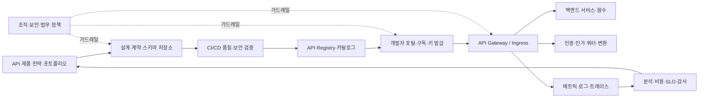
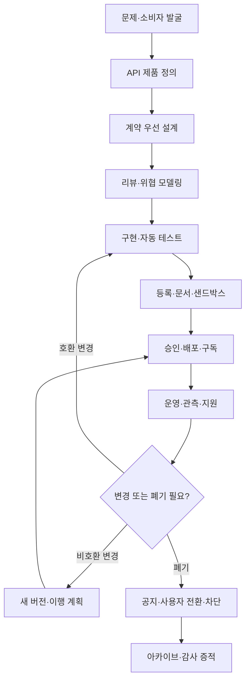

# API 관리(API Management)와 API 수명주기 거버넌스

## 1. 개요

> **API 관리(API Management)**란 API를 설계·개발·배포·보호·공개·운영·분석·폐기하는 전 수명주기를 정책, 플랫폼, 조직 책임으로 통제하여 API를 안정적인 제품으로 제공하는 체계이다.

API는 애플리케이션 사이의 호출 규약을 넘어 조직의 데이터와 비즈니스 기능을 외부에 제공하는 제품 경계가 되었다. 내부 서비스 연동, 모바일 앱, 파트너 시스템, 공공 데이터, SaaS 연계가 모두 API에 의존하므로 API의 변경은 하나의 프로그램 변경보다 넓은 소비자와 계약에 영향을 준다. API 관리가 필요한 이유는 API를 많이 만드는 것이 아니라, 누가 어떤 목적에서 어떤 품질과 권한으로 사용하는지 지속적으로 설명하고 통제하기 위해서다.

API 게이트웨이는 API 관리 플랫폼의 중요한 실행 구성요소이지만 API 관리 전체와 동일하지 않다. 게이트웨이가 요청을 라우팅하고 런타임 정책을 집행한다면, API 관리는 기획·설계·등록·문서화·개발자 포털·구독·분석·변경·폐기까지 포함한다. 게이트웨이만 도입하면 호출은 전달되지만 소유자 없는 API, 오래된 버전, 숨은 엔드포인트, 계약 불일치가 누적될 수 있다.

API를 제품으로 본다는 것은 예쁜 문서를 만든다는 뜻이 아니다. 명확한 소비자와 가치 제안, 안정적인 계약, 사용량과 품질의 측정, 지원 채널, 폐기 정책, 보안 책임을 갖는다는 뜻이다. 따라서 API 관리의 성과는 API 개수보다 재사용률, 소비자 온보딩 시간, 변경 실패율, 취약점 대응시간, SLO 달성률과 같은 운영 결과로 평가해야 한다.

### 가. 등장 배경과 필요성

첫째, 디지털 서비스가 다채널화되면서 동일한 업무 기능이 웹·모바일·파트너·배치·AI 에이전트에서 재사용된다. 각 채널이 데이터베이스를 직접 조회하면 결합도와 보안 위험이 커지므로 명시적인 API 계약을 통해 서비스 경계를 제공해야 한다. 관리 체계가 없으면 채널마다 비슷한 API가 만들어져 중복과 의미 불일치가 생긴다.

둘째, API는 배포 후에도 소비자가 계속 존재한다. 내부 코드라면 한 번에 함께 수정할 수 있지만 외부 파트너나 이미 배포된 모바일 앱은 즉시 업데이트되지 않는다. 호환성 규칙, 버전 병행, 사용 현황, 폐기 공지와 마이그레이션 지원이 없으면 작은 필드 변경도 장애로 이어진다.

셋째, API는 공격 표면이다. 객체 식별자, 권한, 호출량, 민감정보, 제3자 연동이 요청 단위로 노출되므로 인증만으로 안전성을 보장할 수 없다. OWASP API Security Top 10은 객체 수준 인가 실패, 과도한 자원 소비, 잘못된 인벤토리 관리와 안전하지 않은 API 소비 등을 API 특유의 위험으로 제시한다.

넷째, 클라우드 네이티브 환경은 API가 여러 클러스터·리전·서비스 메시·서버리스 함수에 분산되게 한다. 중앙 게이트웨이의 라우팅 정보만으로는 모든 API를 알 수 없으므로 설계 명세, 서비스 카탈로그, 런타임 관측성, 보안 스캔을 연결한 API 포트폴리오가 필요하다.

### 나. 핵심 목표와 범위

API 관리의 첫 목표는 소비자가 신뢰할 수 있는 발견 가능성과 계약 안정성이다. API 이름, 설명, 예제, 인증 방식, 오류 모델, 제한 정책, 지원 담당자가 카탈로그에 있어야 소비자가 시행착오를 줄인다. 두 번째 목표는 정책 일관성이다. 인증·인가·요청 검증·호출량·감사·개인정보 보호를 서비스마다 제각각 구현하지 않도록 공통 가드레일을 제공한다.

세 번째 목표는 변화와 운영의 가시성이다. API별 호출량, 오류율, 지연, 소비자, 버전, 비용과 데이터 분류를 연결해야 과도한 사용이나 폐기 대상 API를 판단할 수 있다. 네 번째 목표는 비즈니스 가치의 측정이다. 호출 수가 많아도 실패율이 높거나 고객 전환에 기여하지 못하면 성공한 API가 아니다.

범위에는 공개 API뿐 아니라 내부·파트너·관리자·서비스 간 API가 포함될 수 있다. 다만 동일한 공개 수준과 정책을 적용하지는 않는다. 공개 API는 개발자 경험과 계약 안정성을 중시하고, 내부 API는 배포 자동화와 서비스 신뢰를 중시하며, 파트너 API는 계약·법무·지원·상호 인증을 추가로 고려한다.

## 2. API 관리의 전체 구조

### 가. 논리 아키텍처

위 구조에서 API 제품 전략은 어떤 소비자 문제를 해결하고 어떤 수준으로 공개할지 정한다. 설계·계약 저장소는 OpenAPI 같은 인터페이스 명세와 오류 모델, 예시, 변경 이력을 보관한다. CI/CD 검증은 명세 구문뿐 아니라 호환성, 보안, 테스트, 개인정보 규칙을 배포 전에 점검한다.

Registry와 카탈로그는 API의 기술 주소만 저장하는 곳이 아니다. 소유 팀, 데이터 분류, 환경, 인증 방식, 버전, SLO, 폐기일, 연락처, 규제지역, 소비자와 사용량을 연결하여 의사결정 가능한 자산 목록을 만든다. 포털은 카탈로그에서 승인된 API의 문서와 샌드박스, 구독·지원 절차를 제공한다.

게이트웨이는 데이터 플레인에서 실제 요청을 처리하고 인증·인가·속도 제한·변환·캐시·라우팅과 관측성 정책을 집행한다. 그러나 게이트웨이가 모든 업무 규칙을 소유해서는 안 된다. 주문 승인, 계정 잔액 판단, 데이터 소유권 확인과 같은 도메인 판단은 백엔드 서비스가 최종 책임을 져야 하며 게이트웨이는 방어 심층의 한 계층으로 동작해야 한다.

### 나. 수명주기 처리 흐름

수명주기는 문서 작성의 순서가 아니라 의사결정과 증거가 이어지는 통제 루프다. 설계 단계에서 정의한 계약은 구현과 테스트의 기준이 되고, 배포된 버전은 소비자·사용량·오류 데이터로 검증된다. 운영 중 발견된 계약 불편이나 보안 위험은 다음 설계에 반영되어야 한다.

아이디어 단계에서는 소비자, 사용 사례, 데이터 민감도, 기대 지연, 가용성, 호출량, 비용 부담 주체를 정의한다. 같은 데이터를 제공하더라도 실시간 조회 API와 대량 추출 API는 서로 다른 제한과 저장·전송 비용을 갖는다. 서비스 이름만 정하고 시작하면 나중에 제품 목표와 기술 구현의 우선순위가 충돌한다.

설계 단계에서는 리소스와 행위, 입력·출력 스키마, 상태 전이, 오류 모델, 멱등성, 페이지네이션, 정렬, 필터, 인증·인가를 계약으로 만든다. OpenAPI는 HTTP API의 인터페이스를 사람과 도구가 이해할 수 있는 형식으로 표현하는 표준이므로 코드 생성·문서·계약 테스트의 공통 입력으로 활용할 수 있다. 단, 명세가 있다고 의미의 품질과 권한 설계가 자동으로 보장되는 것은 아니다.

구현·검증 단계에서는 정상 경로뿐 아니라 경계값, 권한 없는 객체 접근, 대량 요청, 중복 재시도, 부분 장애, 구버전 클라이언트를 테스트한다. 명세와 실제 응답을 비교하는 계약 테스트를 CI에 넣고, breaking change 검출을 병합 조건으로 둔다. 개발 환경의 임시 엔드포인트가 운영으로 승격되지 않도록 환경별 등록과 승인 상태를 분리한다.

## 3. 핵심 구성요소와 설계 원리

### 가. API 계약과 설계 우선 방식

계약 우선(contract-first)은 구현 전에 소비자가 볼 인터페이스를 합의하는 방식이다. 경로·메서드·상태 코드·스키마·예시·보안 요구를 먼저 정의하면 프론트엔드와 백엔드가 병렬로 개발할 수 있고, 모호한 요구를 조기에 발견할 수 있다. 반대로 코드에서 문서를 자동 생성하는 방식은 실제 동작을 빠르게 반영하지만 설계 의도와 업무 의미가 뒤늦게 정리될 수 있다.

좋은 계약은 성공 응답만 설명하지 않는다. 401과 403의 차이, 404를 자원 부재와 권한 은닉 중 어떻게 사용할지, 409 충돌과 429 제한 초과, 5xx 재시도 가능성을 명확히 해야 한다. 오류 객체에는 외부에 공개할 코드·메시지·추적 ID를 두되 내부 호스트명과 스택 트레이스는 제외한다.

스키마는 필드 이름보다 의미와 진화 규칙이 중요하다. 숫자의 단위, 시간대, 정밀도, null 허용 여부, 열거값 추가 가능성을 명시하지 않으면 서로 다른 소비자가 같은 필드를 다르게 해석한다. 필드를 삭제하거나 의미를 바꾸는 대신 새 필드를 추가하고 일정 기간 구필드를 병행하는 호환 전략을 우선 검토한다.

OpenAPI 명세는 재사용 가능한 components, 보안 스킴, 요청·응답 스키마를 표현할 수 있다. 하지만 명세 파일 자체의 변경 이력, 검토자, 승인 상태, 운영 버전과의 일치 여부를 관리해야 한다. 저장소의 명세와 실제 게이트웨이 설정이 어긋나면 포털은 올바른 문서를 보여주면서 운영 요청은 다른 동작을 하는 위험이 생긴다.

### 나. 포털·카탈로그·개발자 경험

개발자 포털의 핵심은 검색과 호출 성공까지의 시간을 줄이는 것이다. 설명, 인증 시작 방법, 최소 권한 범위, 예제 요청·응답, SDK, 오류 해결, 제한 정책, 상태 페이지와 문의 창구를 한 흐름으로 제공한다. 문서가 최신이어도 첫 호출을 위한 테스트 자격증명이나 샌드박스가 없으면 온보딩 장벽이 남는다.

API 카탈로그는 모든 엔드포인트를 무분별하게 나열하는 목록이 아니라 책임과 위험을 포함한 자산 레지스터다. API별 제품 오너, 기술 오너, 데이터 오너, 보안 분류, 운영 환경, 버전, 소비자, 마지막 사용 시각, 폐기 예정일을 기록한다. 이 정보는 장애 대응과 개인정보 영향평가에도 활용된다.

구독 모델은 소비자와 API의 관계를 명시한다. 공개 읽기 API는 셀프서비스 키 발급을 허용할 수 있지만, 개인정보나 결제 기능은 조직 확인, 계약, 승인된 scope, 강한 인증이 필요하다. 키는 소비자 식별에 쓰는 자격증명이지 세밀한 사용자 인가를 대체하지 않으며, 유출 시 폐기·재발급과 사용량 추적이 가능해야 한다.

### 다. 게이트웨이와 정책 집행

게이트웨이는 경로·호스트·메서드·헤더를 바탕으로 요청을 적절한 업스트림으로 전달한다. 라우팅 규칙이 겹치면 정적 경로와 변수 경로의 우선순위를 명시하고, 배포 전에 모호성을 검사해야 한다. 데이터 플레인은 마지막으로 유효한 설정으로 동작할 수 있어야 하며, 컨트롤 플레인 장애가 곧 전체 API 장애가 되지 않도록 분리한다.

인증은 주체를 확인하고 인가는 주체의 행위를 허용할지 판단한다. JWT 서명과 만료를 검증했다고 해서 사용자가 다른 고객의 주문을 읽을 권한이 생기는 것은 아니다. 객체 소유자·테넌트·업무 상태에 대한 인가는 서비스가 다시 확인하고, 게이트웨이와 백엔드의 판단·정책 버전·결과를 감사 가능한 형태로 남겨야 한다.

Rate limit은 단기 속도를 제한하고 quota는 기간 누적량을 관리한다. 토큰 버킷은 평균 속도와 버스트 허용량을 분리하기 쉽지만, 다중 인스턴스에서 카운터 일관성과 저장소 지연을 고려해야 한다. IP만 제한 키로 사용하면 NAT 뒤 정상 사용자가 함께 차단될 수 있으므로 앱·사용자·조직·경로·요금제·비용을 결합한 정책을 설계한다.

변환과 집계는 외부 계약과 내부 프로토콜 차이를 흡수하지만, 게이트웨이에 복잡한 업무 조합을 넣으면 변경과 장애의 중심이 된다. 단순 JSON↔gRPC 변환이나 필드 이름 호환은 게이트웨이에 둘 수 있지만, 재고 예약과 결제 승인처럼 상태와 보상이 필요한 오케스트레이션은 도메인 서비스 또는 별도의 BFF가 소유하는 편이 적절하다.

### 라. 관측성·분석·비용

API별로 요청량, p50·p95·p99 지연, 4xx·5xx 비율, 업스트림 오류, timeout, 429, payload 크기, 소비자별 quota를 측정한다. 평균 지연만 보면 일부 사용자의 긴 꼬리 지연을 놓치므로 SLO와 연계한 백분위 지표를 기본으로 삼는다. 게이트웨이 자체 처리시간과 백엔드 처리시간을 분리해야 개선 위치를 판단할 수 있다.

로그에는 시간, route ID, 버전, 상태, 지연, trace ID, 비식별 소비자 ID를 남길 수 있다. Authorization 헤더, 주민등록번호, 결제수단 원문, 민감한 요청 본문은 기본 수집 대상에서 제외하거나 필드 단위로 마스킹한다. 로그가 보안 감사에 쓰이더라도 원문을 오래 보관하는 것이 항상 정당화되는 것은 아니며 접근권한과 보존기간을 별도로 정해야 한다.

분석은 단순 호출 순위보다 API 제품의 건강성을 보여줘야 한다. 재사용률, 활성 소비자 수, 성공률, 문서 조회 대비 호출 전환율, 버전별 사용량, 소비자 온보딩 시간, 지원 티켓, 호출당 인프라 비용을 함께 본다. 트래픽이 줄었다고 폐기하는 대신 계절성·대체 API·중요한 소수 소비자의 업무 영향까지 확인한다.

## 4. 보안·품질·거버넌스

### 가. API 보안 통제

API 보안은 설계 시점과 런타임을 나누어 다층으로 적용한다. 설계 시점에는 위협 모델링, 민감정보 분류, 스키마 검증, 계약 테스트, 의존성·비밀 스캔, 권한 매트릭스 검토를 수행한다. 런타임에는 TLS, 인증·인가, 요청·응답 검증, rate limit, timeout, circuit breaker, 이상행위 탐지를 적용한다.

OWASP API Security Top 10의 Broken Object Level Authorization은 URL의 객체 ID만 바꿔 다른 사용자의 자원에 접근하는 위험을 설명한다. 게이트웨이에서 토큰의 유효성만 확인하고 서비스가 객체 소유권을 확인하지 않으면 이 공격을 막을 수 없다. 테스트 데이터로 ID를 바꾸는 부정 테스트와 테넌트 경계 검증을 자동화해야 한다.

Unrestricted Resource Consumption은 네트워크뿐 아니라 CPU, 메모리, 저장, 외부 SMS·결제 호출 비용까지 고갈시킬 수 있다. 페이지 크기, 파일 크기, 정렬·필터 복잡도, 재귀 깊이, 외부 호출 횟수에 상한을 두고, 소비자별 예산과 시간 제한을 설계한다. 너무 낮은 제한은 정상 사용을 방해하므로 업무별 기준과 예외 절차를 함께 둔다.

Improper Inventory Management는 운영 중인 모든 호스트·버전·문서·디버그 엔드포인트를 알지 못하는 문제다. 배포 파이프라인의 등록을 의무화하고, DNS·게이트웨이 로그·서비스 디스커버리·코드 저장소를 대조해 섀도 API를 탐지한다. 사용되지 않는 버전은 바로 삭제하기보다 소유자 확인, 소비자 통지, 대체 경로, 단계적 차단을 거친다.

### 나. 품질 게이트와 변경관리

품질 게이트는 구문 검사만으로 충분하지 않다. 명세 lint, 호환성 비교, 스키마·예제 일치, 자동화 테스트, 성능 기준, 보안 스캔, 개인정보 필드 검토, 문서 생성과 포털 등록을 파이프라인에 포함한다. 실패 원인을 소비자가 이해할 수 있는 메시지로 남겨 반복 가능한 개선으로 연결한다.

호환 변경은 필드 추가처럼 기존 소비자의 요청과 응답을 깨지 않는 변경이고, 비호환 변경은 필드 삭제·타입 변경·의미 변경·필수값 추가처럼 소비자 수정이 필요한 변경이다. 호환성 판단은 문법이 아니라 실제 소비자의 사용 방식과 코드 생성 도구까지 고려해야 한다. 예를 들어 열거값 추가도 소비자가 미지의 값을 거부하도록 구현했다면 사실상 위험한 변경이 될 수 있다.

버전 전략에는 URL, 헤더, 미디어 타입과 호환 진화가 있다. URL 버전은 관찰과 라우팅이 쉽지만 엔드포인트가 늘고, 헤더 방식은 주소가 안정적이지만 디버깅과 캐시가 복잡해진다. 방식보다 중요한 것은 각 버전의 지원기간, 폐기 기준, 사용량 확인, 전환 문서와 롤백 수단을 명확히 하는 것이다.

## 5. 비교와 적용 사례

### 가. API 관리·API 게이트웨이·서비스 메시 비교

API 관리와 게이트웨이는 포함 관계가 있다. 게이트웨이는 요청 실행 지점이고 API 관리는 설계부터 폐기까지의 운영·거버넌스 체계다. 서비스 메시의 프록시와 정책은 주로 서비스 간 동서 트래픽, 서비스 신원, 재시도, 분산 추적을 다루므로 외부·파트너 API의 포털과 제품 수명주기를 자동으로 대체하지 않는다.

| 구분 | API 관리 | API 게이트웨이 | 서비스 메시 |
|---|---|---|---|
| 주 대상 | 외부·내부·파트너 API 제품 | 요청의 진입·중계·정책 | 서비스 간 동서 통신 |
| 주요 기능 | 계약·포털·구독·분석·폐기 | 라우팅·인증·제한·변환 | mTLS·서비스 디스커버리·재시도 |
| 핵심 plane | 관리·개발자 경험·데이터 plane | control plane·data plane | control plane·sidecar/data plane |
| 소비자 | 사람·조직·외부 개발자 | 호출 클라이언트·서비스 | 내부 서비스 |
| 실패 시 질문 | 누가 무엇을 언제 폐기하는가 | 어디로 어떻게 전달하는가 | 어떤 서비스가 안전하게 통신하는가 |

이 차이를 무시하고 하나의 도구로 모두 해결하려 하면 정책의 책임과 관측 범위가 혼합된다. 외부 API의 사용량·계약·법무 요구는 API 관리에서 다루고, 서비스 간 mTLS와 재시도는 서비스 메시에서 다루며, 게이트웨이에서는 두 영역 사이의 진입 정책을 통합하는 식으로 경계를 정한다.

### 나. 사례: 금융기관 파트너 결제 API

금융기관이 제휴사에 결제 승인·거래조회 API를 제공한다고 가정한다. 먼저 API 제품 정의에서 파트너별 사용 목적, 허용 지역, 처리량, 개인정보 범위, 거래 책임, 장애 시 보상 기준을 정한다. 공개 문서와 별개로 계약된 파트너만 접근할 수 있도록 포털 가입·심사·mTLS 또는 강한 클라이언트 인증·scope 승인을 연결한다.

설계에서는 승인 요청의 멱등 키와 거래 상태를 명시한다. 네트워크 재시도로 동일 승인 요청이 중복 처리되면 금전 사고가 될 수 있으므로 서버가 멱등 키와 요청 본문 관계를 저장하고 같은 키에 같은 결과를 반환하는 정책을 둔다. 401·403·409·429·5xx의 의미와 재시도 조건을 계약에 포함해야 파트너가 임의 재시도로 부하를 증폭시키지 않는다.

운영에서는 파트너·상품·API 버전별 p95 지연, 성공률, 승인 거절률, 중복 요청, quota, 이상 지역과 시간대의 호출을 분리해서 본다. 결제 데이터 원문은 로그에 남기지 않고 거래 식별자와 추적 ID를 가명화한다. 버전 폐기 전에 각 파트너의 호출 현황과 테스트 결과를 확인하고, 샌드박스와 단계적 트래픽 전환으로 호환성을 검증한다.

### 다. 사례: 공공 데이터 조회 API의 과다 사용

한 기관이 교통 데이터를 제공하는데 특정 소비자가 짧은 시간에 대량 페이지를 반복 조회해 다른 사용자에게 429가 발생했다고 가정한다. IP만 기준으로 차단하면 동일 NAT의 정상 사용자까지 영향을 받는다. 애플리케이션 키·기관·엔드포인트·페이지 크기·시간대별 quota를 결합하고, 캐시 가능한 데이터는 갱신 주기와 ETag를 제공하여 반복 조회 자체를 줄인다.

동시에 API가 반환하는 데이터가 개인정보나 위치 민감정보를 포함하는지 재검토한다. 호출량을 제한하는 것만으로는 과도한 데이터 수집과 목적 외 이용을 막을 수 없다. 최소 필드, 집계·익명화, 사용 목적과 보존기간, 이용약관, 감사 로그를 함께 설계하고, 차단·경고·승인 예외의 기준을 공개해야 정책에 대한 신뢰를 유지할 수 있다.

## 6. 심화: 표준과 클라우드 네이티브 API 보호 동향

OpenAPI 공식 사양은 3.1 계열의 패치 릴리스와 3.2 계열을 함께 제공하며, 인터페이스를 언어 중립적으로 설명하는 계약의 기반으로 활용된다. 실무에서는 조직이 지원할 사양 버전을 고정하고, 명세의 문법 버전과 실제 운영 게이트웨이 기능의 차이를 검증해야 한다. 최신 사양을 선언했다는 이유만으로 모든 도구가 동일하게 해석한다고 가정해서는 안 된다.

NIST는 클라우드 네이티브 시스템의 API 보호를 개발·배포 전 단계와 런타임 단계로 나누어 위험과 통제를 설명한다. 2026년 3월 업데이트된 SP 800-228 개정판은 API 위험과 수명주기 단계별 권고 통제를 보강했다. 이는 API 보안을 게이트웨이 한 곳의 방어가 아니라 명세·개발·테스트·배포·운영의 연속된 통제로 보아야 한다는 방향과 맞닿아 있다.

생성형 AI가 API 소비자와 제공자로 참여하면서 새로운 문제가 생긴다. 에이전트가 도구 API를 호출할 때는 사람의 로그인 세션과 다른 실행 주체·목적·권한·예산을 식별해야 한다. 프롬프트에 포함된 지시가 API 권한을 우회하지 않도록 도구 목록과 인자 스키마를 allowlist로 제한하고, 고위험 작업에는 사용자 확인과 거래 한도를 둔다.

AI API는 요청 토큰·응답 토큰·모델 버전·지연·품질·비용을 함께 분석해야 한다. 단순 호출량 제한으로는 긴 프롬프트와 대규모 응답의 비용 폭증을 막기 어렵기 때문에 토큰 quota, 모델별 예산, 최대 컨텍스트, 재시도 상한, fallback 규칙을 계약에 포함한다. 민감한 프롬프트와 응답을 관측 데이터로 보존할 때는 최소수집·마스킹·접근통제를 적용한다.

API 관리 플랫폼은 API 포트폴리오를 중앙에서 통제하되 도메인 팀의 자율성을 없애서는 안 된다. 중앙 플랫폼은 표준 템플릿·보안 가드레일·포털·공통 관측성을 제공하고, 도메인 팀은 업무 계약과 소비자 관계를 책임지는 플랫폼형 운영 모델이 현실적이다. 정책 예외는 무기한 허용하지 않고 근거·승인자·만료일을 기록해야 한다.

## 7. 고려사항 및 시사점

### 가. API를 제품으로 정의하고 우선순위를 정한다

API를 기술팀의 부산물로 만들면 유사 API가 늘고 소비자가 누구인지 불명확해진다. 제품 목표, 핵심 소비자, 데이터 범위, 품질 수준, 비용 부담, 성공 지표를 먼저 정의하고 포트폴리오에서 중복·미사용·고위험 API를 주기적으로 정리한다. API 개수보다 재사용과 소비자 성공을 KPI로 삼아야 한다.

### 나. 계약과 변경을 자동 검증한다

OpenAPI 명세를 중앙 저장소에 두고 lint·호환성·계약 테스트·예제 검증을 CI에 연결한다. 명세 변경만 승인하고 게이트웨이 설정이나 실제 응답을 검증하지 않으면 문서와 운영이 분리된다. 변경 유형별 승인 수준과 롤백 절차를 정의하며, 구버전 소비자의 사용량을 확인한 뒤 폐기한다.

### 다. 보안 책임을 게이트웨이에만 집중하지 않는다

게이트웨이는 공통 인증과 트래픽 통제를 제공하지만, 객체 수준 인가와 업무 규칙은 백엔드가 최종 검증해야 한다. 내부 우회 호출, 서비스 계정, 관리자 API, 배치 경로를 포함한 전체 호출 경로를 위협 모델링한다. API 인벤토리와 섀도 API 탐지를 운영하여 방치된 엔드포인트를 줄인다.

### 라. 성능·가용성·비용을 함께 설계한다

캐시와 rate limit은 성능과 비용을 개선할 수 있지만 신선도·공정성·가용성의 트레이드오프가 있다. 게이트웨이와 업스트림의 SLO를 분리하고, 재시도·타임아웃·회로 차단이 연쇄 폭주를 만들지 않도록 예산을 둔다. 서버리스·AI API는 호출량보다 요청 크기와 실행 단위가 비용을 좌우하므로 단위경제성을 따로 측정한다.

### 마. 개발자 경험과 통제를 균형 있게 운영한다

보안 승인을 모든 API 호출에 수작업으로 요구하면 우회 API와 비공식 공유 키가 생길 수 있다. 위험이 낮은 읽기 API는 자동화된 셀프서비스와 표준 정책으로 빠르게 온보딩하고, 민감 데이터·금전·관리 기능은 강한 심사와 최소권한을 적용한다. 포털 문서, 샘플, SDK, 샌드박스, 상태 페이지를 지속적으로 개선한다.

### 바. 관측 데이터도 개인정보와 기밀로 보호한다

요청 본문과 헤더에는 토큰·개인정보·영업정보가 포함될 수 있다. 로그 필드 allowlist, 마스킹, 보존기간, 접근권한, 조회 감사, 테넌트 격리를 설계하고 필요하면 원문 대신 해시·분류·추적 ID를 사용한다. API 관리 메타데이터 자체가 어떤 고객·업무가 연결되어 있는지 드러낼 수 있으므로 카탈로그 접근도 위험 기반으로 통제한다.

### 사. 조직 책임과 예외의 만료를 명확히 한다

제품 오너는 가치와 소비자, 기술 오너는 구현과 SLO, 보안 오너는 통제, 데이터 오너는 이용 목적과 분류를 책임지도록 RACI를 정한다. 표준에서 벗어난 예외는 사유·위험·보완통제·승인자·만료일을 남기고 자동 알림으로 갱신 여부를 확인한다. 플랫폼 팀이 모든 API의 업무 의미를 대신 결정하는 구조는 확장되지 않는다.

## 참고자료

- OpenAPI Initiative, “OpenAPI Specification” — https://spec.openapis.org/oas/
- OpenAPI Initiative, “OpenAPI Specification v3.1.2” — https://spec.openapis.org/oas/v3.1.2.html
- OWASP, “API Security Project” — https://owasp.org/www-project-api-security/
- OWASP, “Top 10 API Security Risks – 2023” — https://owasp.org/API-Security/editions/2023/en/0x11-t10/
- NIST, “SP 800-228-upd1 Guidelines for API Protection for Cloud-Native Systems” — https://csrc.nist.gov/pubs/sp/800/228/upd1/final
- NIST, “Guidelines for API Protection for Cloud-Native Systems” — https://www.nist.gov/publications/guidelines-api-protection-cloud-native-systems-march-2026-update

---

> **한 줄 요약**: API 관리는 게이트웨이의 요청 중계를 넘어 계약·보안·개발자 경험·관측성·변경·폐기를 하나의 수명주기로 연결하여 API를 신뢰 가능한 디지털 제품으로 운영하는 거버넌스 체계다.
