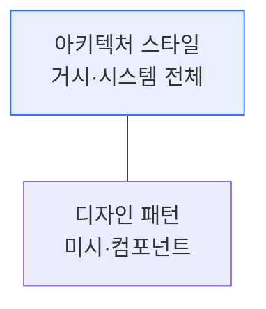
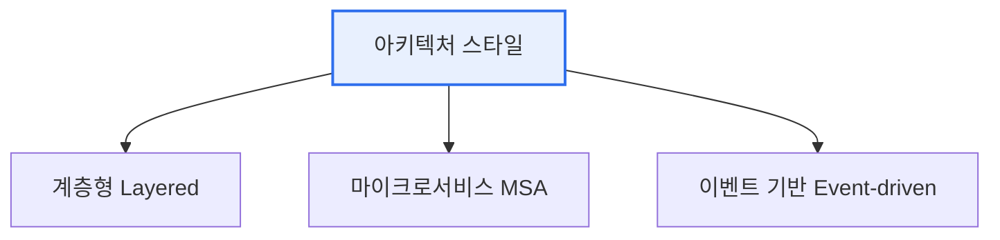

# 아키텍처 스타일과 디자인 패턴

## 1. 개요

### 가. 정의
> **아키텍처 스타일**은 시스템 전체 구조를 조직하는 **거시적(Macro) 설계 틀**이고, **디자인 패턴**은 특정 설계 문제를 해결하는 **미시적(Micro)·재사용 가능한 해법**이다.

두 개념의 관계는 '**건물의 구조 양식**'과 '**방을 꾸미는 정형화된 기법**'에 비유하면 명확하다. 아키텍처 스타일이 아파트냐 단독주택이냐 하는 건물 전체의 골격(계층형·MSA 등)을 정한다면, 디자인 패턴은 그 건물 안에서 반복적으로 마주치는 문제—예를 들어 '어떻게 하면 특정 객체를 하나만 만들어 공유할까'—를 검증된 방식으로 푸는 국소적 해법이다. 둘의 차이는 **추상화 수준과 영향 범위**에 있다. 아키텍처 스타일의 선택은 성능·확장성·보안 같은 시스템 전체의 품질속성을 좌우하는 되돌리기 어려운 결정인 반면, 디자인 패턴은 특정 클래스·컴포넌트 수준의 유연성·재사용성을 다룬다.

### 나. 필요성
소프트웨어가 커지고 복잡해질수록, 매번 처음부터 구조를 고민하면 비효율적이고 실패 위험이 크다. 아키텍처 스타일과 디자인 패턴은 선배 개발자들이 축적한 검증된 해법을 재사용하게 해, 품질과 생산성을 동시에 높인다.

## 2. 아키텍처 스타일과 디자인 패턴의 차이

| 구분 | 아키텍처 스타일 | 디자인 패턴 |
|---|---|---|
| **범위** | 시스템 전체(거시) | 클래스·컴포넌트(미시) |
| **관심사** | 구조·컴포넌트·연결·품질속성 | 객체 생성·구조·행위 |
| **영향** | 성능·확장·보안(되돌리기 어려움) | 코드 재사용·유연성 |
| **예** | 계층형, MSA, 이벤트기반 | 싱글턴, 팩토리, 옵서버 |

## 3. 대표적인 아키텍처 스타일 3가지

**계층형(Layered)** 은 표현·비즈니스·데이터 계층으로 관심사를 수평 분리해 이해·유지보수가 쉬운 가장 보편적 스타일이지만, 계층을 관통하는 변경에 취약하고 대규모에서 확장성이 떨어진다. **마이크로서비스(MSA)** 는 시스템을 독립 배포 가능한 작은 서비스들로 분해해 서비스별 확장·자율 개발·장애 격리가 가능하지만, 분산 시스템의 복잡성(네트워크·데이터 일관성·운영 부담)이 대가로 따른다. **이벤트 기반(Event-driven)** 은 컴포넌트가 이벤트를 발행/구독해 느슨하게 결합되므로 실시간·비동기 처리와 확장에 강하지만, 흐름 추적·디버깅이 어렵다.

| 스타일 | 특징 | 트레이드오프 |
|---|---|---|
| **계층형** | 관심사 수평 분리, 단순 | 관통 변경 취약, 확장 한계 |
| **마이크로서비스** | 독립 배포·확장·장애 격리 | 분산 복잡성·운영 부담 |
| **이벤트 기반** | 느슨한 결합, 실시간·비동기 | 흐름 추적·디버깅 곤란 |

## 4. GoF 디자인 패턴

GoF(Gang of Four) 디자인 패턴은 목적에 따라 세 유형으로 나뉜다. **생성(Creational)** 패턴은 객체를 어떻게 생성할지를 캡슐화하고, **구조(Structural)** 패턴은 객체·클래스를 어떻게 조합할지를 다루며, **행위(Behavioral)** 패턴은 객체 간 책임 분배와 상호작용을 다룬다.

| 유형 | 목적 | 대표 패턴 |
|---|---|---|
| **생성** | 객체 생성 캡슐화 | 싱글턴, 팩토리메서드, 추상팩토리, 빌더, 프로토타입 |
| **구조** | 객체·클래스 조합 | 어댑터, 데코레이터, 프록시, 퍼사드, 컴포지트 |
| **행위** | 객체 간 책임·상호작용 | 옵서버, 전략, 커맨드, 상태, 반복자, 템플릿메서드 |

대표 패턴을 보면, **싱글턴** 은 인스턴스를 하나만 생성·공유해 설정·로그처럼 전역적으로 하나만 필요한 자원에 쓰고, **팩토리 메서드** 는 객체 생성을 서브클래스에 위임해 결합도를 낮춘다. **옵서버** 는 한 객체의 상태 변화를 구독자들에게 자동 통지해 이벤트·MVC에 활용되고, **전략** 은 알고리즘을 캡슐화해 런타임에 교체할 수 있게 한다.

## 5. 고려사항 및 시사점

1. **아키텍처 스타일로 품질속성을, 디자인 패턴으로 코드 유연성을** 확보한다. 두 층위는 목적이 다르므로 상호 보완적으로 적용한다.
2. **패턴 남용은 과설계(Over-engineering)** 다. 문제가 없는데 패턴을 위한 패턴을 적용하면 오히려 복잡도만 늘린다. 문제 맥락에 맞게 절제해 사용한다.
3. 클라우드 네이티브·MSA 시대에는 **서킷브레이커·사가(Saga)·API 게이트웨이** 등 새로운 분산 아키텍처 패턴이 등장해 전통 GoF 패턴을 보완하고 있다.

---

> **한 줄 요약**: 아키텍처 스타일(계층형·MSA·이벤트기반)은 시스템 전체 구조와 품질속성을, GoF 디자인 패턴(생성·구조·행위)은 반복되는 설계 문제의 국소 해법을 제공하며, 추상화 수준과 영향 범위가 달라 상호 보완적으로 절제하며 적용한다.
