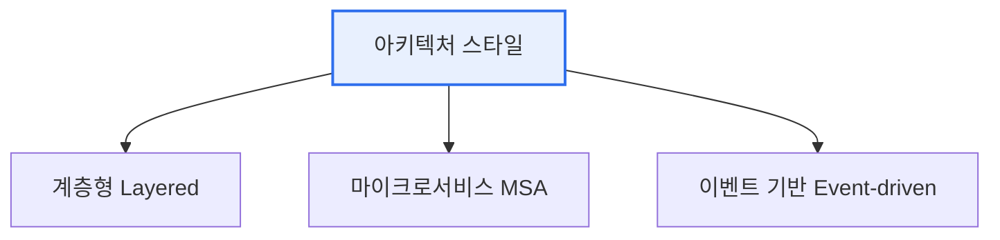

# 아키텍처 스타일과 디자인 패턴

## 1. 개요

### 가. 정의
> **아키텍처 스타일**은 시스템 전체 구조를 조직하는 **거시적 설계 틀**이고, **디자인 패턴**은 특정 설계 문제를 해결하는 **미시적·재사용 가능한 해법**이다.

둘의 관계는 '**건물의 구조 양식**'과 '**방을 꾸미는 정형화된 기법**'에 비유된다. 아키텍처 스타일이 시스템의 뼈대(계층·MSA 등)를 정한다면, 디자인 패턴은 그 안에서 반복되는 코드 수준의 문제(객체 생성·행위 조정)를 검증된 방식으로 푼다. 추상화 수준과 영향 범위가 다르다.

## 2. 아키텍처 스타일과 디자인 패턴의 차이 (가)

| 구분 | 아키텍처 스타일 | 디자인 패턴 |
|---|---|---|
| **범위** | 시스템 전체(거시) | 컴포넌트·클래스(미시) |
| **관심사** | 구조·컴포넌트·연결 | 객체 생성·구조·행위 |
| **영향** | 품질속성(성능·확장·보안) | 코드 재사용·유연성 |
| **예** | 계층형, MSA, 이벤트기반 | 싱글턴, 팩토리, 옵서버 |

## 3. 대표적인 아키텍처 스타일 3가지 (나)

| 스타일 | 특징 |
|---|---|
| **계층형(Layered)** | 표현·비즈니스·데이터 계층 분리, 단순·유지보수 용이 |
| **마이크로서비스(MSA)** | 독립 배포 가능한 작은 서비스로 분해, 확장·자율성 |
| **이벤트 기반(Event-driven)** | 이벤트 발행/구독으로 느슨한 결합, 실시간·비동기 |

## 4. GoF 디자인 패턴 (다)

| 유형 | 목적 | 대표 패턴 |
|---|---|---|
| **생성(Creational)** | 객체 생성 방식 캡슐화 | 싱글턴, 팩토리 메서드, 추상팩토리, 빌더, 프로토타입 |
| **구조(Structural)** | 객체·클래스 조합 구조 | 어댑터, 데코레이터, 프록시, 퍼사드, 컴포지트 |
| **행위(Behavioral)** | 객체 간 책임·상호작용 | 옵서버, 전략, 커맨드, 상태, 반복자, 템플릿메서드 |

- **싱글턴**: 인스턴스를 하나만 생성·공유(설정·로그)
- **팩토리 메서드**: 객체 생성을 서브클래스에 위임
- **옵서버**: 상태 변경을 구독자에 자동 통지(이벤트)
- **전략**: 알고리즘을 캡슐화해 교체 가능하게

## 5. 시사점
- 아키텍처 스타일로 **품질속성**을, 디자인 패턴으로 **코드 유연성**을 확보
- 패턴 남용은 과설계(Over-engineering) — 문제 맥락에 맞게 적용
- MSA·클라우드 네이티브에서 서킷브레이커·사가 등 새 패턴 등장

---

> **한 줄 요약**: 아키텍처 스타일(계층형·MSA·이벤트기반)은 시스템 전체 구조를, GoF 디자인 패턴(생성·구조·행위)은 반복되는 설계 문제의 해법을 제공하며, 추상화 수준과 영향 범위가 다르다.
