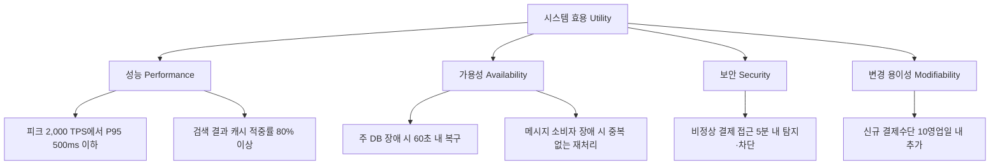
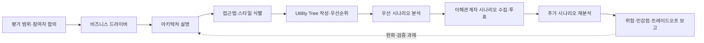

# ATAM(Architecture Tradeoff Analysis Method) 기반 소프트웨어 아키텍처 평가

## 1. 개요

> **정의**: ATAM(Architecture Tradeoff Analysis Method)은 비즈니스 목표에서 도출한 품질속성 요구를 시나리오로 구체화하고, 아키텍처 결정이 품질속성에 미치는 영향을 분석하여 위험·민감점·트레이드오프를 조기에 식별하는 이해관계자 참여형 아키텍처 평가 방법이다.

소프트웨어 아키텍처는 기능 목록만으로 설명되지 않는다.
같은 기능을 제공하더라도 응답시간, 장애 허용, 보안, 변경 용이성, 배포 속도에 따라 사용자와 사업이 얻는 결과가 달라진다.
예를 들어 주문 시스템이 주문을 생성한다는 기능은 같아도 피크 시간에 95퍼센타일 응답시간을 500밀리초 이내로 유지할 수 있는지, 결제 장애 때 중복 청구를 막는지에 따라 아키텍처의 적합성이 달라진다.
따라서 아키텍처 평가는 컴포넌트가 존재하는지를 확인하는 일이 아니라, 중요한 품질속성 목표를 실제 구조가 지속적으로 만족할 수 있는지를 검토하는 활동이다.

ATAM의 핵심은 품질속성 사이의 상호작용을 드러내는 데 있다.
캐시를 도입하면 성능과 가용성이 좋아질 수 있지만, 데이터 신선도와 무효화 복잡성이 커질 수 있다.
동기식 강결합을 줄이면 변경성과 확장성은 좋아지지만, 메시지 중복·순서·최종 일관성이라는 운영 부담이 생긴다.
즉 한 품질속성의 개선이 다른 품질속성의 저하를 일으킬 수 있으므로, 단일 지표의 최적화가 아니라 사업 우선순위에 따른 균형점을 찾아야 한다.

전통적인 설계 검토는 아키텍트가 구조도를 설명하고 참석자가 구현 세부를 질문하는 방식으로 끝나기 쉽다.
이 방식에서는 이해관계자가 실제로 중요하게 생각하는 품질 목표가 암묵지로 남고, 아키텍처 선택의 근거도 회의록에 흩어진다.
ATAM은 비즈니스 드라이버, 품질속성 유틸리티 트리, 시나리오 우선순위, 아키텍처 접근법을 공통 언어로 사용하여 논의를 구조화한다.
그 결과 평가팀은 설계의 정답을 선언하기보다 현재 결정이 어떤 위험을 만들고 어떤 추가 검증이 필요한지 투명하게 제시한다.

ATAM은 기능적 정확성을 증명하는 테스트 방법이 아니다.
모든 코드 경로를 검증하거나 성능 수치를 실측하여 보증하는 방법도 아니다.
아키텍처 결정의 결과를 품질속성 관점에서 질문하고, 불확실성이 큰 지점을 찾아 후속 분석·프로토타입·시험으로 연결하는 위험 식별 방법이다.
따라서 평가 결과는 합격·불합격 한 줄보다 위험 목록, 비위험 판단, 민감점, 트레이드오프, 완화 계획과 의사결정의 근거로 구성되어야 한다.

### 1.1 등장 배경과 필요성

첫째, 아키텍처 결정은 되돌리기 어렵고 변경 비용이 크다.
데이터 저장소, 통신 프로토콜, 배포 단위, 인증 경계와 같은 결정은 이후 컴포넌트와 운영 절차 전체에 영향을 준다.
구현 이후에 이를 바꾸면 데이터 이전, 인터페이스 호환, 운영 중단, 조직 재교육이 함께 발생한다.
ATAM을 요구사항과 기본 아키텍처가 형성되는 시점에 적용하면 값비싼 재설계를 줄이고, 아직 여러 대안을 비교할 수 있는 상태에서 리스크를 가시화할 수 있다.

둘째, 비기능 요구는 모호한 형용사로 남기 쉽다.
"빠른 시스템", "안전한 서비스", "유연한 플랫폼"이라는 표현만으로는 설계 대안을 판단할 수 없다.
ATAM은 자극원, 자극, 환경, 대상, 반응, 반응 측정치로 구성된 품질속성 시나리오를 사용하여 추상적 요구를 관찰 가능한 기준으로 바꾼다.
예를 들어 "피크 트래픽에서 빠르다"를 "정상 운영 중 초당 2,000건의 주문 요청이 유입될 때 주문 API의 95퍼센타일 응답시간이 500밀리초 이하이고 오류율이 0.5퍼센트 이하"로 구체화한다.

셋째, 이해관계자마다 최적의 아키텍처가 다르다.
사업 부서는 출시일과 비용을 중시하고, 보안 부서는 격리와 감사성을 중시하며, 운영 부서는 장애 복구와 관측성을 중시한다.
한쪽의 관점만 반영하면 프로젝트 후반에 숨은 요구가 충돌한다.
ATAM은 사업 책임자, 아키텍트, 개발자, 운영자, 보안 담당자, 유지보수자, 사용자 대표가 같은 시나리오를 놓고 우선순위를 토론하도록 하여 합의의 질을 높인다.

### 1.2 목표와 기본 원칙

ATAM의 첫 번째 원칙은 **비즈니스 드라이버에서 출발한다**는 것이다.
품질속성은 그 자체가 목적이 아니라 사업 목표를 달성하기 위한 수단이다.
예를 들어 높은 가용성이 필요한 이유는 기술팀이 숫자를 좋아해서가 아니라, 금융 거래의 중단이 매출·신뢰·규제 준수에 직접 영향을 주기 때문이다.
따라서 평가의 범위와 우선순위는 사업 가치, 법적 의무, 사용자 영향, 운영 위험을 함께 고려해 정한다.

두 번째 원칙은 **시나리오로 분석한다**는 것이다.
품질속성 이름만 말하면 평가자의 경험에 따라 해석이 달라진다.
자극과 반응, 환경과 측정치를 명시하면 서로 다른 아키텍처가 동일한 질문에 답하게 되고, 추가 부하 시험이나 보안 검증의 요구사항도 명확해진다.
정량화가 어려운 변경 용이성도 "새로운 결제수단을 기존 릴리스 주기 내에 추가한다"와 같은 변화 시나리오로 다룰 수 있다.

세 번째 원칙은 **위험을 조기에 드러내되 해결을 독단적으로 결정하지 않는다**는 것이다.
ATAM 평가팀은 위험의 존재와 영향도를 설명하고, 완화 대안과 검증 과제를 제시한다.
최종 선택은 예산, 일정, 조직 역량, 규제, 제품 전략을 책임지는 의사결정자가 해야 한다.
평가팀이 특정 기술을 정답으로 강제하면 참여형 평가의 장점과 책임 소재가 모두 약해진다.

## 2. ATAM의 평가 대상과 품질속성 시나리오

ATAM은 아키텍처를 구성하는 컴포넌트, 커넥터, 배치, 외부 인터페이스, 데이터 흐름, 배포 환경과 그 선택 근거를 대상으로 한다.
아키텍처 설명에는 단순한 상자와 선뿐 아니라 어떤 품질속성 요구를 어떤 접근법으로 만족시키는지가 포함되어야 한다.
예를 들어 주문 서비스와 결제 서비스 사이에 메시지 큐를 놓았다면, 비동기 결정을 통해 확장성과 장애 격리를 높이는 동시에 중복 이벤트와 일관성 문제를 어떻게 처리하는지 설명해야 한다.

### 2.1 품질속성의 분류와 상호작용

대표적인 품질속성은 성능, 가용성, 보안, 변경 용이성, 확장성, 시험 용이성, 상호운용성, 사용성, 운영성이다.
이들은 서로 독립된 체크박스가 아니라 동일한 아키텍처 결정에 의해 함께 변한다.
예를 들어 강한 암호화와 세밀한 감사 로그는 보안을 높이지만 CPU 사용량, 저장량, 처리 지연을 증가시킬 수 있다.
이 상호작용을 정리하지 않으면 성능팀과 보안팀이 서로의 요구를 방해 요소로만 인식하게 된다.

품질속성 분석은 다음 네 가지 질문으로 진행한다.
첫째, 어떤 이해관계자가 어떤 자극을 발생시키는가를 묻는다.
둘째, 시스템은 어느 환경에서 어떤 반응을 보여야 하는가를 묻는다.
셋째, 반응이 성공했다고 판단할 측정치와 허용 기준은 무엇인가를 묻는다.
넷째, 해당 반응을 보장하기 위해 어떤 아키텍처 접근법을 선택했고 그 선택이 다른 품질속성에 어떤 비용을 주는가를 묻는다.

| 품질속성 | 대표 자극 | 반응 측정 예 | 대표 아키텍처 접근법 |
|---|---|---|---|
| 성능 | 피크 요청 급증 | 95퍼센타일 지연, 처리량, 오류율 | 캐시, 비동기 큐, 수평 확장 |
| 가용성 | 특정 인스턴스 장애 | 복구시간, 실패 요청 비율 | 이중화, 자동 페일오버, 격리 |
| 보안 | 비인가 접근 시도 | 탐지·차단 시간, 감사 누락 | 최소 권한, 방어 심층화, 암호화 |
| 변경 용이성 | 신규 결제수단 추가 | 변경 소요시간, 영향 파일 수 | 인터페이스 분리, 플러그인, 계약 테스트 |
| 확장성 | 사용자·데이터 규모 증가 | 용량 증가에 따른 비용·성능 | 무상태화, 샤딩, 파티셔닝 |
| 운영성 | 장애·배포·설정 변경 | 탐지시간, 복구시간, 변경 실패율 | 관측성, 자동화, 점진 배포 |

표의 항목을 나열하는 것만으로는 평가가 되지 않는다.
예를 들어 무상태 서비스는 수평 확장에 유리하지만, 세션과 작업 상태를 외부 저장소로 이동해야 하므로 저장소의 가용성과 네트워크 지연이 새로운 민감점이 된다.
또한 캐시는 읽기 성능을 개선하지만 무효화 지연이 결제 잔액이나 재고 수량의 정확성을 훼손할 수 있다.
ATAM에서는 이처럼 한 접근법이 만드는 이득과 부작용을 같은 시나리오 묶음에서 추적한다.

### 2.2 품질속성 시나리오의 6요소

품질속성 시나리오는 **자극원(Source)**, **자극(Stimulus)**, **환경(Environment)**, **대상(Artifact)**, **반응(Response)**, **반응 측정(Response Measure)**으로 구체화한다.
자극원은 사용자, 관리자, 외부 시스템, 운영자, 장애 이벤트처럼 자극을 발생시키는 주체다.
자극은 요청 폭증, 노드 장애, 정책 변경, 공격 시도, 신규 기능 요구처럼 시스템이 처리해야 할 사건이다.

환경은 정상 운영, 피크 부하, 부분 장애, 배포 중, 재해 상황처럼 사건이 발생하는 조건을 말한다.
대상은 전체 시스템일 수도 있고 API 게이트웨이, 데이터베이스, 인증 모듈, 메시지 소비자처럼 특정 컴포넌트일 수도 있다.
반응은 시스템이 수행해야 할 행동을 서술하며, 반응 측정은 시간·비율·수량·변경 범위처럼 검증 가능한 기준으로 작성한다.

예를 들어 "장애에 강해야 한다"는 시나리오는 다음처럼 바꾼다.
"정상 운영 중 데이터베이스 주 인스턴스가 중단되면, 주문 서비스가 장애를 탐지하고 대기 인스턴스로 전환하여 60초 이내에 읽기·쓰기 기능을 복구하며, 확인된 트랜잭션의 손실을 0건으로 유지한다."
이 문장은 가용성, 데이터 무결성, 운영 자동화, 복구 절차를 동시에 질문하게 만든다.

변경 시나리오도 같은 방식으로 작성한다.
"사업 담당자가 3개월 후 새로운 해외 결제사업자를 추가하더라도, 기존 주문·환불 흐름을 중단하지 않고 개발자 2명이 10영업일 이내에 어댑터와 계약 테스트를 추가하여 배포한다."
이 시나리오는 모듈성, 인터페이스 안정성, 테스트 자동화, 배포 독립성에 대한 근거를 요구한다.

### 2.3 Utility Tree와 우선순위

Utility Tree는 최상위 효용(Utility)에서 품질속성, 세부 시나리오로 내려가는 계층 구조다.
각 시나리오는 사업 중요도와 아키텍처 난이도 또는 위험도를 조합해 우선순위화한다.
중요도는 해당 시나리오가 사업 성과·규제·사용자 경험에 미치는 영향이고, 난이도는 현재 아키텍처가 요구를 충족하기 위해 감당해야 하는 기술적 불확실성이다.

실무에서는 중요도와 난이도를 각각 H(High), M(Medium), L(Low)로 표시하거나 숫자 점수로 기록한다.
예를 들어 피크 주문 처리 시나리오가 사업 중요도 H, 난이도 H라면 최우선 분석 대상이다.
반면 내부 관리 화면의 테마 변경처럼 중요도와 난이도가 모두 낮은 항목은 ATAM 워크숍의 핵심 시간을 소모하지 않도록 별도 검토로 보낼 수 있다.
점수 자체가 객관적 진리를 뜻하는 것은 아니며, 왜 그 우선순위가 나왔는지 이해관계자 간 근거를 남기는 것이 더 중요하다.

## 3. ATAM 수행 절차와 산출물

ATAM은 조직과 범위에 따라 변형되지만, 일반적으로 평가 소개, 비즈니스 드라이버 제시, 아키텍처 제시, 아키텍처 접근법 식별, 품질속성 유틸리티 트리 작성, 접근법 분석, 이해관계자 시나리오 수집·우선순위화, 재분석, 결과 제시의 흐름으로 수행한다.
일회성 발표가 아니라 질문과 분석이 반복되는 워크숍이며, 각 단계에서 발견한 사실은 다음 단계의 질문을 더 정밀하게 만든다.

### 3.1 준비와 평가 소개

준비 단계에서는 평가 목적, 대상 시스템, 평가 시점, 포함·제외 범위, 의사결정 권한, 필요한 자료, 참석자를 합의한다.
평가 대상이 아직 개념 설계라면 논리 아키텍처와 핵심 기술 선택을 중심으로 보고, 운영 중인 시스템이라면 실제 장애·변경 이력·관측 지표를 자료로 포함한다.
범위를 정하지 않고 모든 품질속성을 다루면 워크숍이 기술 토론회로 변질되므로, 사업 드라이버와 가장 큰 불확실성에 초점을 맞춘다.

평가팀은 진행자, 기록자, 아키텍처 평가 경험자와 도메인 전문가를 포함한다.
진행자는 특정 기술을 옹호하기보다 질문과 발언 균형을 관리하고, 기록자는 시나리오·가정·위험·의견 차이를 실시간으로 구조화한다.
사업 책임자와 아키텍트는 목표와 구조를 설명하고, 개발·운영·보안·유지보수 담당자는 실제 품질 요구와 실패 경험을 보충한다.

소개 단계에서 ATAM의 목적이 설계자를 심사하거나 개인의 책임을 찾는 것이 아님을 분명히 해야 한다.
평가 결과를 인사 평가와 연결하면 참석자가 위험을 숨기거나 방어적으로 발표할 수 있다.
반대로 위험을 공개해도 불이익이 없고, 발견된 위험이 완화 계획으로 이어진다는 신뢰가 형성되어야 객관적인 자료가 나온다.

### 3.2 비즈니스 드라이버와 아키텍처 제시

비즈니스 드라이버는 사업 목표, 핵심 사용자, 규제와 계약, 시장 출시 시점, 비용 제약, 성장 전망을 포함한다.
예를 들어 온라인 주문 플랫폼의 드라이버는 명절 피크에서도 거래를 수용하는 것, 결제 정보의 법적 보호, 신규 판매자 입점 기간 단축, 클라우드 비용의 예측 가능성일 수 있다.
이 드라이버를 품질속성으로 번역해야 아키텍처 선택과 사업 가치의 연결 고리가 생긴다.

아키텍트는 구조도만 보여주지 말고 주요 결정의 의도와 가정을 설명해야 한다.
서비스를 분리한 이유, 데이터 소유권을 나눈 기준, 동기·비동기 통신을 선택한 근거, 장애 시 일관성 모델, 배포·롤백 방식, 보안 경계를 함께 제시한다.
특히 아직 검증하지 못한 가정은 사실처럼 말하지 않고 가정 목록으로 표시해야 한다.
가정이 위험 목록으로 발전할 수 있기 때문이다.

아키텍처 접근법은 완성된 제품이나 특정 벤더를 뜻하지 않는다.
무상태 컴퓨팅, 읽기 전용 복제본, 이벤트 기반 통합, 회로 차단기, 다중 리전, 토큰 기반 인증처럼 품질속성 목표를 달성하기 위해 선택한 구조적 전략을 말한다.
동일한 접근법도 환경과 구현 방식에 따라 결과가 다르므로, ATAM에서는 접근법의 이름보다 어떤 시나리오에 어떻게 작용하는지를 분석한다.

### 3.3 Utility Tree 작성과 접근법 분석

평가팀은 이해관계자와 함께 품질속성을 추출하고, 각 품질속성 아래에 우선순위 시나리오를 만든다.
시나리오는 모호한 표현을 피하고 자극·환경·대상·반응·측정값을 포함하도록 다듬는다.
그 다음 투표나 합의로 중요도와 난이도를 표시하며, 가장 영향이 큰 잎 노드부터 아키텍처 접근법을 분석한다.

접근법 분석에서는 해당 선택이 시나리오를 만족시키는 경로를 따라간다.
예컨대 주문 서비스의 수평 확장은 처리량 증가에는 효과적이지만, 세션 외부화와 데이터베이스 병목이 필요한지 확인한다.
메시지 큐는 생산자와 소비자를 분리하지만, 재처리 시 멱등성 키와 순서 보장 정책이 있는지 확인한다.
멀티 리전 복제는 재해 대응을 개선하지만, 지역 간 쓰기 충돌과 개인정보 국외 이전 같은 법·운영 문제를 추가할 수 있다.

분석 질문은 "이 기술을 쓰는가"가 아니라 "이 접근법이 이 시나리오의 측정 기준을 어떤 메커니즘으로 만족시키며 실패 시 어떤 결과를 내는가"여야 한다.
답변이 정량 근거 없이 낙관적이면 위험으로 기록하고, 부하 시험·장애 주입·프로토타입·보안 검토 같은 검증 과제를 정의한다.
검증 과제의 책임자와 완료 시점을 지정하면 워크숍의 통찰이 실행 가능한 아키텍처 관리로 전환된다.

### 3.4 시나리오 브레인스토밍과 재분석

초기 Utility Tree가 아키텍트와 핵심 담당자의 관점을 과도하게 반영할 수 있으므로, 더 넓은 이해관계자에게 시나리오를 받는다.
사용자 관점의 불편, 운영자가 겪는 수동 복구, 감사 담당자의 추적 요구, 파트너 시스템의 호환성 요구가 이 단계에서 드러날 수 있다.
제출된 시나리오는 중복을 통합하되, 서로 다른 사업 의미를 지우지 않도록 원래 발화와 출처를 기록한다.

시나리오는 투표로 우선순위를 정할 수 있지만, 표 수가 적은 규제·안전 시나리오를 단순 다수결로 탈락시켜서는 안 된다.
법적 의무와 안전 관련 요구는 낮은 빈도라도 영향이 매우 크므로 별도 필수 조건으로 분류한다.
또한 투표 결과가 사업 드라이버와 불일치하면 이유를 재질문해야 하며, 점수만으로 의사결정을 자동화하지 않는다.

재분석에서는 새로 우선순위가 높아진 시나리오를 기존 접근법에 대입한다.
이 과정에서 앞서 보이지 않던 위험과 민감점이 추가되며, 서로 다른 시나리오가 동일한 결정에 의존한다는 사실도 드러난다.
예를 들어 캐시 정책이 검색 성능 시나리오와 재고 정합성 시나리오 모두의 핵심이라면, 캐시는 단순 최적화가 아니라 트레이드오프를 만드는 중심 결정으로 승격된다.

### 3.5 결과 제시와 후속 관리

결과 보고서는 평가 범위와 참여자, 비즈니스 드라이버, 아키텍처 요약, 주요 접근법, Utility Tree, 우선순위 시나리오, 위험, 비위험, 민감점, 트레이드오프, 미해결 가정, 완화·검증 계획을 포함한다.
위험은 "문제가 있다"로 끝내지 말고 발생 조건, 영향을 받는 품질속성, 사업 영향, 현재 통제, 추가 조치와 책임자를 함께 기록한다.

비위험(Non-risk)은 해당 접근법이 특정 시나리오를 현재 범위에서 만족하며 추가 조치가 필요하지 않다는 판단이다.
비위험 판단도 근거와 범위를 기록해야 나중에 환경이 바뀌었을 때 재검토할 수 있다.
민감점은 한 품질속성 결과가 특정 결정이나 매개변수에 크게 좌우되는 지점이며, 트레이드오프는 한 결정이 둘 이상의 품질속성에 동시에 영향을 미치는 지점이다.

평가 후에는 위험을 아키텍처 백로그와 ADR(Architecture Decision Record)에 연결한다.
ADR에는 문제 맥락, 고려한 대안, 결정, 근거, 결과와 재검토 조건을 남긴다.
부하 시험 결과나 장애 훈련 결과가 나오면 해당 ADR과 위험 항목을 갱신하여 문서가 실제 설계 지식의 기록으로 남게 한다.

## 4. 핵심 결과물과 위험 분석

### 4.1 위험·민감점·트레이드오프의 구분

**위험(Risk)**은 어떤 아키텍처 결정이나 가정이 향후 품질속성 목표를 방해할 가능성이 있는 상태다.
예를 들어 결제 이벤트를 비동기로 처리하면서 멱등성 키가 정의되지 않았다면, 재전송 시 중복 결제가 발생할 위험이 있다.
위험은 아직 실패가 확정된 것이 아니라, 실패 가능성과 영향이 충분히 커서 검증 또는 완화가 필요한 상태다.

**민감점(Sensitivity Point)**은 특정 아키텍처 결정이나 매개변수의 작은 변화가 품질속성 결과에 큰 변화를 주는 지점이다.
예를 들어 캐시 TTL이 30초에서 60초로 조금만 바뀌어도 재고 부정확성이 허용 범위를 넘는다면 TTL은 민감점이다.
민감점은 향후 요구나 운영 조건이 바뀌었을 때 재평가해야 하는 조정 레버이므로, 설정값·임계치·용량 계획과 함께 관리한다.

**트레이드오프(Tradeoff Point)**는 둘 이상의 품질속성에 영향을 주면서 한쪽의 개선이 다른 쪽의 비용이나 저하를 유발하는 결정이다.
예를 들어 강한 동기식 검증은 데이터 일관성과 보안을 높일 수 있으나 응답시간과 가용성을 낮출 수 있다.
트레이드오프는 반드시 나쁜 설계라는 뜻이 아니라, 사업 우선순위에 따라 의식적으로 선택하고 운영 지표로 감시해야 하는 설계 지점이다.

| 구분 | 핵심 질문 | 예시 | 후속 조치 |
|---|---|---|---|
| 위험 | 어떤 결정이 목표를 위협할 가능성이 있는가? | 재처리 시 중복 결제 | 멱등성 설계·장애 시험 |
| 비위험 | 어떤 근거로 현재 목표를 만족한다고 보는가? | 읽기 복제본의 조회 부하 충족 | 근거와 범위 기록 |
| 민감점 | 어느 변수의 작은 변화가 큰 영향을 주는가? | 캐시 TTL, 커넥션 풀 크기 | 임계치 측정·모니터링 |
| 트레이드오프 | 한 결정이 여러 품질속성에 어떤 상충을 만드는가? | 암호화 강도와 지연 | 우선순위·보상책 합의 |

### 4.2 위험 테마와 우선순위화

개별 위험을 품질속성과 사업 드라이버별로 묶으면 반복되는 원인과 구조적 문제를 찾을 수 있다.
예를 들어 여러 서비스의 위험이 "운영자가 장애 원인을 추적할 수 없다"로 수렴한다면, 각 팀의 로그 추가가 아니라 공통 상관관계 ID, 분산 추적, 서비스 수준 지표를 플랫폼 역량으로 보강해야 한다.
위험 테마는 위험의 개수를 줄이는 것이 아니라, 한 번의 개선으로 여러 시나리오를 완화할 수 있는 레버를 찾게 한다.

위험 우선순위는 발생 가능성, 사업 영향, 탐지 가능성, 완화 비용, 규제·안전 중요도를 조합한다.
정량 점수는 대화를 촉진하는 도구이지 정확한 확률 계산으로 오해해서는 안 된다.
특히 발생 확률이 낮아도 대규모 개인정보 유출이나 안전 사고처럼 영향이 극단적인 위험은 경영진의 수용 여부를 명시적으로 결정해야 한다.

## 5. ATAM과 유사 기법 비교

ATAM은 품질속성 상호작용과 위험을 이해관계자 참여로 분석하는 데 강점이 있다.
그러나 시스템의 기능 정확성, 상세 코드 품질, 실제 용량을 단독으로 검증하지 않으므로 다른 방법과 결합해야 한다.
유사 기법과의 차이를 이해하면 어떤 질문에 어떤 평가 방법을 투입할지 결정할 수 있다.

**SAAM(Software Architecture Analysis Method)**은 변경 시나리오를 중심으로 아키텍처의 수정 용이성과 기능 분배를 분석하는 데 초점을 둔다.
ATAM은 SAAM의 시나리오 기반 사고를 확장하여 성능·가용성·보안 등 여러 품질속성의 상호작용과 트레이드오프를 다룬다.
따라서 변경 영향이 주된 관심이면 SAAM이 간결하고, 여러 품질목표가 충돌하는 대규모 시스템이면 ATAM이 더 적합하다.

**ARID(Active Reviews for Intermediate Designs)**는 상세 설계가 완성되기 전 중간 설계를 검토하는 방식으로, 설계의 실행 가능성과 핵심 컴포넌트 책임을 빠르게 피드백한다.
ATAM이 사업 드라이버와 품질속성 위험의 큰 그림에 초점을 둔다면, ARID는 특정 설계 부분을 더 가까이 들여다보는 리뷰에 가깝다.
두 방법을 단계적으로 적용하면 초기 ATAM에서 큰 위험을 찾고, ARID에서 해당 영역의 설계를 구체화할 수 있다.

**ADR**은 평가 방법이라기보다 하나의 중요한 아키텍처 결정을 맥락과 근거로 기록하는 산출물 형식이다.
ATAM에서 도출한 트레이드오프와 합의된 완화책을 ADR로 남기면 의사결정의 추적성과 신규 구성원의 이해가 높아진다.
반대로 ADR만 작성하고 대안 비교나 이해관계자 시나리오를 수행하지 않으면, 결과의 근거가 빈약한 사후 문서가 될 수 있다.

| 구분 | 주된 질문 | 강점 | 한계 | 함께 쓰는 방법 |
|---|---|---|---|---|
| ATAM | 품질속성 목표와 상호작용의 위험은 무엇인가? | 이해관계자 기반 위험·트레이드오프 분석 | 워크숍 준비와 참여 필요 | ADR·부하·장애 시험 연결 |
| SAAM | 변경 시나리오가 구조에 미치는 영향은? | 변경 용이성·기능 분배 분석 | 품질속성 상호작용이 상대적으로 제한 | ATAM 전후 변경 분석 |
| ARID | 중간 설계가 구현 가능한가? | 상세 설계의 조기 피드백 | 범위가 국소적 | 위험 컴포넌트 심층 리뷰 |
| ADR | 왜 이 결정을 선택했는가? | 결정 맥락과 근거의 지속 기록 | 자체로는 평가 절차 아님 | ATAM 결과를 결정 로그화 |
| 성능·보안 시험 | 실제 조건에서 목표를 만족하는가? | 측정값과 증거 확보 | 아키텍처 초기에는 실행 환경 부족 | ATAM 위험 검증 과제 |

비교에서 중요한 실무적 함의는 기법을 경쟁시키지 않는 것이다.
ATAM이 "메시지 큐의 재처리 위험을 검증하라"고 지적하면, 성능 시험과 장애 주입 시험이 실제 증거를 만든다.
보안 시나리오가 인증 경계의 문제를 드러내면 위협 모델링과 침투 시험이 설계 대안을 검증한다.
평가와 시험이 서로의 대체재가 아니라 질문 생성과 증거 확보의 순환을 구성하도록 계획해야 한다.

## 6. 사례 — 온라인 주문·결제 플랫폼의 아키텍처 평가

### 6.1 사업 드라이버와 대안

온라인 주문 플랫폼은 평시 초당 300건, 행사 기간 초당 2,000건의 요청을 처리해야 한다.
주문 생성부터 결제 승인까지의 핵심 거래는 중복 청구와 재고 과판매를 방지해야 하며, 신규 결제사업자를 빠르게 추가해야 한다.
또한 결제 관련 민감정보는 접근을 제한하고, 장애 발생 시 운영자가 5분 안에 원인을 파악해야 한다.
이 요구는 성능, 무결성, 보안, 변경 용이성, 운영성이라는 서로 얽힌 품질속성을 만든다.

평가 대상 팀은 모든 처리를 하나의 트랜잭션으로 묶는 모놀리식 대안과 주문·결제·재고를 분리하고 이벤트로 연결하는 대안을 비교한다.
모놀리식 구조는 트랜잭션 일관성과 초기 개발 단순성이 장점이지만, 전체를 함께 확장·배포해야 하고 결제 장애가 주문 조회까지 끌어내릴 수 있다.
분리 구조는 서비스별 확장과 장애 격리에 유리하지만, 분산 트랜잭션 대신 사가·보상 처리·멱등성·관측성을 설계해야 한다.
ATAM은 어느 대안이 일반적으로 우월하다고 선언하지 않고, 주어진 시나리오와 제약에서 어떤 위험을 감수할지 비교한다.

### 6.2 Utility Tree 시나리오 분석

성능 시나리오는 행사 중 초당 2,000건의 주문 요청이 들어와도 주문 API P95가 500밀리초 이하이고 오류율이 0.5퍼센트 이하인 것이다.
무상태 주문 API와 수평 확장은 처리량 증가에 기여하지만, 재고 차감 데이터베이스의 잠금 경합이 병목이 될 수 있다.
따라서 캐시를 주문 생성에 무분별하게 적용하기보다 상품 조회와 재고 예약을 분리하고, 예약 원장에 원자적 조건 검사를 적용하는 방식이 안전하다.
이때 커넥션 풀과 큐 적체가 민감점이므로 부하 증가에 따른 지연 곡선을 측정한다.

가용성 시나리오는 결제 서비스가 3분 동안 응답하지 않아도 주문 접수와 결제 대기 상태를 분리하여 사용자에게 중복 재시도를 유도하지 않는 것이다.
회로 차단기는 결제 장애의 연쇄 전파를 줄이지만, 회로가 열린 동안 어떤 주문을 대기시키고 언제 재시도할지 정책이 필요하다.
메시지 기반 재처리는 소비자 재시작 때 같은 결제 이벤트가 다시 전달될 수 있으므로, 주문 ID와 결제 시도 번호를 멱등성 키로 사용해야 한다.
결제 승인과 재고 예약의 순서를 바꾸면 보상 트랜잭션이 달라지므로, 이 순서와 실패 시 상태 전이를 ADR에 기록한다.

보안 시나리오는 비정상 위치에서 관리자 API를 호출할 때 다중 인증과 세분화된 권한 검사를 수행하고, 모든 결제 상태 변경을 감사 로그로 남기는 것이다.
게이트웨이에서 토큰을 확인하더라도 서비스 내부 호출에서 사용자·서비스 권한을 다시 확인해야 한다.
감사 로그는 위변조 방지 저장소로 보내고 상관관계 ID로 주문·결제·관리자 행위를 연결하되, 카드번호와 같은 민감정보는 로그에 기록하지 않는다.
이 접근은 보안과 감사성을 높이지만 로그 저장량과 검색 비용을 증가시키므로 보존 기간과 마스킹 정책을 함께 결정한다.

변경 용이성 시나리오는 새로운 결제사업자를 추가할 때 주문 도메인 코드를 수정하지 않고 10영업일 이내에 배포하는 것이다.
결제 포트는 승인·취소·환불의 내부 계약을 정의하고, 사업자별 어댑터가 외부 API 차이를 흡수하도록 한다.
계약 테스트와 샌드박스 검증이 없으면 내부 인터페이스가 안정적이어도 외부 오류 코드·타임아웃·부분 승인 처리에서 장애가 발생한다.
따라서 플러그인 구조만으로 충분하다고 판단하지 말고, 실패 계약과 운영 대시보드까지 변경 경계에 포함한다.

### 6.3 발견된 위험과 완화책

첫 번째 위험은 메시지 중복으로 인한 이중 결제다.
현재 설계가 "메시지 큐는 최소 한 번 전달한다"는 특성을 인정하지 않고 소비자의 성공만 기록한다면, ACK 직전 장애에서 동일 결제가 다시 실행될 수 있다.
완화책은 결제사업자 요청에 멱등성 키를 전달하고, 결제 시도 원장에 유일 제약을 두며, 재처리 결과를 관측 가능한 상태 머신으로 관리하는 것이다.
완화 여부는 장애 주입으로 ACK 전 중단과 네트워크 타임아웃을 재현하여 검증한다.

두 번째 위험은 멀티 리전 쓰기 충돌과 개인정보 처리 경계다.
재해 복구를 위해 양 리전에서 쓰기를 허용하면 지연은 줄 수 있지만, 동일 주문의 상태 충돌과 데이터 주권·국외 이전 검토가 필요해진다.
단일 리전 주 쓰기와 대기 리전 복구 방식을 선택하면 충돌은 줄지만 복구 시점의 데이터 손실 목표와 전환 시간 목표를 입증해야 한다.
이 지점은 가용성, 복구성, 지연, 규제 준수에 걸친 트레이드오프로 기록하고, 사업 책임자가 복구 목표와 비용을 승인하도록 한다.

세 번째 위험은 운영 관측성의 불균형이다.
서비스별 로그는 많지만 주문 하나의 흐름을 묶을 상관관계 ID와 표준 지표가 없으면, 장애 원인을 찾는 데 시간이 오래 걸린다.
API 게이트웨이에서 생성한 추적 ID를 서비스·메시지 헤더·감사 이벤트에 전달하고, 주문 상태 전이와 큐 적체·결제 타임아웃을 공통 대시보드로 구성한다.
그러나 민감정보를 추적 정보에 넣지 않고 샘플링·보존 정책으로 비용을 통제해야 하므로 관측성도 보안·비용과 함께 평가한다.

## 7. 심화 — 클라우드·AI 시대의 ATAM 확장

최근 아키텍처는 클라우드 관리형 서비스, 컨테이너, 이벤트 스트리밍, AI 모델, 외부 API에 의존하므로 평가 범위가 애플리케이션 코드 밖으로 넓어진다.
아키텍처 접근법은 배포 당시의 구조만이 아니라 서비스 제공자의 장애 도메인, 데이터 보존·학습 정책, 모델 변경, 리전 의존성, 공급망과 운영 조직까지 포함해야 한다.
ATAM의 시나리오 형식은 이처럼 기술이 바뀌어도 "누가 어떤 자극을 주고, 어떤 환경에서, 무엇이 어떻게 반응하며, 어떤 수치로 검증하는가"를 유지하게 한다.

ISO/IEC 25010:2023은 ICT 제품과 소프트웨어 제품을 대상으로 제품 품질 모델을 정의하고, 품질을 요구사항·설계·시험·평가 전 생애주기에서 활용할 수 있도록 한다.
기존에 익숙한 품질속성 이름을 그대로 암기하기보다, 조직의 사업 드라이버와 제품 범위에 맞춰 품질 특성을 선택하고 측정 가능한 시나리오로 번역해야 한다.
특히 안전, 보안, 상호작용 능력, 유연성과 같은 품질 관점이 제품과 시스템 범위에서 어떻게 적용되는지 확인하면, ATAM의 Utility Tree를 최신 품질 모델과 연결할 수 있다.

AI 기능을 포함한 서비스에서는 일반적인 성능·가용성 외에 정확성, 설명 가능성, 편향, 데이터·프롬프트 보호, 모델 변경 안정성을 시나리오로 추가한다.
예를 들어 "검색증강생성 답변이 지식 기준일 이후의 문서를 인용하고, 근거 없는 답변은 거부하며, 민감정보가 프롬프트 로그에 남지 않는다"는 시나리오를 설정할 수 있다.
모델 버전 교체가 응답 품질과 비용에 미치는 영향은 민감점이며, 외부 모델 API 장애와 요금 변경은 가용성·비용·공급망 트레이드오프가 된다.
AI 결과를 절대적 사실로 가정하지 않고 오프라인 평가셋, 인간 검토, 런타임 모니터링, 롤백 조건을 아키텍처 접근법으로 제시해야 한다.

클라우드 네이티브 시스템에서는 인프라를 코드로 관리하므로 아키텍처 결정과 운영 설정이 빠르게 변한다.
ATAM 결과를 ADR, 코드 저장소, 정책 코드, 관측성 대시보드와 연결하고, 중요한 위험에 대해 자동 검증을 CI/CD 게이트로 배치하면 워크숍의 결론이 일회성 문서로 끝나지 않는다.
다만 모든 커밋마다 전체 ATAM을 다시 수행하는 것은 비효율적이므로, 민감한 아키텍처 결정·사업 드라이버·품질 목표가 바뀌는 이벤트를 재평가 트리거로 정의한다.

## 8. 고려사항 및 시사점

1. **비즈니스 중심으로 범위를 정한다.** ATAM을 기술 목록 검토로 시작하면 품질속성의 우선순위가 흔들린다. 먼저 매출·사용자·규제·운영 목표를 확인하고, 그 목표에 영향을 주는 아키텍처 결정만 평가 범위에 넣는다.

2. **품질속성을 측정 가능한 시나리오로 바꾼다.** "확장 가능"이나 "안전" 같은 형용사는 합의를 만들지 못한다. 자극·환경·대상·반응·측정치를 포함하여 부하 시험, 장애 시험, 보안 검증으로 이어질 수 있는 문장으로 작성한다.

3. **위험·민감점·트레이드오프를 구분한다.** 세 결과를 모두 "이슈"라고 기록하면 우선순위와 대응 방법이 달라진다. 위험은 완화·검증 과제로, 민감점은 임계치와 모니터링으로, 트레이드오프는 사업 우선순위와 보상책 합의로 관리한다.

4. **참여자의 심리적 안전을 보장한다.** 위험을 발견한 사람이나 설계자를 탓하면 ATAM은 형식적인 발표가 된다. 평가 목적을 학습과 조기 위험 감소로 정의하고, 근거가 부족한 가정도 공개할 수 있는 운영 규칙을 만든다.

5. **정성 분석과 정량 검증을 연결한다.** ATAM은 질문과 위험을 찾는 데 강하지만 실제 처리량·복구시간·오탐률을 자동으로 보증하지 않는다. 위험별로 프로토타입, 부하 시험, 장애 주입, 위협 모델링, 모의해킹 같은 검증 방법과 완료 기준을 배정한다.

6. **아키텍처 결정의 수명주기를 관리한다.** 평가 결과를 ADR과 아키텍처 백로그에 기록하고, 환경·사업 드라이버·품질 목표가 바뀔 때 재검토한다. 문서와 실제 구조가 달라지지 않도록 코드·배포 설정·대시보드의 변경과 결정 기록을 연결한다.

7. **기술 부채와 미해결 가정을 숨기지 않는다.** 일정 때문에 미룬 위험은 사라진 것이 아니라 미래의 비용과 장애 가능성으로 이동한 것이다. 수용할 위험, 즉시 완화할 위험, 추가 증거 후 결정할 위험을 구분하여 의사결정자의 명시적 승인을 받는다.

8. **기법을 조직 성숙도에 맞게 단계화한다.** 모든 팀에 대규모 워크숍을 강요하기보다 핵심 시스템은 정식 ATAM을 수행하고, 작은 변경은 시나리오 기반 미니 리뷰와 ADR로 시작한다. 반복 수행을 통해 조직의 품질속성 어휘와 위험 데이터베이스를 축적해야 평가 시간이 줄면서도 효과가 커진다.

9. **출제 답안은 목적·절차·산출물·사례의 흐름으로 구성한다.** 기술사 논술에서는 ATAM의 약어와 단계만 나열하지 말고, 비즈니스 드라이버에서 Utility Tree를 만들고 시나리오를 분석하여 위험·민감점·트레이드오프와 완화책을 도출하는 인과 관계를 보여주어야 한다. 마지막에는 ADR, 시험, 운영 모니터링으로 연결하여 적용 전략과 한계를 함께 제시한다.

## 참고자료

- Carnegie Mellon Software Engineering Institute, “Architecture Tradeoff Analysis Method Collection” — https://www.sei.cmu.edu/library/architecture-tradeoff-analysis-method-collection/
- Carnegie Mellon Software Engineering Institute, “ATAM: Method for Architecture Evaluation” — https://www.sei.cmu.edu/library/atam-method-for-architecture-evaluation/
- Carnegie Mellon Software Engineering Institute, “The Architecture Tradeoff Analysis Method” — https://www.sei.cmu.edu/library/the-architecture-tradeoff-analysis-method/
- ISO, “ISO/IEC 25010:2023 — Product quality model” — https://www.iso.org/standard/78176.html
- Architectural Decision Records, “Architectural Decision Records” — https://adr.github.io/
- arc42, “Quality Scenarios” — https://docs.arc42.org/section-10/

---

> **한 줄 요약**: ATAM은 비즈니스 드라이버와 품질속성 시나리오를 출발점으로 아키텍처 접근법의 위험·민감점·트레이드오프를 이해관계자와 분석하고, 시험·ADR·운영지표로 후속 관리하는 아키텍처 평가 방법이다.
