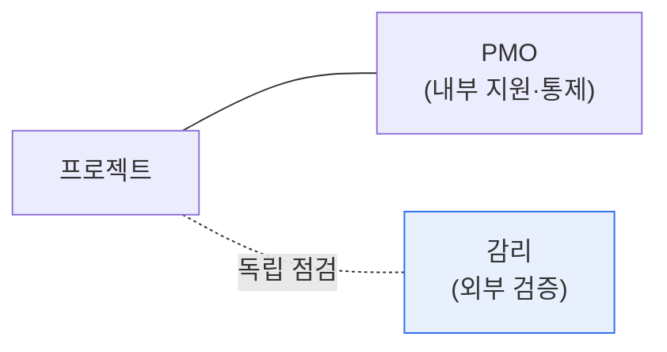

# 정보시스템 감리와 PMO 비교

## 1. 개요

### 가. 정의
> **정보시스템 감리**는 제3자가 사업의 적정성·품질을 독립적으로 점검·평가하는 활동이고, **PMO(Project Management Office)** 는 프로젝트 관리를 지원·표준화·통제하는 조직 기능이다.

둘 다 프로젝트 품질을 높이지만 **입장이 근본적으로 다르다**. 감리는 사업 밖에서 '독립적·객관적'으로 검증하는 제3자이고, PMO는 사업 안에서 '지원·통제'하는 이해관계자다. 감리가 "제대로 됐는지 심판"한다면, PMO는 "제대로 되도록 돕는 코치"에 가깝다.

## 2. 비교

| 구분 | 정보시스템 감리 | PMO |
|---|---|---|
| **입장** | 독립적 제3자(외부) | 프로젝트 이해관계자(내부) |
| **목적** | 적정성·품질 검증·개선 권고 | 프로젝트 성공 지원·통제 |
| **시점** | 단계별 점검(스냅샷) | 전 기간 상시 관여 |
| **역할** | 점검·진단·권고(집행 안 함) | 표준화·자원·리스크 관리 |
| **책임** | 독립성·객관성 | 프로젝트 성과 |
| **근거** | 감리 기준·법(전자정부법 등) | 조직 규정·PMBOK |

## 3. 상호 관계 및 시사점
- 감리는 PMO 산출물·관리체계도 점검 대상으로 삼음
- **독립성 확보**가 감리의 생명 — PMO와 역할·권한 명확 구분 필요
- 대규모·공공 사업은 감리(외부 검증)+PMO(내부 관리)를 **병행**해 품질 확보

---

> **한 줄 요약**: 감리는 *외부 제3자가 독립적으로 적정성을 검증·권고* 하고, PMO는 *내부에서 프로젝트를 지원·표준화·통제* 하며, 대규모 사업에서 상호 보완적으로 품질을 확보한다.
