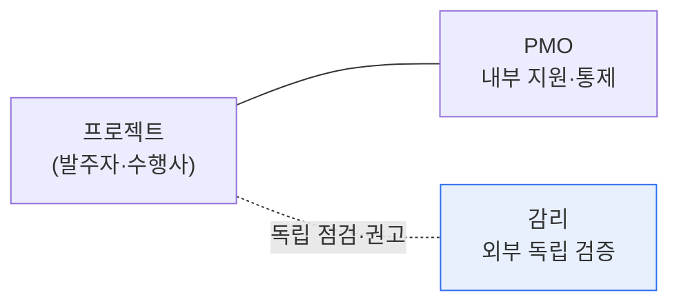

# 정보시스템 감리와 PMO 비교

## 1. 개요

### 가. 정의
> **정보시스템 감리**는 발주자·개발자와 이해관계가 없는 **제3자가 사업의 적정성·품질·성과를 독립적으로 점검·평가**하고 개선을 권고하는 활동이고, **PMO(Project Management Office)** 는 프로젝트 관리를 **지원·표준화·통제**하는 상설 또는 한시 조직 기능이다.

둘 다 프로젝트를 성공으로 이끄는 장치지만, 그 **입장(Position)이 근본적으로 다르다**. 감리는 사업의 **밖**에서 이해관계 없이 객관적으로 검증하는 심판에 가깝고, PMO는 사업의 **안**에서 프로젝트팀을 도와 성공을 이끄는 코치에 가깝다. 이 입장 차이가 목적·시점·책임의 모든 차이를 만든다. 감리가 "이 사업이 제대로 되고 있는가"를 외부 시각으로 진단한다면, PMO는 "제대로 되도록 어떻게 도울 것인가"를 내부에서 실행한다.

### 나. 등장 배경
정보시스템 사업이 대형화·복잡화되면서 실패 위험이 커졌고, 이를 통제할 두 가지 접근이 발전했다. 발주기관 입장에서 수행사의 산출물이 요구를 충족하는지 **객관적으로 확인**할 필요에서 감리(전자정부법 등에 근거한 공공사업 의무 감리)가 제도화되었고, 다수 프로젝트를 일관된 방법론으로 관리·지원할 필요에서 PMO가 자리 잡았다.

## 2. 관계 구도

핵심은 감리의 **독립성**이다. 감리인이 프로젝트 수행이나 PMO 업무에 직접 관여하면, 자기가 만든 것을 자기가 점검하는 이해상충이 생겨 객관성이 무너진다. 그래서 감리는 반드시 사업과 독립된 제3자여야 하며, 이 독립성이 감리 가치의 원천이다.

## 3. 비교

감리와 PMO는 목적·시점·역할·책임의 네 축에서 갈린다. **목적**에서 감리는 품질·적정성의 검증과 권고이고 PMO는 프로젝트 성공 자체의 지원이다. **시점**에서 감리는 요구정의·설계·종료 등 주요 단계마다 스냅샷처럼 개입하고, PMO는 착수부터 종료까지 상시 관여한다. **역할**에서 감리는 점검·진단·권고까지만 하고 실제 집행은 하지 않는 반면, PMO는 표준 수립·자원 배분·리스크 관리 등을 직접 수행한다. **책임**에서 감리는 독립성·객관성에 책임을 지고, PMO는 프로젝트 성과에 책임을 진다.

| 구분 | 정보시스템 감리 | PMO |
|---|---|---|
| **입장** | 독립적 제3자(외부) | 프로젝트 이해관계자(내부) |
| **목적** | 적정성·품질 검증·개선 권고 | 프로젝트 성공 지원·통제 |
| **시점** | 주요 단계별 점검(스냅샷) | 전 기간 상시 관여 |
| **역할** | 점검·진단·권고(집행 안 함) | 표준화·자원·리스크 관리(집행) |
| **책임** | 독립성·객관성 | 프로젝트 성과 |
| **근거** | 전자정부법 등 감리 기준 | 조직 규정·PMBOK |

## 4. 상호 관계와 병행

감리와 PMO는 배타적이지 않고 오히려 상호 보완적이다. 감리는 PMO가 수립한 관리 계획·산출물·통제 체계도 점검 대상으로 삼아 그 적정성을 검증한다. 대규모 공공사업에서는 PMO가 내부에서 프로젝트를 촘촘히 관리하고, 감리가 외부에서 그 관리와 산출물을 독립적으로 검증하는 **이중 안전장치**로 함께 운영되는 것이 일반적이다. 다만 감리인이 PMO 역할을 겸하면 독립성이 훼손되므로 역할·권한을 명확히 분리해야 한다.

## 5. 고려사항 및 시사점

1. **독립성 확보가 감리의 생명**이다. 감리인이 사업 수행이나 PMO에 관여하지 않도록 제도적으로 분리해야 객관성이 유지된다.
2. **감리는 사후 지적이 아니라 조기 통제**로 가치를 낸다. 되돌리기 어려운 단계 이전에 문제를 발견해 시정하도록 단계별로 개입한다.
3. AI·빅데이터 등 신기술 사업에서는 기존 감리 기준의 한계가 있어, 데이터·모델 타당성을 점검하는 **지능정보기술 감리 가이드** 등으로 감리 기준 자체가 진화하고 있다.

---

> **한 줄 요약**: 감리는 *외부 제3자가 독립적으로 사업 적정성을 검증·권고* 하고 PMO는 *내부에서 프로젝트를 지원·표준화·통제* 하며, 입장·목적·역할이 다르되 대규모 사업에서 이중 안전장치로 상호 보완하되 감리의 독립성 분리가 전제된다.
