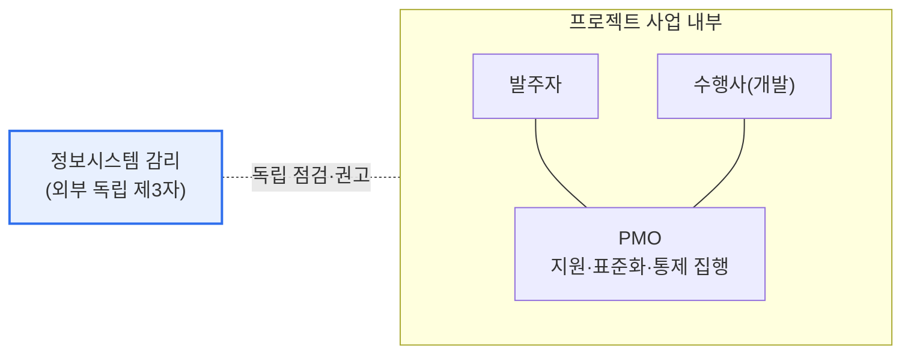
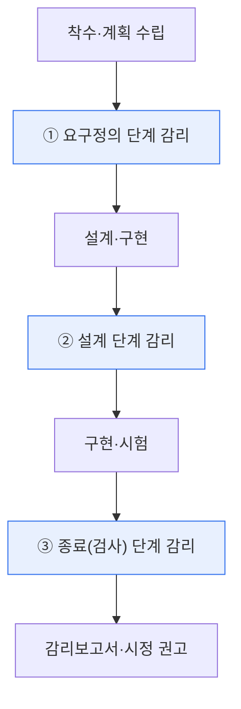

# 정보시스템 감리와 PMO 비교

## 1. 개요

### 가. 정의

> **정보시스템 감리(IS Audit)** 는 발주자·개발자와 이해관계가 없는 **제3자가 정보시스템 사업의 적정성·품질·성과를 독립적으로 점검·평가**하고 개선을 권고하는 활동이고, **PMO(Project Management Office)** 는 프로젝트 관리를 **지원·표준화·통제**하기 위해 발주기관 내부(또는 위탁) 관점에서 운영되는 상설·한시 조직 기능이다.

두 장치는 모두 정보화 사업을 성공으로 이끄는 통제 수단이지만, 그 **입장(Position)이 근본적으로 다르다**. 감리는 사업의 **밖**에서 이해관계 없이 객관적으로 검증하는 '심판'에 가깝고, PMO는 사업의 **안**에서 프로젝트팀을 도와 성공을 이끄는 '코치'에 가깝다. 이 입장의 차이가 목적·시점·역할·책임의 모든 차이를 파생시킨다. 감리가 "이 사업이 제대로 되고 있는가"를 외부 시각으로 진단한다면, PMO는 "제대로 되도록 어떻게 도울 것인가"를 내부에서 실행한다. 따라서 둘을 '경쟁 관계'로 오해해서는 안 되며, 서로 다른 지점에서 사업의 실패 위험을 낮추는 **보완적 이중 통제**로 이해하는 것이 정확하다.

### 나. 등장 배경과 필요성

정보시스템 사업이 대형화·복잡화되면서 실패 위험(요구 불명확, 일정 지연, 품질 미달, 예산 초과)이 함께 커졌고, 이를 통제할 두 갈래의 접근이 발전했다. 첫째, 발주기관은 수행사가 제출하는 산출물이 요구를 충족하는지 스스로 판단하기 어려웠다. 발주자는 대개 IT 전문성이 부족하고 수행사는 자기 산출물을 유리하게 설명하려는 유인이 있으므로, **이해관계 없는 제3자의 객관적 검증**이 필요했고 이것이 감리로 제도화되었다. 우리나라는 「전자정부법」과 관련 고시에 따라 일정 규모 이상의 공공 정보화 사업에 감리를 의무화하고, 감리법인·감리원의 자격과 감리 절차·점검 기준을 규정하고 있다.

둘째, 하나의 기관이 다수의 프로젝트를 동시에 수행하면서 방법론·산출물·품질 기준이 제각각이 되는 문제가 커졌다. 이를 일관된 표준으로 관리하고, 발주기관의 부족한 관리 역량을 보강하기 위해 **PMO**가 자리 잡았다. 특히 발주기관을 대신해 사업관리를 수행하는 '발주자 PMO(위탁 PMO)'가 공공에서 확산되면서, 발주기관의 통제력과 전문성을 끌어올리는 장치로 기능하고 있다. 요컨대 감리는 '검증의 필요'에서, PMO는 '관리 역량 보강의 필요'에서 각각 태어났다.

## 2. 관계 구도와 독립성

두 기능의 위치 관계를 그림으로 보면 차이가 분명해진다. PMO는 프로젝트 내부 경계 안에서 발주자·수행사와 함께 움직이며 관리를 집행하고, 감리는 그 경계 밖에서 프로젝트와 PMO의 산출물을 함께 점검 대상으로 삼아 독립적으로 검증한다.

```mermaid
flowchart LR
  subgraph 사업내부["프로젝트 사업 내부"]
    OWN["발주자"]
    SUP["수행사(개발)"]
    PMO["PMO<br/>지원·표준화·통제 집행"]
    OWN --- PMO
    SUP --- PMO
  end
  AU["정보시스템 감리<br/>(외부 독립 제3자)"] -. 독립 점검·권고 .- 사업내부
  style AU fill:#e8f0fe,stroke:#2f6fed,stroke-width:2px
```

여기서 핵심은 감리의 **독립성(Independence)** 이다. 만약 감리인이 프로젝트 수행이나 PMO 업무에 직접 관여한다면, 자기가 만들거나 관리한 것을 자기가 점검하는 **이해상충(self-review)** 이 발생해 객관성이 무너진다. 그래서 감리는 반드시 사업과 조직적·경제적으로 분리된 제3자여야 하며, 이 독립성이야말로 감리 가치의 원천이자 존재 이유이다. 감리 기준이 감리원의 자격·소속·수행사와의 관계를 엄격히 규율하는 것도 이 때문이다.

절차 측면에서 감리는 사업 전 과정에 상주하지 않고 **주요 단계마다 스냅샷처럼 개입**한다. 아래 흐름은 전형적 3단계 감리(요구정의·설계·종료)의 진행을 보여 준다.

```mermaid
flowchart TB
  P1["착수·계획 수립"] --> A1["① 요구정의 단계 감리"]
  A1 --> P2["설계·구현"]
  P2 --> A2["② 설계 단계 감리"]
  A2 --> P3["구현·시험"]
  P3 --> A3["③ 종료(검사) 단계 감리"]
  A3 --> R["감리보고서·시정 권고"]
  style A1 fill:#e8f0fe,stroke:#2f6fed
  style A2 fill:#e8f0fe,stroke:#2f6fed
  style A3 fill:#e8f0fe,stroke:#2f6fed
```

이렇게 단계별로 끊어 개입하는 데는 이유가 있다. 되돌리기 어려운 다음 단계로 넘어가기 **전에** 문제를 발견해야 시정 비용이 적기 때문이다. 요구가 잘못 정의된 채로 설계·구현까지 진행되면 재작업 규모가 눈덩이처럼 커지므로, 감리는 '사후 지적'이 아니라 '단계 전환 직전의 게이트(gate) 점검'으로 설계된다. 소프트웨어 결함은 발견 시점이 늦어질수록 시정 비용이 기하급수적으로 증가한다는 것이 오랜 공학적 경험칙이며, 감리의 단계별 개입은 바로 이 비용 곡선의 앞쪽에서 문제를 잡으려는 장치다.

감리는 점검하는 관점에 따라 여러 유형으로 나눌 수 있다. 사업의 계획·산출물이 요구와 기준에 맞는지를 보는 **사업 감리**가 기본이고, 보안 통제의 적정성을 보는 **정보보안 감리**, 데이터 품질·구조를 보는 **데이터베이스(DB) 감리** 등이 목적에 따라 결합된다. 어떤 유형이든 감리원은 점검 항목(체크리스트)과 증거(산출물·인터뷰·시연)를 근거로 판단하고, 그 결과를 '적합/부적합/개선권고'로 정리해 **감리수행결과보고서**에 담는다. 여기서 중요한 것은 감리가 주관적 인상이 아니라 사전에 정의된 기준과 확보된 증거에 근거해야 한다는 점이며, 이 증거 기반성이 감리 지적의 설득력과 이행 강제력을 뒷받침한다.

PMO 역시 단일하지 않다. 관여 강도에 따라 정보·조언만 제공하는 **지원형(supportive)**, 표준 준수를 요구하는 **통제형(controlling)**, 프로젝트를 직접 관장하는 **지시형(directive)** PMO로 구분된다. 공공 발주자 PMO는 발주기관의 통제력을 대신 행사한다는 점에서 통제형에 가까운 경우가 많다. 어떤 유형의 PMO를 두느냐는 발주기관의 관리 성숙도와 사업 위험에 따라 결정되어야 하며, 성숙도가 낮은 조직에 지원형 PMO만 두면 통제 공백이, 반대로 역량 있는 조직에 지시형 PMO를 두면 현업과의 권한 충돌이 생길 수 있다.

## 3. 감리와 PMO의 비교

감리와 PMO는 목적·시점·역할·책임의 네 축에서 갈린다. **목적** 측면에서 감리는 품질·적정성의 검증과 개선 권고에 있고, PMO는 프로젝트 성공 자체의 지원과 통제에 있다. 감리는 "잘 되고 있는지 확인"이 목적이고 PMO는 "잘 되게 만드는 것"이 목적이라는 점에서 지향이 다르다. **시점** 측면에서 감리는 요구정의·설계·종료 등 주요 단계마다 개입하는 반면, PMO는 착수부터 종료까지 상시 관여한다. 감리가 '점(點)'의 개입이라면 PMO는 '선(線)'의 관여다.

**역할** 측면에서 감리는 점검·진단·권고까지만 하고 실제 집행(표준 수립·자원 배분·일정 조정)은 하지 않는다. 반면 PMO는 관리 표준을 만들고 자원을 배분하며 리스크·이슈를 직접 관리하는 집행 주체다. 이 차이는 책임의 성격도 가른다. 감리는 자신의 **독립성·객관성**과 점검의 충실성에 책임을 지고, PMO는 **프로젝트 성과** 그 자체(일정·품질·비용 목표 달성)에 책임을 진다. 즉 감리가 잘못하면 "검증이 부실했다"는 책임을, PMO가 잘못하면 "사업이 실패했다"는 책임을 지는 구조다.

| 구분 | 정보시스템 감리 | PMO |
|---|---|---|
| **입장** | 독립적 제3자(외부) | 프로젝트 이해관계자(내부) |
| **목적** | 적정성·품질 검증·개선 권고 | 프로젝트 성공 지원·통제 |
| **시점** | 주요 단계별 점검(스냅샷) | 전 기간 상시 관여 |
| **역할** | 점검·진단·권고(집행 안 함) | 표준화·자원·리스크 관리(집행) |
| **책임** | 독립성·객관성·점검 충실성 | 프로젝트 성과(일정·품질·비용) |
| **근거** | 전자정부법·감리 기준(고시) | 조직 규정·계약·PMBOK 등 |
| **산출** | 감리수행결과보고서·시정 권고 | 관리계획·표준·진척/리스크 보고 |

표의 각 항목은 결국 "밖에서 검증하는가, 안에서 집행하는가"라는 하나의 축에서 갈라져 나온 결과다. 예컨대 감리가 집행을 하지 않는 것은 집행에 관여하는 순간 독립성이 깨지기 때문이고, PMO가 성과에 책임지는 것은 사업 안에서 자원과 일정을 실제로 움직이는 주체이기 때문이다.

## 4. 상호 관계와 병행 운영

감리와 PMO는 배타적이지 않고 오히려 상호 보완적이다. 감리는 PMO가 수립한 관리 계획·산출물·통제 체계까지도 점검 대상으로 삼아 그 적정성을 검증한다. 즉 PMO가 관리를 '하는' 주체라면, 감리는 그 관리가 '제대로 되는지'를 밖에서 확인하는 주체다. 대규모 공공사업에서는 PMO가 내부에서 프로젝트를 촘촘히 관리하고, 감리가 외부에서 그 관리와 산출물을 독립적으로 검증하는 **이중 안전장치(two lines of assurance)** 로 함께 운영되는 것이 일반적이다.

다만 병행 운영에는 명확한 원칙이 필요하다. 첫째, 감리인이 PMO 역할을 겸하거나 PMO가 자기 사업을 감리해서는 안 된다. 이는 독립성 훼손이자 이해상충이다. 둘째, 감리 지적사항과 PMO의 관리 활동이 충돌하지 않도록 **역할·권한·책임(R&R)을 사전에 명확히 분리**해야 한다. 예컨대 감리가 지적한 시정사항의 이행 관리는 PMO가 맡되, 그 이행 여부의 최종 판정은 다시 감리가 하는 식으로 견제와 균형을 설계한다. 실제 대형 차세대 시스템(금융·공공) 구축 사업에서 PMO와 감리를 동시에 두고 이 경계를 계약서에 명시하는 것이 정착된 관행이다.

이 구도를 조직 내부통제 이론의 '3선 방어(Three Lines)' 관점에 대입하면 이해가 쉬워진다. 실제 개발을 수행하는 수행사가 1선, 그 수행을 관리·통제하는 PMO가 2선, 이를 독립적으로 검증하는 감리가 3선에 대응한다. 각 선은 앞선 선을 대체하지 않고 **보강**한다. 수행사의 자체 품질활동이 있어도 PMO의 관리 통제가 필요하고, PMO의 통제가 있어도 감리의 독립 검증이 필요한 이유가 여기에 있다. 한 선이 다른 선의 역할을 삼키는 순간 방어선은 하나로 줄어들고, 문제를 놓칠 확률은 그만큼 올라간다.

한편 사업 규모·성격에 따라 두 장치의 적용은 달라진다. 소규모 사업은 의무 감리 대상이 아니고 별도 PMO를 두기에 비용 부담이 크므로 발주기관이 직접 관리하되 필요 시 간이 점검만 두는 경우가 많다. 반대로 수백억 원대 공공 차세대 사업은 상주 PMO와 3단계 이상의 감리를 동시에 운영하는 것이 일반적이다. 즉 감리·PMO는 '있으면 좋은 옵션'이 아니라 **사업의 위험 크기에 비례해 배치하는 위험 통제 자원**으로 이해해야 하며, 과소 배치는 통제 공백을, 과대 배치는 비용·행정 부담을 낳는다는 균형 감각이 요구된다.

두 장치가 어떻게 맞물려 돌아가는지는 하나의 흐름으로 정리할 수 있다. PMO가 상시 관리 활동으로 진척·품질·리스크를 통제하는 가운데, 단계 전환 시점에 감리가 개입해 그 결과물을 독립 검증하고 지적사항을 낸다. 이후 지적사항의 이행은 다시 PMO의 관리 트랙으로 들어가고, 최종 이행 여부는 종료 감리에서 확인된다. 이렇게 관리(PMO)와 검증(감리)이 번갈아 맞물리며 사업을 나아가게 하는 것이 이상적 협업 모델이다.

- **PMO(상시)**: 관리 표준 수립 → 진척·품질·리스크 통제 → 지적사항 이행 관리
- **감리(단계별)**: 요구·설계·종료 시점 독립 점검 → 시정 권고 → 이행 여부 최종 판정
- **접점 원칙**: 역할·권한 분리(R&R 명문화), 감리인의 PMO 겸직 금지, 이행-검증의 폐루프 유지

이러한 협업이 실패하는 전형적 양상도 알아 둘 만하다. 감리 지적이 형식적 문서 확인에 그쳐 실제 위험을 짚지 못하거나, PMO가 발주기관이 아닌 수행사 편의를 대변하며 통제 기능을 상실하거나, 지적사항이 보고서에만 남고 이행 추적이 끊기는 경우다. 이 실패들은 모두 '독립성 훼손'과 '폐루프의 단절'이라는 두 원인으로 수렴하며, 그래서 실무에서는 제도의 존재 여부보다 **실질적 독립성과 이행 추적 체계가 살아 있는가**를 더 중요하게 점검한다.

## 5. 심화 — 지능정보기술 확산에 따른 감리·PMO의 진화

AI·빅데이터·클라우드 같은 지능정보기술이 사업의 중심에 들어오면서, 전통적 감리·PMO의 방식도 진화하고 있다. 기존 감리 기준은 요구·설계·구현·시험이라는 정형 SW 개발 절차를 전제로 만들어졌지만, AI 사업은 '데이터 품질'과 '모델 성능·타당성'이라는 새로운 점검 축을 요구한다. 학습 데이터의 편향·대표성, 모델의 정확도·설명가능성, 재학습 체계 같은 항목은 종래의 산출물 점검만으로는 검증되지 않는다. 이에 따라 데이터·모델 타당성을 점검하는 **지능정보기술 관련 감리 가이드**가 정비되는 등 감리 기준 자체가 확장되고 있다(세부 기준은 개정이 잦으므로 최신 고시·가이드를 확인해야 한다).

PMO도 변한다. 애자일·데브옵스가 확산되면서 단계별 산출물을 통제하던 전통적 워터폴형 PMO에서, 반복 개발의 흐름을 지원하고 장애물을 제거하는 **가치 전달 중심의 PMO(또는 애자일 코치·VMO)** 로 역할이 이동하고 있다. 이때 감리 역시 '문서 완결성' 중심 점검에서 '실제 동작하는 결과물과 데이터 기반 통제'를 함께 보는 방향으로 조정될 필요가 커진다. 기술사 관점에서 중요한 것은, 도구·방법론이 바뀌어도 "안에서 집행하는 PMO와 밖에서 독립 검증하는 감리"라는 본질적 역할 분담은 유지되어야 한다는 점이다.

나아가 클라우드 전환은 감리·PMO 모두에게 점검 대상의 이동을 요구한다. 온프레미스 시대에는 하드웨어 도입·구축 산출물이 점검의 중심이었지만, 클라우드에서는 자원이 코드로 정의(IaC)되고 서비스형으로 조달되므로, 구성의 적정성·비용 최적화·보안 책임 공유 모델 준수 같은 새로운 축이 점검 대상이 된다. PMO는 종량제 비용을 상시 모니터링하고, 감리는 클라우드 보안 통제와 데이터 주권 요건의 충족 여부를 독립 검증하는 식으로 각자의 역할이 재정의된다.

결국 기술 환경이 아무리 바뀌어도 두 장치가 지켜야 할 원칙은 변하지 않는다. PMO는 사업 안에서 성과를 책임지는 집행자로서 관리의 일관성과 실행력을 제공하고, 감리는 사업 밖에서 그 관리와 산출물의 적정성을 독립적으로 검증한다. 신기술은 '무엇을 점검하고 무엇을 관리할 것인가'라는 대상만 바꿀 뿐, '누가 어떤 입장에서 하는가'라는 역할의 골격은 그대로 유지되어야 통제 체계가 무너지지 않는다.

## 6. 고려사항 및 시사점

1. **독립성 확보가 감리의 생명이다.** 감리인이 사업 수행이나 PMO에 관여하지 않도록 조직·계약상 분리해야 객관성이 유지된다. 독립성이 형식적으로만 선언되고 실제로는 발주기관에 종속되면 감리는 요식행위로 전락한다.
2. **감리는 사후 지적이 아니라 조기 통제로 가치를 낸다.** 되돌리기 어려운 단계 이전에 문제를 발견해 시정하도록 단계별 게이트로 개입해야 하며, 지적사항의 이행 여부까지 추적·확인하는 폐루프(closed-loop)가 있어야 실효가 있다.
3. **PMO와 감리의 R&R을 사전에 명확히 분리·명문화해야 한다.** 병행 운영 시 역할이 겹치면 책임 공백이나 이해상충이 생기므로, 계약·규정에 권한과 견제 관계를 구체적으로 규정해야 한다.
4. **발주기관의 관리 역량 자체를 함께 키워야 한다.** PMO·감리에 전적으로 의존하면 위탁이 끝난 뒤 관리 공백이 생긴다. 두 장치는 발주자 역량을 대체하는 것이 아니라 보강하는 수단으로 설계·운영되어야 한다.
5. **신기술 사업에 맞춰 점검 기준을 갱신해야 한다.** AI·데이터 중심 사업에서는 데이터 품질·모델 타당성·윤리·설명가능성 같은 새로운 축을 감리·PMO의 점검 항목에 반영해, 기준의 노후화로 인한 검증 사각지대를 없애야 한다.
6. **이행 추적의 폐루프가 실효를 좌우한다.** 감리 지적사항이 보고서에만 남고 이행이 추적되지 않으면 통제는 형식에 그친다. 지적 → PMO의 이행 관리 → 종료 감리의 최종 확인으로 이어지는 폐루프를 계약·프로세스에 못 박아, 통제가 문서가 아닌 실제 개선으로 귀결되게 해야 한다.

## 참고자료

- 국가법령정보센터, 전자정부법(정보시스템 감리 근거): https://www.law.go.kr/
- 한국지능정보사회진흥원(NIA), 정보시스템 감리 관련 안내: https://www.nia.or.kr/
- PMI, PMBOK Guide(PMO·프로젝트 거버넌스 개념): https://www.pmi.org/

---

> **한 줄 요약**: 감리는 *외부 제3자가 독립적으로 사업의 적정성을 검증·권고* 하고 PMO는 *내부에서 프로젝트를 지원·표준화·통제* 하는 장치로, 입장·목적·시점·역할·책임이 다르되 대규모 사업에서 이중 안전장치로 상호 보완하며, 그 전제는 언제나 감리의 독립성 분리와 명확한 역할 구분이다.
