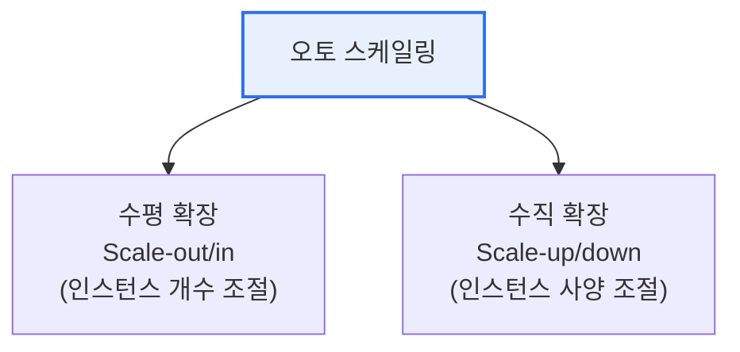

# 오토 스케일링(Auto Scaling)

## 1. 개요

### 가. 정의
> 부하(트래픽·자원 사용률)의 변화에 따라 **컴퓨팅 자원을 자동으로 늘리거나(scale-out/up) 줄여(scale-in/down)** 성능과 비용을 동시에 최적화하는 클라우드 기술.

오토 스케일링이 클라우드의 핵심 가치인 이유는 '**탄력성(Elasticity)**'을 실현하기 때문이다. 온프레미스 시대에는 최대 트래픽(피크)을 기준으로 서버를 미리 넉넉히 사둬야 했고, 그 결과 평상시에는 자원의 대부분이 놀며 낭비되었다. 반대로 예측을 낮게 잡으면 갑작스러운 트래픽에 서비스가 다운되었다. 오토 스케일링은 이 딜레마를 해소한다. 트래픽이 몰리면 자원을 자동으로 늘려 장애를 막고, 한산해지면 줄여 비용을 아낀다. 즉 '**필요한 만큼만 쓰고 쓴 만큼만 낸다**'는 클라우드 종량제의 이점을 완성한다. 예를 들어 쇼핑몰이 블랙프라이데이에 트래픽이 10배로 뛰어도 인스턴스가 자동 증설되어 견디고, 새벽에는 최소 대수로 줄어 비용을 절감한다.

## 2. 확장 유형

확장에는 두 방향이 있다. **수평 확장(Scale-out/in)** 은 같은 사양의 인스턴스 대수를 늘리거나 줄이는 것으로, 서비스를 멈추지 않고 무중단으로 용량을 조절할 수 있고 이론상 한계 없이 확장된다. 다만 여러 인스턴스에 요청을 나눠주는 로드밸런서와, 특정 서버에 상태를 저장하지 않는 **무상태(Stateless)** 설계가 전제되어야 한다. **수직 확장(Scale-up/down)** 은 한 인스턴스의 CPU·메모리 사양 자체를 키우거나 줄이는 것으로, 구현은 간단하지만 대개 재기동이 필요하고 단일 머신의 물리적 한계에 부딪힌다. 그래서 대규모 웹 서비스는 주로 수평 확장을 쓴다.

| 유형 | 방식 | 장점 | 제약 |
|---|---|---|---|
| **수평 확장** | 인스턴스 개수 증감 | 무중단·고가용, 한계 없음 | 무상태 설계·로드밸런서 필요 |
| **수직 확장** | 인스턴스 사양 증감 | 구현 간단 | 재기동·물리 한계 |

## 3. 스케일링 정책

언제 확장할지를 정하는 정책도 여러 방식이 있다. **동적 정책**은 CPU 사용률·요청 수 같은 지표가 임계값을 넘으면 자동 조절하는 가장 일반적인 방식이다. **예측 정책**은 머신러닝으로 과거 패턴을 학습해 트래픽이 오르기 전에 선제적으로 자원을 준비한다. **예약 정책**은 '매일 오전 9시 업무 시작'처럼 알려진 패턴에 맞춰 미리 조절한다.

| 정책 | 설명 |
|---|---|
| **동적(Dynamic)** | 지표 임계값 기반 실시간 조절 |
| **예측(Predictive)** | ML로 수요 예측해 선제 확장 |
| **예약(Scheduled)** | 알려진 시간 패턴에 맞춰 조절 |

## 4. 고려사항 및 시사점

1. **무상태 설계가 수평 확장의 전제**다. 세션·파일을 특정 인스턴스에 저장하면 확장·축소 시 데이터가 유실되므로, 상태는 외부 저장소(Redis·DB·오브젝트 스토리지)로 분리해야 한다.
2. **준비 시간(Warm-up)을 고려**해야 한다. 인스턴스가 뜨고 서비스 가능해지기까지 시간이 걸리므로, 임계값과 증설 시점을 여유 있게 잡아야 트래픽 급증에 늦지 않는다.
3. **쿠버네티스 HPA/VPA·서버리스로 진화**하고 있다. 컨테이너 단위(HPA)나 요청 단위(서버리스 Lambda)로 더 세밀하고 빠른 자동 확장이 가능해져, 자원 효율이 극대화되고 있다.

---

> **한 줄 요약**: 오토 스케일링은 부하에 따라 자원을 자동 증감(수평·수직)해 *성능과 비용을 동시 최적화* 하는 클라우드 탄력성 기술로, 무상태 설계·로드밸런싱을 전제로 동적·예측·예약 정책을 적용하며 쿠버네티스·서버리스로 세밀화되고 있다.
