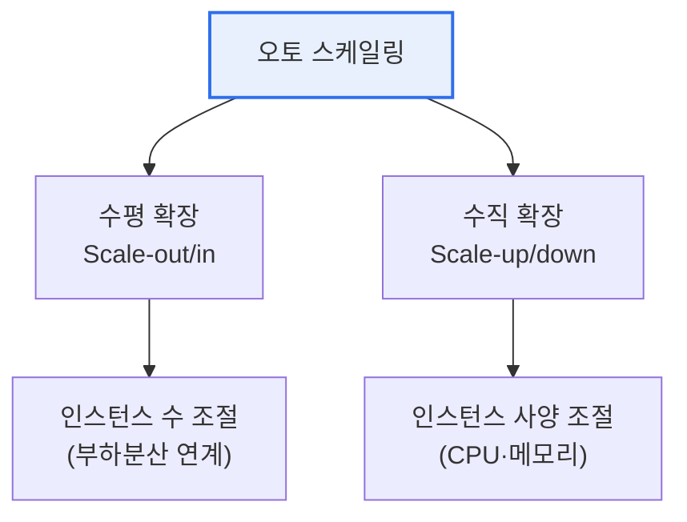

# 오토 스케일링(Auto Scaling)

## 1. 개요

### 가. 정의
> 부하(트래픽·자원 사용률) 변화에 따라 **컴퓨팅 자원을 자동으로 늘리거나 줄이는** 클라우드 기술. 성능과 비용을 동시에 최적화한다.

오토 스케일링의 가치는 '**필요한 만큼만 쓰는**' 클라우드의 탄력성(Elasticity)을 실현하는 데 있다. 트래픽이 몰릴 때는 자원을 늘려 성능을 유지하고, 한산할 때는 줄여 비용을 아낀다. 수요 예측이 어려운 서비스에서 과잉 프로비저닝(낭비)과 과소 프로비저닝(장애)을 모두 피하게 해준다.

## 2. 유형

| 유형 | 방식 | 특징 |
|---|---|---|
| **수평 확장(Scale-out/in)** | 인스턴스 개수 증감 | 무중단·고가용, 상태없는(stateless) 앱 적합 |
| **수직 확장(Scale-up/down)** | 인스턴스 사양 증감 | 간단하나 재기동·한계 존재 |

## 3. 스케일링 정책

| 정책 | 설명 |
|---|---|
| **동적(Dynamic)** | 지표(CPU·요청수) 임계값 기반 자동 조절 |
| **예측(Predictive)** | ML로 수요 예측해 선제 확장 |
| **예약(Scheduled)** | 특정 시간대 패턴에 맞춰 조절 |

## 4. 시사점
- 로드밸런서·헬스체크와 연계해 **무중단 확장** 실현
- 상태 비저장 설계, 준비시간(warm-up) 고려로 스케일 효과 극대화
- 쿠버네티스 HPA/VPA·서버리스로 세밀한 자동 확장 진화

---

> **한 줄 요약**: 오토 스케일링은 부하에 따라 자원을 자동 증감(수평·수직)하여 *성능과 비용을 동시 최적화* 하며, 동적·예측·예약 정책과 로드밸런싱 연계로 무중단 탄력성을 실현한다.
