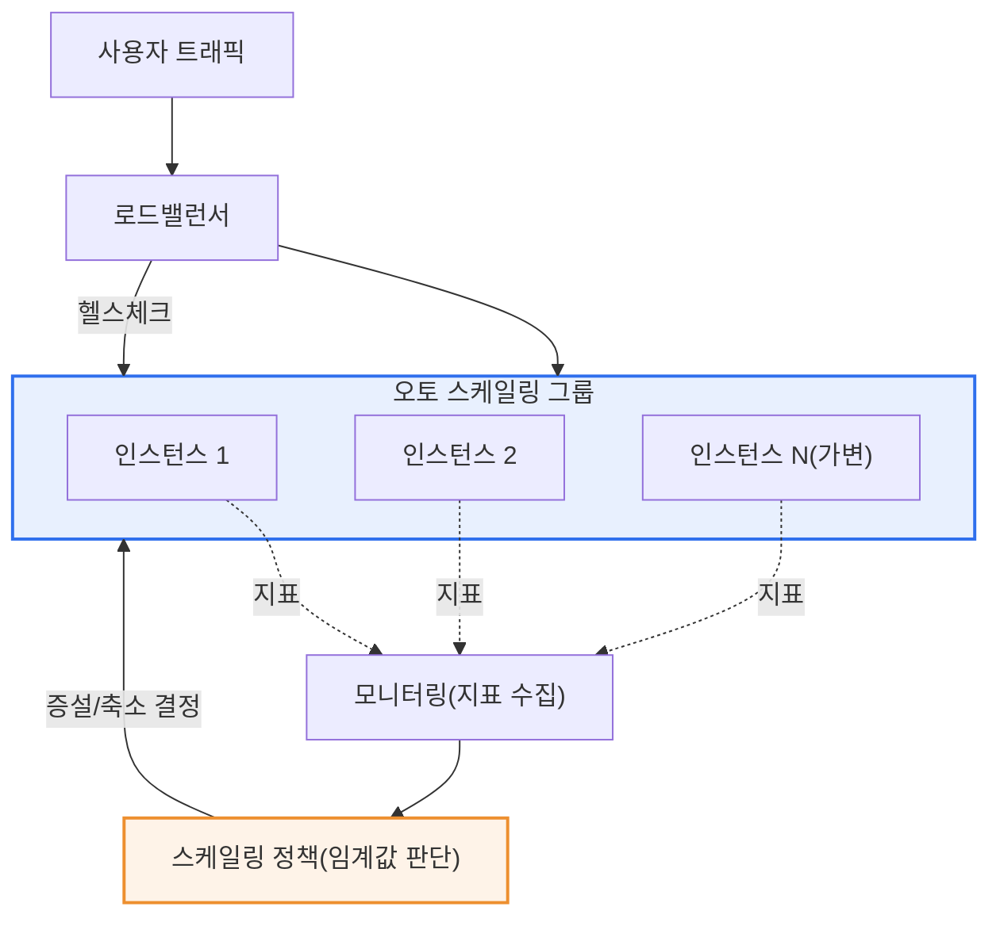
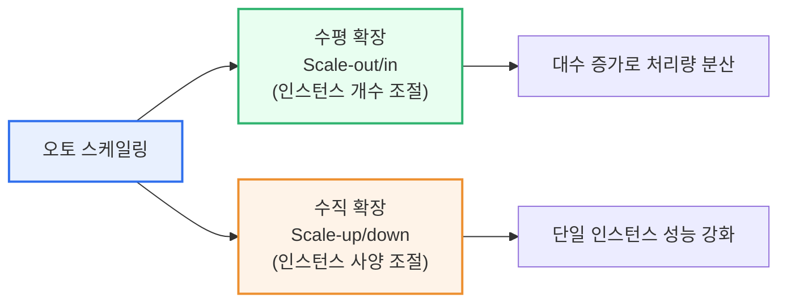

# 오토 스케일링(Auto Scaling)

## 1. 개요

### 가. 정의
> 부하(트래픽·자원 사용률)의 변화에 따라 **컴퓨팅 자원을 자동으로 늘리거나(scale-out/up) 줄여(scale-in/down)** 서비스의 성능·가용성과 비용을 동시에 최적화하는 클라우드 운영 기술.

오토 스케일링이 클라우드의 핵심 가치로 꼽히는 이유는 클라우드가 내세우는 '**탄력성(Elasticity)**'을 실제로 구현하는 메커니즘이기 때문이다. 탄력성이란 수요에 맞춰 자원을 늘였다 줄였다 할 수 있는 능력을 말하는데, 이것이 자동화되지 않으면 사람이 밤낮으로 지표를 지켜보며 서버를 껐다 켜야 하므로 현실적으로 불가능하다. 오토 스케일링은 이 판단과 실행을 규칙(정책)에 위임함으로써, 사람의 개입 없이도 수요에 자원을 실시간으로 맞춘다.

### 나. 등장 배경과 필요성
온프레미스(자체 전산실) 시대의 용량 산정은 근본적인 딜레마를 안고 있었다. 서버는 한 번 사면 몇 년을 쓰는 고정 자산이므로, 관리자는 **최대 트래픽(피크)** 을 기준으로 서버를 넉넉히 사둘 수밖에 없었다. 그 결과 평상시에는 자원의 대부분이 놀며 낭비되었고, 반대로 예측을 보수적으로 낮게 잡으면 이벤트·마케팅으로 트래픽이 몰릴 때 서비스가 다운되었다. 즉 '**낭비 아니면 장애**'라는 이분법을 벗어날 수 없었다.

오토 스케일링은 이 딜레마를 정면으로 해소한다. 트래픽이 몰리면 자원을 자동으로 늘려 장애를 막고, 한산해지면 줄여 비용을 아낀다. 다시 말해 '**필요한 만큼만 쓰고 쓴 만큼만 낸다**'는 클라우드 종량제(pay-as-you-go)의 이점을 비로소 완성한다. 예를 들어 이커머스 플랫폼이 블랙프라이데이·광군제 같은 대목에 평소의 10배가 넘는 트래픽을 맞아도 인스턴스가 수 분 내에 자동 증설되어 견디고, 새벽 시간대에는 최소 대수로 줄어 비용을 절감한다. 넷플릭스가 특정 시간대 시청 급증을 자동 확장으로 흡수하거나, 국내 대학 수강신청 시스템이 오픈 순간의 폭주를 예약 확장으로 대비하는 것이 대표적 사례다.

### 다. 특징
오토 스케일링은 ① 지표 기반의 **자동성**, ② 늘리고 줄이는 **양방향성**, ③ 정책으로 동작을 규정하는 **선언성**, ④ 로드밸런서·헬스체크와 결합한 **고가용성 지향** 이라는 특징을 가진다. 특히 단순히 '많으면 늘린다'가 아니라, 헬스체크로 비정상 인스턴스를 걸러내고 교체까지 수행하므로 오토 스케일링은 확장 도구인 동시에 **자가 치유(self-healing)** 를 실현하는 복원력(resilience) 도구이기도 하다.

## 2. 전체 구조와 동작 원리

```mermaid
flowchart TB
  U[사용자 트래픽] --> LB[로드밸런서]
  LB --> G["오토 스케일링 그룹(ASG)"]
  subgraph G["오토 스케일링 그룹"]
    I1[인스턴스 1]
    I2[인스턴스 2]
    I3["인스턴스 N(가변)"]
  end
  MON["모니터링(지표 수집)"] --> POL["스케일링 정책(임계값 판단)"]
  POL -->|증설/축소 결정| G
  I1 -. 지표 .-> MON
  I2 -. 지표 .-> MON
  I3 -. 지표 .-> MON
  LB -->|헬스체크| G
  style G fill:#e8f0fe,stroke:#2f6fed,stroke-width:2px
  style POL fill:#fef3e8,stroke:#ed8f2f,stroke-width:2px
```

오토 스케일링의 동작은 하나의 **폐루프 제어(closed-loop control)** 로 이해하면 명확하다. 먼저 모니터링 시스템이 각 인스턴스의 CPU·메모리·요청 수·응답시간 같은 지표를 주기적으로 수집한다. 수집된 지표는 스케일링 정책이 정의한 임계값과 비교되며, 조건을 만족하면 오토 스케일링 그룹(ASG, Auto Scaling Group)에 인스턴스 증설·축소 명령이 내려간다. 새 인스턴스는 미리 정의된 템플릿(머신 이미지·기동 스크립트)으로 동일하게 복제되어 로드밸런서에 자동 등록되고, 헬스체크를 통과한 뒤부터 실제 트래픽을 받는다. 이 순환이 쉼 없이 돌면서 자원 규모가 수요를 뒤따라간다.

이 구조에서 네 가지 구성요소가 핵심이며, 각각을 분해해 이해할 필요가 있다.

**가. 오토 스케일링 그룹(ASG)** 은 '최소 대수·희망 대수·최대 대수'라는 세 경계값으로 자원의 안전 범위를 강제한다. 최소 대수는 트래픽이 거의 없어도 항상 유지할 가용성의 하한선이고, 희망 대수는 현재 유지하려는 목표 대수이며, 최대 대수는 비용·장애 폭주를 막는 상한선이다. 이 세 값이 없다면 오토 스케일링은 통제 불능이 되기 쉽다. 예컨대 최소를 2로 두면 한 대가 죽어도 최소 한 대가 살아 무중단을 보장하고, 최대를 20으로 두면 비정상 부하에도 청구서가 무한정 불어나지 않는다.

**나. 로드밸런서(LB)** 는 늘어난 인스턴스에 트래픽을 고르게 분배하고, 헬스체크에 실패한 인스턴스를 즉시 대상에서 제외한다. 로드밸런서가 없으면 인스턴스를 늘려도 트래픽이 한 대에만 몰려 수평 확장이 성립하지 않는다. 로드밸런서는 수평 확장의 물리적 전제인 셈이다.

**다. 기동 템플릿(Launch Template)** 은 어떤 인스턴스든 동일한 머신 이미지·소프트웨어·초기화 스크립트로 즉시 복제되게 한다. 이 덕분에 새로 뜬 인스턴스가 기존 인스턴스와 완전히 동일하게 동작하며, 확장의 결과가 예측 가능해진다. 인스턴스마다 설정이 다르면 확장할 때마다 예상치 못한 오류가 나므로, 불변 인프라(immutable infrastructure) 원칙이 여기서 중요하다.

**라. 모니터링·헬스체크** 는 지표를 수집해 정책 판단의 근거를 제공하고, 비정상 인스턴스를 감지해 교체를 유발한다. 이 요소가 오토 스케일링을 단순 확장기가 아니라 자가 치유 시스템으로 만든다.

간단한 수치 예시로 동작을 정리해 보자. 목표 추적 정책에서 'CPU 평균 50% 유지, 인스턴스당 CPU 100% = 100 RPS 처리'라고 하면, 평상시 400 RPS는 8대(대당 50 RPS)로 감당한다. 트래픽이 1,200 RPS로 3배 뛰면 목표 50%를 유지하기 위해 시스템은 대수를 약 24대로 늘리고, 다시 400 RPS로 내려오면 8대로 축소한다. 이렇게 대수가 부하에 비례해 자동으로 수렴하는 것이 오토 스케일링의 본질이다.

## 3. 확장 유형 — 수평 확장과 수직 확장

```mermaid
flowchart LR
  A[오토 스케일링] --> H["수평 확장<br/>Scale-out/in<br/>(인스턴스 개수 조절)"]
  A --> V["수직 확장<br/>Scale-up/down<br/>(인스턴스 사양 조절)"]
  H --> H1[대수 증가로 처리량 분산]
  V --> V1[단일 인스턴스 성능 강화]
  style A fill:#e8f0fe,stroke:#2f6fed,stroke-width:2px
  style H fill:#e8fef0,stroke:#2fb36f,stroke-width:2px
  style V fill:#fef3e8,stroke:#ed8f2f,stroke-width:2px
```

확장에는 서로 다른 두 방향이 있으며, 어느 쪽을 택하느냐가 아키텍처 설계를 좌우한다.

**수평 확장(Scale-out/in)** 은 같은 사양의 인스턴스 '대수'를 늘리거나 줄이는 방식이다. 요청을 여러 대로 나눠 처리하므로 서비스를 멈추지 않고 무중단으로 용량을 조절할 수 있고, 이론상 한계 없이 확장된다는 점이 가장 큰 장점이다. 대규모 웹·API 서비스가 거의 예외 없이 수평 확장을 채택하는 이유가 여기 있다. 다만 여러 인스턴스에 요청을 배분하는 로드밸런서와, 특정 서버에 세션·파일 같은 상태를 저장하지 않는 **무상태(Stateless)** 설계가 반드시 전제되어야 한다. 상태가 특정 서버에 묶여 있으면 그 서버가 축소로 사라질 때 데이터가 유실되기 때문이다.

**수직 확장(Scale-up/down)** 은 한 인스턴스의 CPU·메모리 사양 자체를 키우거나 줄이는 방식이다. 애플리케이션 구조를 바꿀 필요 없이 사양만 올리면 되므로 구현이 단순하다는 장점이 있으나, 대개 사양 변경 시 재기동이 필요해 순간적인 중단이 생기고, 결국 단일 물리 머신이 제공할 수 있는 최대 사양이라는 한계에 부딪힌다.

그래서 수직 확장은 관계형 데이터베이스처럼 수평 분산이 까다로운 상태 저장(stateful) 계층에서 제한적으로 쓰이는 경우가 많다. 데이터가 한 곳에 모여 있어야 하는 특성상 대수를 늘리기 어렵기 때문에, 우선 사양을 키워 버티는 것이다. 실무에서는 웹·앱 계층은 수평, DB 계층은 수직(또는 읽기 복제본 추가)으로 조합하는 하이브리드 전략이 일반적이며, 어느 쪽을 자동화할지는 계층의 상태 유무가 결정한다.

| 유형 | 방식 | 장점 | 제약 | 적합 계층 |
|---|---|---|---|---|
| **수평 확장** | 인스턴스 개수 증감 | 무중단·고가용, 사실상 무한 확장 | 무상태 설계·로드밸런서 필요 | 웹·API·워커 |
| **수직 확장** | 인스턴스 사양 증감 | 구현 간단, 앱 변경 불필요 | 재기동 발생·물리적 상한 | DB·레거시 단일 서버 |

## 4. 스케일링 정책 — 언제 확장할 것인가

언제 얼마나 조절할지를 정하는 것이 스케일링 정책이며, 정책의 정교함이 오토 스케일링의 실효성을 결정한다. 정책은 크게 세 갈래로 나뉜다.

**동적 정책(Dynamic)** 은 CPU 사용률·초당 요청 수(RPS)·응답 지연 같은 지표가 임계값을 넘거나 밑돌면 실시간으로 자원을 조절하는 가장 보편적인 방식이다. 예컨대 'CPU 평균 70% 초과가 3분 지속되면 2대 증설, 30% 미만이 10분 지속되면 1대 축소'처럼 규칙을 준다. 단순 임계값(step scaling)에서 나아가 목표치를 지정하면 시스템이 알아서 대수를 맞추는 **목표 추적(target tracking)** 방식이 널리 쓰이는데, 온도조절기처럼 'CPU를 항상 50% 근처로 유지'라는 목표만 주면 되므로 운영이 간편하다.

**예측 정책(Predictive)** 은 머신러닝으로 과거 트래픽 패턴을 학습해, 부하가 오르기 '전에' 선제적으로 자원을 준비하는 방식이다. 동적 정책은 본질적으로 부하가 오른 '뒤에' 반응하므로 준비 시간만큼 지연이 생기는데, 예측 정책은 이 지연을 앞당겨 급증 초입의 순간 장애를 줄인다. 매주 반복되는 주기적 패턴(예: 평일 출근 시간대 급증)이 뚜렷한 서비스에서 특히 효과가 크다.

**예약 정책(Scheduled)** 은 '매일 오전 9시 업무 시작', '매월 말 정산 배치', '수강신청 오픈 10분 전'처럼 시점이 이미 알려진 이벤트에 맞춰 미리 대수를 확보해 두는 방식이다. 예측이 필요 없을 만큼 명백한 패턴에는 예약 정책이 가장 확실하다. 티켓 예매 오픈처럼 초 단위 폭주가 예정된 경우, 동적 정책만으로는 증설이 폭주를 따라잡지 못하므로 예약으로 미리 규모를 키워 두는 것이 필수적이다.

실무에서는 이 세 정책을 배타적으로 쓰기보다, 예약으로 기본 규모를 잡고 예측으로 곡선을 앞당기며 동적으로 오차를 보정하는 식으로 **중첩 적용**하는 것이 정석이다. 어느 하나에만 의존하면 사각지대가 생기지만, 세 정책을 겹쳐 두면 알려진 패턴·학습된 패턴·예상 밖 변동을 모두 흡수할 수 있다.

| 정책 | 판단 기준 | 특징 | 대표 활용 |
|---|---|---|---|
| **동적(Dynamic)** | 지표 임계값·목표치 | 사후 반응, 범용적 | 상시 트래픽 변동 대응 |
| **예측(Predictive)** | ML 수요 예측 | 사전 선제, 지연 축소 | 주기적 패턴 서비스 |
| **예약(Scheduled)** | 알려진 시간표 | 확정 이벤트 대비 | 배치·오픈런·업무시간 |

## 5. 비교 — 오토 스케일링 vs 수동 증설, 그리고 서버리스와의 관계

오토 스케일링의 가치를 이해하려면 대안과 비교해야 한다. **수동 증설** 은 관리자가 지표를 보고 직접 서버를 늘리는 방식으로, 판단 유연성은 높지만 야간·주말 급증에 즉시 대응하기 어렵고 사람의 실수·지연이 개입한다. 반면 오토 스케일링은 반응이 일관되고 빠르지만, 정책을 잘못 설계하면 불필요한 증설·축소가 반복되는 **요동(flapping)** 이 생긴다. 이 차이가 발생하는 근본 이유는 '판단 주체가 사람이냐 규칙이냐'에 있으며, 실무적 함의는 명확하다 — **규칙이 잘 정의된 반복적 부하는 자동화하고, 판단이 필요한 예외 상황만 사람이 개입**하는 것이 최적이다.

한편 서버리스(FaaS, 예: AWS Lambda)와의 관계도 짚어야 한다. 전통적 오토 스케일링이 '인스턴스(가상 서버) 단위'로 수 분에 걸쳐 조절한다면, 서버리스는 '요청 단위'로 밀리초~초 단위에 0에서부터 확장한다. 즉 서버리스는 오토 스케일링의 극단적 세밀화 형태로 볼 수 있다.

다만 서버리스는 실행 시간·상태 유지에 제약이 있고, 오랫동안 요청이 없다가 갑자기 호출될 때 인스턴스를 새로 띄우는 콜드 스타트(cold start) 지연이 있어, 상시 구동되며 응답 지연에 민감한 대형 서비스는 여전히 인스턴스·컨테이너 기반 오토 스케일링이 비용 효율적인 경우가 많다. 선택 기준은 '트래픽이 얼마나 간헐적인가'와 '요청당 처리 시간이 얼마나 긴가'이다. 간헐적·단발성 작업은 서버리스가, 지속적·대용량 트래픽은 오토 스케일링이 유리하며, 실무에서는 두 방식을 함께 쓰는 하이브리드 구성도 흔하다.

## 6. 심화 — 쿠버네티스 오토 스케일링과 최신 동향

컨테이너·쿠버네티스가 표준이 되면서 오토 스케일링은 더 세밀하고 다층적인 형태로 진화했다. 쿠버네티스는 세 층위의 자동 확장을 제공한다. **HPA(Horizontal Pod Autoscaler)** 는 파드(컨테이너 그룹)의 개수를 지표에 따라 늘리는 수평 확장이고, **VPA(Vertical Pod Autoscaler)** 는 파드에 할당되는 CPU·메모리 요청량을 조절하는 수직 확장이며, **Cluster Autoscaler(및 Karpenter)** 는 파드를 올릴 노드(가상 서버) 자체가 부족하면 노드 풀을 확장한다. 즉 애플리케이션 단위(파드)와 인프라 단위(노드)의 확장이 계층적으로 맞물려 돌아간다.

최근 주목받는 흐름은 **이벤트 기반 자동 확장(KEDA, Kubernetes Event-Driven Autoscaling)** 이다. 기존 HPA가 CPU·메모리 같은 자원 지표에 주로 반응했다면, KEDA는 메시지 큐의 적재량, 카프카 컨슈머 랙(lag), 이벤트 스트림 길이 같은 **업무 지표** 에 직접 반응해 확장한다. 예컨대 주문 처리 큐에 메시지가 쌓이면 소비자 파드를 즉시 늘리고, 큐가 비면 0까지 줄이는 식이다. 이는 '자원이 아니라 실제 처리해야 할 일의 양'에 자원을 맞추는 발상의 전환으로, 서버리스에 가까운 효율을 컨테이너 환경에서 구현한다.

또한 예측 확장에 시계열 예측·강화학습을 접목하거나, 여러 클라우드·리전에 걸쳐 비용과 가용성을 함께 고려해 확장 위치를 선택하는 멀티클라우드 스케일링, 스팟(spot) 인스턴스를 우선 활용해 비용을 낮추는 혼합 전략 등이 FinOps(클라우드 비용 최적화) 관점에서 확산되고 있다. 오토 스케일링은 이제 단순 확장을 넘어 **성능·가용성·비용을 동시에 최적화하는 지능형 자원 오케스트레이션** 으로 위상이 바뀌고 있다.

## 7. 고려사항 및 시사점

기술사 관점에서 오토 스케일링 도입·운영 시 고려할 점은 다음과 같다.

1. **무상태(Stateless) 설계가 수평 확장의 절대 전제다.** 세션·업로드 파일·캐시를 특정 인스턴스 로컬에 저장하면 축소 시 데이터가 유실되고 사용자 세션이 끊긴다. 상태는 Redis·DB·오브젝트 스토리지 같은 외부 저장소로 분리하고, 애플리케이션은 언제 죽어도 무방한 '일회용(cattle, not pets)' 원칙으로 설계해야 한다. 이는 오토 스케일링을 위한 사전 아키텍처 투자다.

2. **준비 시간(Warm-up)과 요동(Flapping)을 함께 제어해야 한다.** 인스턴스가 기동되어 트래픽을 받기까지는 수십 초~수 분이 걸리므로, 임계값과 증설 시점을 여유 있게 잡아야 급증에 늦지 않는다. 동시에 축소와 증설이 짧은 간격으로 반복되는 요동을 막기 위해 냉각 기간(cooldown)과 완충 구간(hysteresis)을 두어야 한다. '빠른 증설, 느린 축소'가 안정 운영의 경험칙이다.

3. **비용 상한과 폭주 방어를 정책에 내장해야 한다.** 오토 스케일링은 트래픽 급증뿐 아니라 DDoS 공격이나 애플리케이션 버그로 인한 비정상 부하에도 반응해 자원을 무한정 늘릴 수 있고, 이는 곧 예상치 못한 청구서로 돌아온다. 최대 대수 제한, 비용 알림, WAF·요청 제한(rate limiting)과의 연계로 '나쁜 트래픽에는 확장이 아니라 차단'이 작동하도록 설계해야 한다.

4. **관측성(Observability)과 지표 선택이 성패를 가른다.** CPU 같은 자원 지표만 보면 실제 사용자 경험(응답 지연·에러율)과 어긋날 수 있다. 큐 길이·RPS·p95 지연 등 서비스 특성에 맞는 지표를 골라야 하며, 확장 결정과 결과를 지속 관측·튜닝하는 피드백 루프가 필요하다. 지표가 부정확하면 오토 스케일링은 오히려 장애를 증폭한다.

5. **재해복구·다중 가용영역과 연계해야 한다.** 오토 스케일링 그룹을 여러 가용영역(AZ)에 분산 배치하면 한 데이터센터 장애 시에도 다른 영역에서 자동으로 대수를 채워 가용성을 지킨다. 오토 스케일링은 확장 도구를 넘어 고가용성·자가 치유 아키텍처의 핵심 축으로 통합 설계되어야 한다.

## 참고자료
- AWS, "What is Amazon EC2 Auto Scaling?" — https://docs.aws.amazon.com/autoscaling/ec2/userguide/what-is-amazon-ec2-auto-scaling.html
- Kubernetes, "Horizontal Pod Autoscaling" — https://kubernetes.io/docs/tasks/run-application/horizontal-pod-autoscale/
- KEDA, "Kubernetes Event-driven Autoscaling" — https://keda.sh/docs/latest/concepts/

---

> **한 줄 요약**: 오토 스케일링은 부하에 따라 자원을 자동 증감(수평·수직)해 *성능·가용성과 비용을 동시에 최적화* 하는 클라우드 탄력성 기술로, 무상태 설계·로드밸런싱을 전제로 동적·예측·예약 정책을 중첩 적용하며, 쿠버네티스 HPA/VPA·KEDA와 서버리스로 세밀화되어 지능형 자원 오케스트레이션으로 진화하고 있다.
