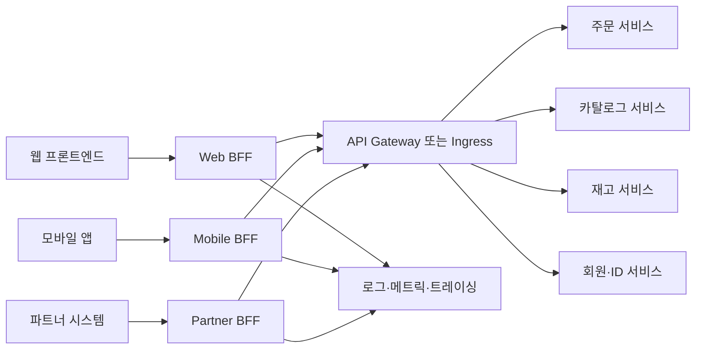
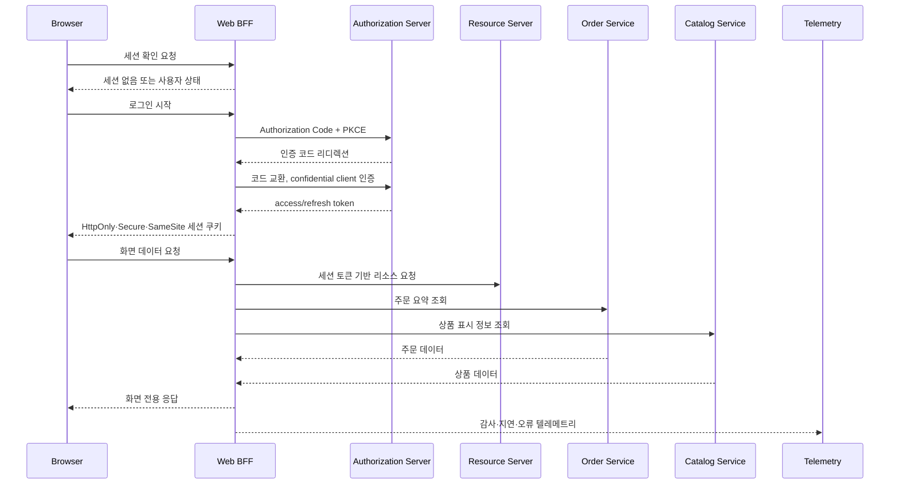

# BFF(Backend for Frontend) 패턴과 브라우저 OAuth 보안

## 1. 개요

### 가. 정의

> **BFF(Backend for Frontend)**는 웹·모바일·외부 파트너와 같이 서로 다른 사용자 경험을 제공하는 클라이언트마다 전용 백엔드 계층을 두고, 해당 클라이언트에 필요한 데이터 조합·변환·보안·성능 최적화를 수행하는 아키텍처 패턴이다.

BFF의 핵심은 “모든 소비자에게 하나의 범용 API를 제공한다”는 발상에서 벗어나, 사용자 경험의 경계에 맞춰 서버 측 API를 설계하는 데 있다. 모바일 애플리케이션은 배터리와 네트워크 비용을 아껴야 하고, 웹 애플리케이션은 화면 단위의 풍부한 데이터와 빠른 초기 렌더링을 요구할 수 있다. 외부 파트너는 내부 서비스의 도메인 구조를 알 필요가 없으며 오래된 계약을 일정 기간 유지해야 할 수도 있다. 같은 백엔드가 이 요구를 모두 만족시키려 하면 조건문과 버전 분기가 계속 늘어난다.

BFF는 프론트엔드와 내부 도메인 서비스 사이에 위치하지만, 내부 도메인 서비스의 업무 규칙을 대체하는 계층은 아니다. BFF는 여러 서비스를 호출해 화면에 필요한 읽기 모델을 만들고, 클라이언트가 이해하기 쉬운 형식으로 응답하며, 클라이언트별 인증·세션·캐시 정책을 적용한다. 주문 승인, 재고 차감, 결제 확정과 같은 핵심 업무의 불변식은 주문·재고·결제 도메인이 책임져야 한다.

Microsoft Azure Architecture Center는 BFF를 여러 프론트엔드 인터페이스에 하나의 범용 백엔드를 공유하는 대신 인터페이스별 백엔드 서비스를 만드는 패턴으로 설명한다([Microsoft Azure Architecture Center](https://learn.microsoft.com/en-us/azure/architecture/patterns/backends-for-frontends)). Sam Newman은 이를 특정 사용자 경험에 밀접하게 결합된 단일 목적 엣지 서비스로 설명하며, UI 팀이 BFF를 함께 소유하면 UI와 API의 변경을 함께 조정하기 쉬워진다고 정리한다([Sam Newman, Backends For Frontends](https://samnewman.io/patterns/architectural/bff/)).

### 나. 등장 배경과 필요성

모놀리식 시스템에서는 하나의 서버가 화면 생성과 업무 처리를 모두 담당하므로 클라이언트별 요구 차이가 코드 내부에 숨겨질 수 있다. 그러나 마이크로서비스가 도입되면 화면 하나를 그리기 위해 카탈로그, 가격, 재고, 배송, 회원 서비스를 각각 호출해야 한다. 클라이언트가 이 호출 그래프를 직접 알게 되면 내부 서비스의 주소와 데이터 모델이 외부 계약으로 굳어지고, 네트워크 지연과 장애 처리까지 모든 클라이언트가 중복 구현하게 된다.

범용 API는 처음에는 재사용성이 높아 보인다. 하지만 웹, 모바일, 키오스크, 파트너가 같은 엔드포인트를 사용하면 한 소비자의 필드 추가 요청이 다른 소비자의 응답 크기와 보안 범위에 영향을 준다. 서버가 소비자별 요구를 모두 수용하려고 하면 `includeMobileFields`, `legacyVersion`, `compact=true` 같은 매개변수가 누적되고, API의 의미가 호출자에 따라 달라진다. BFF는 이러한 변이를 클라이언트 경계 안으로 격리한다.

또한 브라우저 기반 애플리케이션은 OAuth 토큰을 어디에 보관하고 어떻게 갱신할지 결정해야 한다. 토큰을 브라우저의 자바스크립트가 직접 관리하면 악성 스크립트나 브라우저 확장, 공급망 공격이 토큰에 접근할 수 있는 위험이 커진다. 2026년 8월 공개된 IETF RFC 10017은 브라우저 애플리케이션의 OAuth 2.0 모범 사례로 BFF를 포함한 세 가지 패턴을 비교하고, 민감한 업무·개인정보 애플리케이션에는 BFF 아키텍처를 강하게 권고한다([IETF RFC 10017](https://datatracker.ietf.org/doc/rfc10017/)).

### 다. 목표와 적용 범위

BFF의 목표는 다음과 같이 정리할 수 있다.

1. 클라이언트가 필요한 데이터 모양과 호출 횟수에 맞춰 응답을 최적화한다.
2. 내부 서비스의 주소·토폴로지·도메인 모델을 클라이언트에서 숨긴다.
3. 화면 단위의 집계와 변환을 서버에서 수행하여 클라이언트의 복잡도를 줄인다.
4. 클라이언트별 릴리스 속도와 장애 격리 수준을 높인다.
5. 브라우저와 리소스 서버 사이에서 세션·토큰·감사·남용 방지 정책을 일관되게 집행한다.

다만 BFF는 모든 애플리케이션에 추가해야 하는 필수 계층이 아니다. 클라이언트가 하나뿐이고 API 요구가 단순하거나, 이미 GraphQL의 프론트엔드별 resolver와 스키마가 충분히 문제를 해결하거나, API 게이트웨이만으로 라우팅·인증·변환 요구가 충족된다면 BFF의 추가 운영비가 편익보다 클 수 있다.

## 2. 전체 구조와 동작 원리

### 가. 논리 아키텍처

위 구조에서 각각의 BFF는 특정 사용자 경험의 서버 측 일부로 간주한다. Web BFF는 브라우저 화면에 필요한 집계와 세션 처리를 담당하고, Mobile BFF는 작은 화면과 불안정한 네트워크에 맞춰 응답을 축약하거나 호출을 합친다. Partner BFF는 내부 서비스의 도메인 모델을 파트너 계약에 맞게 변환하고, 파트너별 속도 제한과 버전 정책을 적용한다.

BFF 뒤에 API 게이트웨이를 둘 수 있지만 두 계층은 동일한 개념이 아니다. 게이트웨이는 여러 API의 진입점으로 라우팅·공통 인증·속도 제한·TLS 종료를 수행하는 플랫폼 계층이다. BFF는 한 경험의 요구에 맞는 API를 설계하고 집계·변환하는 제품 또는 도메인 인접 계층이다. 조직에 따라 한 제품이 두 역할을 함께 수행할 수 있으나, 책임을 문서로 분리해야 운영 중 만능 미들웨어가 되는 것을 막을 수 있다.

### 나. 화면 요청의 처리 흐름

첫 단계에서 브라우저는 BFF의 세션 확인 엔드포인트를 호출한다. 활성 세션이 없으면 BFF가 인가 서버와 Authorization Code 흐름을 시작한다. RFC 10017의 BFF 모델에서 BFF는 브라우저를 대신하는 confidential OAuth client이며, access token과 refresh token을 브라우저 코드에 노출하지 않고 서버 측 세션과 연결한다.

로그인 이후 브라우저는 토큰을 API마다 직접 전달하지 않고 BFF에 세션 쿠키를 보낸다. BFF는 쿠키를 검증한 뒤 서버 측에 보관된 토큰을 사용해 리소스 서버에 요청한다. 쿠키는 HttpOnly, Secure, 적절한 SameSite 정책을 적용하고, CSRF 방어 토큰 또는 동일 출처 검증과 함께 운영해야 한다. 쿠키를 사용한다고 CSRF가 자동으로 사라지는 것은 아니다.

화면 데이터 요청에서 BFF는 여러 하위 서비스를 병렬 호출할 수 있다. 주문 서비스의 주문 식별자와 카탈로그 서비스의 상품명을 조합해 화면 모델을 만들고, 재고가 느리면 재고 상태를 별도 표기하거나 캐시된 값을 사용하도록 설계할 수 있다. 하지만 결제 금액과 재고 차감처럼 강한 일관성이 필요한 결정은 단순 집계가 아니라 도메인 서비스의 명령 API를 호출해야 한다.

### 다. BFF의 책임 경계

BFF가 맡는 책임은 클라이언트 경험에 한정된 변환·집계·보호다. 예를 들어 모바일 목록 화면의 페이지 크기를 조정하고, 여러 서비스의 데이터를 하나의 DTO로 조합하며, 사용하지 않는 필드를 제거하는 일은 BFF의 책임이다. 클라이언트가 이해하지 못하는 내부 오류 코드를 사용자 경험에 맞는 상태로 변환하는 것도 BFF에서 수행할 수 있다.

반면 가격 계산 규칙, 주문 상태 전이, 권한의 최종 결정, 재고 예약의 원자성은 도메인 서비스가 책임져야 한다. BFF가 이 업무 로직을 복제하면 웹과 모바일 BFF의 규칙이 달라지고, 서비스의 정책 변경이 모든 BFF에 전파되지 않는 문제가 생긴다. 기술사 답안에서는 “BFF는 얇게 유지한다”는 원칙을 단순 구호로 쓰지 말고, 어떤 로직을 어느 계층에 둘지 불변식과 변경 주체를 기준으로 설명해야 한다.

## 3. 주요 구성요소와 설계 원칙

### 가. 클라이언트 전용 API와 데이터 조합

BFF API는 내부 서비스의 엔드포인트를 그대로 노출하는 대신 화면 또는 사용자 여정 중심으로 설계한다. 예를 들어 `/mobile/home`은 추천, 최근 주문, 배송 알림을 모바일 화면의 한 응답으로 조합할 수 있다. 이때 응답은 화면의 렌더링 요구에 맞춘 것이므로 내부 Catalog 객체를 그대로 직렬화하지 않고 필요한 필드와 공개 등급만 선택한다.

집계는 순차 호출과 병렬 호출을 구분해야 한다. 서로 독립적인 카탈로그와 재고 조회는 병렬화할 수 있지만, 두 번째 요청이 첫 번째 결과를 필요로 한다면 순차 흐름이 불가피하다. 병렬화는 총 지연을 줄일 수 있지만 하위 호출 수를 늘릴 수 있으므로 연결 풀, 타임아웃, 동시성 제한을 함께 설계한다.

하위 서비스의 부분 실패를 어떻게 표현할지도 중요하다. 추천 서비스가 실패해도 주문 이력 화면은 보여줄 수 있다면 BFF는 핵심 데이터와 선택 데이터의 우선순위를 구분한다. 반대로 결제 승인 화면에서 환율 또는 결제수단 검증이 실패하면 “부분 응답”을 반환해서는 안 되고 명확한 재시도·대체 경로를 제공해야 한다.

### 나. 캐시와 응답 최적화

BFF는 클라이언트별로 캐시 키와 신선도 요구를 다르게 적용할 수 있다. 공개 상품 설명은 CDN이나 역방향 프록시에서 캐시할 수 있지만, 개인별 주문 상태는 사용자·권한·지역을 키에 포함해야 한다. 캐시된 응답에 개인정보가 섞이지 않도록 `Cache-Control: private`와 저장 위치를 점검하고, 로그와 캐시의 보존기간을 데이터 분류에 맞춰 설정한다.

화면 집계 응답은 여러 원천의 신선도가 다를 수 있다. 가격이 1분마다 갱신되고 상품 설명이 하루에 한 번 바뀐다면 하나의 전체 TTL을 임의로 정하기보다 데이터 속성별 캐시 전략을 설계해야 한다. 캐시 무효화 이벤트를 사용할 때는 이벤트 유실과 순서 역전, 지역별 전파 지연을 고려하며, 캐시가 업무 정합성의 유일한 근거가 되지 않도록 한다.

모바일 네트워크를 고려한 최적화는 단순히 JSON을 작게 만드는 데 그치지 않는다. 필요한 필드만 내려주고, 여러 왕복을 한 번의 집계 호출로 줄이며, 페이지네이션과 압축을 적용하고, 재시도 가능한 읽기 요청과 재시도하면 안 되는 명령 요청을 구분한다. 화면에 보이지 않는 내부 필드를 제거하면 성능뿐 아니라 데이터 최소화에도 도움이 된다.

### 다. 오류·타임아웃·재시도

BFF의 전체 타임아웃은 하위 호출 타임아웃의 합보다 짧거나 같아야 한다. 상위 요청의 deadline을 하위 호출에 전파하지 않으면 이미 응답을 포기한 클라이언트 요청이 계속 내부 자원을 점유한다. 예를 들어 화면 요청의 예산이 800ms라면 주문·카탈로그·재고 호출에 각각 무제한 1초 타임아웃을 설정해서는 안 된다.

재시도는 멱등성이 보장되는 조회나 명시적인 멱등 키가 있는 명령에 제한한다. 결제 요청을 네트워크 오류만 보고 자동 재시도하면 서버에서 결제가 성공했지만 응답만 유실된 상황에서 중복 승인이 발생할 수 있다. BFF는 도메인 서비스의 멱등 계약을 확인하고, 재시도 횟수·백오프·지터·회로 차단을 함께 설정한다.

하위 서비스의 오류는 원인을 숨기지 않으면서 클라이언트 계약은 안정적으로 유지해야 한다. 내부 스택 트레이스나 비밀값을 응답하지 말고, 상관관계 ID를 반환해 운영자가 로그를 찾게 한다. HTTP 상태 코드, 도메인 오류 코드, 재시도 가능 여부를 구분하면 클라이언트가 무의미한 무한 재시도를 하지 않는다.

### 라. 인증·인가·세션

인증은 사용자가 누구인지 확인하는 과정이고, 인가는 그 사용자가 특정 자료와 기능을 사용할 수 있는지 판단하는 과정이다. BFF가 OAuth 인증을 수행해도 주문 조회 권한과 관리자 기능 권한이 자동으로 부여되는 것은 아니다. BFF는 세션의 사용자·클라이언트·범위·대상 리소스를 확인하고, 도메인 서비스도 신뢰 경계 안에서 권한을 재검증해야 한다.

브라우저에 세션 쿠키를 발급할 때 쿠키의 수명은 서버 측 세션과 refresh token 수명 정책에 맞춰야 한다. 로그아웃은 브라우저 쿠키 삭제만이 아니라 서버 세션 폐기, 필요시 refresh token 폐기, 관련 감사 기록을 포함해야 한다. 키 회전과 토큰 만료 중에 이미 발급된 세션을 어떻게 처리할지 런북으로 정한다.

BFF는 외부 브라우저와 내부 리소스 서버 사이의 보안 경계이므로 SSRF, 오픈 리디렉션, 호스트 헤더 공격, 요청 크기 폭탄, 헤더 주입, 세션 고정 공격을 점검한다. 프록시 대상 URL을 클라이언트 입력으로 직접 결정하지 말고 허용된 리소스와 경로를 서버 측 매핑으로 제한한다.

### 마. 관측성과 감사

BFF는 사용자 요청 하나가 여러 하위 호출로 확장되는 지점이므로 trace ID와 span 관계를 유지해야 한다. 전체 지연시간, 하위 서비스별 지연, 집계 실패율, 캐시 적중률, 토큰 갱신 실패, 401·403 증가, 응답 크기를 주요 지표로 수집한다. 단순히 BFF의 200 비율만 보면 일부 데이터가 누락된 부분 성공을 발견하지 못할 수 있다.

로그에는 사용자 식별자를 원문으로 남기지 않고 가명화된 상관 ID와 필요한 최소 속성만 기록한다. access token, refresh token, 쿠키 값, 주민등록번호와 같은 민감정보는 로그·트레이스·오류 응답에서 제거한다. 감사 로그는 누가 언제 어떤 클라이언트로 어떤 보호 자원에 접근했는지 추적할 수 있어야 하지만, 접근한 데이터의 원문을 복제하는 저장소가 되어서는 안 된다.

## 4. 적용 방식과 비교

### 가. BFF와 API 게이트웨이

API 게이트웨이는 조직 공통의 진입점으로 라우팅, TLS 종료, 인증서 정책, 속도 제한, WAF 연계, API 키와 사용량 계량을 표준화하는 데 강점이 있다. 반면 BFF는 특정 사용자 경험의 데이터 조합과 API 계약에 강점이 있다. 게이트웨이가 모든 화면 조합을 담당하면 중앙 팀에 변경이 집중되고, BFF가 모든 공통 보안 기능을 중복 구현하면 정책 편차가 생긴다.

둘은 대체 관계라기보다 계층적 조합이 가능하다. 외부 요청은 API 게이트웨이에서 기본적인 네트워크·플랫폼 통제를 받고, 각 클라이언트의 BFF에서 세션과 화면 데이터 조합을 수행한 뒤, 내부 서비스에서 도메인 권한과 업무 불변식을 검증한다. 단, 동일한 인증·속도 제한·관측 기능이 여러 계층에 중복되어 어느 정책이 최종 적용되는지 불명확해지지 않도록 책임표를 만든다.

### 나. BFF와 GraphQL

GraphQL은 클라이언트가 필요한 필드를 질의하고 여러 원천을 resolver로 조합할 수 있어 BFF의 일부 문제를 해결한다. 하나의 스키마와 프론트엔드별 resolver 체계를 잘 운영하면 별도 BFF 서비스 수를 줄일 수 있다. 그러나 GraphQL도 인증·인가, 쿼리 복잡도 제한, N+1 호출, 캐시, 스키마 변경, 관측성 문제를 해결해야 하며, GraphQL 서버가 사실상 BFF 역할을 할 수 있다.

BFF와 GraphQL의 선택은 프로토콜 선호가 아니라 조직과 경계의 문제다. 여러 클라이언트가 하나의 도메인 그래프를 탐색하고 필드 선택성이 중요하면 GraphQL이 유리할 수 있다. 클라이언트별 보안 경계와 배포 주기가 크게 다르거나 파트너 계약을 독립적으로 유지해야 하면 BFF를 분리하는 편이 명확할 수 있다. Microsoft 문서도 GraphQL의 프론트엔드 전용 resolver가 충분하다면 BFF가 추가 가치를 주지 않을 수 있다고 안내한다([Microsoft BFF pattern guidance](https://learn.microsoft.com/en-us/azure/architecture/patterns/backends-for-frontends)).

### 다. BFF와 직접 호출·범용 백엔드

클라이언트가 내부 마이크로서비스를 직접 호출하면 중간 홉이 줄어드는 장점이 있지만 내부 토폴로지 노출, 호출 그래프 중복, 서비스별 인증 구현, 장애 처리 편차가 커진다. 특히 브라우저에 내부 서비스의 주소와 OAuth 토큰을 노출하면 공격면이 넓어질 수 있다. 반대로 하나의 범용 백엔드는 서비스 수가 적은 초기 시스템에서 단순하고 운영하기 쉽지만, 소비자별 요구가 늘면 병목과 결합도가 커질 수 있다.

BFF는 이 두 극단 사이에서 사용자 경험별 서버 경계를 제공한다. 그러나 BFF가 추가되면 네트워크 홉과 배포 단위가 늘어난다. 따라서 클라이언트 수, 요구 차이, 내부 호출 복잡도, 보안 등급, 팀 소유권, 운영 자동화 수준을 판단 기준으로 삼아야 한다.

| 비교 항목 | 직접 호출 | 범용 API 백엔드 | BFF | GraphQL 중심 |
|---|---|---|---|---|
| API 최적화 단위 | 클라이언트 코드 | 모든 소비자 공통 | 사용자 경험별 | 질의·resolver별 |
| 내부 토폴로지 은닉 | 낮음 | 중간 | 높음 | 높음 |
| 화면 집계 | 클라이언트 중복 | 중앙 집중 | 경험별 집계 | resolver 조합 |
| 운영 서비스 수 | 적음 | 적음~중간 | 클라이언트 수에 비례 | 플랫폼 중심 |
| 클라이언트 독립 배포 | 높음 | 낮음 | 높음 | 스키마 정책 필요 |
| 주요 위험 | 보안·중복 호출 | 병목·범용화 | 운영비·중복 | 쿼리 폭주·복잡도 |

표의 차이는 기능 개수보다 변경의 방향에서 발생한다. 직접 호출은 변경 책임이 각 클라이언트에 흩어지고, 범용 백엔드는 변경 책임이 하나의 팀에 몰린다. BFF는 클라이언트와 가까운 팀에 책임을 배치하는 대신 BFF의 수와 운영 비용을 감수한다. GraphQL은 호출 모양의 유연성을 얻는 대신 스키마와 resolver의 거버넌스를 강화해야 한다.

## 5. 적용 사례와 도입 절차

### 가. 전자상거래 모바일·웹 사례

전자상거래 서비스에 웹, 모바일, 파트너 채널이 있다고 가정한다. 웹 상품 상세 화면은 고해상도 이미지, 추천 목록, 리뷰 요약, 배송 예정일을 요구하지만, 모바일은 제한된 데이터 사용량과 작은 화면을 고려해 대표 이미지와 핵심 가격만 필요로 할 수 있다. 파트너는 내부 추천 알고리즘이나 회원 속성을 보지 않고 계약된 상품·재고 필드만 사용해야 한다.

Web BFF는 상품·리뷰·추천·배송 서비스를 호출해 화면 모델을 만든다. Mobile BFF는 이미지 크기와 필드를 줄이고 여러 읽기 요청을 하나로 합친다. Partner BFF는 파트너별 API 키 또는 OAuth client와 쿼터를 적용하며, 내부 상품 상태를 파트너 계약의 공개 상태로 변환한다. 이렇게 하면 내부 서비스가 바뀌어도 각 소비자에게 안정적인 경험별 계약을 유지할 수 있다.

예를 들어 웹 첫 화면의 목표가 p95 700ms라고 가정하면 BFF는 하위 호출을 병렬화하고, 추천 실패 시 상품 정보만 반환하는 대체 경로를 둘 수 있다. 이는 설명을 위한 가상 목표이며 실제 SLO는 사용자 행동과 측정된 기준선으로 정해야 한다. 결제 승인처럼 실패를 허용할 수 없는 흐름은 추천 화면과 같은 부분 성공 정책을 적용해서는 안 된다.

### 나. 브라우저 업무 시스템의 OAuth 사례

공공·금융 업무 시스템에서 브라우저 SPA가 개인정보 API를 호출한다고 가정하자. 브라우저 코드가 access token과 refresh token을 직접 저장하면 XSS나 악성 의존성으로 토큰이 노출될 수 있다. BFF는 authorization server와 confidential client로 통신하고, 서버 측 세션과 토큰을 관리한다. 브라우저는 HttpOnly 세션 쿠키로 BFF를 호출하며, BFF가 보호된 리소스 서버에 access token을 전달한다.

RFC 10017은 BFF, token-mediating backend, 브라우저 기반 OAuth client를 구분한다. BFF는 모든 API 상호작용을 백엔드가 전달하고 토큰을 브라우저에 노출하지 않는 구조이며, token-mediating backend는 토큰을 브라우저 코드가 사용하도록 전달하는 차이가 있다. 보호 수준과 구현 복잡도를 비교하여 업무의 민감도에 맞는 선택을 해야 한다.

BFF를 도입해도 XSS와 CSRF가 사라지는 것은 아니다. XSS는 세션을 이용해 사용자를 대신한 요청을 만들 수 있고, CSRF는 쿠키 기반 인증 요청을 악용할 수 있다. 콘텐츠 보안 정책, 출력 인코딩, 의존성 점검, SameSite 설정, CSRF 토큰, Origin 검증, 재인증과 이상징후 탐지를 다층적으로 적용한다.

### 다. 단계적 도입 절차

1. **소비자와 변경 이력 조사**: 웹·모바일·파트너별 API 호출, 데이터 요구, 릴리스 주기, 장애 사례를 목록화한다.
2. **경계와 소유자 정의**: BFF가 담당할 경험, 도메인 서비스의 책임, API 게이트웨이의 공통 기능을 결정한다.
3. **읽기 중심 파일럿 선정**: 결제나 재고 명령보다 실패를 격리하기 쉬운 대시보드·상품 조회부터 시작한다.
4. **계약 설계**: 클라이언트 전용 DTO, 버전 정책, 오류 모델, 페이지네이션, 필드 민감도와 폐기 정책을 정의한다.
5. **성능 기준선 측정**: 직접 호출·기존 범용 API와 비교해 p50·p95·p99, 호출 수, payload, CPU·메모리를 측정한다.
6. **보안 설계**: OAuth client 유형, PKCE, 세션 쿠키, CSRF, 토큰 보관, 로그 마스킹, 권한 검증을 위협 모델에 반영한다.
7. **관측성 구축**: trace context 전파, 하위 호출별 span, 오류·부분 성공 분류, 사용자 영향 지표를 먼저 만든다.
8. **점진 전환**: 기능 플래그나 라우팅 가중치로 일부 사용자부터 전환하고, 오류·지연·보안 이벤트를 기준으로 롤백한다.
9. **소유권 이전과 운영 자동화**: UI 팀과 BFF 팀의 배포·당직·취약점 패치·비용 책임을 명문화한다.
10. **확대 여부 재평가**: 클라이언트별 요구 차이가 실제로 유지되는지 확인하고, 유사 BFF를 무리하게 늘리지 않는다.

## 6. 심화 — RFC 10017과 보안형 BFF

IETF RFC 10017은 2026년 8월 Best Current Practice로 발행된 RFC 10017(BCP 212)이다. 문서는 브라우저 기반 OAuth 애플리케이션의 위협과 보안 권고를 정리하고, BFF를 단순한 데이터 집계 패턴이 아니라 브라우저와 보호 리소스 사이의 OAuth client 경계로 설명한다([IETF Datatracker, RFC 10017](https://datatracker.ietf.org/doc/rfc10017/)).

RFC 10017이 제시하는 BFF의 세 가지 핵심 책임은 명확하다. 첫째, BFF가 authorization server와 confidential OAuth client로 상호작용한다. 둘째, BFF가 access token과 refresh token을 쿠키 기반 세션의 서버 측 문맥에 보관하여 브라우저 애플리케이션에 직접 노출하지 않는다. 셋째, BFF가 브라우저 요청을 보호 리소스 서버로 전달하면서 올바른 access token을 추가한다.

이 권고는 기존의 “모바일 화면용 집계 API”라는 BFF 이해를 보안 아키텍처로 확장한다. 기술사 답안에서는 BFF를 단순한 프록시라고 쓰기보다, 클라이언트별 API 계약과 서버 측 토큰·세션 보호를 동시에 수행하는 경계로 설명하면 좋다. 다만 BFF의 보안 효과는 구현 품질에 의존하므로 세션 탈취, CSRF, SSRF, 오픈 리디렉션, 로그 유출에 대한 통제가 함께 있어야 한다.

브라우저 애플리케이션이 public client로 직접 OAuth를 수행해야 하는 경우에도 Authorization Code + PKCE 적용, 토큰 저장 최소화, 브라우저 기반 공격 방어가 중요하다. BFF가 항상 가능한 것은 아니므로 네트워크 구성·배포 모델·개인정보 영향·사용자 경험·토큰 수명과 같은 현실 제약을 비교해야 한다. RFC의 권고를 제품 도입 명령으로 오해하지 말고 위협 모델과 업무 위험에 연결한다.

## 7. 고려사항 및 시사점

### 가. 성능과 비용의 균형

BFF는 집계로 왕복 횟수를 줄일 수 있지만 서버 측 하위 호출과 추가 네트워크 홉을 만든다. 호출 수가 늘어날 때 연결 풀과 스레드가 고갈되지 않는지, 하위 서비스의 fan-out이 장애를 증폭시키지 않는지 부하 시험으로 확인해야 한다. 평균 지연만 보지 말고 p95·p99와 사용자 여정 완료율을 함께 평가한다.

BFF별 런타임, 배포 파이프라인, 보안 패치, 모니터링, 당직 운영이 필요하다. 클라이언트 수가 늘어날수록 서비스 수를 선형으로 늘리는 것이 항상 답은 아니다. 요구가 유사한 클라이언트는 하나의 BFF를 공유할 수 있지만, 서로 다른 요구를 억지로 묶으면 다시 범용 백엔드의 병목이 생기므로 공유 기준을 문서화한다.

### 나. 중복과 책임 경계

BFF마다 비슷한 하위 서비스 호출 코드가 생길 수 있다. 중복을 모두 제거하려고 공통 라이브러리와 중앙 BFF를 만들면 독립 배포의 장점이 줄어든다. 안정적인 인증·추적·오류 처리 라이브러리는 공유하되, 클라이언트 경험의 조합 규칙과 UI 계약은 각 BFF가 소유하는 식으로 경계를 나눈다.

BFF에 도메인 업무 로직이 들어가면 웹과 모바일의 결과가 달라지는 위험이 커진다. 도메인 서비스가 보장해야 할 불변식, BFF가 수행해도 되는 표현 변환, 클라이언트가 책임질 표시 로직을 ADR과 API 계약으로 기록한다. 변경 검토 때도 코드 위치보다 업무 규칙의 소유자를 기준으로 판단한다.

### 다. 보안과 개인정보 보호

BFF는 민감한 토큰과 개인정보가 지나가는 집중 지점이다. 세션 저장소 암호화, 키 회전, 접근 권한 분리, 비밀값 관리, 감사 로그, 취약점 패치, WAF와 rate limit을 함께 운영한다. 사용자별 응답 캐시가 다른 사용자에게 제공되지 않는지와 오류·추적 데이터가 원문 개인정보를 포함하지 않는지 정기 점검한다.

브라우저 쿠키 기반 세션은 CSRF 방어와 세션 고정 방지가 필요하다. `SameSite`만으로 모든 브라우저와 연동 시나리오를 해결한다고 가정하지 말고, Origin·Referer 검증과 CSRF 토큰을 위험도에 맞춰 조합한다. OAuth redirect URI는 사전 등록된 정확한 값만 허용하고, state와 PKCE 검증 실패를 거부하며, 로그인·로그아웃 엔드포인트의 공개 리디렉션을 차단한다.

### 라. 가용성과 장애 격리

BFF가 웹과 모바일의 단일 공통 백엔드가 되면 오히려 중앙 장애점이 될 수 있다. 클라이언트별 BFF를 분리하는 이유가 장애 격리라면 배포·캐시·세션 저장소·오토스케일링·당직도 실제로 분리되어야 한다. 하나의 공유 데이터베이스나 공통 메시지 버스가 전체 BFF를 동시에 묶고 있지 않은지 확인한다.

부분 성공을 허용할 화면과 전체 실패해야 하는 업무를 구분한다. 추천·광고·리뷰는 대체 응답을 허용할 수 있지만 결제 금액·권한·재고 예약은 임의의 캐시나 빈 값으로 대체하면 안 된다. 장애 예산과 사용자 영향 등급을 바탕으로 기능별 fallback을 설계하고, 카오스 테스트와 복구 훈련으로 검증한다.

### 마. 관측성·계약 테스트

BFF 계약 테스트는 클라이언트가 기대하는 응답 구조와 오류 의미가 유지되는지 검증해야 한다. 하위 서비스의 consumer-driven contract, 스키마 호환성 검사, 샘플 응답 기반 회귀 테스트를 CI에 포함한다. 집계 순서와 부분 실패를 포함한 시나리오를 테스트하지 않으면 정상 응답만 확인하는 얕은 테스트가 된다.

관측성은 BFF를 통해 확장된 호출 그래프를 보여줘야 한다. trace ID를 클라이언트 오류 응답과 연결하되 토큰·개인정보를 노출하지 않고, 하위 서비스의 지연이 화면 지연으로 이어지는 경로를 추적한다. SLO는 BFF 단위뿐 아니라 사용자 여정과 핵심 기능 단위로 정의한다.

### 바. 기술사 관점의 도입 판단

BFF의 도입 판단은 “마이크로서비스이면 BFF”라는 공식이 아니라 소비자 차이와 조직 운영 능력의 함수다. 클라이언트별 데이터 모양·보안·릴리스 주기가 크게 다르고, 화면 집계와 토큰 보호가 필요하며, 경험별 팀이 배포를 자율적으로 운영할 수 있으면 BFF의 가치가 높다.

반대로 클라이언트가 하나이거나 요구가 거의 같고, API 게이트웨이와 기존 도메인 API가 충분히 단순하다면 BFF는 불필요한 홉과 운영비가 될 수 있다. 도입 전에 기준선, 목표 SLO, 팀 소유권, 보안 위협 모델, 비용 상한, 철회 조건을 정한다. 도입 후에는 BFF의 개수보다 소비자 변경 리드타임, 장애 격리, 토큰 노출 감소, 사용자 지연 개선과 같은 결과를 측정한다.

## 참고자료

- [Microsoft Azure Architecture Center — Backends for Frontends pattern](https://learn.microsoft.com/en-us/azure/architecture/patterns/backends-for-frontends)
- [Sam Newman — Pattern: Backends For Frontends](https://samnewman.io/patterns/architectural/bff/)
- [IETF Datatracker — RFC 10017: OAuth 2.0 for Browser-Based Applications](https://datatracker.ietf.org/doc/rfc10017/)
- [RFC Editor — BCP 212 / RFC 10017](https://www.rfc-editor.org/info/bcp212/)
- [OAuth 2.0 for Browser-Based Applications, RFC 10017 full text](https://www.rfc-editor.org/rfc/rfc10017.html)

---

> **한 줄 요약**: BFF는 클라이언트 경험별 전용 백엔드에서 집계·변환·성능 최적화와 OAuth 세션·토큰 보호를 수행하되, 도메인 불변식은 내부 서비스에 남기고 운영비·보안·가용성·팀 소유권을 함께 평가해야 하는 패턴이다.
